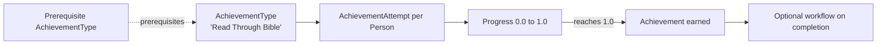

# Achievements

## Overview

Achievements are gamified badges earned by completing prerequisites or meeting threshold criteria. An `AchievementType` defines what to earn ("Read Through the Bible in a Year", "Attended 12 Weeks Straight", "Volunteered 100 Hours"). `AchievementAttempt` rows track in-progress and completed attempts per Person. `AchievementTypePrerequisite` chains badges so completing one unlocks the next. The engagement-tracking job evaluates progress against attempt criteria and updates `AchievementAttempt.Progress`.

## Why It Exists

Discipleship and engagement programs benefit from positive reinforcement. Earning a badge for completing a goal creates a small dopamine hit that encourages continued engagement. Tracking it as data lets reports celebrate the achievements at the org level (X Persons completed the Read-Through-the-Bible challenge).

The Achievement system overlaps somewhat with Steps and Streaks, but each has a distinct shape: Steps are sequential discipleship pathway milestones; Streaks are pattern-engagement bitmaps; Achievements are threshold-based earnable badges with optional prerequisite chains. A "completed all of Foundations" achievement might depend on a Step Program Completion; a "12-week-streak" achievement might depend on a Streak's longest-streak value.

## Mental Model

Each achievement type has criteria for completion. Each Person who is eligible gets an `AchievementAttempt` row tracking their progress. When progress reaches 1.0 (100%), the attempt is marked complete; configured workflows fire.

## What You Need to Know

**`AchievementType` defines the criteria.** What needs to happen, how it's measured, threshold for completion. Configurable.

**`AchievementAttempt` tracks per-Person progress.** Multiple attempts per Person possible (a "12-week streak" achievement can be earned multiple times if the type allows).

**Progress is a 0.0 to 1.0 value.** Computed from the attempt's data. The engagement-tracking job updates progress as criteria are met.

**Prerequisites chain achievements.** `AchievementTypePrerequisite` rows say "must earn X before earning Y." Reports must walk prerequisites.

**Component-based criteria.** Achievement types use `AchievementComponent` implementations to evaluate criteria. Built-in components handle common cases (streak length, step program completion, attendance count); custom components handle deployment-specific criteria.

**Attempts can be reset.** An attempt can move back to in-progress if requirements lapse. For "currently on a 12-week streak" achievement, breaking the streak resets the attempt.

**Workflow integration on completion.** Configurable workflow fires when an attempt is marked complete. Used for badge-display, congratulation emails, unlocking content.

**Multiple attempts allow re-earning.** A type configured `AllowOverAchievement = true` lets a Person earn the achievement again after a previous earn. Useful for recurring streaks.

**Reports filter by attempt status.** Active vs Successful vs Failed. Counting completed achievements requires filtering to status = Successful.

**Display data on achievement type.** `IconCssClass`, `BadgeColor`, custom `BadgeLavaTemplate`. Used by Person profile widgets and award-display surfaces.

## Common Scenarios

**"Define an achievement: 'Attended 52 weeks straight.'"** AchievementType. Component: Streak-based, threshold = streak length 52. Configure on the Streak Type "Service Attendance". Each Person enrolled in that streak gets an attempt; progress updates as the streak grows.

**"Define a chained achievement: 'Foundation Graduate' requires 'Welcome Class' achievement first."** AchievementType "Foundation Graduate" with prerequisite = AchievementType "Welcome Class". Reports / awarding logic walks the prerequisite chain.

**"Award an achievement when a Person completes a StepProgram."** AchievementType with component = StepProgramCompletion-based. Threshold = the StepProgram. The job creates the achievement attempt when the program completion happens.

**"Notify Person when they earn an achievement."** AchievementType configured with a workflow on completion. The workflow sends the celebration email.

**"Reset an attempt that lapsed."** Custom workflow or admin action. Sets the attempt to In Progress and recalculates Progress.

**"Display earned achievements on the Person profile."** Custom Lava that queries `AchievementAttempt` filtered by Person and successful status. Renders the badges.

## Key Architectural Decisions

### Attempt as a separate entity from Type

Multiple attempts per Person possible; attempt-level state (start, progress, completion) needs its own row.

### Component-based criteria

Different criteria types (streak, step, attendance count, etc.) need different evaluators. Component pattern.

### Prerequisites as configuration

Per-deployment chains; data-driven.

### Progress as 0.0 to 1.0

Normalized progress lets UIs render bars / percentages consistently. Implementation-specific math is encapsulated in the component.

### Workflow on completion

Standard pattern for celebrating achievements; reuses the workflow infrastructure.

## Considered but Rejected

### Single Achievement entity (no attempt separation)

Rejected. Multiple attempts per Person is the realistic case.

### Hardcoded criteria per type

Rejected. Configuration-as-data with components is right.

### Real-time per-event progress update

Rejected. Job-driven evaluation is bounded.

## Technical Reference

### Schema (relevant subset)

`AchievementType`:
- `Name`, `Description`, `IconCssClass`, `BadgeColor`
- `ComponentEntityTypeId` (the AchievementComponent class)
- `MaxAccomplishmentsAllowed` (e.g., 1 for once-only achievements; null for unlimited)
- `AllowOverAchievement`
- `AchievementStartWorkflowTypeId`, `AchievementSuccessWorkflowTypeId`, `AchievementFailureWorkflowTypeId`
- `BadgeLavaTemplate`, `ImageBinaryFileId`
- Component-specific configuration via attributes

`AchievementAttempt`:
- `AchievementTypeId`
- `AchieverEntityId` (typically PersonAlias)
- `Progress` (0.0 to 1.0)
- `IsClosed`, `IsSuccessful`
- `AchievementAttemptStartDateTime`, `AchievementAttemptEndDateTime`

`AchievementTypePrerequisite`:
- `AchievementTypeId`
- `PrerequisiteAchievementTypeId`

### Save Hook Behavior

`AchievementAttempt.SaveHook` triggers configured workflows on lifecycle events (Start, Success, Failure).

`AchievementType.SaveHook` invalidates achievement type cache.

### Service / API

`AchievementAttemptService`, `AchievementTypeService`: standard CRUD plus evaluation helpers.

### Affected Blocks

- **Admin:** Achievement Type Detail/List.
- **Operational:** Achievement Attempt Detail/List, Person profile achievement widgets.

### Related Docs

- [docs/engagement/engagement-overview.md](engagement-overview.md)
- [docs/engagement/streak-types.md](streak-types.md) (achievements often build on streaks)
- [docs/engagement/step-programs-and-pathways.md](step-programs-and-pathways.md) (achievements can build on step completions)

## Recent Impactful Changes

(No release-note-tagged changes specifically to achievements in the last 18 months. The mechanism is mature; per-deployment achievement types continue.)
