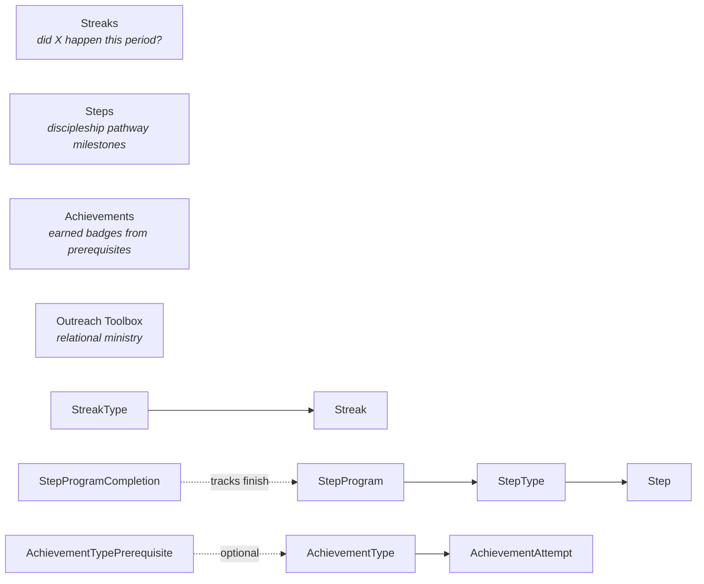

# Engagement Domain Overview

## Overview

Engagement is the umbrella for Rock's "is the person growing" tracking systems: **Streaks** (binary did/did-not patterns over time, like attendance streaks), **Steps** (discipleship pathway tracking, like "Member -> Baptized -> Volunteer"), **Achievements** (gamified badges earned by completing prerequisites), and the **Outreach Toolbox / Contact** subsystem (people-to-people relational ministry, added 2026-01-13). Engagement also hosts **LMS** (Learning Management) under `Rock/Model/Lms/`, which has its own overview.

## Why It Exists

Tracking attendance and giving alone does not capture growth. A church that wants to measure discipleship needs to track multi-step journeys (a person completed a class, then served, then led a small group), repeated commitments (showed up to small group 8 weeks running), and earned milestones (read through the Bible in a year, completed Foundations curriculum). The Engagement domain exists to make these patterns first-class data so they can drive workflows, communications, and reporting.

The Outreach Toolbox feature (`9f72c0ab56`, 2026-01-13) is a different shape: it lets the mobile app help people stay relationally connected to the people around them, with prayer prompts and contact reminders. Modeled as `Contact` and `ContactTouchpoint`, it is the "your people" feature most other church platforms do not have.

The Step Analytics work (`8aadf06f08`, 2025-09-15) addresses a long-standing complaint: Step data was hard to summarize. The refresh added trends, totals, status, and campus breakdowns to the Step Program / Step Type Detail blocks.

## Mental Model

Four parallel subsystems with little overlap:

- **Streaks**: a `StreakType` defines what counts (attendance to a specific Group, giving frequency, etc.) and the cadence (daily/weekly/monthly). Each enrolled person has a `Streak` row with a bitmap of engagement-or-not per period. Streak length and engagement count are computed from the bitmap.
- **Steps**: a `StepProgram` is a discipleship pathway (Foundations, Membership). `StepType` rows define the milestones; `Step` rows record one person reaching one milestone. `StepProgramCompletion` summarizes when someone has finished an entire program.
- **Achievements**: `AchievementType` defines the badge and the rules (e.g., "completed N steps in program X"). `AchievementAttempt` rows track in-progress and completed attempts. `AchievementTypePrerequisite` chains badges (must complete A before earning B).
- **Outreach Toolbox / Contact**: `Contact` is one person's outreach connection to another; `ContactTouchpoint` is a single interaction (prayer, message, visit). Optimized for mobile usage.

## What You Need to Know

**Streak engagement is per-period, not per-event.** A `Streak.EngagementMap` bitmap stores whether the person engaged in each period. Multiple events in one period do not change the bit. The cadence is the unit of measurement.

**Step Programs have prerequisite chains.** A StepType can require completion of another StepType before it is available. Reports must walk prerequisites to evaluate eligibility correctly.

**Step completion writes a `StepProgramCompletion` row when the program finishes.** Used for "completed Foundations" reporting; absent the row, the person is mid-program.

**Achievement attempts can be reset.** An `AchievementAttempt` can move back to in-progress if requirements lapse. Reports that count successful attempts must filter by current status, not just existence.

**LMS shares this domain folder.** Learning Management (Programs, Courses, Classes, Activities, Completions) lives under `Rock/Model/Lms/`, with its own overview at [docs/lms/lms-overview.md](../lms/lms-overview.md). Many recent commits in Engagement-tagged release notes are LMS-related.

**Step analytics surfaces trend data.** The Detail block redesign (`8aadf06f08`) showed how impactful Step data is when surfaced; custom reports can join `Step` to `StepProgram` and `StepType` for similar analysis.

**Outreach Toolbox is a mobile-first feature.** Contact / ContactTouchpoint are designed for phone usage. The web admin UI exists for setup but is not the primary surface.

## Common Scenarios

**"Track which volunteers are on a 12-week serving streak."** Define a StreakType keyed off attendance to the volunteer Group, weekly cadence. Enroll the volunteers; the streak job updates engagement bits weekly.

**"Build a discipleship pathway: Membership -> Foundations -> Coaching."** StepProgram with three StepTypes. Order the types and configure prerequisites. Steps are recorded manually or via workflow when the milestone is reached.

**"Award a 'Foundations Graduate' badge."** AchievementType with rule "completed StepType X". AchievementAttempt rows are evaluated by the engagement job; on success, the badge is awarded.

**"Encourage relational outreach."** Outreach Toolbox in the mobile app. Each user maintains their own Contact list; ContactTouchpoint records when they pray for someone or reach out.

## Key Architectural Decisions

### Three subsystems, not one

Streaks, Steps, and Achievements answer different questions: pattern engagement, pathway progression, milestone earning. Forcing them into one model would have lost expressiveness.

### Streaks as bitmaps per period

Storing per-event rows would have multiplied storage and complicated streak-length calculation. The bitmap is one column that compactly represents engagement history.

### Step prerequisites as configuration

Hard-coding prerequisites would have made pathway changes a deployment. The data-driven model keeps it administrable.

### Outreach Toolbox as mobile-first

The relational-ministry use case is mobile-native (people pray and reach out in moments, not at desks). Building it for phone first matches usage.

## Considered but Rejected

### Per-event Streak rows

Rejected. The bitmap is more compact and more efficient for streak-length math.

### Achievement awarding at request time (synchronous)

Rejected. Real-time evaluation would multiply DB load. Achievement attempts are evaluated by the engagement job.

### A single "engagement" entity

Rejected. The use cases are different enough that separate entities serve them better.

## Technical Reference

### Data Model

| Entity | Purpose |
|---|---|
| `Streak` | One person's enrollment in a streak with engagement bitmap. |
| `StreakType`, `StreakTypeExclusion`, `StreakTypeSettings` | Streak definition and exclusions. |
| `Step` | One milestone reached by one person. |
| `StepProgram`, `StepType`, `StepStatus` | Pathway definition. |
| `StepTypePrerequisite` | Step prerequisite chains. |
| `StepWorkflow`, `StepWorkflowTrigger` | Workflow launches on Step lifecycle events. |
| `StepProgramCompletion` | Program-finish summary row. |
| `AchievementType`, `AchievementAttempt` | Badge definitions and per-person attempts. |
| `AchievementTypePrerequisite` | Badge prerequisite chains. |
| `Contact`, `ContactTouchpoint`, `ContactRelationshipChange` | Outreach Toolbox: relational ministry tracking. |

### Save Hook Behavior

`Streak.SaveHook` recomputes streak length on engagement-bitmap updates.

`Step.SaveHook` triggers Step workflows and StepProgramCompletion creation when applicable.

`AchievementAttempt.SaveHook` evaluates prerequisite chains.

`AchievementType.SaveHook` invalidates achievement cache.

`Contact.SaveHook` (and `ContactTouchpoint`) handle audit and relationship inference.

### Affected Blocks and UI Surfaces

- **Admin:** Streak Type Detail/List, Streak Type Exclusion Detail/List, Streak Map Editor, Streak List, Streak Detail.
- **Steps:** Step Program Detail/List, Step Program Completion Detail/List, Step Type Detail/List, Step Bulk Entry, Step Entry, Step Participant List.
- **Achievements:** Achievement Type Detail/List, Achievement Attempt Detail/List.
- **Outreach (mobile-first):** Outreach Toolbox blocks under `Rock.Blocks.Types.Mobile.Engagement`.

### Extension Points

- **Custom Streak source criteria.** StreakType configuration plus the engagement job.
- **Custom Achievement components.** Implement `AchievementComponent` for non-Step-driven achievement evaluation.
- **Custom Step Workflows.** StepWorkflow rows on type or program.

### File Index

- `Rock/Model/Engagement/` (entities)
- `Rock/Model/Lms/` (LMS, separate domain doc)
- `Rock.Blocks/Engagement/` (Obsidian-aware C# blocks)

## Recent Impactful Changes

- **2026-01-13** ([commit `9f72c0ab56`](https://github.com/SparkDevNetwork/Rock/commit/9f72c0ab56)). Outreach Toolbox feature added: mobile relational-ministry tracking with prayer prompts and contact reminders.
- **2025-09-18** ([commit `b853227029`](https://github.com/SparkDevNetwork/Rock/commit/b853227029)). LMS public block security: programs, courses, and classes can be access-controlled on the public external blocks.
- **2025-09-15** ([commit `8aadf06f08`](https://github.com/SparkDevNetwork/Rock/commit/8aadf06f08)). Step Program Detail and Step Type Detail blocks gained step analytics (trends, totals, statuses, campuses).
- **2025-07-09** ([commit `0a2660ba94`](https://github.com/SparkDevNetwork/Rock/commit/0a2660ba94)). New Content Article Learning Activity type, plus SMS notification support for new learning activities.
