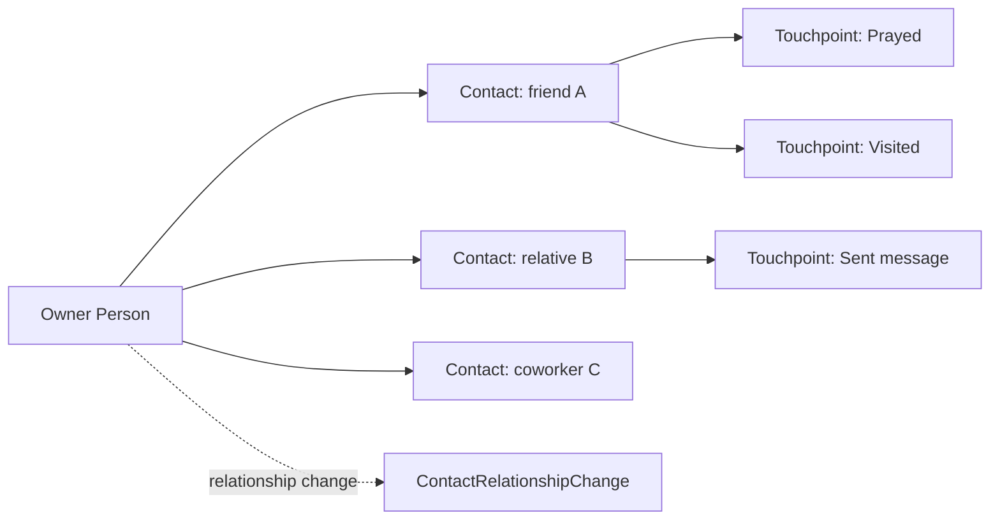

# Outreach Toolbox

## Overview

The Outreach Toolbox is Rock's relational-ministry feature added 2026-01-13 (commit `9f72c0ab56`). It lets a Person maintain a personal "people I'm reaching out to" list inside the mobile app, with prayer prompts and contact reminders. Each connection is a `Contact` row; each interaction (prayed for them, sent a message, met for coffee) is a `ContactTouchpoint` row. The feature is mobile-first; the operational surface is the phone, not a desk.

## Why It Exists

Many ministry programs encourage members to be intentional about whom they're praying for and reaching out to. Tracking it as data lets the system surface gentle reminders ("you haven't prayed for X this week") and gives ministry leaders aggregate insight into the engagement. Modeling it as Contact + Touchpoint lets each Person curate their own list without polluting the broader Group / GroupMember system; this is your private ministry, not a public Group.

The mobile-first design reflects how the use case actually plays out: prayer happens in moments throughout the day, not at a desk. Reaching out is a phone activity. The mobile app surfaces the toolbox prominently; admin web UIs exist for setup and analytics but are not the primary surface.

## Mental Model

Each Person curates their own Contact list. Touchpoints log each interaction. Relationship changes (the Contact moves from "Acquaintance" to "Friend") are recorded as `ContactRelationshipChange` rows.

## What You Need to Know

**Outreach Toolbox is a personal ministry tool.** Different from Connection Requests (organization-managed) or Group Membership (formal). Each Person curates their own list privately.

**Mobile-first design.** Mobile app surfaces the toolbox. Web admin exists for setup; the operational surface is the phone.

**`Contact.OwnerPersonAliasId` is who owns the list.** Each Contact belongs to one Person. Contacts are not shared across Persons (a husband and wife each have their own list).

**`Contact.ContactPersonAliasId` references the contacted Person.** Optional. Some Contacts might be free-form ("my neighbor John whom I'm praying for") without a Person record; the contact's name is on the row.

**`ContactTouchpoint` types are configurable.** Common types: Prayer, Phone Call, Text, Visit, Email. Configurable per deployment.

**Relationship changes are tracked.** The Contact's relationship to the owner can change over time (Acquaintance -> Friend -> Close Friend). Each change is recorded.

**Aggregate reports respect privacy.** The list is personal; aggregate views ("how many Persons are using the toolbox") are anonymized.

**Reminder logic surfaces stale Contacts.** A Contact without a recent Touchpoint surfaces in the mobile app's "haven't reached out lately" prompts.

**Privacy is critical.** Contact data is sensitive (the fact that someone is praying for someone, what relationships exist). Authorization is per-Person; the owner sees only their own list.

**Custom touchpoint types via component pattern.** Standard types ship; custom types extend.

**Group Sync / Connection Request integration.** Some deployments wire Outreach to other domain entities (e.g., a Connection Request becomes a Contact when the connector marks "I'll continue praying for this person"). Custom workflow.

## Common Scenarios

**"Add someone to my outreach list."** Mobile app -> Outreach Toolbox -> Add Contact. Pick a Person (or enter free-form). Save.

**"Log that I prayed for someone."** Tap the Contact in the toolbox. Tap Prayer touchpoint. Touchpoint row created.

**"Show me Contacts I haven't reached out to in 14 days."** Mobile app's "stale contacts" view. Queries Touchpoints filtered by date.

**"Report on toolbox engagement at the org level."** Aggregate count of Touchpoints per type, per time window. Anonymized.

**"Promote a Connection Request to my Outreach list."** Custom workflow. Marks "I'll continue with this person personally"; creates a Contact in the connector's list.

**"Disable the toolbox for a deployment."** Configuration; not enabled by default in older Rock versions.

## Key Architectural Decisions

### Personal ministry, not organizational

Outreach is one Person's relationship management; not a public Group / Connection.

### Mobile-first

Use case is phone-native; building mobile-first matches usage.

### Contact + Touchpoint two-entity model

Per-relationship row + per-interaction row matches the natural data shape.

### Relationship change tracking

Relationships evolve; recording changes preserves history.

### Privacy by default

Personal data; aggregate reports are anonymized.

## Considered but Rejected

### Outreach as a Group with shared visibility

Rejected. Personal ministry; sharing breaks the model.

### Web-first design

Rejected. Mobile usage dominates the use case.

### Auto-import all of a Person's connections

Rejected. The toolbox is curated, not auto-populated.

## Technical Reference

### Schema (relevant subset)

`Contact`:
- `OwnerPersonAliasId` (the toolbox owner)
- `ContactPersonAliasId` (the contacted Person, optional)
- `FirstName`, `LastName` (free-form when no PersonAlias)
- `Relationship`, `RelationshipDateTime`
- `Status`
- `PrayerEnabled`, `PrayerFrequency`
- `LastTouchpointDateTime` (denormalized)
- `IsActive`

`ContactTouchpoint`:
- `ContactId`
- `TouchpointType` (Prayer / Call / Text / Visit / Email)
- `TouchpointDateTime`
- `Notes`

`ContactRelationshipChange`:
- `ContactId`
- `OldRelationship`, `NewRelationship`
- `ChangeDateTime`

### Save Hook Behavior

`Contact.SaveHook` updates denormalized `LastTouchpointDateTime` and tracks status transitions.

### Affected Blocks

- **Mobile:** Outreach Toolbox blocks under `Rock.Blocks.Types.Mobile.Engagement`.
- **Web admin:** Setup / configuration blocks; org-level aggregate reporting.

### Related Docs

- [docs/engagement/engagement-overview.md](engagement-overview.md)
- [docs/mobile/mobile-overview.md](../mobile/mobile-overview.md) for the mobile shell.
- [docs/connection/connection-overview.md](../connection/connection-overview.md) for the parallel organization-managed system.

## Recent Impactful Changes

- **2026-01-13** ([commit `9f72c0ab56`](https://github.com/SparkDevNetwork/Rock/commit/9f72c0ab56)). Outreach Toolbox feature added: mobile relational-ministry tracking with prayer prompts and contact reminders.
