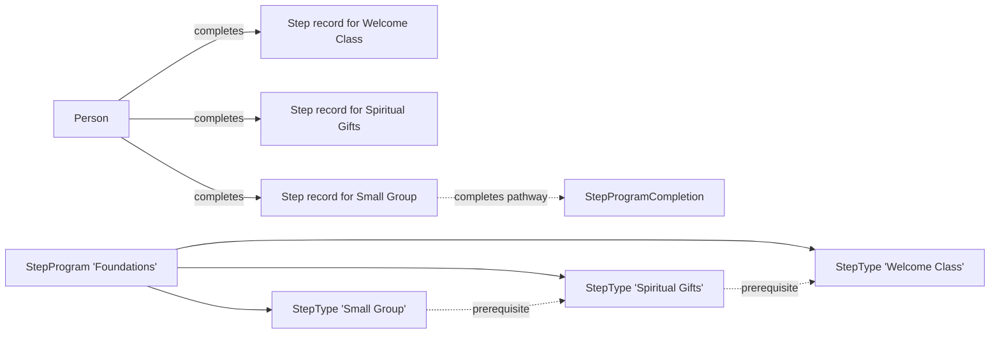

# Step Programs and Pathways

## Overview

A Step Program is a discipleship pathway: an ordered (or partially ordered) sequence of milestones a person works through. "Foundations Pathway" might have steps "Attended Welcome Class", "Took Spiritual Gifts Assessment", "Joined a Small Group", "Started Volunteering." `StepProgram` is the pathway; `StepType` rows are the milestones; `Step` rows are records of one Person reaching one milestone; `StepProgramCompletion` summarizes when someone has finished an entire program. Prerequisites can chain steps (must complete A before B becomes available). Workflows can fire on Step lifecycle events.

The Step Analytics work (commit `8aadf06f08`, 2025-09-15) added trends, totals, statuses, and campuses to the Step Program / Step Type Detail blocks - turning Step data from "available but hard to surface" into actionable reporting.

## Why It Exists

Most discipleship and onboarding programs in churches are sequential: complete the welcome class before joining a group; finish the foundational class before serving; complete the leader assessment before leading. Tracking this with ad-hoc methods (spreadsheets, custom workflow chains) does not scale and fails the audit needs of leadership-development programs.

The Step Program model gives a structured way to define the pathway and track progress per Person. The prerequisite mechanism enforces the sequential constraint. The completion record marks "this person finished the whole pathway" - useful for reporting on graduation rates and identifying program-completers.

## Mental Model

Each Step Type has prerequisites pointing to other Step Types. The completion order is enforced by the prerequisite check: you can't complete Step Type B until Step Type A is complete. When a Person finishes all required step types in the program, a `StepProgramCompletion` row records the achievement.

## What You Need to Know

**StepProgram is the pathway; StepType is the milestone.** Programs hold many types. Each type is a distinct achievable milestone.

**Prerequisites enforce ordering.** `StepTypePrerequisite` rows say "must complete StepType X before StepType Y." Reports must walk prerequisites to evaluate eligibility.

**Steps are records of completion.** A `Step` row says "this Person completed this StepType on this date." Steps can be added manually (admin records) or via workflow (an automated trigger detects the milestone happened).

**StepStatus categorizes Steps.** Common statuses: Started, Completed, Failed. Configurable per program. Reports filter by status.

**`StepProgramCompletion` is the program-finish summary.** Created when all required step types in the program are complete. Used for "graduation rate" reporting and identifying program-completers.

**Step Workflows fire on lifecycle events.** `StepWorkflow` and `StepWorkflowTrigger` rows wire workflows to step events: started, completed, failed. Custom workflows can extend (send congratulation email, assign to next pathway, notify a coach).

**Step Analytics surfaces trends.** Per `8aadf06f08`, the Step Program Detail and Step Type Detail blocks include analytics: completion trends over time, totals, status breakdowns, campus distribution. Useful for pathway-effectiveness reporting.

**LMS Integration:** Some Step Types tie to LMS course completions. The LMS course-completion event triggers Step record creation.

**Custom completion criteria.** A Step Type can have custom criteria for completion (Person met criteria X). Custom workflow actions can evaluate and create Steps.

**Manual addition via admin UI.** Administrators can add Step rows manually via Step Detail block. Bulk addition via Step Bulk Entry.

**Step Type configuration includes display.** Icon, color, description. Used by progress UIs that visualize a Person's pathway position.

## Common Scenarios

**"Define a Foundations pathway."** StepProgram "Foundations". Add StepTypes: Welcome Class, Spiritual Gifts, Small Group, Serving. Configure prerequisites. Save.

**"Mark someone as completing the Welcome Class."** Step Detail block, OR Step Bulk Entry, OR a custom workflow that detects attendance. Creates a Step row.

**"Show pathway progress for a Person."** Person profile widget that lists StepTypes in the program with current Status. Custom widget OR built-in Step Participant List.

**"Configure a workflow on Welcome Class completion."** StepWorkflow row with trigger=Completed and the WorkflowType to launch.

**"Report on Foundations graduation rate."** Query `StepProgramCompletion` for the program. Compare to the count of enrolled Persons.

**"Custom criteria: complete 'Took Communion' step when Person attended a communion service."** Custom workflow that detects the attendance event and creates a Step.

## Key Architectural Decisions

### Program / Type / Step three-tier model

Pathway / milestone / per-Person-completion are three different concepts. Modeling each independently is correct.

### Prerequisites as data

Configuration drives ordering; per-program prerequisite chains evolve without code.

### Completion as separate entity

Program finish is a noteworthy event; recording it as `StepProgramCompletion` lets reports easily query for finishers.

### Workflow triggers on Step lifecycle

Reuses the workflow machinery for custom actions on milestone achievements.

### Per-Person-Step persistence

Each Step is a row; steps don't get deleted when later steps are added. Historical record preserved.

## Considered but Rejected

### Hardcoded pathway logic per Program

Rejected. Per-deployment pathway evolution requires data-driven configuration.

### Single Step row per Person per Program

Rejected. Multiple StepTypes per Program need per-StepType records.

### Completion auto-deletion of intermediate Steps

Rejected. Steps are historical records; deletion would lose audit value.

## Technical Reference

### Schema (relevant subset)

`StepProgram`:
- `Name`, `Description`, `IconCssClass`
- `CategoryId`
- `IsActive`
- `DefaultListView` (Card / Grid)

`StepType`:
- `StepProgramId`
- `Name`, `Description`, `IconCssClass`
- `IsActive`
- `AllowMultiple`, `HasEndDate`, `ShowCountOnBadge`
- `AudienceDataViewId`, `AutoCompleteDataViewId`
- `MergeTemplateDescriptorId`

`StepTypePrerequisite`:
- `StepTypeId`
- `PrerequisiteStepTypeId`

`Step`:
- `StepTypeId`
- `PersonAliasId`
- `StepStatusId`
- `StartDateTime`, `EndDateTime`, `CompletedDateTime`
- `CampusId`

`StepStatus`:
- `StepProgramId`
- `Name`, `IsCompleteStatus`
- `StatusColor`

`StepProgramCompletion`:
- `StepProgramId`
- `PersonAliasId`
- `StartedDateTime`, `EndedDateTime`
- `CampusId`

`StepWorkflow`, `StepWorkflowTrigger`: workflow trigger configuration.

### Save Hook Behavior

`Step.SaveHook` triggers Step workflows; creates `StepProgramCompletion` when all required steps are complete.

### Affected Blocks

- **Admin:** Step Program Detail/List, Step Type Detail, Step Status Detail.
- **Operational:** Step Detail, Step Bulk Entry, Step Entry, Step Participant List, Step Map Editor, Step Program Completion Detail/List.

### Related Docs

- [docs/engagement/engagement-overview.md](engagement-overview.md)
- [docs/engagement/streak-types.md](streak-types.md) (different concept)
- [docs/engagement/achievements.md](achievements.md) (related; achievements can be triggered by step completions)

## Recent Impactful Changes

- **2025-09-15** ([commit `8aadf06f08`](https://github.com/SparkDevNetwork/Rock/commit/8aadf06f08)). Step Program Detail and Step Type Detail blocks gained analytics: trends, totals, statuses, campuses.
