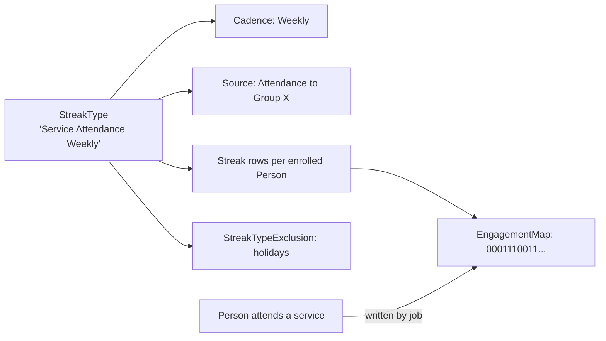

# Streak Types

## Overview

A `StreakType` defines what counts as engagement, the cadence (daily / weekly / monthly), and the rules for what counts. Each enrolled `Streak` row holds a person's bitmap of engagement-or-not per period. Streak length and total engagement count are computed from the bitmap. `StreakTypeExclusion` rows define periods that don't count (org-wide blackouts, holidays). The classic use case is "service attendance streak" - a binary did-they-attend per week, with bitmap aggregation across the year.

## Why It Exists

Tracking patterns of engagement (attended worship, gave consistently, served regularly) requires more than just counting events. Did they show up two weeks in a row? Three months? A whole year? Modeling each event individually would give the data; modeling the aggregate as a streak makes the question fast to answer. The bitmap representation compresses a year of weekly check-ins into a few bytes; streak length is a constant-time computation.

The bitmap design is what makes this work at scale. Per-event rows would multiply storage; the bitmap stores 365 days in 46 bytes (or 52 weeks in 7 bytes). Computing "current streak length" walks backward through the bitmap until it hits a zero; computing "longest streak ever" runs through the whole bitmap once.

## Mental Model

A streak type is configured once. Each Person who should be tracked gets a `Streak` row with an `EngagementMap` bitmap. The engagement-tracking job updates bits when matching events occur. Reports query the bitmap for streak length, total engagement, longest streak.

## What You Need to Know

**Cadence determines bit width.** Daily: one bit per day; weekly: one bit per week; monthly: one bit per month. Cadence is set at type creation and rarely changes (changing it invalidates existing streaks).

**Engagement source defines what counts.** Attendance to a specific Group, giving frequency, custom criteria. The source is configured per type; the engagement-tracking job evaluates.

**Bits are written by the engagement-tracking job, not at event time.** A Person attends a service; the job runs nightly (or on a faster cadence) and updates the matching bit. Real-time bitmap update would require save-hook integration with every source event; the job is simpler.

**`StreakTypeExclusion` rows skip periods.** A church-wide holiday week or a campus-specific blackout. The exclusion's `LocationId` (campus) and date range narrow the scope. The exclusion makes that period count as if engagement happened (or as not-counted, depending on configuration).

**`Streak.EngagementMap` is binary.** A bit set means engagement; a bit unset means none. The bitmap aligns with the type's cadence and the streak's `EnrollmentDate`.

**Computed values are derived from the bitmap.** Current streak length: count consecutive bits set going backward from the current period. Longest streak: scan the bitmap. Total engagement: count bits set. Computed by `Streak.SaveHook` and updated on engagement-bit changes.

**Per-Person Streak rows persist.** Even after a streak breaks, the `Streak` row stays; reports show "longest historical streak" plus "current streak (zero or active)."

**Exclusions vs gaps.** A bit unset because the Person did not engage breaks the streak. A bit unset because of an exclusion does NOT break the streak (the period doesn't count either way).

**Custom engagement sources are pluggable.** Configure custom criteria via `StreakTypeSettings`. Custom code can subclass to evaluate non-standard signals.

**`Streak.IsActive = false` removes a Person from tracking.** The row stays for historical reference; the engagement-tracking job skips it.

## Common Scenarios

**"Track 12-week service-attendance streaks."** StreakType "Service Attendance" with weekly cadence and source = attendance to the Worship Group. Enroll members. The job updates bitmaps weekly.

**"Add a Christmas-week exclusion."** StreakTypeExclusion for the type, date range = Dec 23 to Dec 31. Members who don't attend that week don't break their streak.

**"Show the top 10 longest streaks."** Query `Streak` ordered by computed longest-streak-length descending.

**"Re-enroll a Person whose streak broke."** Toggle `IsActive = true` and reset the bitmap (or let the job repopulate from history). The "current" streak starts fresh.

**"Custom signal: streak based on giving consistency."** StreakType with custom source code that evaluates "gave during this period." Job handles the bit update.

**"Investigate why a streak broke unexpectedly."** Inspect the bitmap. Check exclusions for the period. Check the engagement-tracking job ran successfully.

## Key Architectural Decisions

### Bitmap representation

Compresses storage; constant-time current-streak math. Per-event rows would have multiplied storage and complicated streak math.

### Job-driven bit updates

Real-time per-event update would require save-hook integration with every source. Job-driven is simpler and bounded.

### Exclusions as separate entity

Org-wide blackouts and per-campus exclusions need first-class modeling. Embedding in the StreakType configuration would have been awkward for date-range data.

### Cadence fixed per type

Cadence change invalidates the bitmap; modeling cadence change as a type recreation keeps the data model clean.

### Streak rows persist after breaks

Historical streak length is meaningful for engagement reporting; deleting the row would lose it.

## Considered but Rejected

### Per-event row instead of bitmap

Rejected. Storage and computation costs.

### Real-time bitmap updates

Rejected. Save-hook coupling complexity.

### Variable cadence per Streak

Rejected. Cadence is a type-level decision; per-Streak variation would multiply complexity.

## Technical Reference

### Schema (relevant subset)

`StreakType`:
- `Name`, `Description`
- `OccurrenceFrequency` (Daily / Weekly / Monthly)
- `EnableAttendance` (use attendance as the engagement source)
- `RequiresEnrollment` (only enrolled Persons tracked)
- `IsActive`
- `StructureType`, `StructureEntityId` (for source configuration)
- `FirstDayOfWeek`
- `OccurrenceMap`, `OccurrenceLocationsJson` (configuration JSON)

`Streak`:
- `StreakTypeId`
- `PersonAliasId`
- `EnrollmentDate`
- `EngagementMap` (binary)
- `ExclusionMap` (binary, mirrors exclusions)
- Computed values via save hook

`StreakTypeExclusion`:
- `StreakTypeId`
- `LocationId` (campus)
- `ExclusionMap` (binary, periods to exclude)

### Save Hook Behavior

`Streak.SaveHook` recomputes streak length on engagement-bitmap updates. Runs the bitmap-walk to compute current and longest streaks.

### Affected Blocks

- **Admin:** Streak Type Detail/List, Streak Map Editor, Streak Type Exclusion Detail/List.
- **Operational:** Streak List, Streak Detail.

### Related Docs

- [docs/engagement/engagement-overview.md](engagement-overview.md)
- [docs/engagement/step-programs-and-pathways.md](step-programs-and-pathways.md) (related but different)
- [docs/engagement/achievements.md](achievements.md) (related but different)

## Recent Impactful Changes

(No release-note-tagged changes specifically to streak types in the last 18 months. The bitmap mechanism is mature; per-deployment streak configuration evolves.)
