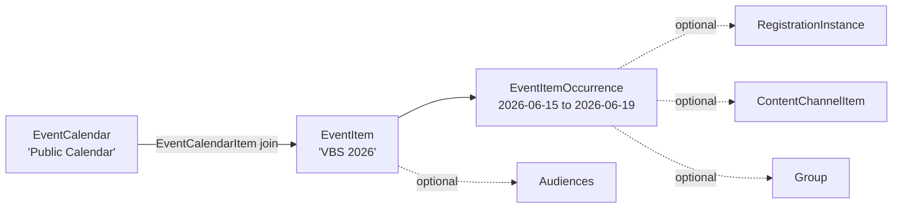

# Calendar and Occurrences

## Overview

Rock's public-facing event calendar uses three layers: **`EventCalendar`** is a calendar (Public Calendar, Internal Calendar, Children's Calendar); **`EventItem`** is an event ("VBS 2026", "Easter Service"); **`EventItemOccurrence`** is one schedulable instance of that event ("VBS, June 15-19" or "Easter Service, 9 AM"). Multiple calendars can hold the same EventItem (`EventCalendarItem` is the join). Audiences (`EventItemAudience`) target events to specific Persons / DataViews. Optional `EventItemOccurrenceChannelItem` ties an occurrence to a Content Channel Item for richer content. Optional `EventItemOccurrenceGroupMap` ties an occurrence to a Group (the team / cohort that runs it).

## Why It Exists

Public events have multiple cross-cutting concerns: categorize across calendars (Public + Children's), recur or schedule once, link to content (the event's promotional page), link to a Group (the team running it), link to a Registration (the signup), surface in feeds and ICS exports. Modeling each as a separate concern (calendar, item, occurrence, content link, group link, registration link) lets each axis vary independently.

The recent fix work has focused on registration-side concerns (discussed in other docs) and the broader surface (`9d30769249` fixed cascading Campus deletes that took attendance / registration with them). The Calendar layer itself is stable.

## Mental Model

A calendar lists items (joined via `EventCalendarItem`). Each item has occurrences. An occurrence can have a registration instance, a content channel item (for the marketing page), a Group association (the team running the occurrence), and audience tags.

## What You Need to Know

**EventCalendar groups events by category.** A church with internal-only events plus public events typically has at least two calendars. Items can belong to multiple calendars.

**EventItem is the event identity, EventItemOccurrence is the run.** A weekly event like "Sunday Service" has one EventItem and many EventItemOccurrences. A one-off event like "Christmas Concert 2026" has one EventItem and one EventItemOccurrence.

**Schedule support is in EventItemOccurrence.** The occurrence's `Schedule` (one-time or recurring) drives ICS export, calendar display, and reminder timing.

**Audiences target events.** `EventItemAudience` rows tie an EventItem to an Audience DefinedValue (Adults, Youth, Families). Calendar feeds can filter by audience.

**Content Channel Item association.** An occurrence can link to a `ContentChannelItem` (typically the marketing / informational page for the event). The link is via `EventItemOccurrenceChannelItem`. Used to render rich content alongside the calendar entry.

**Group association.** An occurrence can link to a Group (typically the team / cohort running it). Via `EventItemOccurrenceGroupMap`. The Group might be the volunteer team for the event, the registered participants, or a planning Group.

**Campus delete used to cascade through events.** Pre-fix `9d30769249` (Fixes #6563, 2025-12-04), deleting a Campus deleted associated Attendance, Prayer Requests, and Registrations. The fix detaches them safely. Older Rock instances may have orphaned data from this class of incident.

**Calendar feeds export ICS.** The EventCalendar exposes feed URLs for ICS export; users subscribe in their calendar apps. Feed URLs respect audience filters.

**Lava blocks for calendar rendering.** `` and `` blocks are the primary rendering primitives for custom calendar UIs. See [docs/lava/lava-overview.md](../lava/lava-overview.md).

**Group Attendance List Date Range filter end-date issue.** Pre-fix `3b6ddea7ba` (Fixes #6749, 2026-03-25), occurrences on the selected end date did not appear. Custom date-range queries should verify they include the end date.

## Common Scenarios

**"Set up a public calendar with a Christmas Concert."** Create EventCalendar "Public Calendar". Create EventItem "Christmas Concert 2026" with audience "Families." Create EventItemOccurrence with the date / schedule. Optionally link to Registration, Content Channel Item, Volunteer Team Group.

**"Show events on a public website."** Use the Calendar Lava block (or Calendar block) on a public page. Configure the calendar to display, audience filters, layout. Lava-render with custom HTML.

**"Subscribe to an external calendar app."** Calendar feed URL. Users add it to their iPhone / Google Calendar.

**"Recurring event."** EventItem with occurrences across multiple dates, OR an EventItemOccurrence with a recurring `Schedule`. Pick based on whether occurrences should be individually editable.

**"Tie an event to a registration."** Set `EventItemOccurrence.RegistrationInstanceId` to the configured RegistrationInstance. The occurrence link surfaces a "Register" CTA on the calendar entry.

**"Tie an event to a Group (the team running it)."** `EventItemOccurrenceGroupMap` row. Useful for showing "this event is run by Group X" or for assigning attendees to the Group.

## Key Architectural Decisions

### Three-layer model (Calendar / Item / Occurrence)

Multiple cross-cutting axes (calendar membership, schedule, content link, registration link, audience). Three layers handle each.

### Multi-calendar membership

An event can be on multiple calendars (Public + Children's). The join table supports this naturally.

### Optional registration / content / group links

Many events have no registration, no separate content page, no Group. Optional links mean simple events stay simple.

### Audience as DefinedValue

Configurable audiences without code change.

### Lava-block-based rendering

Custom calendar UIs are common; Lava blocks support flexible rendering.

## Considered but Rejected

### One calendar per event

Rejected. Multi-calendar membership is a common need.

### Required registration on every event

Rejected. Many events do not require sign-up.

### Hard-deleting events that have run

Rejected. Historical event data is valuable for reporting; soft retirement via `IsActive`.

## Technical Reference

### Schema (relevant subset)

`EventCalendar`:
- `Name`, `Description`
- `IconCssClass`
- Per-calendar attribute support

`EventItem`:
- `Name`, `Summary`, `Description`
- Audience and content links
- Approval status

`EventItemOccurrence`:
- `ScheduleId`
- `LocationDescription`, `Note`
- `RegistrationInstanceId`
- `CampusId`

`EventCalendarItem`: many-to-many join.
`EventItemAudience`: audience tags.
`EventItemOccurrenceChannelItem`: content channel item link.
`EventItemOccurrenceGroupMap`: Group association.

### Affected Blocks

- **Public:** Calendar, Calendar Lava, Event Item Lava, Event Item Detail Lava, Event Item Occurrence View.
- **Admin:** Event Calendar Detail, Event Calendar Item Detail, Event Item Detail, Event Item Occurrence Detail, Event Calendar Types.

### Related Docs

- [docs/event/event-overview.md](event-overview.md)
- [docs/event/registration-template-design.md](registration-template-design.md)
- [docs/cms/cms-overview.md](../cms/cms-overview.md) for ContentChannelItem
- [docs/lava/writing-blocks.md](../lava/writing-blocks.md) for calendar Lava blocks

## Recent Impactful Changes

- **2026-03-25** ([commit `3b6ddea7ba`](https://github.com/SparkDevNetwork/Rock/commit/3b6ddea7ba)). Group Attendance List Date Range filter correctly includes occurrences on the selected end date (Fixes #6749).
- **2025-12-04** ([commit `9d30769249`](https://github.com/SparkDevNetwork/Rock/commit/9d30769249)). Campus delete no longer cascades through Attendance, Prayer Requests, and Registrations (Fixes #6563).
