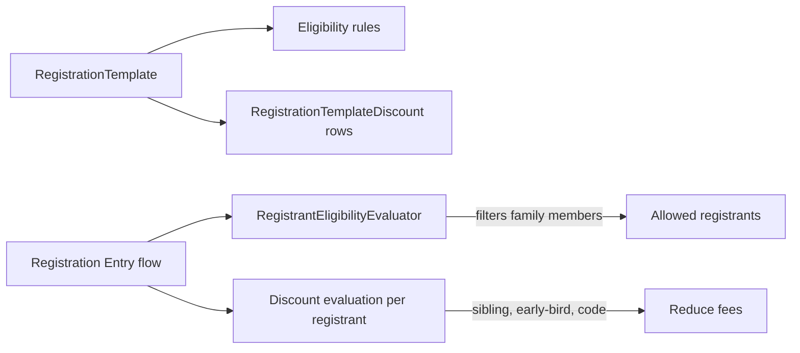

# Eligibility and Discounts

## Overview

Two related concerns at registration time: **eligibility** (who is allowed to register?) and **discounts** (which fees can be reduced for which registrants?). Both are configured on the `RegistrationTemplate` and evaluated at flow time. Eligibility uses the `RegistrantEligibilityEvaluator` (added in commit `b15a1d0946`, 2026-03-02). Discounts use `RegistrationTemplateDiscount` rows with configurable rules (date-based, code-based, sibling-detection).

## Why It Exists

Real registrations have rich constraints: kids' camps require age-classification matching, members-only events require GroupMember status, family members of the registering Person should be auto-suggested, ineligible family members should be blocked. Without configuration, every site would write custom validation; configuring as data lets templates evolve without code.

Discounts have a similar story: sibling discounts, early-bird discounts, promotion codes are universal church-event patterns. Modeling each as a configurable `RegistrationTemplateDiscount` row gives admins flexibility without per-event coding.

## Mental Model

Eligibility runs at registrant-selection time: when the entry flow surfaces "register this family member," ineligible family members are filtered out. Discounts run at fee-calculation time: each fee is evaluated against the active discounts; matching discounts reduce the amount.

## What You Need to Know

**Eligibility rules block ineligible family-member registrations.** Per `b15a1d0946`, the entry flow consults `RegistrantEligibilityEvaluator`. Without rules, all family members are eligible; with rules, only matching members surface.

**Eligibility rule shapes:**
- **Age Classification:** Adult / Child / Unknown.
- **Membership:** must be in a specific Group / GroupType.
- **DataView membership:** must match a configured DataView.
- **Custom rules:** subclass the evaluator for deployment-specific logic.

**Custom registration entry blocks must respect eligibility.** Bypassing the evaluator allows registrations the template considers invalid. The fix codifies the canonical evaluation; custom flows should call into it.

**Discount evaluation is per-registrant.** Each registrant's fees are evaluated against the active discounts; matching discounts reduce that registrant's amount. Cross-registrant discounts (sibling) consider the registration as a whole.

**`RegistrationTemplateDiscount.DiscountAmount` and `.DiscountPercentage` are alternatives.** Set one or the other, not both.

**Promotion codes are entered at flow time.** The discount has a `Code` value; the registrant enters it; matching applies the discount.

**Sibling discounts apply when more than one registrant is in the same family.** Configurable: discount applies to the second-and-beyond registrant, OR all registrants when there are 2+. Configuration on the discount row.

**Early-bird discounts use a date.** Discount with a "valid through" date applies if the registration is created before that date. Date is checked at registration creation, not at template configuration.

**`MaxRegistrants` and `MinRegistrants` on the discount.** Some discounts only apply when registrant count meets a threshold. Configurable per discount.

**Discount stacking.** Multiple matching discounts can apply to the same registrant; the order is determined by configuration. Some sites prefer "best discount only"; some "all matching discounts."

**Eligibility evaluation can be expensive.** DataView eligibility runs the DataView per-evaluation. Cache aggressively if the DataView is heavy; or use simpler rules.

## Common Scenarios

**"Restrict registration to adults only."** Eligibility rule: AgeClassification = Adult. Family members of other classifications cannot register.

**"Members-only event."** Eligibility rule: must be in the "Members" Group. Visitor / inactive Persons are filtered out.

**"Sibling discount: 20% off for second+ child."** RegistrationTemplateDiscount with `MinRegistrants = 2`, applies to registrants 2 onward, percentage 20.

**"Early-bird discount: $25 off if registered by April 1."** RegistrationTemplateDiscount with `ValidThrough = 2026-04-01`, amount 25.

**"Promotion code REUNION25."** RegistrationTemplateDiscount with `Code = "REUNION25"`, percentage 25. Registrants enter the code at flow time.

**"Eligibility based on a DataView (e.g., 'Has Completed Foundations')."** DataView eligibility rule referencing the DataView. Only Persons matching the DataView can register.

## Key Architectural Decisions

### Configuration over code

Both eligibility and discounts as configuration. New rules / discounts are admin work, not code work.

### Per-registrant evaluation

Each registrant gets evaluated independently for both. Cross-registrant logic (sibling discounts) considers the registration as a whole.

### Eligibility evaluator as a class

`RegistrantEligibilityEvaluator` lets custom rule implementations subclass for deployment-specific logic.

### Discount stacking configurable per template

Different policies for different events. Configuration handles both.

## Considered but Rejected

### Always-best-discount

Rejected. Some templates want stacking; configuration handles both.

### Hardcoded eligibility for common cases

Rejected. Configuration is correct; even "common cases" vary across deployments.

### Eligibility on the registrant after submission

Rejected. Should be enforced at registrant selection, not after the user has filled out a form.

## Technical Reference

### `RegistrantEligibilityEvaluator`

[Rock/Model/Event/RegistrationTemplate/RegistrantEligibilityEvaluator.cs](../../Rock/Model/Event/RegistrationTemplate/RegistrantEligibilityEvaluator.cs):
- Evaluates configured eligibility rules against a candidate Person.
- Returns true / false plus a reason (for surfacing "this person is not eligible because ...").

### Eligibility Rule Configuration

On `RegistrationTemplate`:
- AgeClassification filter
- DataView reference
- Group / GroupType reference

### `RegistrationTemplateDiscount`

| Field | Purpose |
|---|---|
| `Code` | Optional promotion code |
| `DiscountAmount` | Flat amount off |
| `DiscountPercentage` | Percentage off |
| `MaxUsage`, `MaxRegistrants`, `MinRegistrants` | Threshold gates |
| `ValidStartDate`, `ValidEndDate` | Date gates |

### Service / API

`RegistrationTemplateDiscountService`: standard CRUD. Discount evaluation logic lives in the registration entry flow.

### Affected Blocks

- Registration Template Detail (configure rules / discounts).
- Registration Entry (apply at flow time).
- Registration Instance Discount List (admin-side discount usage report).

### Related Docs

- [docs/event/registration-template-design.md](registration-template-design.md)
- [docs/event/registration-entry-flow.md](registration-entry-flow.md)

## Recent Impactful Changes

- **2026-03-02** ([commit `b15a1d0946`](https://github.com/SparkDevNetwork/Rock/commit/b15a1d0946)). Added Registrant Eligibility Rules to the Registration Template; Registration Entry block respects them.
