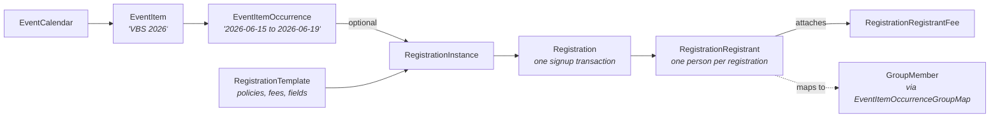

# Event Domain Overview

## Overview

Event is Rock's calendar, registration, and interactive-experience system. The data is layered: `EventCalendar` -> `EventItem` -> `EventItemOccurrence` describes a public-facing event with a recurrence; `RegistrationTemplate` -> `RegistrationInstance` -> `Registration` -> `RegistrationRegistrant` describes the registration shape and the people who actually signed up; `Attendance` (shared with the Group domain) records who showed up. The same `Attendance` entity also backs check-in.

Interactive Experiences are a parallel feature: real-time audience-response experiences (live polls, prayer wall, Q&A) tied to a schedule and a campus.

## Why It Exists

A church-management system needs to handle events with operational complexity that generic calendar tools do not: a single VBS week might have one EventItem with one RegistrationInstance that takes hundreds of registrations across age-segmented groups, requires waivers, charges per-child, applies sibling discounts, validates eligibility against custom rules (age, grade, family member relationships), and must integrate with check-in for the actual week. Modeling event vs registration vs registrant lets each axis vary independently: the event can recur without re-creating registration setup, the template can be reused across multiple instances, and per-registrant fields can be customized per template.

The recent eligibility-rules work (`b15a1d0946`, 2026-03-02; `8cb0f95aba`, 2026-03-05) addresses a class of bug-report-shaped problems: parents could register family members who should not have been eligible, and the same person could double-register. The fix added explicit eligibility rules to the template and a "Prevent Duplicate Registrants" toggle. The signature-document attribution fix (`de5a49c33e`, Fixes #6737) addressed a related correctness gap: documents were being matched by Person rather than by Registrant, which caused incorrect documents to surface in admin views.

The Registration save-hook complexity (full-or-not, payment-handled-or-not, waitlist behavior) exists because real registrations frequently fail mid-flow: a payment processes but the form was incomplete, or the registration becomes full during submission. Commits `134ce18e4c` (Fixes #5091) and `194da6e90c` (Fixes #6462) both address class-of-bug situations in this area.

## Mental Model

Two parallel hierarchies, joined by `EventItemOccurrenceGroupMap`:

`EventItemOccurrence` is the schedulable instance of an EventItem. Registration is optional: many public events do not require sign-up. When registration applies, the occurrence references one `RegistrationInstance`, which inherits its shape (forms, fees, discounts, eligibility) from a `RegistrationTemplate`.

`Registration` is the per-signup transaction (one family group registering N people). `RegistrationRegistrant` is the per-person row inside that transaction. Fees, attribute values, and signature documents attach to the registrant, not to the registration.

`InteractiveExperience` is its own subgraph: an experience has actions (poll questions, prompts), schedules (when it runs), occurrences (specific runs), and answers (per-attendee responses). Used for live worship-service polls, prayer walls, and similar.

## What You Need to Know

**Registration template defines the shape, instance is the run.** Editing the template after a registration is open will affect the instance, but historical Registration rows hold their submitted values; field changes propagate forward. Adding a required field to a template while a registration is mid-flow is risky; the form may render with the new field but in-flight submissions might bypass it (`8dd76e4bd3`, Fixes #6708 addressed exception logging in this area).

**Registration becoming "full" during submission is a race condition.** Pre-fix (commit `194da6e90c`, Fixes #6462), individuals could be charged AND added to the wait list when registration filled during submission, even with the wait list disabled. The fix updated payment handling and message wording. Custom block code that pre-dates this is suspect.

**Required-field enforcement runs at submission, not at field render.** Commit `134ce18e4c` (Fixes #5091) closed a case where individuals could complete a registration without filling required fields (the validation was bypassable). The fix tightened submission-time validation; rolling your own registration block must replicate it.

**Signature documents attach to the registrant, not the person.** A person who registers for two different events needs two signed waivers; matching on Person silently shared waivers across registrations. Commit `de5a49c33e` (Fixes #6737) corrected the relationship to use the registrant's `SignatureDocumentId`. A data migration backfilled historical rows where a valid same-person, same-template document existed.

**Prevent Duplicate Registrants is a template-level toggle.** Since `8cb0f95aba` (2026-03-05), `RegistrationTemplate.PreventDuplicateRegistrants` blocks the same Person from registering twice for the same `RegistrationInstance`. Default is off (existing templates retain prior behavior); turn on for events where double-signup is operationally wrong.

**Registrant Eligibility Rules narrow who can register family members.** `b15a1d0946` (2026-03-02) added per-template eligibility rules used by the Registration Entry block to block ineligible registrations of family members. Custom registration entry flows must respect the same rules; bypassing them allows registrations the template considers invalid.

**Group Attendance Reminders job suppresses reminders only for actual attendance.** Commit `08cf5e8401` (Fixes #6685) addressed a Send-Attendance-Reminder job bug where Groups whose Attendance rows came only from RSVP/scheduling tracking were treated as "attendance taken" and reminders were suppressed. The fix treats those tracking rows as not-attendance; reminders fire correctly when no actual presence was recorded.

**Date Range filter on the Group Attendance List was end-date-exclusive.** `3b6ddea7ba` (Fixes #6749) fixed occurrences on the selected end date being missed.

**Campus delete used to cascade through events.** Commit `9d30769249` (Fixes #6563) fixed Attendance, Prayer Request, and Registration records being deleted when their Campus was deleted. They are now safely detached. Older Rock instances may have orphaned data from this class of incident.

**Event items can target personalization segments and request filters.** The Event Item Detail admin block ([Rock.Blocks/Event/EventItemDetail.cs](../../Rock.Blocks/Event/EventItemDetail.cs)) lets an administrator tag an `EventItem` with Personalization Audience Segments and Request Filters. These persist in the generic `PersonalizedEntity` table (keyed by EntityType + EntityId).

**Interactive Experience is its own thing.** Different lifecycle (start/stop/end), different data shape (`InteractiveExperienceOccurrence`, `InteractiveExperienceAnswer`), different UI (Live Experience block). Do not assume the registration model maps to it.

## Common Scenarios

**"Set up a public event with registration."** Create the EventItem under an EventCalendar. Add an EventItemOccurrence for the schedule. Either pick an existing RegistrationTemplate or create one. Create the RegistrationInstance referencing template + occurrence. The Registration Entry block on a public page handles signups.

**"Limit one registration per person per event."** Set `RegistrationTemplate.PreventDuplicateRegistrants = true`. Existing registrations are not affected.

**"Add a sibling discount."** RegistrationTemplate Discount, with the configured logic and amount. Registrants meeting the criteria get the discount applied at fee calculation.

**"Require a parent waiver for all registrants under 18."** Configure a SignatureDocument template and reference it from the RegistrationTemplate. The Registration Entry flow surfaces the signature step. The Registrant attaches its SignatureDocumentId on completion.

**"Run a live audience poll during a service."** Configure an InteractiveExperience with poll-style actions, schedule it for the service time, and present via the Live Experience block. Answers persist as `InteractiveExperienceAnswer`.

## Key Architectural Decisions

### Three-tier registration model

`Template -> Instance -> Registration -> Registrant` lets policy live on the template (reusable), runtime details on the instance (per-event), and per-person facts on the registrant (per-attendee).

### Registration optional on EventItemOccurrence

Many events do not require signup. Linking RegistrationInstance via the occurrence (rather than baking it into EventItem) keeps the simple case simple.

### Attendance shared across check-in and event recording

`Attendance` is the same entity whether produced by check-in, group attendance recording, or scheduled-attendance imports. Forking the schema would have meant three reporting paths.

### Eligibility rules as data, not code

Registrant eligibility rules live on the template as configuration. New eligibility rules are a template change, not a deployment.

### Interactive Experience as separate feature

Real-time audience response has different lifecycle and data shape from registration. Modeling it in a separate subgraph keeps the registration model clean.

## Considered but Rejected

### Per-occurrence registration shapes

Rejected. Reusing one template across recurring instances of the same event is the common case; per-occurrence shape would multiply admin work without operational benefit.

### Hard FK from Attendance to Registration

Rejected. Attendance can come from check-in, group recording, or scheduled-attendance imports; binding it to a Registration would force every attendance row through the registration model.

### Cascade Campus delete to events

Rejected (since `9d30769249`). The blast radius is too wide and the legitimate use cases for Campus delete (cleanup of test data, retiring a closed campus) do not need to destroy event history.

## Technical Reference

### Data Model (high-level)

| Entity | Purpose |
|---|---|
| `EventCalendar`, `EventCalendarItem`, `EventCalendarContentChannel` | Public-facing calendar grouping. |
| `EventItem`, `EventItemOccurrence`, `EventItemOccurrenceChannelItem`, `EventItemAudience` | Event definition + schedulable occurrence. |
| `EventItemOccurrenceGroupMap` | Optional Group association for an occurrence. |
| `RegistrationTemplate` | Reusable registration shape: forms, fees, discounts, fields, eligibility rules, signature template. |
| `RegistrationTemplateForm`, `RegistrationTemplateFormField`, `RegistrationTemplateFormSection` | Form layout. |
| `RegistrationTemplateFee`, `RegistrationTemplateFeeItem` | Fee configuration. |
| `RegistrationTemplateDiscount` | Discount rules. |
| `RegistrationTemplatePlacement` | Placement policy for assigning registrants to groups. |
| `RegistrationInstance` | Run of a template (the actual signup window). |
| `Registration` | One submission transaction. |
| `RegistrationRegistrant` | One person per registration. |
| `RegistrationRegistrantFee` | Per-registrant fees. |
| `RegistrationSession` | In-progress registration session for resume support. |
| `Attendance`, `AttendanceOccurrence` | Presence recording (shared with Group / Check-in). |
| `AttendanceCode`, `AttendanceCheckInSession`, `AttendanceData` | Check-in metadata. |
| `InteractiveExperience` and related (`Action`, `Answer`, `Occurrence`, `Schedule`, `ScheduleCampus`) | Live audience-response experiences. |

### Save Hook Behavior

`Registration.SaveHook` ([Rock/Model/Event/Registration/Registration.SaveHook.cs](../../Rock/Model/Event/Registration/Registration.SaveHook.cs)) handles balance recomputation and notification queuing.

`RegistrationInstance.SaveHook` updates active counts and timestamps.

`RegistrationRegistrant.SaveHook` cascades attribute saves and triggers waitlist transitions.

`AttendanceOccurrence.SaveHook` and `Attendance.SaveHook` handle the standard write hooks shared with Group/Check-in.

### Service / API Surface

`RegistrationService.GetSpotsAvailable`, `EventItemService.GetSpotsAvailable` answer the "can I still register" question used by Registration Entry.

`RegistrantEligibilityEvaluator` ([Rock/Model/Event/RegistrationTemplate/RegistrantEligibilityEvaluator.cs](../../Rock/Model/Event/RegistrationTemplate/RegistrantEligibilityEvaluator.cs)) evaluates the eligibility rules introduced in `b15a1d0946`.

### Affected Blocks and UI Surfaces

- **Public:** Calendar, Calendar Lava, Event Item Lava, Registration Entry, Group Registration.
- **Admin:** Event Calendar Detail, Event Calendar Item Detail, Event Item Detail, Event Item Occurrence Detail, Registration Template Detail, Registration Instance Detail, Registration Detail, Registrant Detail.
- **Reporting:** Registration Instance Registration List, Registration Instance Discount List, Registration Instance Linkage List, Registration Instance Payment List, Registration Instance Send Payment Reminder.
- **Interactive:** Interactive Experience Detail/List, Live Experience, Experience Manager, Experience Manager Occurrences.

### Extension Points

- **Custom registration form fields.** Configure attribute-backed fields per-template.
- **Custom signature templates.** SignatureDocument templates attached to registration templates.
- **Custom Interactive Experience action types.** `InteractiveExperienceAction` configurable per experience.
- **Custom workflow triggers.** Registration completion, payment received, registrant added.

### File Index

- `Rock/Model/Event/` (entities)
- `Rock.Blocks/Event/` (Obsidian-aware C# blocks)
- `Rock/Field/Types/RegistrationTemplate*` (field types for the registration system)

## Recent Impactful Changes

- **2026-07-28** ([commit `322e2faeb7`](https://github.com/SparkDevNetwork/Rock/commit/322e2faeb7)). Event Item Detail block refreshed to the section/stack layout and gained personalization Audience Segment and Request Filter assignment (stored in `PersonalizedEntity`); the Approved status became a permission-gated button group.
- **2026-03-25** ([commit `3b6ddea7ba`](https://github.com/SparkDevNetwork/Rock/commit/3b6ddea7ba)). Group Attendance List Date Range filter now correctly includes occurrences on the selected end date (Fixes #6749).
- **2026-03-20** ([commit `de5a49c33e`](https://github.com/SparkDevNetwork/Rock/commit/de5a49c33e)). Internal Event Registration blocks now match Signature Documents by registrant rather than by person; data migration backfilled missing values (Fixes #6737).
- **2026-03-05** ([commit `8cb0f95aba`](https://github.com/SparkDevNetwork/Rock/commit/8cb0f95aba)). Added "Prevent Duplicate Registrants" template setting to block the same Person registering twice for the same instance.
- **2026-03-02** ([commit `b15a1d0946`](https://github.com/SparkDevNetwork/Rock/commit/b15a1d0946)). Added Registrant eligibility rules to the Registration Template, prevent incorrect family member registrations.

## Related Specs

- [Event Item Detail Polish + Personalization](../../specs/completed/event/260727-event-item-detail-polish-personalization.md) — 2026-07-27 (Jason Hendee)
