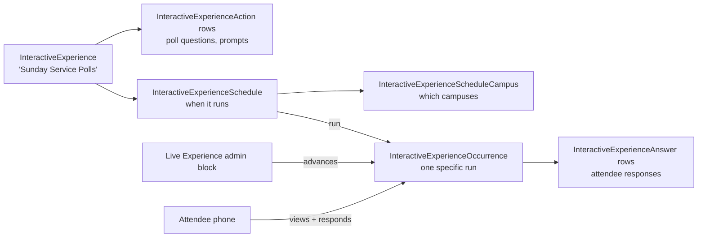

# Interactive Experiences

## Overview

Interactive Experiences are real-time audience-response experiences: live polls during a service, a prayer wall during a worship night, a Q&A during a teaching session. The model has its own subgraph distinct from registration: an `InteractiveExperience` is the experience definition (the title, the actions to run, the visual theme); `InteractiveExperienceAction` rows are the prompts (poll question, prayer prompt, Q&A); `InteractiveExperienceSchedule` defines when it runs; `InteractiveExperienceOccurrence` is one specific run; `InteractiveExperienceAnswer` records each attendee's response.

## Why It Exists

Live audience response is a different shape from registration: there's no signup, no payment, no per-person attribute collection. Just a real-time experience where attendees respond and the response stream is shown live. Modeling it on the Registration entities would have been awkward; the dedicated subgraph fits the lifecycle (start the experience, run actions one at a time, close it, archive answers).

Interactive Experiences are typically driven from a worship-time UI (the Live Experience block on a kiosk or admin tablet) and consumed from attendees' phones. The mobile app surfaces the experience; the admin advances actions; answers stream in real time.

## Mental Model

The admin (typically a service producer) starts the occurrence, advances actions one at a time, watches answer streams. Attendees on phones see the current action and submit responses; the admin can show aggregated results live.

## What You Need to Know

**Interactive Experiences are not Registrations.** Different lifecycle, different data shape, different consumer surfaces. Do not confuse the two.

**`InteractiveExperience` is the definition.** Like a workflow type: configured once, run many times.

**`InteractiveExperienceAction` is one prompt.** Action types: Poll (multiple-choice question), Prayer Prompt (collect prayer requests), Q&A (free-form questions). Custom action types as components.

**`InteractiveExperienceOccurrence` is one specific run.** Started, advanced through actions, ended. The occurrence has its own state: which action is active, whether responses are accepted.

**`InteractiveExperienceAnswer` records each response.** PersonAlias, Action, Answer text / structured value, timestamp. Aggregated views (poll results, top responses) compute from these rows.

**Per-campus scheduling.** `InteractiveExperienceScheduleCampus` lets one experience run differently per campus. The schedule defines when across campuses; per-campus rows override.

**The admin block (`Rock.Blocks.Event.InteractiveExperiences.LiveExperience`) drives the runtime.** Start, advance, close. Watching the admin UI sees the current action plus the live answer stream.

**The attendee block surfaces the current action.** Public-facing or mobile block. Attendee submits; the answer hits the database; the admin block sees it.

**Anonymous responses are supported.** Attendees do not need to be signed in; the answer can be tied to a transient session ID. Configurable per experience.

**Answer aggregation is real-time.** Poll results, top prayer requests, etc. computed from `InteractiveExperienceAnswer` rows live. Performance scales with audience size; large audiences may need caching layers.

**Custom action types.** Implement an `InteractiveExperienceActionComponent` for new action shapes. The standard set covers most cases; specialized cases (e.g., word cloud) may need new components.

**Closed occurrences retain answers.** Reports / replays can read the answer stream after the experience ends. Cleanup is manual; high-volume sites with many experiences may want a retention policy.

## Common Scenarios

**"Run a live poll during the sermon."** Configure an InteractiveExperience with Poll actions. Schedule for the service time. Start the occurrence from the admin block; advance actions as the speaker references them; show results.

**"Prayer wall during a worship night."** InteractiveExperience with a Prayer Prompt action. Attendees submit prayers from their phones; the admin / display surface shows the stream.

**"Q&A during a teaching session."** Q&A action; attendees submit questions; the moderator picks ones to answer; results displayed live.

**"Multi-campus rollout."** One InteractiveExperience, scheduled for the service time across campuses. Each campus runs its own occurrence; answers tagged by campus.

**"Anonymous responses."** Configure the experience to accept anonymous. Useful for sensitive prayer requests where attendees may not want their identity shown.

**"Custom action: word cloud."** Implement an action component that aggregates submitted words. Register; add to the experience.

## Key Architectural Decisions

### Separate subgraph from Registration

Different lifecycle, different data shape. Forking would have been the wrong tradeoff.

### Action-component pluggability

New action types (poll, prompt, Q&A, future custom types) plug in without core changes.

### Per-campus scheduling

Multi-campus realism: same experience, different runs.

### Anonymous response support

Some experiences (sensitive prayer requests) need anonymity. Configurable per experience.

### Real-time admin advance

Live experiences need a human director; admin block is the right surface.

## Considered but Rejected

### Modeling on Registration

Rejected. Different lifecycle.

### Async-only response collection

Rejected. Real-time admin display is core to the experience. Sync stream-in is correct.

### Hardcoded action types

Rejected. New experience types come up; pluggable action components is right.

## Technical Reference

### Schema (relevant subset)

`InteractiveExperience`:
- `Name`, `Description`
- Visual theme configuration
- Status

`InteractiveExperienceAction`:
- `InteractiveExperienceId`
- `ActionType` (Poll / Prayer / Q&A / custom component)
- Action-specific configuration

`InteractiveExperienceSchedule`:
- `InteractiveExperienceId`
- `ScheduleId`

`InteractiveExperienceScheduleCampus`:
- Schedule + campus combination

`InteractiveExperienceOccurrence`:
- `InteractiveExperienceScheduleId`
- `Status` (Started, In Progress, Ended)
- `CurrentActionId`
- Start / End timestamps

`InteractiveExperienceAnswer`:
- `InteractiveExperienceOccurrenceId`
- `InteractiveExperienceActionId`
- `PersonAliasId` (nullable for anonymous)
- `Response` (text or structured)
- Timestamp

### Affected Blocks

- **Admin:** Interactive Experience Detail/List, Experience Manager, Experience Manager Occurrences.
- **Live:** Live Experience admin block.
- **Attendee:** Live Experience public/mobile block.

### Related Docs

- [docs/event/event-overview.md](event-overview.md)
- [docs/mobile/mobile-overview.md](../mobile/mobile-overview.md)

## Recent Impactful Changes

(No release-note-tagged changes specifically to Interactive Experiences in the last 18 months. The subsystem is mature; per-deployment custom action types continue.)
