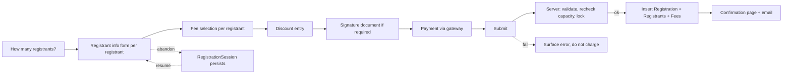

# Registration Entry Flow

## Overview

The Registration Entry flow is the user-facing path that turns a `RegistrationTemplate` into a completed `Registration` with `RegistrationRegistrant` rows, charges payment, and triggers downstream workflows. The flow lives in `Rock.Blocks/Event/RegistrationEntry.cs` (one of the largest blocks in Rock) and walks the registrant through: how many registrants, who each is, fee selection, discount entry, payment, signature documents, confirmation. Mid-flow state persists in `RegistrationSession` rows so users can resume after a closed browser. The save hook on `Registration` writes balances, queues confirmations, and fires workflows.

## Why It Exists

Multi-step registration with mid-flow payment is the most failure-prone path in Rock: the registrant might abandon mid-flow, the gateway might time out during payment, the registration might fill up between submission and final commit, the user might double-click submit producing duplicate registrations. The flow exists to handle all of these cleanly: session persistence for resume, locking and capacity recheck at commit, idempotent submission handling, full-rollback if payment fails after registrant insert.

The 2026-01-05 fix (commit `194da6e90c`, Fixes #6462) addressed the "registration full during submission" race: pre-fix, a registrant could be charged AND added to the wait list when the registration filled up while their submission was processing, even when the wait list was disabled. The fix updated payment handling and the user-facing message; correct behavior is "fail submission, don't charge, surface a clear message."

The required-field-bypass fix (commit `134ce18e4c`, Fixes #5091) was a security-class issue: clever users could submit without filling required fields. The fix tightened submission-time validation.

## Mental Model

Each step persists progress in `RegistrationSession` so an abandoned flow can resume. Final submission goes through server-side validation (required fields, eligibility, capacity). On success, the Registration row is inserted along with Registrant rows and fees; the save hook handles balance, confirmation, and workflows.

## What You Need to Know

**Required-field validation runs server-side at submission.** Pre-fix `134ce18e4c`, validation could be bypassed. Custom registration flows must replicate the server-side check; client-side validation is for UX only.

**Capacity is rechecked at submission.** Between flow start and submission, other registrations may fill the instance. Pre-fix `194da6e90c`, the conflict produced incorrect billing + wait-list assignment. The fix: fail cleanly, do not charge, surface a clear message.

**Mid-flow state persists in `RegistrationSession`.** Resume support: the user can close their browser and come back; the session row holds their progress. Cleaned up periodically by maintenance jobs.

**Payment happens before final commit.** The gateway is called with the calculated total. On success, the Registration row is created and tied to the gateway transaction. Failed payment does NOT create the Registration.

**The saved-account offer requires a usable login path.** On the success step, "Save account information for future payments" appears only when the registrar is logged in or Database (username/password) authentication is enabled. An anonymous saver on a Passwordless-only site (Database auth disabled) would otherwise be forced to create a login that can never be used to sign in, so the option is hidden. The save endpoint enforces the same rule: `SaveFinancialAccountFormSaveAccount` in `Rock.Rest/v2/ControlsController.cs` rejects the anonymous create when Database auth is inactive, so the gate is not UI-only.

**Eligibility is enforced.** Per `b15a1d0946` (eligibility rules) and `8cb0f95aba` (duplicate prevention), the entry block blocks ineligible registrations. Custom flows must respect.

**Signature documents attach per registrant.** Per `de5a49c33e`, signatures are tied to the Registrant, not the Person. The entry flow surfaces the signature step for each registrant (or once per registration depending on configuration).

**Confirmation emails fire from the save hook.** The Registration save hook queues the confirmation SystemCommunication. The user sees the confirmation page immediately; the email arrives shortly after.

**Workflows fire from the save hook.** Post-registration workflows configured on the template launch via the save hook. Typical flows: assign registrants to a Group, send custom emails, create Connection Requests.

**Empty form configurations no longer log exceptions.** Pre-fix `8dd76e4bd3` (Fixes #6708, 2026-02-24), submitting a Registration Template Form with no fields at submission time logged an exception. The fix recognizes this is an admin-configuration case, not an error.

**Wait list flow.** When a registration fills, additional submissions go to the wait list (if the template enables it). Wait-list registrants do not pay; promotion to active is a separate admin action that creates a charge.

**Custom block extension via subclassing.** `RegistrationEntry.cs` is large and complex; minor customizations are sometimes possible by subclassing.

## Common Scenarios

**"User registers their family for VBS."** Open Registration Entry block. Pick number of registrants (3 kids). Fill out each child's info, allergies, emergency contact. Pay. Sign waiver. Confirmation page. Confirmation email arrives.

**"User abandons mid-flow."** RegistrationSession persists progress. User returns later via the same link; the flow resumes where they left off.

**"Registration fills during submission."** Server detects, rejects submission, does not charge, surfaces "this event just filled up" message. Wait-list capability if configured.

**"User tries to register the same family member twice."** Per `8cb0f95aba`, blocked by Prevent Duplicate Registrants if enabled. Otherwise allowed, but reports may surface duplicates.

**"Custom workflow on registration completion."** Configure a post-registration workflow on the template. Fires from the save hook.

**"Investigate a stuck registration."** Check the RegistrationSession for the user; check payment status; check for save-hook errors; check the workflow log if a post-registration workflow ran.

## Key Architectural Decisions

### Server-side validation is authoritative

Client-side bypass exists; server is the boundary.

### Mid-flow state in RegistrationSession

Resume support is a real user need. Persistence handles it.

### Payment before commit

Failing payment must not produce a Registration. This ordering is operationally critical.

### Capacity recheck at submission

Race conditions between flow start and submission are real; recheck closes the gap.

### Save hook handles confirmation and workflows

Decouples user-facing UX from background processing. The user sees the confirmation page immediately; emails / workflows happen async.

## Considered but Rejected

### Client-side-only validation

Rejected. Server-side enforcement is required.

### Lock for entire flow duration

Rejected. Holding capacity for the entire form-fill duration would multiply abandonment lock-outs. Recheck at submission is the right tradeoff.

### One Registration per Person

Rejected. Family registrations register multiple Persons; the model supports this.

## Technical Reference

### Block

`Rock.Blocks/Event/RegistrationEntry.cs`: the user-facing entry point. Large block; consult before significant customization.

### Save Hook

`Registration.SaveHook` ([Rock/Model/Event/Registration/Registration.SaveHook.cs](../../Rock/Model/Event/Registration/Registration.SaveHook.cs)):
- Balance recomputation on registrant add / remove.
- Confirmation queue.
- Workflow trigger on completion.

`RegistrationRegistrant.SaveHook`: cascades attribute saves; handles wait-list transitions.

### Service / API

`RegistrationService.GetSpotsAvailable( instanceId )`: the canonical capacity check.

### Affected Blocks

- **Public:** Registration Entry, Group Registration.
- **Admin:** Registration Detail, Registration Instance Detail, Registration Instance Registration List.

### Related Docs

- [docs/event/registration-template-design.md](registration-template-design.md)
- [docs/event/eligibility-and-discounts.md](eligibility-and-discounts.md)
- [docs/event/event-overview.md](event-overview.md)

## Recent Impactful Changes

- **2026-06-16** ([commit `f2774f6a6d`](https://github.com/SparkDevNetwork/Rock/commit/f2774f6a6d)). Registration Entry now hides the "Save account information for future payments" option when an anonymous registrar has no usable login (Database auth disabled), enforced server-side (Fixes #6877).
- **2026-02-24** ([commit `8dd76e4bd3`](https://github.com/SparkDevNetwork/Rock/commit/8dd76e4bd3)). Empty-form configurations no longer log exceptions on submission (Fixes #6708).
- **2026-01-26** ([commit `134ce18e4c`](https://github.com/SparkDevNetwork/Rock/commit/134ce18e4c)). Server-side required-field validation now correctly enforced (Fixes #5091).
- **2026-01-05** ([commit `194da6e90c`](https://github.com/SparkDevNetwork/Rock/commit/194da6e90c)). Registration full during submission no longer charges + adds to wait list when wait list is disabled (Fixes #6462).
