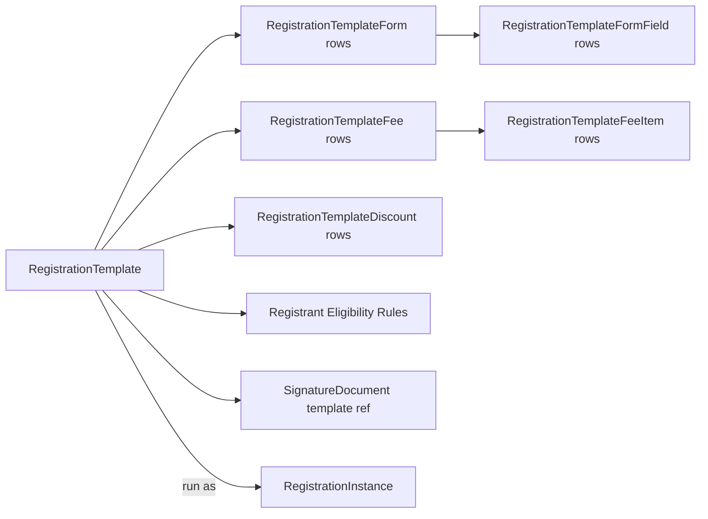

# Registration Template Design

## Overview

A `RegistrationTemplate` is the reusable shape of a registration: which fields registrants fill out, which fees apply, which discounts can be redeemed, which eligibility rules narrow who can register, what the confirmation flow looks like, optional signature documents, and notification routing. One template typically serves many `RegistrationInstance`s (different events, different runs of the same event); the template is the policy, the instance is the run.

## Why It Exists

Event registration in a church-management system has rich requirements: per-registrant attribute collection, per-fee logic (size pickers, optional add-ons), tiered discounts (sibling discount, early-bird), waivers, custom confirmation language, post-registration workflows. Modeling each event from scratch would multiply admin work and produce inconsistent UX. Templates let admins design once, reuse for VBS 2026, VBS 2027, and any other camp / event with similar structure.

The 2026-03-02 / 2026-03-05 work (commits `b15a1d0946`, `8cb0f95aba`) was a substantive enhancement: registrant eligibility rules and "Prevent Duplicate Registrants." Eligibility rules let templates declare "only Persons of Age Classification X can register" or "only Persons in DataView Y." Prevent Duplicate Registrants blocks the same Person from registering twice for the same instance. Both are template-level configurations; instances inherit them.

## Mental Model

A template has multiple **forms** (typically one for general registrant info, optional additional forms for special-needs, conditional forms). Each form has **fields** (registrant attributes, custom-text fields, person-related fields). The template has **fees** (per-registrant or per-registration), **discounts** (configurable rules), **eligibility rules**, and an optional **signature document** template.

## What You Need to Know

**Templates can be reused.** VBS 2026 and VBS 2027 can share the same template; each gets its own RegistrationInstance.

**Forms are layered.** A typical registration has one form ("Registrant Info"). Multiple forms support staged collection (e.g., one form per camp activity).

**Fields can be person-attribute fields, registration attributes, or custom inputs.** Person fields write to the Person record on submission; registration attributes are scoped to the registration.

**Required-field enforcement runs at submission.** Pre-fix `134ce18e4c` (Fixes #5091, 2026-01-26), individuals could complete registration without filling required fields. The fix tightened submission-time validation. Custom registration entry blocks must replicate.

**Prevent Duplicate Registrants is a template setting.** Since `8cb0f95aba` (2026-03-05), `RegistrationTemplate.PreventDuplicateRegistrants = true` blocks the same Person from registering twice for the same instance. Default off; turn on per-template.

**Eligibility Rules narrow valid registrants.** Since `b15a1d0946` (2026-03-02), templates can declare eligibility rules. Used by the Registration Entry block to block ineligible family-member registrations. Custom registration entry blocks must respect.

**Signature Document templates can be referenced.** A template can require registrants to sign a waiver. The signature document template is configured separately; the registration template references it. Pre-fix `de5a49c33e` (Fixes #6737, 2026-03-20), signature documents were matched by Person rather than Registrant; the fix correctly attributes per-registrant.

**Fees are per-registrant or per-registration.** A camp registration with a base fee plus an optional t-shirt is two fees: base (per-registrant) plus t-shirt (per-registrant, optional with size picker). A "facility fee" might be per-registration (one for the family).

**Fee items support pickers.** A fee with multiple items lets the registrant pick (size: S/M/L/XL with different prices, or activity: Climbing / Swimming / Both).

**Discounts are configurable rules.** Sibling discount: more than one registrant from the same Person family. Early-bird: registration before a date. Promotion-code: an entered code matches.

**Confirmation language is configurable.** Per-template customization of the confirmation page, confirmation email body (typically a SystemCommunication reference).

**Workflow integration via post-registration triggers.** A workflow can launch on registration completion, payment received, or registrant added.

## Common Scenarios

**"Build a VBS template."** Registration Template Detail block. Add fields (FirstName, LastName, DOB, Allergies, Emergency Contact). Configure base fee plus optional t-shirt fee with sizes. Add sibling discount. Configure waiver SignatureDocument. Set notifications.

**"Block double registration on a workshop."** Set `PreventDuplicateRegistrants = true` on the template.

**"Restrict registration to adults only."** Add an eligibility rule: AgeClassification = Adult. Family members of other classifications can't register.

**"Add an early-bird discount."** Configure a `RegistrationTemplateDiscount` row with the percentage / amount and the cutoff date.

**"Notify registrants on submission."** Configure a Confirmation From email and the SystemCommunication for the confirmation body. The save hook fires on completion.

**"Customize fields per camp activity."** Multiple forms; one per activity. Conditional logic narrows.

## Key Architectural Decisions

### Template / Instance separation

Reuse across events is the dominant use case; per-event customization at the instance level handles the deltas.

### Multi-form support

Some registrations are simple (one form); others span multiple sections. Multi-form supports both.

### Eligibility rules as configuration

Hardcoded eligibility would force per-template code. Configurable rules let admins evolve.

### Signature document by template reference

Reuse the standard Signature Document infrastructure rather than forking.

### Workflow integration via triggers

Post-registration custom logic (assign to a Group, send a custom communication, schedule a follow-up) is workflow's job.

## Considered but Rejected

### Per-event templates (no reuse)

Rejected. Reuse is the dominant case; per-event would multiply admin work.

### Hardcoded eligibility for common cases

Rejected. Configurable rules are correct; hardcoding "common cases" would lock the system.

## Technical Reference

### Schema

`RegistrationTemplate`:
- Forms, Fees, Discounts, Eligibility configuration
- Confirmation From, FromEmail, Subject, Body
- SignatureDocumentTemplateId
- PreventDuplicateRegistrants (since `8cb0f95aba`)
- Eligibility rule fields (since `b15a1d0946`)
- Notification recipients

`RegistrationTemplateForm`, `RegistrationTemplateFormField`: form layout.
`RegistrationTemplateFee`, `RegistrationTemplateFeeItem`: fees with optional item pickers.
`RegistrationTemplateDiscount`: discount rules.
`RegistrationTemplatePlacement`: placement policy for assigning registrants to groups.

`RegistrantEligibilityEvaluator`: evaluates the configured rules.

### Affected Blocks

Registration Template Detail; Registration Instance Detail (uses the template); Registration Entry (consumes for runtime).

### Related Docs

- [docs/event/event-overview.md](event-overview.md)
- [docs/event/registration-entry-flow.md](registration-entry-flow.md)
- [docs/event/eligibility-and-discounts.md](eligibility-and-discounts.md)

## Recent Impactful Changes

- **2026-03-20** ([commit `de5a49c33e`](https://github.com/SparkDevNetwork/Rock/commit/de5a49c33e)). Registration Signature Documents now matched by registrant rather than person (Fixes #6737).
- **2026-03-05** ([commit `8cb0f95aba`](https://github.com/SparkDevNetwork/Rock/commit/8cb0f95aba)). Added Prevent Duplicate Registrants template setting.
- **2026-03-02** ([commit `b15a1d0946`](https://github.com/SparkDevNetwork/Rock/commit/b15a1d0946)). Added Registrant Eligibility Rules to the template.
- **2026-01-26** ([commit `134ce18e4c`](https://github.com/SparkDevNetwork/Rock/commit/134ce18e4c)). Required-field enforcement now runs correctly at submission (Fixes #5091).
