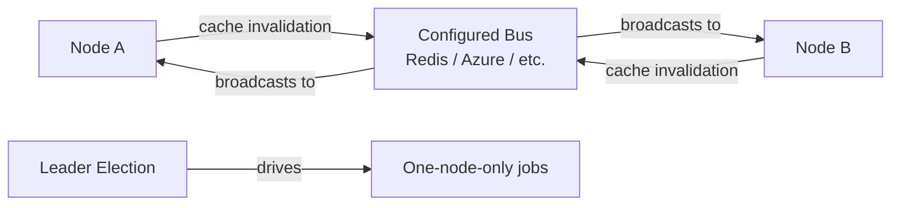

# Farm Domain Overview

## Overview

Farm (release-note name) / WebFarm (namespace) is Rock's multi-node deployment coordination layer: when Rock runs on more than one web server in a cluster, the WebFarm subsystem coordinates cache invalidation, leader election (for jobs that should run on only one node), and inter-node messaging via the configured Bus. The whole subsystem is small (three files) because it is intentionally focused: it does not orchestrate deploys, share state, or replicate data; it propagates the few signals nodes need to keep their in-process caches consistent.

## Why It Exists

Rock's caches (PageCache, BlockCache, GroupCache, GroupTypeCache, etc.) are per-process singletons. In a single-node deployment that is fine. In a web farm, a save on Node A invalidates only Node A's cache; Node B keeps serving stale data until something else triggers eviction there. The WebFarm subsystem fixes this: when a save invalidates a cache, the invalidation message is broadcast on the configured Bus, and other nodes apply the invalidation locally.

The same mechanism enables leader election: scheduled jobs that should run on exactly one node use the WebFarm to coordinate. Without coordination, every node runs every job, producing duplicate communications and conflicting writes.

## Mental Model

The active Bus implementation is configured at deploy time (Redis, Azure Service Bus, or in-process for development). Each node registers as a `MessageBusConsumer` for the relevant message types and broadcasts its own invalidations.

`IntervalAction` is the leader-election + scheduled-action wrapper: a recurring action that should run on exactly one node uses an `IntervalAction` and the WebFarm to claim leadership.

## What You Need to Know

**Single-node deployments do not engage the WebFarm.** The subsystem only matters when multiple nodes serve the same database. Development and small deployments can ignore it.

**The Bus is operator-configured.** Pick a Bus implementation that matches your infrastructure: Redis for self-hosted on-prem, Azure Service Bus for Azure-hosted, in-process for single-node test environments.

**Cache invalidation is broadcast, not coordinated.** When Node A invalidates a cache entry, all other nodes are notified and apply the invalidation. This is eventual consistency: there is a brief window after a save where Node B may serve a stale value.

**Leader election is per-action, not per-node.** Different `IntervalAction`s can have different leaders at the same time. A node is "the leader for the Group Sync job" without being "the leader for everything."

**The WebFarm does NOT replicate data, sessions, or files.** Database is the shared state; if you need session affinity for non-DB state, configure your load balancer accordingly.

**`NodeName` is accessible throughout RockApp** since `5af92e3f64` (2024-09-26). Custom code that needs to identify which node it is on can read `IHostingSettings.NodeName`.

**Custom save hooks should not bypass the cache.** A save hook that mutates data via raw SQL skips the cache invalidation broadcast; other nodes will serve stale values until something else evicts. Always go through the standard EF + cache-invalidation path.

## Common Scenarios

**"Run Rock on three servers behind a load balancer."** Configure a Bus implementation in `web.config`. Each node should report a distinct `NodeName`. The WebFarm handles cache invalidation broadcasting and leader election automatically.

**"Schedule a job that must run on exactly one node."** The `IntervalAction` mechanism plus job configuration. The WebFarm decides which node owns the job at any given moment.

**"Diagnose a stale cache issue."** Verify the Bus is configured and reachable. Check the invalidation broadcasts on the Bus. Verify all nodes are subscribed to the relevant topics.

## Key Architectural Decisions

### Eventual consistency, not strong consistency

A few seconds of stale cache after a save is acceptable; forcing every save to wait for cluster-wide acknowledgment would be expensive. Rock chose eventual consistency.

### Pluggable Bus

Different deployments have different infrastructure. Pluggable Bus lets the WebFarm work with whatever messaging system is already deployed.

### Leader election per-action

Different actions can have different leaders. A node lost during a job run loses leadership only for that action, not for everything.

### Minimal scope

The WebFarm does not try to do session replication, file sync, or database replication. Those are operator concerns; the WebFarm handles only what depends on Rock-internal state.

## Considered but Rejected

### Strong consistency on cache invalidation

Rejected. Cluster-wide acknowledgment per save is too expensive. Eventual consistency is the right tradeoff.

### Building a Rock-specific Bus

Rejected. Standard message buses (Redis, Azure Service Bus) are well-understood and operator-friendly. Pluggable wins.

### Implicit leader election (one node always wins)

Rejected. Static leader election would have produced single-points-of-failure. Per-action election is more resilient.

## Technical Reference

### Components

| Class | Purpose |
|---|---|
| `RockWebFarm` | The static facade. Initialization, leader election, broadcast helpers. |
| `MessageBusConsumer` | Handlers for incoming bus messages (cache invalidations, etc.). |
| `IntervalAction` | Recurring action with leader-election support. |

### Bus Configuration

The Bus is configured in `web.config` and resolved through Rock's bus infrastructure (`Rock/Bus/`). Supported transports include in-process (development), Azure Service Bus, RabbitMQ, and Redis.

### Cache Invalidation Path

1. `Save` mutates an entity.
2. The entity's `SaveHook` invalidates its cache (`UpdateCachedEntity`).
3. The cache class's invalidation calls `RockApp.Current.RockWebFarm.SendMessage(...)` (or equivalent).
4. The broadcast goes to the configured Bus.
5. Other nodes' `MessageBusConsumer`s receive the broadcast and apply the invalidation locally.

### Leader Election

`IntervalAction.Run` checks leadership before executing. The WebFarm keeps lease information in the Bus; nodes claim leases by attempting an atomic update. The first to succeed wins; others skip until lease expiry.

### Affected Blocks and UI Surfaces

- **Web Farm Settings.** Configure the bus and node identity.
- **Web Farm Node Detail/List.** Surface node status, leadership claims, and recent broadcasts.
- **Cache Manager.** Lets administrators force cluster-wide cache eviction.

### Extension Points

- **Custom message types.** Subclass `MessageBusConsumer` to handle a new broadcast type.
- **Custom IntervalAction.** Wrap a recurring action with WebFarm-aware leadership.
- **Custom Bus transport.** Implement Rock's bus interfaces for an unsupported transport.

### File Index

- `Rock/WebFarm/RockWebFarm.cs`
- `Rock/WebFarm/MessageBusConsumer.cs`
- `Rock/WebFarm/IntervalAction.cs`
- `Rock/Bus/` (the underlying bus infrastructure)
- `Rock.Blocks/WebFarm/` (admin UI)

## Recent Impactful Changes

The WebFarm subsystem is small and stable; no notable release-note-tagged changes in the last 18 months. The most recent meaningful change is the `NodeName` exposure on `IHostingSettings` (commit `5af92e3f64`, 2024-09-26), which is older than the 18-month window.
