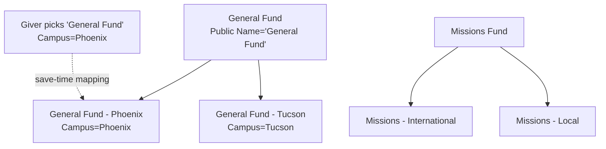

# Accounts and Campus Mapping

## Overview

`FinancialAccount` is Rock's chart of accounts: General Fund, Missions, Building, etc. Accounts form a tree via `ParentAccountId`, support per-campus child accounts, and have a tax-deductible flag, public name, order, and security. Account Campus Mapping is the pattern where a parent account ("General Fund") routes per-campus contributions to a child account ("General Fund - Phoenix") at save time, based on the giver's campus. The "Use Account Campus Mapping Logic" block setting controls whether this re-routing happens.

## Why It Exists

Multi-campus churches need per-campus accounting (each campus reports its giving separately) without forcing every giver to choose between "General Fund - Phoenix" or "General Fund - Tucson" in the picker UI. Hiding this complexity from the giver while still routing the gift to the right ledger is what the campus-mapping logic accomplishes: the picker shows "General Fund," the system resolves it to the campus-specific child account at save time using the campus context.

The account-tree structure exists so reporting can roll up: "Missions" reported as a single line aggregates "Missions - International" plus "Missions - Local" plus campus-specific children. Modeling the chart as a tree with self-referential FK lets reporting walk the hierarchy without a separate aggregation table.

The self-parent fix (commit `2f102899d9`, Fixes #6100, 2024-11-22) addressed a real bug: the Account Detail block allowed setting an account as its own parent. The cycle silently broke giving roll-up math (descendants never resolve up to a root). The fix added the cycle check.

## Mental Model

A giver picks "General Fund." The system knows the giver's campus is Phoenix. The save-time logic resolves to "General Fund - Phoenix." The detail row records `AccountId = GFP.Id`. Reports rolling up by parent walk through the tree.

## What You Need to Know

**An account cannot be its own parent.** Cycle protection is in the Account Detail block since `2f102899d9`. Bulk imports and raw SQL paths must respect this; the giving roll-up math breaks if a cycle exists (descendants never resolve to a root).

**The "Use Account Campus Mapping Logic" block setting controls re-routing.** When ON, the picked parent account is replaced at save time with the campus-mapped child. When OFF, the picked account is recorded verbatim. Commit `ccb81a0911` fixed the setting being ignored; behavior on older builds may differ.

**`PublicName` differs from `Name`.** `Name` is the internal accounting name; `PublicName` is what shows in the picker UI (often shorter or friendlier). Some blocks use `Name`, others `PublicName`; verify before reporting.

**`ParentAccountId` is the tree FK.** NULL means root account. The hierarchy walk resolves "all transactions to this account" by including all descendants.

**Tax-deductible status is per-account.** `IsTaxDeductible = true` is the marker for IRS-compliant statements. Statement Generator filters accordingly.

**`Order` controls picker display.** Lower numbers display first within a parent. Ordering decisions cascade through reports that respect chart order.

**Account-level security supported.** Sensitive accounts (designated giving for a specific family in need, restricted funds) can be locked down with standard `ISecured` authorization. Picker UIs filter by visibility.

**`StartDate` and `EndDate` control account active period.** Accounts that have run their course (a one-time capital campaign account) can be retired by setting `EndDate`. Filtering by current date excludes them from active-fund pickers.

**Account Campus Mapping is configuration, not code.** The mapping is implicit: a child account with `CampusId` set is the campus-specific variant. The save-time logic queries for "child of selected account where `CampusId = giver's campus`."

**Account Detail block is the canonical admin surface.** Use it instead of raw SQL for account changes; it enforces the cycle check and the standard validation.

## Common Scenarios

**"Add a new fund."** Account Detail (Internal -> Finance -> Accounts). Set Name, Public Name, Account Type, optional ParentAccount, optional Campus. Tax-deductible flag if applicable. Save.

**"Add per-campus children for an existing fund."** Create child accounts under the parent fund, each with `CampusId` set to the appropriate campus. The save-time mapping logic auto-resolves picks to the right child.

**"Disable an old fund without deleting."** Set `IsActive = false` (or `EndDate` in the past). The fund stops appearing in pickers; historical transactions retain their references.

**"Walk all transactions to a fund and its descendants."** Recursive query through `ParentAccountId`, OR use `FinancialAccountService.GetDescendentAccounts(accountId)`.

**"Avoid cycle when restructuring the tree."** Account Detail enforces the cycle check; reorganizing parents through the UI is safe. Bulk SQL must check explicitly.

**"Resolve which account a giver's pick will route to."** Test in the Transaction Entry block with the giver's campus context; the save-time logic shows the resolution.

## Key Architectural Decisions

### Tree-shaped chart of accounts

Reporting roll-up needs the hierarchy. Self-referential FK is the simplest model.

### Per-campus children for multi-campus accounting

Splitting a fund into per-campus children with mapping resolves the "single picker, multiple ledgers" requirement.

### Save-time mapping, not picker-time

The picker UI stays simple (no per-campus variants visible). The mapping resolves at save when the giver's campus is known.

### Cycle protection in the UI, not the schema

Schema-level cycle prevention would require a CHECK constraint with recursive logic, which most DBMSs handle awkwardly. UI-level enforcement is sufficient for the realistic write paths.

### `PublicName` separate from `Name`

Public-facing naming differs from accounting naming. Modeling both keeps each surface clean.

## Considered but Rejected

### Single account with per-row campus tag

Rejected. Accounting-system integrations need distinct account ids per campus; the tag-based model would have required exporting via a join.

### Auto-cycle prevention in raw SQL

Rejected (so far). UI-level prevention plus operator awareness handles the realistic risk.

### Hard delete on account removal

Rejected. Historical transactions reference accounts; deleting a referenced account would break giving history. `IsActive = false` is the supported retirement.

## Technical Reference

### Schema (relevant subset)

| Field | Purpose |
|---|---|
| `Name` | Internal name |
| `PublicName` | Picker / public display |
| `ParentAccountId` | Tree FK (self-referential) |
| `CampusId` | Per-campus child marker |
| `AccountTypeValueId` | DefinedValue for accounting category |
| `IsTaxDeductible` | Statement filter |
| `IsActive`, `StartDate`, `EndDate` | Active-period gating |
| `Order` | Display sequence |
| `Url` | Optional public link |
| `ImageBinaryFileId` | Account icon |

### Service / API

`FinancialAccountService` provides:
- `GetDescendentAccounts(int parentAccountId)`: recursive descendants for roll-up.
- `GetParentAccounts(int childAccountId)`: walk up to root.
- `GetCampusChildAccounts(int parentAccountId)`: campus-mapped children for the save-time logic.

### Save Hook Behavior

`FinancialAccount.SaveHook` writes history on changes; the cycle check (since `2f102899d9`) lives in the Account Detail block, not the save hook.

### Affected Blocks

- **Admin:** Account Detail, Account List, Account Tree.
- **Capture:** Transaction Entry uses the picker; campus-mapping logic runs at save.

### Related Docs

- [docs/finance/transactions-and-batches.md](transactions-and-batches.md) for how detail rows reference accounts.
- [docs/finance/pledges-and-statements.md](pledges-and-statements.md) for how statements aggregate by account.

## Recent Impactful Changes

- **2025-07-15** ([commit `ccb81a0911`](https://github.com/SparkDevNetwork/Rock/commit/ccb81a0911)). "Use Account Campus Mapping Logic" block setting now correctly applied; the picked account is used instead of the campus-mapped child when the setting is off.
- **2024-11-22** ([commit `2f102899d9`](https://github.com/SparkDevNetwork/Rock/commit/2f102899d9)). Account Detail no longer allows setting an account as its own parent (Fixes #6100).
