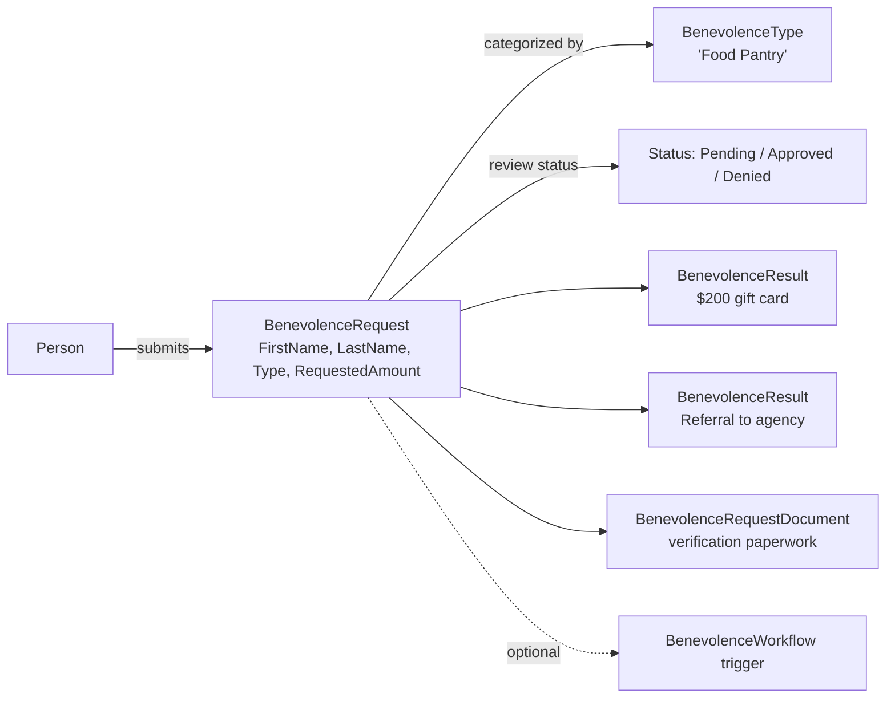

# Benevolence

## Overview

Benevolence is Rock's "people-in-need application" subsystem: a person submits a `BenevolenceRequest` (or staff submits one on their behalf), it's classified by `BenevolenceType` (Food Pantry, Medical, Rent, etc.), goes through review, and concludes with one or more `BenevolenceResult` rows recording what was approved or given. `BenevolenceWorkflow` lets administrators wire workflows to lifecycle events (request created, approved, denied). Documents (receipts, applications, verification paperwork) attach via `BenevolenceRequestDocument`.

## Why It Exists

Most churches have some form of benevolence ministry: helping members and community contacts with rent, food, medical bills, utilities. Tracking these as data lets the benevolence team coordinate, lets finance reconcile payouts against requests, lets follow-up workflows fire automatically, and lets reporting answer "how much benevolence did we provide last year by category."

Modeling the request and the result as separate entities reflects reality: a single request might be partially fulfilled, fulfilled across multiple disbursements (some food assistance now, rent help next month), or fulfilled differently than requested (the person asked for $500 cash, the church provided a $200 gift card and a referral to a local agency).

## Mental Model

A request can target a known Person (linked via PersonAlias) or be a free-form name + contact (community contacts who don't have a Person record yet). Multiple result rows let one request span multiple kinds of help. The workflow integration launches custom workflows on request lifecycle events.

## What You Need to Know

**A request can be for a known Person or a free-form name.** `RequestedByPersonAliasId` links to a Person. If null, `FirstName`, `LastName`, and contact info on the request itself describe the requester. Real-world benevolence often serves community contacts not yet in the database.

**Multiple `BenevolenceResult` rows per request.** A single request can produce multiple disbursements (cash + gift cards + referrals). Reports aggregate per-request to show "total help provided."

**`BenevolenceType` is the configurable category.** New types are configuration (no code change). Each type can have its own workflow and its own set of attributes via the standard attribute system.

**`BenevolenceWorkflow` rows trigger workflows on lifecycle events.** Configurable per type or globally. Trigger types include `New`, `Approved`, `Denied`, `Status Changed`. Used for staff notification, follow-up scheduling, financial-system integration.

**`Status` flow is configurable.** Standard statuses: Pending, Approved, Denied. Custom statuses can be added per deployment via the `BenevolenceType.WorkflowAttributeKey` configuration. Status transitions can fire workflows.

**Documents support verification.** `BenevolenceRequestDocument` references a `BinaryFile` (the application form, copy of the past-due bill, etc.). Standard file storage.

**Person linkage is via PersonAlias.** Audit columns and the `RequestedByPersonAliasId` use PersonAlias, so merges preserve the linkage. See [docs/core/person-alias-semantics.md](../core/person-alias-semantics.md).

**Benevolence does NOT integrate with Financial Transactions automatically.** Approving a benevolence request does not auto-create a financial transaction; finance teams record disbursements through the standard Transaction Entry path. Some deployments wire a workflow to bridge the two.

**`Campus` per request supports multi-campus benevolence ministries.** Each campus can run its own benevolence work; reports filter by campus.

**Provided amounts are on `BenevolenceResult`, not the request.** `BenevolenceRequest.RequestedAmount` is what the person asked for; `BenevolenceResult.Amount` is what was actually provided. Reports aggregate provided.

## Common Scenarios

**"Submit a benevolence request from staff."** Internal -> Finance -> Benevolence -> Add. Pick or enter the requester, type, requested amount, attach documents. Submit.

**"Self-service benevolence application."** Public Benevolence Request block with optional CAPTCHA. Creates the row with `Status = Pending`, optionally launches a notify-staff workflow.

**"Approve and record what was provided."** Open the Benevolence Request Detail. Set `Status = Approved`. Add `BenevolenceResult` rows for each disbursement (gift card $200, food box, etc.).

**"Configure a workflow on benevolence approval."** Internal -> Finance -> Benevolence Type Detail. Add a `BenevolenceWorkflow` row with the trigger and the WorkflowType to launch.

**"Report on benevolence provided last year."** Aggregate `BenevolenceResult.Amount` filtered by `BenevolenceRequest.RequestDateTime` in the year. Group by `BenevolenceType.Name` for category breakdown.

**"Bridge to Financial Transaction."** Custom workflow on benevolence approval. Creates a `FinancialTransaction` (negative-amount, expense category) attributed to the recipient's PersonAlias. Reconciliation is per-deployment.

## Key Architectural Decisions

### Request and Result as separate entities

A request can produce multiple disbursements; modeling them separately matches reality.

### Free-form requester support

Community contacts often need help before they're in the database; `FirstName`/`LastName` on the request itself supports this without forcing a Person creation.

### `BenevolenceType` as configuration

New categories are configuration (no code change). Per-type workflows and attributes give administrators full control.

### Workflow integration via dedicated entity

`BenevolenceWorkflow` rows make the trigger configuration visible in the standard admin UIs without requiring per-event code.

### No automatic financial-transaction creation

Benevolence approval is a ministry decision; the financial recording of the disbursement is a separate finance step. Decoupling lets each domain own its own lifecycle.

## Considered but Rejected

### Auto-creating a `FinancialTransaction` on approval

Rejected. Different deployments record benevolence disbursements differently (expense category, dedicated account, in-kind value). Forcing a single shape would break some flows.

### Person required on every request

Rejected. Community contacts without Person records are a real use case.

### Single result per request

Rejected. Multi-disbursement is common.

## Technical Reference

### Schema (relevant subset)

`BenevolenceRequest`:
- Free-form: `FirstName`, `LastName`, `Email`, `HomePhoneNumber`, `CellPhoneNumber`, `WorkPhoneNumber`
- Linked: `RequestedByPersonAliasId`, `CaseWorkerPersonAliasId`
- Categorization: `BenevolenceTypeId`, `RequestStatusValueId` (DefinedValue)
- Description: `RequestText`, `ResultSummary`
- Amount: `RequestedAmount`, `ProvidedNextSteps`
- Lifecycle: `RequestDateTime`
- Optional: `CampusId`, `LocationId`, `GovernmentId`

`BenevolenceResult`:
- `BenevolenceRequestId`
- `ResultTypeValueId` (DefinedValue: Cash, Check, Gift Card, Referral)
- `Amount`
- `ResultSummary`

`BenevolenceType`:
- `Name`, `Description`
- `IconCssClass`
- `WorkflowAttributeKey` (for status workflows)
- `IsActive`, `Order`

`BenevolenceWorkflow`:
- `BenevolenceTypeId` (or null for global)
- `WorkflowTypeId`
- `TriggerType`, `QualifierValue`

`BenevolenceRequestDocument`:
- `BenevolenceRequestId`
- `BinaryFileId`

### Save Hook Behavior

`BenevolenceRequest.SaveHook` writes history; status-change side effects.

`BenevolenceWorkflow.SaveHook` integrates with the workflow trigger registration.

### Affected Blocks

- **Admin:** Benevolence Request Detail/List, Benevolence Type Detail/List.
- **Public:** Benevolence Request Lava, Benevolence Request public block.
- **Workflow:** triggered workflow types fire on configured events.

### Extension Points

- Custom `BenevolenceType` rows with custom attributes.
- Custom `BenevolenceWorkflow` triggers per type.
- Custom workflows that bridge to Financial Transactions.

## Recent Impactful Changes

(No release-note-tagged changes specifically to benevolence in the last 18 months. The subsystem is mature; the work happens in deployment-specific workflow configuration.)
