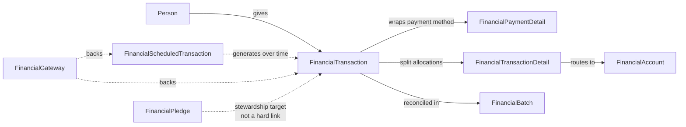

# Finance Domain Overview

## Overview

Finance is Rock's giving, batch, account, pledge, scheduled-transaction, statement, and benevolence system. It records who gave what to which fund, how it was paid, when it cleared, and how it gets reported. Most of Rock's financial value lives in two relationships: `FinancialTransaction` -> `FinancialTransactionDetail` -> `FinancialAccount` (one transaction, many details, each routed to an account), and `FinancialBatch` -> `FinancialTransaction` (a batch wraps a set of transactions for reconciliation).

This is the orientation doc. Read this first, then jump to the per-subsystem docs (transactions, batches, accounts, pledges, scheduled transactions, gateways, statements, benevolence) as needed.

## Why It Exists

Financial records are the highest-trust data in Rock. A church's giving system has to: reconcile against bank deposits, produce IRS-compliant year-end statements, support recurring gifts and refunds, integrate with external payment gateways, capture pledged-vs-given for stewardship reporting, and route the same payment across multiple accounts (a single check can split across general fund, missions, and building). Each of these requirements explains a piece of the data model. The split between `FinancialTransaction` (the payment event) and `FinancialTransactionDetail` (the per-account allocation) is what allows split gifts and per-account reporting from a single check.

Two reliability concerns drive much of the save-hook complexity: (1) the transaction must remain immutable after it is in a closed batch (modifying a transaction in a closed batch breaks reconciliation with the bank), and (2) the financial account hierarchy must remain a valid tree (the account-self-parent fix in commit `2f102899d9` exists because allowing self-parenting silently broke the giving roll-up math).

## Mental Model

Think of the domain in three layers:

- **Capture.** A `FinancialTransaction` records "a payment happened." It can be online (gateway-driven), in person (check or cash entered through a Transaction Entry block), or scheduled (created automatically by a `FinancialScheduledTransaction` recurrence).
- **Allocation.** Each transaction has one or more `FinancialTransactionDetail` rows, each routing a portion of the gift to a `FinancialAccount`. Splits are always at the detail level; the parent transaction's `TotalAmount` is computed.
- **Reconciliation.** Transactions live inside a `FinancialBatch`. Batches track expected vs actual control totals and transition through `Open` -> `Closed` -> (optionally) reopened states. Closing a batch is the operational signal that the deposit has been balanced against the bank.

Pledges (`FinancialPledge`) are a separate axis: they record what someone said they would give, not what they did give. The Giving Automation job and statement templates compute pledged-vs-given by joining transactions to pledges through `(Person, Account, Date Range)`.

The dotted lines matter: a scheduled transaction generates one-time transactions but is not in their `OriginatingScheduledTransactionId` chain at the SQL level for older rows. A pledge is reported against, not joined to a transaction at insert time. These are loose couplings by design; tightening them would force every gateway-imported gift to lookup a pledge before insert, which is operationally expensive.

## What You Need to Know

**A transaction in a closed batch is immutable in practice.** The save hook does not block edits, but the audit trail and the reconciliation reports treat any post-close edit as a discrepancy. If you must correct a mistaken transaction in a closed batch, the supported path is a refund (`FinancialTransactionRefund`) or reopening the batch via the Batch Detail block, not a direct edit.

**`FinancialTransactionDetail.AccountId` is the source of truth for "where did this go".** Reports built against `FinancialTransaction.AccountId` are wrong; that column does not exist. Always query through the detail rows, even for "single account" gifts.

**The account hierarchy must stay a tree.** `FinancialAccount.ParentAccountId` is FK to itself. The Account Detail block enforces "an account cannot be its own parent" since commit `2f102899d9`; bulk-imports and raw SQL paths must respect this or the giving roll-up math breaks (descendants never resolve up to a root).

**`AccountCampusMapping` resolves the actual account at save time.** When a campus is provided on a transaction and the picked account has child accounts mapped to specific campuses, the save flow may re-route the detail to a child. The `Use Account Campus Mapping Logic` block setting controls this; when off, the picked account is recorded verbatim. Commit `ccb81a0911` fixed an issue where the setting was being ignored; old data may show inconsistencies between intended and recorded accounts.

**`FinancialPaymentDetail` is shared between one-time and scheduled transactions.** A `FinancialScheduledTransaction` and the `FinancialTransaction` instances it spawns can point at the same `FinancialPaymentDetail` row. Mutating that row affects both. The save hook protects against accidental mutation but custom code should treat the row as conceptually immutable once written.

**Refunds are negative-amount transactions linked back to the original.** `FinancialTransactionRefund` stores the reason and the refunded `FinancialTransaction` reference; the actual money movement is a separate `FinancialTransaction` with negative amounts. Reporting code must include negative-amount transactions to avoid overstated giving totals.

**Scheduled transactions can produce summary-less child transactions.** Commit `857cf79393` (Fixes #6178) addressed a case where transactions generated from scheduled payments for event registrations lacked a summary note that one-time payments had. Reports that key off transaction summary may show gaps for older data; the fix is forward-only.

**The Giving Automation Job touches a lot.** It computes giving classifications (frequency, percentile, alerts), evaluates Giving Journey stages, and writes `FinancialTransactionAlert` rows. Commit `16c48bfd30` was a major performance refactor; running the old version against a large dataset is slow enough to overlap with the next nightly schedule.

## Common Scenarios

**"Record an in-person gift."** Use the Transaction Entry block (or its V2 equivalent). It creates a `FinancialTransaction` with one or more `FinancialTransactionDetail` rows, attaches a `FinancialPaymentDetail` for the payment method, and adds the transaction to the active `FinancialBatch` for the campus and source.

**"Send a year-end giving statement."** The `FinancialStatementTemplate` defines the layout and merge fields; the `Statement Generator` block (and the desktop tool) iterate persons and render a per-person statement. Joins flow Person -> PersonAlias -> FinancialTransaction.AuthorizedPersonAliasId -> FinancialTransactionDetail.

**"Refund a gift that cleared yesterday."** Use the Transaction Detail block's Refund action. It creates a paired refund record and writes the negative-amount transaction. Do NOT directly edit the original transaction.

**"Roll up giving by parent account."** Walk `FinancialAccount.ParentAccountId` up to the root. The cycle protection (since `2f102899d9`) is in the UI but not in older data; defensive walks should detect cycles.

**"Split one gift across three accounts."** Multiple `FinancialTransactionDetail` rows on the same `FinancialTransaction`. The `Amount` on the parent is informational; the detail rows are authoritative.

## Key Architectural Decisions

### Transaction vs Detail split

A check is one payment but can fund multiple ministries. Modeling the split at the detail level means the parent transaction stays singular (one bank-side event) while reporting can roll up by account, by detail, or by transaction.

### Closed batches treated as immutable

Reconciliation against the bank requires that the church's record of a deposit not change after it is balanced. The system does not enforce immutability in code (the save hook permits edits); it enforces it operationally through the batch close action and audit logging. This is a conscious tradeoff: hard immutability would prevent legitimate corrections via a re-opened batch.

### Pledges loose-coupled to transactions

Pledges record intent; transactions record reality. A hard FK from transaction to pledge would force every imported gift to resolve a pledge at insert time, which is expensive when gateway batches arrive. The Giving Automation Job and statement reports compute pledged-vs-given via runtime joins, not stored references.

### Account campus mapping at save time

Resolving the actual destination account from a (chosen account, campus) pair at save time keeps the picker UI simple ("just pick General Fund"). The complexity of "which child account does General Fund route to for the Phoenix campus" lives in `AccountCampusMapping`, not in every block.

## Considered but Rejected

### Storing `AccountId` directly on `FinancialTransaction`

Rejected. Splits are common enough that a single-account assumption would force every multi-account gift through a contortion. Detail-level allocation has been the model from the beginning.

### Hard immutability on closed-batch transactions

Rejected. Real-world correction flows (a misclassified gift discovered in audit) need an editing path. The reopen-batch action plus audit history handles this without making transactions schema-immutable.

### Synchronously linking transactions to pledges at save time

Rejected. Gateway imports run in batches of hundreds; a per-transaction pledge lookup would multiply DB load and slow ingestion. Pledged-vs-given is a reporting concern, not a write-time concern.

## Technical Reference

### Data Model (high-level)

| Entity | Purpose |
|---|---|
| `FinancialTransaction` | The payment event. Authorized person, gateway, batch, summary, totals. |
| `FinancialTransactionDetail` | Per-account allocation row. Routes a portion of the transaction to a `FinancialAccount`. |
| `FinancialPaymentDetail` | Payment method snapshot (currency type, credit card last 4, etc.). Shared between scheduled and one-time. |
| `FinancialBatch` | Reconciliation wrapper. Status (`Pending`, `Open`, `Closed`), control totals, campus, accounting period. |
| `FinancialAccount` | Chart-of-accounts entry. Self-referential parent FK, campus, public-name, tax-deductible flag, order. |
| `FinancialScheduledTransaction` | Recurring giving setup. Schedule, gateway customer reference, next payment date. |
| `FinancialScheduledTransactionDetail` | Per-account allocation for the recurrence. |
| `FinancialPledge` | Stewardship intent. (Person | Group), Account, date range, amount, frequency. |
| `FinancialGateway` | Gateway configuration (NMI, MyWell, test gateway). Active flag, batch schedule, entity-type. |
| `FinancialPersonSavedAccount` | A person's stored payment method on a gateway (tokenized). |
| `FinancialPersonBankAccount` | Bank-account reference for ACH (legacy/scanner integration). |
| `FinancialTransactionRefund` | Refund metadata, links the refund transaction back to the original. |
| `FinancialTransactionAlert` | Output of the Giving Automation Job (gift classifications, follow-up flags). |
| `FinancialTransactionAlertType` | Configurable alert rules. |
| `FinancialStatementTemplate` | Year-end statement layout (HTML, footer, merge fields). |
| `BenevolenceRequest` | Person-in-need request, with `BenevolenceType`, status, requested amount. |
| `BenevolenceResult` | What was approved/given for the request. |
| `BenevolenceType` | Configurable category (Food Pantry, Medical, etc.). |
| `BenevolenceWorkflow` | Workflow trigger on request lifecycle events. |
| `BenevolenceRequestDocument` | Attached documents (receipts, applications). |

### Save Hook Behavior

`FinancialTransaction.SaveHook` ([Rock/Model/Finance/FinancialTransaction/FinancialTransaction.SaveHook.cs](../../Rock/Model/Finance/FinancialTransaction/FinancialTransaction.SaveHook.cs)) writes history entries for amount, batch, account changes; cascades update to the parent batch's `ControlAmount` reconciliation when transactions are added.

`FinancialPaymentDetail.SaveHook` masks card data on save (last 4 only stored).

`FinancialPledge.SaveHook` writes per-person history.

`BenevolenceWorkflow.SaveHook` and `BenevolenceRequest.SaveHook` integrate with workflow launches when status transitions occur.

### Service / API Surface

`FinancialAccountService` ([Rock/Model/Finance/FinancialAccount/FinancialAccountService.cs](../../Rock/Model/Finance/FinancialAccount/FinancialAccountService.cs)) provides hierarchy walking, descendant queries, and the campus-mapping lookups.

`FinancialScheduledTransactionService` includes `ProcessPayments`, the entry point for gateway-driven recurrence execution.

`FinancialPledgeService` exposes pledge-vs-giving comparisons used by the statement generator.

### Extension Points

- **Custom gateways.** Implement `GatewayComponent`; configure as `FinancialGateway` rows with the entity-type pointing at the new component.
- **Statement templates.** `FinancialStatementTemplate` rows hold Lava-templated HTML; new layouts are configuration, not code.
- **Benevolence types.** `BenevolenceType` rows configure new request categories without code changes.
- **Transaction alert rules.** `FinancialTransactionAlertType` rules are evaluated by the Giving Automation Job; new rules are data, not code.

### Affected Blocks and UI Surfaces

- **Giving:** Transaction Entry, Transaction Entry V2, Utility Payment Entry, Utility Payment Entry V2, Scheduled Transaction Detail/List, Saved Account List, Saved Account Detail (Mobile).
- **Admin:** Batch Detail, Batch List, Account Detail, Account List, Pledge Detail, Pledge List, Pledge Analytics.
- **Statements:** Statement Generator (block + desktop), Financial Statement Template Detail/List.
- **Benevolence:** Benevolence Request Detail/List, Benevolence Type Detail/List.

### File Index

- `Rock/Model/Finance/` (entities)
- `Rock.Blocks/Finance/` (Obsidian-aware C# blocks)
- `Rock/Financial/` (gateway components, processing helpers)
- `Rock/Jobs/GivingAutomation.cs` (the giving classification job)

## Recent Impactful Changes

- **2026-01-15** ([commit `16c48bfd30`](https://github.com/SparkDevNetwork/Rock/commit/16c48bfd30)). Major performance refactor of the Giving Automation Job; reduced DB load and fixed inconsistencies across multiple giving classification attributes; improved Giving Journey stages and giving-alert performance.
- **2025-12-10** ([commit `933fdcf551`](https://github.com/SparkDevNetwork/Rock/commit/933fdcf551)). Pledge Analytics block gained a "Giving Date Range" filter to limit gift transactions independently of the pledge date filter.
- **2025-07-15** ([commit `ccb81a0911`](https://github.com/SparkDevNetwork/Rock/commit/ccb81a0911)). Fixed "Use Account Campus Mapping Logic" block setting being ignored on Utility Payment / Transaction Entry V2 WebForms blocks. The selected account is now used instead of the matched child account when the setting is off.
- **2025-07-07** ([commit `857cf79393`](https://github.com/SparkDevNetwork/Rock/commit/857cf79393)). Transactions generated from scheduled payments for event registrations now include a summary note matching one-time payments (Fixes #6178).
- **2024-11-22** ([commit `2f102899d9`](https://github.com/SparkDevNetwork/Rock/commit/2f102899d9)). Financial Account Detail no longer allows setting an account as its own parent (Fixes #6100).
