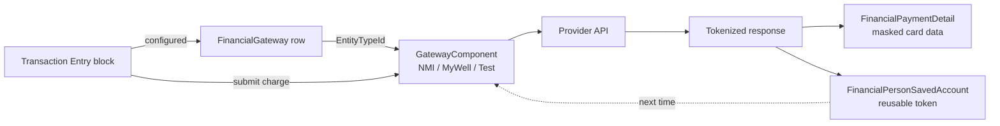

# Gateways and Payments

## Overview

A `FinancialGateway` row configures one payment provider integration (NMI, MyWell, the test gateway, etc.). The provider is implemented as a `GatewayComponent` (a custom C# class that implements provider-specific submission, webhook handling, and refund logic). `FinancialPaymentDetail` is the masked snapshot of how the payment was made (currency type, last-4 of card, expiration, billing-name) attached to each transaction. `FinancialPersonSavedAccount` is the tokenized stored payment method that lets the gateway charge again without re-entering card details. `FinancialPersonBankAccount` is a similar concept for ACH check scanning workflows (typically used in MICR processing).

## Why It Exists

A church-management system that did not integrate with payment providers would force every gift through manual entry, which does not scale to online giving. Modeling the gateway as a configurable EntityType lets churches plug in any provider that implements the `GatewayComponent` contract; the same Transaction Entry / Scheduled Transaction Detail blocks work against any configured provider.

The split between `FinancialPaymentDetail` (per-transaction snapshot) and `FinancialPersonSavedAccount` (reusable token) reflects different use cases: the snapshot tells reports "this was paid by Visa ending in 1234" without storing the actual card; the saved account is the reusable token the gateway charges next time. Storing the actual card is forbidden by PCI compliance; the gateway holds the card, Rock holds the token reference.

## Mental Model

A new transaction (one-time or scheduled) goes through the configured gateway component. The component talks to the provider; the response includes a tokenized reference that Rock stores in `FinancialPaymentDetail` (for the per-transaction record) and optionally `FinancialPersonSavedAccount` (for reuse).

`FinancialPaymentDetail` is shared between scheduled and one-time transactions: a `FinancialScheduledTransaction` and the `FinancialTransaction` rows generated from it can point at the same `FinancialPaymentDetail` row. The masked card data displays consistently across both.

## What You Need to Know

**`GatewayComponent` is the extension point.** Each provider implements the abstract base. Configuration (API key, webhook URL, default settings) is per-instance via `FinancialGateway.Attributes`.

**`FinancialPaymentDetail` is shared between scheduled and one-time transactions.** Editing `FinancialPaymentDetail` mutates both views. Treat the row as conceptually immutable once written.

**Card data is masked on save.** The `FinancialPaymentDetail.SaveHook` ensures only last-4, expiration, currency type, and billing name persist; the actual PAN never lands in the database. PCI compliance.

**Saved accounts hold tokens, not card data.** `FinancialPersonSavedAccount.GatewayPersonIdentifier` is the gateway's reference id (the token); the actual card lives at the provider. Reuse means another submission to the gateway with the saved token.

**ACH bank accounts may use a separate entity.** `FinancialPersonBankAccount` exists for check-scanning integrations (MICR data) and some legacy ACH workflows. Most modern ACH goes through `FinancialPersonSavedAccount` with `CurrencyTypeValueId` set to ACH.

**Webhooks land at provider-specific endpoints.** Each `GatewayComponent` exposes its webhook handler. The handler resolves the gateway-side reference (subscription id, charge id) to local entities and creates / updates them.

**Refund handling is per-component.** A refund through the Transaction Detail block calls into the gateway component, which makes the provider-side refund call. On success, the local `FinancialTransactionRefund` row is created and a paired negative-amount transaction is recorded.

**`FinancialGateway.IsActive = false` disables a provider.** Existing transactions remain attached; new submissions through that gateway fail. Useful for retiring a provider during a migration.

**Multiple gateways can be configured simultaneously.** Different sites within Rock can use different providers; some sites have a primary and a backup. Block configuration picks which gateway each entry block uses.

**Test gateways exist for development.** The Test Gateway component does not actually charge; it simulates success/failure responses for testing. Production deployments should disable it explicitly.

**`SupportsRefunds` and similar capability flags vary by provider.** The component declares its capabilities; UI surfaces gate accordingly. A gateway that does not support refunds hides the refund action.

## Common Scenarios

**"Configure a new gateway."** Internal -> Finance -> Financial Gateways. Add a row, pick the component (entity type), configure the provider-specific attributes (API key, environment, webhook URL).

**"Switch providers."** Configure the new gateway; reconfigure entry blocks to point at it. Existing transactions keep their reference to the old gateway. Scheduled transactions on the old gateway must be migrated separately (typically: cancel on old, recreate on new).

**"Add a custom provider."** Implement `GatewayComponent`. Register as an EntityType. Configure attributes for provider-specific settings. Implement `Charge`, `RefundTransaction`, `CreateScheduledTransaction`, etc.

**"Save a payment method for reuse."** Submit through the gateway with `SaveAccount = true`. The component persists `FinancialPersonSavedAccount` with the token. Next submission for the same person can pick the saved account instead of re-entering.

**"Receive a webhook from the provider."** The provider posts to the gateway component's webhook handler URL. The handler parses, resolves to local entities, updates state. Some events (refund, failed charge) generate workflows.

**"Reconcile a missing transaction."** If a webhook was missed, manual reconciliation via the gateway's reporting + matching local transactions. Some gateways expose a "list recent charges" API the gateway component can query for catch-up.

## Key Architectural Decisions

### Pluggable provider components

Provider APIs differ; locking into one would compromise operational flexibility. Component pattern supports any provider.

### Tokens, not card data

PCI compliance requires that card data not land in the application database. Tokens are the safe abstraction.

### `FinancialPaymentDetail` as a per-transaction snapshot

The masked card data tells reports what was used without exposing card details. Sharing the row with scheduled transactions keeps the data consistent across recurrence.

### Webhook-driven async updates

Synchronous coupling of webhook to DB state would slow webhook responses and risk losing events on DB failure. Async is the right model.

### `IsActive` on gateway, not delete

Retired gateways still need to surface in historical transaction reports. Soft-deactivation is correct.

## Considered but Rejected

### Storing card numbers locally

Rejected. PCI compliance forbids it.

### Single hardcoded gateway

Rejected. Vendor lock-in.

### Real-time transaction creation in webhook handler

Rejected. Async via job is more resilient to DB transient failures.

## Technical Reference

### Schema (relevant subset)

`FinancialGateway`:
- `Name`, `Description`
- `EntityTypeId` (the GatewayComponent class)
- `BatchTimeOffsetTicks` (per-gateway batch timing)
- `IsActive`

`FinancialPaymentDetail`:
- `AccountNumberMasked` (last-4 with asterisks)
- `CurrencyTypeValueId` (Cash, Check, Credit Card, ACH, etc.)
- `CreditCardTypeValueId` (Visa, MC, etc.)
- `NameOnCard`
- `ExpirationMonth`, `ExpirationYear`
- `BillingLocationId`
- `GatewayPersonIdentifier` (the token reference, when applicable)

`FinancialPersonSavedAccount`:
- `PersonAliasId`
- `FinancialGatewayId`
- `FinancialPaymentDetailId` (the masked snapshot)
- `GatewayPersonIdentifier` (gateway-side token)
- `Name` (user-friendly label like "My Visa")
- `IsSystem`, `IsDefault`

`FinancialPersonBankAccount`:
- `PersonAliasId`
- `AccountNumberSecured` (encrypted; bank routing/account for legacy ACH and check scanning)

### Service / API

`FinancialGatewayService` provides standard CRUD; the gateway-component invocation goes through `FinancialGatewayExtensionMethods` (`ProcessPayment`, `Refund`, etc.).

### Affected Blocks

- **Public Capture:** Transaction Entry / V2, Utility Payment / V2, Scheduled Transaction Detail.
- **Admin:** Financial Gateway List/Detail, Saved Account List/Detail.
- **Mobile:** Saved Account List/Detail (since 2025-01).

### Related Docs

- [docs/finance/transactions-and-batches.md](transactions-and-batches.md)
- [docs/finance/scheduled-transactions.md](scheduled-transactions.md)
- [docs/finance/finance-overview.md](finance-overview.md)

## Recent Impactful Changes

(No release-note-tagged changes specifically to gateway / payment-method infrastructure in the last 18 months. Provider-specific updates ship as plugin migrations rather than touching the core entity model. The 2025-01 mobile saved-account additions touch this area peripherally.)
