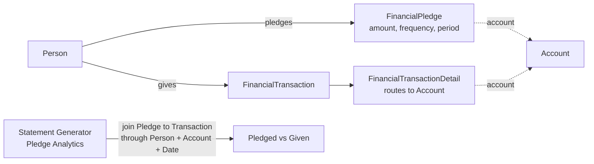

# Pledges and Statements

## Overview

A `FinancialPledge` is a stewardship target: a person or family commits to give a specific amount to a specific account over a specific period. Pledges are NOT linked to transactions at insert time; they are reported AGAINST. The Giving Automation Job and Statement Generator compute pledged-vs-given by joining pledges to transactions through `(Person, Account, Date Range)` at runtime. `FinancialStatementTemplate` defines the layout for year-end giving statements (HTML body, footer, merge fields); the Statement Generator iterates Persons and produces per-person statements using the template.

## Why It Exists

Stewardship pledges record intent; transactions record reality. A church wants to know both: "the congregation pledged $X for the year, has given $Y so far." Hard-coupling a transaction to a pledge at insert time would force every imported gift (gateway batches arriving in the hundreds) to do a pledge lookup at insert time, multiplying database load on the hot ingestion path. Loose coupling (compute pledged-vs-given in reports) is the right tradeoff.

Year-end statements are an IRS compliance requirement for tax-deductible giving. Hardcoding the statement layout would prevent church-specific branding, logo placement, and message customization. The template-as-data model with Lava body lets administrators design statements without code changes.

The Pledge Analytics enhancement (commit `933fdcf551`, 2025-12-10) addressed an operational pain: stewardship reports needed independent date filters for "pledge period" and "gift transactions in period," because they often differ (a pledge runs Jan-Dec, but you might want to see giving in just Q4). The block now exposes both filters.

## Mental Model

Pledge stores intent (Person, Account, Amount, Frequency, StartDate, EndDate). Transactions are recorded independently. Reports compute the "given so far" by joining transactions matching the pledge's Person, Account, and date range.

A pledge can target a specific Person OR a Group (typically a family). When `GroupId` is set, the pledge applies to family-level giving; reporting walks through `Person.GivingGroupId` to associate transactions.

## What You Need to Know

**Pledges are loose-coupled to transactions.** No FK from `FinancialTransaction` to `FinancialPledge`. Reporting joins through (Person, Account, Date) at runtime. This is intentional; tightening the coupling would multiply ingestion-time work.

**A pledge can target a Person or a Group.** `PersonAliasId` for individual pledges, `GroupId` for family pledges. The Pledge Detail block presents both options. Family pledges aggregate across all family members' giving.

**Pledge frequency is a `DefinedValue`.** Common values: One-Time, Weekly, Bi-Weekly, Monthly, Annually. The `Amount` is the TOTAL pledge amount; reports compute per-period expected giving from total / period count.

**Pledge Analytics now has independent date filters.** Since `933fdcf551` (2025-12-10), the block has separate filters for "Pledge Date Range" (which pledges to include) and "Giving Date Range" (which gifts to count toward those pledges). Pre-fix, only one date filter existed and conflated the two.

**Statements are generated by an iterating block / job.** The Statement Generator block runs through Persons, looks up applicable transactions and pledges, renders the template. The desktop Statement Generator tool runs the same flow client-side for high-volume statement printing.

**Statement template body is Lava.** Available merge fields include `Person`, `StatementStartDate`, `StatementEndDate`, `TransactionDetails`, `TotalContribution`, `Pledges`, plus campus / family aggregations. Custom branding goes in the Lava body.

**Tax-deductible filter is per-account.** `FinancialAccount.IsTaxDeductible = true` accounts are the ones included in tax statements. Non-deductible accounts (event registrations, designated non-charity gifts) are typically excluded from year-end statements.

**Statement Generator handles family aggregation.** A family's Statement aggregates all family members' giving by default. Per-person statements are an option for some templates.

**`FinancialPledge.AccountId` is nullable.** A pledge without an account is "to the church generally"; reports often treat this as the General Fund. With an account, the pledge is fund-specific.

**Pledge save hook writes history.** Standard `Model<T>` history, scoped to the Person.

## Common Scenarios

**"Record a one-year pledge for $1200 to General Fund, paid monthly."** Pledge Detail block. Amount=1200, Frequency=Monthly, StartDate=2026-01-01, EndDate=2026-12-31, Account=General Fund.

**"Show pledged-vs-given for a specific person."** Person Detail's Giving panel surfaces this. Internal query joins their pledges to their transactions through PersonAlias and Account.

**"Generate year-end statements for all givers."** Statement Generator (block or desktop tool). Picks the active `FinancialStatementTemplate`, iterates qualifying Persons, renders per-Person.

**"Customize statement branding."** Edit the active `FinancialStatementTemplate`'s Body Lava. Add the church logo as an HTML image, customize the salutation, format the giving table.

**"Pledge analytics for the giving committee."** Pledge Analytics block. Use the Pledge Date Range filter to scope to the campaign period, the Giving Date Range filter to specify which gifts count.

**"Bulk-import pledges from a campaign tracker."** Direct EF inserts through `FinancialPledgeService`, OR a custom workflow that creates pledge rows in batches. Save hooks fire and write history.

## Key Architectural Decisions

### Pledges loose-coupled to transactions

Hard coupling at insert time would multiply ingestion work. Reporting-time computation is the right tradeoff.

### Person OR Group on the pledge

Real-world pledges are sometimes individual ("my personal commitment"), sometimes family-level. Optional `GroupId` handles both.

### Statement template as Lava-rendered data

Hardcoded layout would prevent church-specific branding. Template-as-data with Lava body is the right shape.

### Independent pledge / giving date filters in analytics

Stewardship reports often need the two scopes separately; commit `933fdcf551` codifies the split.

### Tax-deductible filter at the account level

The IRS-compliance filter is best at the level of "which account is donation-deductible," not per-transaction. Account-level flag drives statement inclusion.

## Considered but Rejected

### Hard FK from transaction to pledge

Rejected. Insert-time lookup is too expensive on bulk ingestion.

### Per-Person statement templates

Rejected. Family-level statements match how donors think about household giving. Per-Person is an option for templates that need it.

### Synchronous statement generation in the giving flow

Rejected. Statement generation is a year-end batch operation, not a per-transaction concern.

## Technical Reference

### Schema (relevant subset)

`FinancialPledge`:
- `PersonAliasId` (nullable, optional individual)
- `GroupId` (nullable, optional family)
- `AccountId` (nullable, optional fund target)
- `TotalAmount` (the full pledge)
- `PledgeFrequencyValueId` (DefinedValue)
- `StartDate`, `EndDate`

`FinancialStatementTemplate`:
- `Name`, `Description`
- `ReportTemplate` (the Lava-templated body)
- `FooterSettingsJson` (footer configuration)
- `ReportSettingsJson` (page layout, margins)
- `LogoBinaryFileId`

### Service / API

`FinancialPledgeService` provides standard pledge CRUD and:
- Pledged-vs-given comparisons used by Statement Generator and Pledge Analytics.

### Affected Blocks

- **Admin:** Pledge Detail, Pledge List, Pledge Analytics, Financial Statement Template Detail/List.
- **Reporting:** Statement Generator (block + desktop).
- **Person Detail:** Giving / Pledges panel.

### Related Docs

- [docs/finance/transactions-and-batches.md](transactions-and-batches.md) for the giving side.
- [docs/finance/accounts-and-campus-mapping.md](accounts-and-campus-mapping.md) for the per-account routing.

## Recent Impactful Changes

- **2025-12-10** ([commit `933fdcf551`](https://github.com/SparkDevNetwork/Rock/commit/933fdcf551)). Pledge Analytics block gained a "Giving Date Range" filter independent of the pledge date filter, allowing campaign analysis with non-aligned date scopes.
