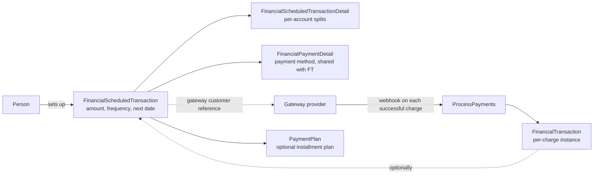

# Scheduled Transactions

## Overview

A `FinancialScheduledTransaction` is a recurring giving setup: a person commits to giving $X every (week | month | year) starting on a specific date, paid through a stored payment method on a configured gateway. The gateway is the system of record for the actual recurrence; Rock's `FinancialScheduledTransaction` row mirrors the gateway's schedule so the church can see who is set up to give, what amounts, and through which method. The job that processes payments creates `FinancialTransaction` rows when the gateway reports a successful charge. Scheduled transactions also support **payment plans**, a related concept where an event-registration or pledge fulfillment is paid off in installments.

## Why It Exists

Most regular giving in churches happens through recurring contributions. Modeling each recurring commitment as a `FinancialScheduledTransaction` (with its own splits per `FinancialScheduledTransactionDetail`, just like one-time transactions) lets the system track commitments separately from individual payment events while reporting them together when needed.

The gateway is the authoritative scheduler: cancellation, retry on failed cards, and date-of-charge logic all live with the provider. Rock mirrors enough state to inform the giver and the staff but does not try to be the scheduler. This is what makes the integration manageable; building a scheduler in Rock would duplicate provider functionality.

The Giving Automation Job perf refactor (commit `16c48bfd30`, 2026-01-15) was a major change because giving classification depends heavily on scheduled-transaction history (frequency, persistence, churn). The fix improved DB load and corrected several inconsistencies in giving attribute computation.

## Mental Model

The gateway charges the saved card / bank account on its schedule. On a successful charge, it sends a webhook (or the `ProcessPayments` job pulls). The job creates a `FinancialTransaction` row matching the schedule's splits. The transaction lands in the active batch; from there, it follows the standard transaction lifecycle.

A `FinancialPersonSavedAccount` is the saved payment method (tokenized): the card or bank reference the gateway uses for future charges. Multiple saved accounts per person are supported.

`PaymentPlan` is a related concept: an event-registration cost (or other balance owed) is paid off in installments. The `PaymentPlanConfiguration` defines the schedule (number of installments, frequency); the `PaymentPlan` row tracks one person's plan against one obligation.

## What You Need to Know

**The gateway is the authoritative scheduler.** Rock does NOT decide when the next charge runs; the gateway does. Rock's `NextPaymentDate` is mirrored from the gateway. Discrepancies in the field can occur if a webhook is missed; resync via `FinancialScheduledTransactionService.UpdateStatus`.

**`FinancialPaymentDetail` is shared between the schedule and the transactions it generates.** A scheduled transaction and the per-charge `FinancialTransaction` rows that come from it can point at the same `FinancialPaymentDetail` row. The row is conceptually immutable once written; mutating it affects both views.

**Cancellation is gateway-side.** Canceling a scheduled transaction calls the gateway to cancel; the local `IsActive = false` is the mirror. Cancellation in Rock that does NOT propagate to the gateway will produce surprise charges.

**`GatewayScheduleId` is the gateway's reference id.** Used to resolve gateway webhooks back to the schedule. Lost / corrupted, the schedule cannot reconcile with provider state.

**`InactivateDateTime` records when cancellation happened.** Distinct from cancellation reason (which is in `Status`). Useful for retention reporting (how long do people give before canceling).

**The Giving Automation Job analyzes scheduled-transaction history.** Frequency classification, "is this person a regular giver" logic, and giving-percentile attributes all depend on schedule churn. The 2026-01-15 perf refactor (`16c48bfd30`) addressed several issues in this analysis.

**Per-charge transactions had a summary-note bug.** Pre-fix `857cf79393` (Fixes #6178), transactions generated from scheduled payments for event registrations lacked a summary note. The fix populates a summary matching one-time payments.

**Mobile saved-account management exists since 2025-01.** Commits `02ad382f30` (Saved Account List, 2025-01-22) and `e2493aa63e` (Saved Account Detail, 2025-01-24) added mobile blocks for managing saved accounts on the phone.

**Payment plans are a separate but related construct.** `PaymentPlan` exists for "I owe $1000 for an event registration; let me pay in 4 monthly installments." Different from "ongoing giving" but uses similar gateway schedule mechanics.

**A scheduled transaction can be edited.** Frequency changes, amount changes, account-split changes propagate to the gateway via the gateway component. The local row updates after gateway confirmation.

## Common Scenarios

**"Set up monthly recurring giving from the public website."** Scheduled Transaction Detail block (V2). Person picks amount, accounts, frequency, payment method (existing saved or new). The block calls the gateway component to create the schedule, persists the local mirror.

**"Cancel a recurring gift."** Scheduled Transaction Detail block. Cancellation propagates to the gateway; on success, `IsActive = false` and `InactivateDateTime` is stamped.

**"Show all active recurring givers."** Query `FinancialScheduledTransaction` filtered by `IsActive = true`. Join to PersonAlias for the giver list.

**"Edit the amount of a recurring gift."** Scheduled Transaction Edit. Updates propagate to the gateway; gateway-side success is required for the local change to commit.

**"Set up an installment plan for an event registration."** PaymentPlan + PaymentPlanConfiguration. Specify total, frequency, number of installments. The plan generates scheduled charges through the gateway.

**"Reconcile a missed webhook."** `FinancialScheduledTransactionService.UpdateStatus` queries the gateway for the schedule's current state and updates the local mirror. Used when a webhook is suspected to have been missed.

## Key Architectural Decisions

### Gateway is the scheduler

Building a scheduler in Rock would duplicate provider functionality and introduce dual-source-of-truth issues. The mirror-the-gateway model is correct.

### Shared `FinancialPaymentDetail` between schedule and transactions

A scheduled transaction's payment method is what each generated transaction also uses. Sharing the row eliminates duplication.

### `FinancialScheduledTransactionDetail` mirrors `FinancialTransactionDetail`

Splits on the schedule predict the splits on each generated transaction. Modeling them in parallel keeps the structure consistent.

### Job-driven transaction generation

A webhook from the gateway triggers a job-mode worker that creates the `FinancialTransaction`. Synchronous webhook -> transaction would couple HTTP responsiveness to DB load; the job model decouples.

### `PaymentPlan` separate from recurring giving

Installment plans for a finite obligation differ from ongoing recurring gifts. Separate entities keep the use cases clear.

## Considered but Rejected

### Local scheduling of recurring charges

Rejected. Provider integration is the supported path; building a scheduler in Rock would force feature parity with every provider's logic.

### Mutating `FinancialPaymentDetail` per-transaction

Rejected. Conceptual immutability simplifies the share-between-schedule-and-transaction model.

### Synchronous webhook -> transaction

Rejected. Decoupling via a job mode keeps the webhook endpoint fast and the DB write resilient.

## Technical Reference

### Schema (relevant subset)

`FinancialScheduledTransaction`:
- `AuthorizedPersonAliasId`
- `FinancialGatewayId`, `FinancialPaymentDetailId`
- `TransactionFrequencyValueId` (DefinedValue)
- `StartDate`, `EndDate`, `NextPaymentDate`
- `NumberOfPayments` (optional cap)
- `IsActive`, `InactivateDateTime`
- `GatewayScheduleId` (provider's reference)
- `Status`, `StatusMessage`

`FinancialScheduledTransactionDetail`: per-account splits; mirrors `FinancialTransactionDetail`.

`FinancialPersonSavedAccount`: saved tokenized payment method. References gateway for the actual storage.

`PaymentPlan`, `PaymentPlanConfiguration`, `PaymentPlanConfigurationOptions`, `PaymentPlanConfigurationService`: installment-plan support.

### Service / API

`FinancialScheduledTransactionService`:
- `ProcessPayments`: the job entry point that drives transaction generation.
- `UpdateStatus`: gateway-side state resync.
- Standard CRUD plus gateway-aware activate/deactivate.

### Affected Blocks

- **Public:** Scheduled Transaction Detail / V2, Saved Account List, Saved Account Detail, Utility Payment Entry.
- **Admin:** Scheduled Transaction Detail (admin), Scheduled Transaction List.
- **Mobile:** Saved Account List / Detail (since 2025-01).

### Related Docs

- [docs/finance/transactions-and-batches.md](transactions-and-batches.md) for the per-charge transaction lifecycle.
- [docs/finance/gateways-and-payments.md](gateways-and-payments.md) for the provider integration.

## Recent Impactful Changes

- **2026-01-15** ([commit `16c48bfd30`](https://github.com/SparkDevNetwork/Rock/commit/16c48bfd30)). Major performance refactor of the Giving Automation Job, which heavily analyzes scheduled-transaction history. Fixed several inconsistencies in giving classification attributes and Giving Journey stages.
- **2025-07-07** ([commit `857cf79393`](https://github.com/SparkDevNetwork/Rock/commit/857cf79393)). Transactions generated from scheduled payments for event registrations now include a summary note matching one-time payment behavior (Fixes #6178).
- **2025-01-24** ([commit `e2493aa63e`](https://github.com/SparkDevNetwork/Rock/commit/e2493aa63e)). Mobile Saved Account Detail block: view and rename a financial person saved account.
- **2025-01-22** ([commit `02ad382f30`](https://github.com/SparkDevNetwork/Rock/commit/02ad382f30)). Mobile Saved Account List block: display a person's saved financial accounts.
