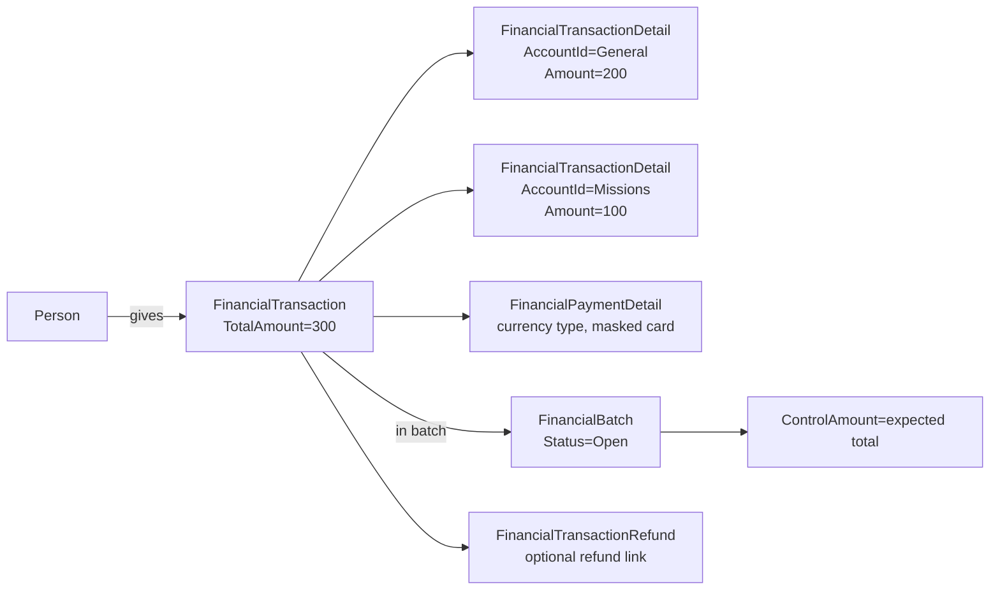

# Transactions and Batches

## Overview

A `FinancialTransaction` records one payment event: a check, a credit-card swipe, an ACH push, a cash gift. It has zero or more `FinancialTransactionDetail` rows, each routing a portion of the gift to a specific `FinancialAccount` (so a single check can split across General Fund, Missions, and Building). The transaction lives inside a `FinancialBatch`, which groups transactions for reconciliation against the bank deposit. Batches transition through `Pending` -> `Open` -> `Closed`. A closed batch is operationally treated as immutable, even though the schema does not enforce it.

## Why It Exists

Reconciling a church's giving against the bank deposit is the foundation of financial trust. The batch construct exists for this: a deposit at the bank corresponds to a batch in Rock; the batch's `ControlAmount` should match the bank-side total before the batch is closed. Modeling each gift as a `FinancialTransaction` with split-able detail rows lets a single check fund multiple ministries while still rolling up to one bank-side payment event.

The transaction-vs-detail split (modeling allocation at the detail level) means reports can answer "how much went to Missions" by aggregating detail rows, not by trying to reverse-engineer split logic from a single account column. Adding a sixth ministry to a split is one new detail row, not a schema change.

## Mental Model



The batch's `ControlAmount` is the operator's expected total (set when the batch is created, typically matching the bank deposit slip). The actual sum of `TotalAmount` across the batch's transactions should match. The Batch Detail block surfaces the difference; closing a batch with mismatched amounts requires explicit override.

## What You Need to Know

**`FinancialTransaction.TotalAmount` is the sum of details.** Some code reads `FinancialTransaction.TotalAmount` directly; the canonical source of truth is the sum of `FinancialTransactionDetail.Amount`. Save-hook logic recomputes the total when details change.

**A closed batch is operationally immutable.** The save hook does NOT block edits, but the audit trail and reconciliation reports treat any post-close edit as a discrepancy. The supported correction path is reopening the batch via the Batch Detail block, then re-closing after the edit.

**`FinancialTransactionDetail.AccountId` is the source of truth for "where did this go."** Reports built against `FinancialTransaction.AccountId` are wrong because there is no such column. Every reporting query must walk through detail rows.

**`AccountCampusMapping` runs at save time.** When a campus is provided on a transaction and the picked account has child accounts mapped to that campus, the save flow may re-route the detail to a child account. The "Use Account Campus Mapping Logic" block setting controls this; commit `ccb81a0911` fixed an issue where the setting was being ignored.

**`FinancialPaymentDetail` is shared between scheduled and one-time transactions.** A `FinancialScheduledTransaction` and the `FinancialTransaction` instances it spawns can point at the same `FinancialPaymentDetail` row. Card data is masked on save (last 4 digits only persisted).

**Refunds are paired transactions.** A refund creates a `FinancialTransactionRefund` row linking back to the original AND a separate `FinancialTransaction` with negative amounts. Reporting must include negative-amount transactions to avoid overstated giving.

**`Transaction Code` is gateway-specific.** The provider's reference id for the payment. Used to resolve gateway webhook events back to the transaction.

**`FinancialTransaction.SourceTypeValueId` records the entry point.** A DefinedValue from `FINANCIAL_SOURCE_TYPE`: Website, Kiosk, Mobile, Bank Check, Onsite Collection, Scheduled Transaction. Used in reporting to attribute giving to channels.

**Transactions imported from a check-scanner integration may have `FinancialTransactionScannedCheck` rows.** The MICR data and the check image are stored separately; the transaction itself is the financial event.

**`Summary` is per-transaction free text.** Notes, memo line content from a check, gateway-side memo. Some reports key off summary; commit `857cf79393` (Fixes #6178) ensured scheduled-transaction-generated transactions also get a summary, matching one-time payment behavior.

**Batch reopen/close requires authorization.** Block-level authorization on the Batch Detail block. Audit history records who opened/closed the batch.

## Common Scenarios

**"Record a one-time gift through the Transaction Entry block."** The block creates `FinancialTransaction`, populates `FinancialTransactionDetail` rows for each fund split, attaches `FinancialPaymentDetail` for the payment method, and adds the transaction to the active batch.

**"Reconcile a deposit."** Open the batch in the Batch Detail block. Compare `ControlAmount` against the batch's transaction sum. Adjust `ControlAmount` or fix mis-entered transactions. Close the batch when it balances.

**"Refund a transaction."** Use the Refund action on the Transaction Detail block. Creates a paired refund record (`FinancialTransactionRefund` linking to the original) and a negative-amount transaction in the active batch.

**"Split a gift across three accounts."** Multiple `FinancialTransactionDetail` rows on the same `FinancialTransaction`. The Transaction Entry block UI surfaces the split-fund picker.

**"Find total giving to a fund this month."**

```sql
SELECT SUM(ftd.Amount)
FROM FinancialTransactionDetail ftd
INNER JOIN FinancialTransaction ft ON ftd.TransactionId = ft.Id
WHERE ftd.AccountId = @accountId
  AND ft.TransactionDateTime >= @start
  AND ft.TransactionDateTime <  @end
```

Note: include negative-amount detail rows (refunds) to get the net.

**"Reopen a closed batch."** Batch Detail -> Reopen. Audited; downstream reports treat the batch as in-flight again until re-closed.

## Key Architectural Decisions

### Detail-level allocation

Splits are common; modeling at the detail level keeps the parent transaction singular while supporting split routing.

### Closed-batch immutability operationally enforced

Hard schema immutability would prevent legitimate corrections. Operational immutability with reopen action handles real-world correction needs without compromising the audit trail.

### `FinancialPaymentDetail` shared with scheduled transactions

A scheduled transaction's payment method is the same as the transactions it generates. Sharing the `FinancialPaymentDetail` row eliminates duplication; the row is conceptually immutable once written.

### Refund as paired transaction

Two records (the refund metadata link plus the negative-amount transaction) keep both sides queryable independently. Reports that join through `FinancialTransactionRefund` get the link; reports that aggregate `FinancialTransactionDetail.Amount` see the negative naturally.

### Account Campus Mapping at save time

Resolving the actual destination account from (chosen account, campus) at save lets the picker UI stay simple ("just pick General Fund"); per-campus child routing is configuration, not picker logic.

## Considered but Rejected

### `FinancialTransaction.AccountId` as a single-account column

Rejected. Splits would require contortion. Detail-level allocation is the correct model.

### Hard immutability on closed-batch transactions

Rejected. Real correction flows need a path. Operational immutability via reopen is right.

### Gateway-side reconciliation as the canonical batch

Rejected. Bank deposits, not gateway settlements, are what church operators reconcile against. The batch construct mirrors deposit-side reality.

## Technical Reference

### Schema (relevant subset)

| Field | Purpose |
|---|---|
| `FinancialTransaction.AuthorizedPersonAliasId` | The giver |
| `FinancialTransaction.BatchId` | Containing batch |
| `FinancialTransaction.FinancialGatewayId` | Origin gateway (for online) |
| `FinancialTransaction.TransactionDateTime` | When payment cleared |
| `FinancialTransaction.TransactionTypeValueId` | Contribution / Event Registration / etc. |
| `FinancialTransaction.SourceTypeValueId` | Entry channel |
| `FinancialTransaction.TransactionCode` | Gateway reference id |
| `FinancialTransaction.Summary` | Free-text notes |
| `FinancialTransactionDetail.AccountId` | Routing target |
| `FinancialTransactionDetail.Amount` | Per-detail amount |
| `FinancialBatch.Status` | Pending / Open / Closed |
| `FinancialBatch.ControlAmount` | Expected total |
| `FinancialBatch.AccountingSystemCode` | External accounting system reference |

### Save Hook Behavior

`FinancialTransaction.SaveHook` writes history for amount changes, batch changes, account changes; cascades batch `ControlAmount` reconciliation when transactions are added/removed.

`FinancialPaymentDetail.SaveHook` masks card data on save (last 4 only).

### Affected Blocks

- **Capture:** Transaction Entry, Transaction Entry V2, Utility Payment Entry / V2.
- **Admin:** Batch Detail, Batch List, Transaction Detail, Transaction List.
- **Reporting:** Giving Analytics, Pledge Analytics.

### Related Docs

- [docs/finance/finance-overview.md](finance-overview.md)
- [docs/finance/accounts-and-campus-mapping.md](accounts-and-campus-mapping.md)
- [docs/finance/scheduled-transactions.md](scheduled-transactions.md)

## Recent Impactful Changes

- **2025-07-15** ([commit `ccb81a0911`](https://github.com/SparkDevNetwork/Rock/commit/ccb81a0911)). Fixed "Use Account Campus Mapping Logic" block setting being ignored on Utility Payment / Transaction Entry V2; the picked account is now used instead of the matched child account when the setting is off.
- **2025-07-07** ([commit `857cf79393`](https://github.com/SparkDevNetwork/Rock/commit/857cf79393)). Transactions generated from scheduled payments for event registrations now include a summary note matching one-time payment behavior (Fixes #6178).
