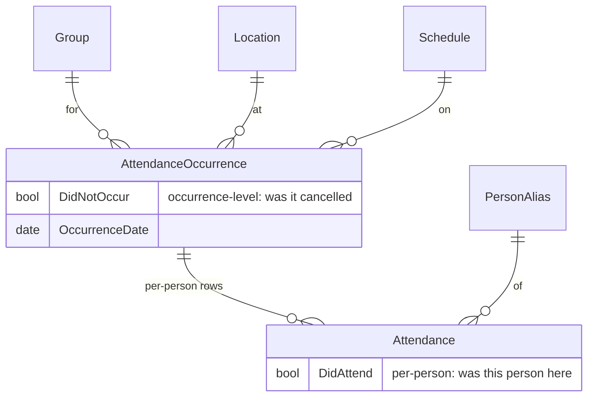

# Group Attendance

## Overview

Group Attendance records who showed up, when, and where for a Group's gatherings. Two entities split the responsibility: `AttendanceOccurrence` is the gathering itself (a Group + Location + Schedule + Date), and `Attendance` is one person's presence at one occurrence. Both entities live in `Rock/Model/Event/`, but the Group-facing UI is in `Rock.Blocks/Group/`.

## Mental Model

Two entities, two questions:

- **`AttendanceOccurrence`**: did the gathering happen? `DidNotOccur = true` means it was scheduled but cancelled. `DidNotOccur = null` or `false` means it occurred.
- **`Attendance`**: did this person attend? `DidAttend = true` (the default) means present; `DidAttend = false` means marked absent.



These are independent. A row in `Attendance` does not in itself prove attendance: it could be a "marked absent" row, and the parent occurrence might have been cancelled. To count "people who actually showed up at events that happened", you must check both flags.

The Group-facing recording flow lazily creates `AttendanceOccurrence` rows on demand. The first time someone records attendance for a particular `(Group, Location, Schedule, Date)` tuple, the block creates the occurrence. Subsequent recording updates the existing occurrence.

## What You Need to Know

**`DidNotOccur` is occurrence-level, `DidAttend` is per-person.** Cancelling a service is one decision, not N decisions (one per expected attendee). The flag goes on the occurrence; per-person rows are created lazily as needed.

**`Attendance.DidAttend` defaults to true.** Most rows are inserted in the act of marking someone present, so the default matches the common path. Marking someone absent requires explicitly setting it to false.

**Counting attendance correctly requires two filters.** `COUNT(*)` over `Attendance` overcounts. The right query filters `DidAttend = true` AND joins to `AttendanceOccurrence` filtered by `DidNotOccur != true`.

**`DidNotOccur = true` does not retroactively flip Attendance rows.** Marking an occurrence as cancelled does not cascade to the attendance rows. If a service is cancelled after some attendance has been recorded, those rows still say `DidAttend = true`. Reporting code must check both.

**Block parameter resolution must accept both raw int IDs and IdKey/Guid forms.** The Group Attendance Detail block previously only accepted raw int IDs and broke when "Disable Predictable Ids" was enabled site-wide. Commit `639757c414` fixed the resolver to accept both forms. Custom blocks that take a Group reference need to follow the same pattern; hardcoding integer-only resolution will produce the same bug.

**Group archive does not bulk-delete attendance.** Historical attendance survives Group archive, preserving reporting integrity. It does not survive `Group.Delete`: the Group save hook bulk-deletes Attendance rows whose `Occurrence.GroupId` matches.

**Multiple occurrences for the same `(Group, Location, Schedule, Date)` are possible.** The recording UI looks up by exact match before creating, but concurrent insertions from different operators can produce duplicates. Cleanup is manual.

## Common Scenarios

**"Record attendance for last Sunday's small group."** Open Group Attendance Detail, pick the Group + date + location + schedule. Block looks up an existing `AttendanceOccurrence`, creates one if missing. Mark attendees, save. Block writes `Attendance` rows linked to the occurrence.

**"Mark a service as cancelled."** Open Group Attendance Detail for the cancelled occurrence. Set `DidNotOccur = true`. No per-person Attendance rows are required.

**"Count who attended a Group over the last quarter."**

```sql
SELECT COUNT(DISTINCT a.PersonAliasId)
FROM Attendance a
INNER JOIN AttendanceOccurrence o ON a.OccurrenceId = o.Id
WHERE o.GroupId = @groupId
  AND a.DidAttend = 1
  AND (o.DidNotOccur IS NULL OR o.DidNotOccur = 0)
  AND o.OccurrenceDate >= @start AND o.OccurrenceDate <= @end
```

**"Build a custom attendance recording block for a Group."** Resolve the Group via `GetQueryableByKey(groupKey, allowIntegerIdentifier: true)` to support both raw int and IdKey/Guid. Look up or create the `AttendanceOccurrence`. Write per-person `Attendance` rows.

## Key Architectural Decisions

### Two entities, two questions

The split between `AttendanceOccurrence` and `Attendance` makes "the service was cancelled" expressible without inventing sentinel rows. Modeling cancellation as a per-attendee decision would conflate signal.

### `DidAttend` defaults to true

The vast majority of insertions come from "this person is here". Defaulting to false would require every recording UI to set the flag explicitly and would silently mis-record cases where the flag was forgotten.

### Group-domain blocks reference Event-domain entities

`AttendanceOccurrence` and `Attendance` live in `Rock/Model/Event/` even though Group attendance is the most common consumer. Events, scheduled-job attendance, and other contexts share the same recording infrastructure.

## Considered but Rejected

### Storing `DidNotOccur` per-Attendance instead of per-Occurrence
Rejected. Cancellation is one decision; pretending it is N decisions wastes storage and complicates queries.

### Defaulting `DidAttend` to false
Rejected. The common case is marking present. Defaulting to false would require every UI to set the flag explicitly.

## Technical Reference

### Data Model

`AttendanceOccurrence` ([Rock/Model/Event/AttendanceOccurrence/AttendanceOccurrence.cs](../../Rock/Model/Event/AttendanceOccurrence/AttendanceOccurrence.cs)):

- `GroupId` (nullable). The Group whose occurrence this is. Nullable because attendance occurrences also exist for Events.
- `LocationId` (nullable). Location of the occurrence.
- `ScheduleId` (nullable). Schedule that produced the occurrence.
- `OccurrenceDate`. Date of occurrence.
- `DidNotOccur` (nullable bool, [line 110](../../Rock/Model/Event/AttendanceOccurrence/AttendanceOccurrence.cs)). True means cancelled.
- `Notes`. Free text.

`Attendance` ([Rock/Model/Event/Attendance/Attendance.cs](../../Rock/Model/Event/Attendance/Attendance.cs)):

- `OccurrenceId`. FK to AttendanceOccurrence, cascade delete.
- `PersonAliasId` (nullable). The attending person.
- `DidAttend` (bool, default true, [line 177](../../Rock/Model/Event/Attendance/Attendance.cs)).
- `StartDateTime`, `EndDateTime`. Check-in/out timestamps where applicable.
- `Note`. Free text.
- `SearchResultGroupId`. Set during certain check-in flows; nulled when the parent Group is deleted.

### Recording Flow

[Rock.Blocks/Group/GroupAttendanceDetail.cs](../../Rock.Blocks/Group/GroupAttendanceDetail.cs):

1. Resolve the Group from the page parameter. Both raw int IDs and IdKey/Guid are accepted ([commit `639757c414`](https://github.com/SparkDevNetwork/Rock/commit/639757c414)).
2. Resolve the date, location, schedule from page params or block settings.
3. Look up an existing `AttendanceOccurrence` for the tuple; create on demand.
4. Render roster, mark attendees.
5. On save, write per-person `Attendance` rows.

The block can mark the occurrence as `DidNotOccur = true`, which sets the flag without creating per-person rows.

### Affected Blocks and UI Surfaces

- **Group Attendance Detail** ([Rock.Blocks/Group/GroupAttendanceDetail.cs](../../Rock.Blocks/Group/GroupAttendanceDetail.cs), [Obsidian](../../Rock.JavaScript.Obsidian.Blocks/src/Group/groupAttendanceDetail.obs)). Records attendance for a single occurrence.
- **Group Attendance List** ([Rock.Blocks/Group/GroupAttendanceList.cs](../../Rock.Blocks/Group/GroupAttendanceList.cs), [Obsidian](../../Rock.JavaScript.Obsidian.Blocks/src/Group/groupAttendanceList.obs)). Historical browse with summary counts.
- **Check-in screens.** The check-in domain creates `AttendanceOccurrence` and `Attendance` rows for check-in classroom Groups. Out of scope here.

### Extension Points

- **`AttendanceCountsAsWeekendService`** on GroupType. Marks attendance as counting toward the weekend-service metric.
- **`GroupAttendanceRequiresLocation`, `GroupAttendanceRequiresSchedule`** on GroupType. Force the recording UI to require those fields.
- **`AttendanceCode`** lookups for short check-in codes; out of scope for this doc.

### File Index

- [Rock/Model/Event/Attendance/](../../Rock/Model/Event/Attendance/)
- [Rock/Model/Event/AttendanceOccurrence/](../../Rock/Model/Event/AttendanceOccurrence/)
- [Rock.Blocks/Group/GroupAttendanceDetail.cs](../../Rock.Blocks/Group/GroupAttendanceDetail.cs)
- [Rock.Blocks/Group/GroupAttendanceList.cs](../../Rock.Blocks/Group/GroupAttendanceList.cs)

## Recent Impactful Changes

- **2025-08-13** ([commit `639757c414`](https://github.com/SparkDevNetwork/Rock/commit/639757c414)). Group Attendance Detail correctly resolves the Group via Guid or IdKey when "Disable Predictive Ids" is enabled (Fixes #6687).
- **2025** ([commit `194af0435a`](https://github.com/SparkDevNetwork/Rock/commit/194af0435a)). Group Attendance List Obsidian block landed; legacy WebForms version chopped.
- **2025** ([commit `278e1fb088`](https://github.com/SparkDevNetwork/Rock/commit/278e1fb088)). Final WebForms cleanup for `BatchList`, `GroupAttendanceDetail`, and `Notes`.
