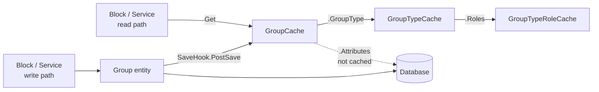

# Group Caching

## Overview

Rock caches `Group`, `GroupType`, `GroupTypeRole`, and (in narrow cases) `GroupLocation` as process-wide singletons through the `ModelCache<TCache, TEntity>` pattern. Most read paths in blocks and services should resolve through the cache; the model classes are the write path. The most important rule to internalize: cache classes that mirror `ISecured` models MUST reproduce the model's security behavior exactly, or authorization checks quietly disagree depending on whether the caller went through cache or DB.

## Mental Model

A cache class is a **read-side projection** of a model. It holds the scalar fields plus lazy navigation properties that resolve to other caches. `GroupCache.GroupType` is a property that calls `GroupTypeCache.Get(GroupTypeId)`; it never holds a strong reference to a fully populated GroupType object. This is what keeps the object graphs bounded and lets each cache be invalidated independently.

The cache is **not** a snapshot of the entire entity. It is a snapshot of *the fields the cache class explicitly copies*, plus pointers to other caches. Collections (`GroupMembers`, `GroupLocations`, `Attributes`) are not cached on the parent cache object. They go through the database.

Eviction is **event-driven, not time-driven**. Save hooks invalidate cache entries when their underlying entity changes. There is no background TTL refresh for most caches; the only TTL behavior is on entries for non-check-in Groups and non-named GroupLocations (10 minutes), which exists for memory hygiene rather than correctness.

For authorization, **the cache must agree with the model**. If a cache class fails to mirror the model's `ISecured` overrides (`IsAuthorized`, `ParentAuthority`, `ParentAuthorityPre`), security checks quietly diverge: a check that goes through `GroupCache.IsAuthorized` returns one answer while the same check through `Group.IsAuthorized` returns another. This was a real production bug; commit `dd7e1d45c8` codified the rule and fixed `GroupCache` and several other caches.

## What You Need to Know

**Cache MUST mirror model security.** Any cache class for an `ISecured` entity has to override the same authorization methods the model overrides. Do not assume the base `ModelCache` does the right thing for free. Specifically: `ParentAuthority`, `ParentAuthorityPre`, and `IsAuthorized` need to match what the model does. If you add a cache for a new secured entity, this rule applies.

**Cache invalidation runs through save hooks.** `Group.SaveHook.PostSave` calls `GroupCache.UpdateCachedEntity`. Same pattern for `GroupType`, `GroupTypeRole`, `GroupLocation`. Code that mutates entities outside `SaveChanges` (raw SQL, `BulkUpdate`) does NOT invalidate the cache. Stale reads will follow until something else triggers eviction.

**`GroupCache.All()` throws.** Too many groups for an "all" enumeration to be safe. Always fetch by id, by parent, or via `GroupService` queries. If you need to enumerate all groups, you go to the DB.

**Attributes are NOT on the cache.** Reading `Attributes` or `AttributeValues` on a cached entity triggers a DB hit on first access. If a hot path needs attributes, either resolve them once and cache at the consumer level, or accept the DB cost.

**Roles are accessed through `GroupTypeCache.Roles`, not `GroupTypeRoleCache.Get` directly.** The `Roles` property memoizes a list of `GroupTypeRoleCache` instances on first access. Direct `GroupTypeRoleCache.Get(id)` calls bypass the memoization and miss the bulk-fetch optimization.

**`GroupLocationCache` is niche.** Most callers query `GroupLocation` directly via EF rather than through this cache. The cache exists primarily for check-in and scheduling paths that need `AllForLocationId(locationId)`. The alternate index backing that method can stale if `GroupLocation.LocationId` is mutated outside the save hook; call `ClearByLocationId` after non-standard mutations.

**`new RockContext()` is forbidden in cache classes.** Use `RockApp.Current.CreateRockContext()`. Commits `b7f1eaa9e0` and `18c8ecbd47` switched all cache classes to this pattern for testability. New cache classes should follow it.

**Web farm deployments need a cross-node cache provider.** Process-wide singletons are per-process. In a web farm, a save on one node invalidates only that node's cache unless the configured cache provider (typically Redis) propagates the invalidation. Verify your cache configuration before assuming consistency across nodes.

**Non-check-in Groups have a 10-minute TTL.** Most `GroupCache` entries persist until invalidated, but entries whose `GroupType` has no check-in configuration expire after 10 minutes. This is a memory-hygiene measure, not a correctness mechanism. Code that depends on cached entries being permanent is wrong.

## Common Scenarios

**"Read a Group's settings."** `GroupCache.Get(groupId)` returns the cache instance. Use its properties; do not go to DB.

**"Read a Group's roles."** Through `GroupTypeCache.Roles` from the parent type, not direct `GroupTypeRoleCache.Get`.

**"Authorization check on a Group."** `GroupCache.Get(id).IsAuthorized(action, person)`. The cache mirrors the model, so the answer is the same as `Group.IsAuthorized`.

**"I changed `GroupLocation.LocationId` via raw SQL."** Call `GroupLocationCache.ClearByLocationId(oldLocationId)` and `ClearByLocationId(newLocationId)` to refresh the alternate index. Do not rely on the standard save-hook path; raw SQL bypasses it.

**"Write a new cache class for a secured entity."** Inherit from `ModelCache<TCache, TEntity>`. Override `ParentAuthority`, `ParentAuthorityPre`, and `IsAuthorized` to match the model exactly. Use `RockApp.Current.CreateRockContext()` for any DB access. Add the save-hook invalidation in the model's `SaveHook.cs`.

## Key Architectural Decisions

### Cache mirrors model security exactly

A cache class that diverges from its model on `IsAuthorized`, `ParentAuthority`, or `ParentAuthorityPre` is a bug. Codified in commit `dd7e1d45c8`.

### Lazy navigation through other caches, not eager fetching

Cache classes hold scalar fields and pointers to other caches. They never hold fully populated graphs of related entities. This bounds memory, lets each cache be invalidated independently, and means a cache miss on one entity does not poison entries for unrelated entities.

### Per-instance memoization on lazy collections

`GroupTypeCache.Roles` populates the role list on first access and reuses it. Cleared when the cache entry is invalidated. The right tradeoff for collections that are frequently read but rarely change inside the lifetime of a cache entry.

### `RockApp.Current.CreateRockContext` for testability

Cache classes do not allocate `RockContext` directly. The indirection through `RockApp.Current` lets tests substitute the implementation.

## Considered but Rejected

### Caching `GroupMembers` and `GroupLocations` collections on `GroupCache`
Rejected. Volume and churn make it net-negative. A large group has thousands of `GroupMember` rows that change on every roster edit, attendance occurrence, or sync run. Caching them would increase memory pressure and force frequent invalidations.

### Caching `IsAuthorized` results
Rejected. Per-(person, action, group) authorization tuples are too high-cardinality to cache safely. The current cost of evaluating role-based permissions through `GroupTypeRoleCache` is low.

## Technical Reference

### What Each Cache Holds

`GroupCache` ([Rock/Web/Cache/Entities/GroupCache.cs](../../Rock/Web/Cache/Entities/GroupCache.cs)). Caches every scalar Group setting: `Name`, `IsActive`, `IsArchived`, `GroupTypeId`, `ParentGroupId`, `CampusId`, `ScheduleId`, `Order`, `GroupCapacity`, `InactiveDateTime`, all chat override flags, all scheduling override flags. Lazy navigation properties for `GroupType`, `ParentGroup`, `Campus`, `Schedule`, `StatusValue`, `InactiveReasonValue`. Not cached: `GroupMembers`, `GroupLocations`, `Attributes`/`AttributeValues`.

`GroupTypeCache` ([Rock/Web/Cache/Entities/GroupTypeCache.cs](../../Rock/Web/Cache/Entities/GroupTypeCache.cs)). Caches every type setting flag. Lazy collections (memoized on instance):

- `Roles` ([line 650](../../Rock/Web/Cache/Entities/GroupTypeCache.cs)). On first access, queries role IDs then bulk-fetches via `GroupTypeRoleCache.GetMany`.
- `ChildGroupTypes`, `GroupScheduleExclusions`, `LocationTypeValues`, `InheritedGroupType`. Same pattern.

`GroupTypeRoleCache` ([Rock/Web/Cache/Entities/GroupTypeRoleCache.cs](../../Rock/Web/Cache/Entities/GroupTypeRoleCache.cs)). Thin scalar cache: `IsLeader`, `IsSystem`, `Name`, `MaxCount`, `MinCount`, `CanView`, `CanEdit`, `CanManageMembers`, `CanTakeAttendance`, `ChatRole`, `IsExcludedFromPeerNetwork`. No nested collections.

`GroupLocationCache` ([Rock/Web/Cache/Entities/GroupLocationCache.cs](../../Rock/Web/Cache/Entities/GroupLocationCache.cs)). Caches `GroupId`, `LocationId`, type/flag fields, `ScheduleIds` (list of int). Lazy `Location` (via `NamedLocationCache`) and `Schedules` (via `ScheduleCache`). Alternate index `_byLocationIdCache` accessed via `AllForLocationId` ([line 127](../../Rock/Web/Cache/Entities/GroupLocationCache.cs)).

### Lifetime and TTL

- All four caches are process-wide singletons backed by `ItemCache<T>`.
- Default: indefinite retention until explicit invalidation.
- `GroupCache` entries for Groups whose GroupType has no check-in configuration: 10-minute TTL ([line 52](../../Rock/Web/Cache/Entities/GroupCache.cs)).
- `GroupLocationCache` non-named entries: 10-minute TTL ([line 55](../../Rock/Web/Cache/Entities/GroupLocationCache.cs)).
- All others: stay until invalidated. No background expiry.

### Invalidation

- `Group.SaveHook.PostSave` calls `GroupCache.UpdateCachedEntity(Id, entityState)`.
- `GroupType.SaveHook.PostSave` calls `GroupTypeCache.UpdateCachedEntity(Id, entityState)` and triggers a check-in director refresh.
- `GroupTypeRole.Logic` invalidates `GroupTypeRoleCache` and clears the parent `GroupTypeCache.Roles` memoization.
- `GroupLocationCache.UpdateCachedEntity(GroupLocation, EntityState)` ([line 206](../../Rock/Web/Cache/Entities/GroupLocationCache.cs)) has a non-standard signature taking the entity itself, because it must refresh the `_byLocationIdCache` alternate index when `LocationId` changes.

### Authorization Mirroring

`GroupCache` overrides:

- `ParentAuthority` ([line 586](../../Rock/Web/Cache/Entities/GroupCache.cs)). Returns cached parent `GroupCache`, not DB-loaded `ParentGroup`.
- `ParentAuthorityPre` ([line 605](../../Rock/Web/Cache/Entities/GroupCache.cs)). Returns cached `GroupTypeCache`.
- `IsAuthorized(action, person)` ([line 622](../../Rock/Web/Cache/Entities/GroupCache.cs)). Mirrors `Group.Logic.IsAuthorized` exactly: base auth, then GroupMember role-based permissions through `GroupTypeRoleCache`, with parent hierarchy.

These overrides were added in commit `dd7e1d45c8` to close an authorization-mismatch class of bugs.

### Affected Blocks and UI Surfaces

Caching is a service-layer concern; no UI exposes it directly. The cache management page in Internal/CMS Configuration shows cache stats and offers a "Clear Cache" button.

### Extension Points

- **New cache classes.** Inherit from `ModelCache<TCache, TEntity>`, override `SetFromEntity`, mirror `ISecured` if applicable, add save-hook invalidation.
- **Additional cache properties.** Promote frequently-read properties from the model to the cache.

### File Index

- [Rock/Web/Cache/Entities/GroupCache.cs](../../Rock/Web/Cache/Entities/GroupCache.cs)
- [Rock/Web/Cache/Entities/GroupTypeCache.cs](../../Rock/Web/Cache/Entities/GroupTypeCache.cs)
- [Rock/Web/Cache/Entities/GroupTypeRoleCache.cs](../../Rock/Web/Cache/Entities/GroupTypeRoleCache.cs)
- [Rock/Web/Cache/Entities/GroupLocationCache.cs](../../Rock/Web/Cache/Entities/GroupLocationCache.cs)
- [Rock/Web/Cache/ModelCache.cs](../../Rock/Web/Cache/ModelCache.cs)

## Recent Impactful Changes

- **2026-03-13** ([commit `dd7e1d45c8`](https://github.com/SparkDevNetwork/Rock/commit/dd7e1d45c8)). Cache classes (including `GroupCache`, `GroupTypeCache`, `GroupTypeRoleCache`) updated to mirror their model entities' `ISecured` behavior. `ParentAuthority`, `IsAuthorized`, `IsAllowedByDefault` overrides added where missing. `ISecured` methods reorganized into `*.Logic.cs` for several entities.
- **2025-10-27** ([commit `b7f1eaa9e0`](https://github.com/SparkDevNetwork/Rock/commit/b7f1eaa9e0)). Cache classes switched from `new RockContext()` to `RockApp.Current.CreateRockContext()` to improve testability.
- **2025-10-16** ([commit `e16e7506a7`](https://github.com/SparkDevNetwork/Rock/commit/e16e7506a7)). `Group.Logic.cs` security checks now use `GroupCache` for parent authority. Small performance improvement.
