# Group Chat

## Overview

When the Rock chat system is configured at the platform level AND the parent GroupType allows chat, individual Groups can opt into being chat channels. Five behavioral settings on the GroupType (visibility, leave permission, push notifications, etc.) can be overridden per-Group, plus the channel can have its own avatar image. This is the only Group subsystem (with peer-network) that uses a tri-state per-Group override pattern: null = inherit from GroupType, true = override on, false = override off.

## Why It Exists

Chat is a cross-cutting communication surface (an external Stream / Sendbird / similar integration). Most chat behavior needs to live on the GroupType because it represents "how Small Groups behave in chat" globally. But individual Groups occasionally need to diverge: a single Small Group is public, the rest are private; one volunteer team disables push so members don't get pinged on Saturdays. Per-Group overrides let those exceptions exist without forcing an admin to fork a GroupType.

## Mental Model

Three layers, each with a distinct role:

- **Platform layer** (`ChatHelper.IsChatEnabled` at [ChatHelper.cs:209](../../Rock/Communication/Chat/ChatHelper.cs)). True when the chat API credentials are configured in system settings. If false, the entire chat feature is dormant; no Group can be a chat channel regardless of settings.
- **GroupType layer** (`GroupType.IsChatAllowed`, `IsChatEnabledForAllGroups`, plus five behavior properties). The GroupType decides whether its Groups CAN participate at all, and what the default behavior is.
- **Group layer** (six `*Override` columns, plus `ChatChannelAvatarBinaryFileId`). Each Group can override the GroupType defaults using a tri-state value: null inherits, true forces on, false forces off.

The override resolution lives on `Group` as five `GetIs*()` helpers ([Group.Logic.cs:697-802](../../Rock/Model/Group/Group/Group.Logic.cs)). Always call those rather than reading the override column directly; the helpers handle the inherit-or-override decision in one place.

```mermaid
flowchart TD
    Platform[ChatHelper.IsChatEnabled<br/><i>API credentials configured?</i>]
    GroupType[GroupType.IsChatAllowed<br/><i>type can participate?</i>]
    Default[GroupType behavior defaults<br/><i>e.g., IsChatChannelPublic</i>]
    Override[Group override columns<br/><i>e.g., IsChatChannelPublicOverride</i>]
    Resolved[Group.GetIsChatChannelPublic&#40;&#41;<br/><i>resolved boolean</i>]

    Platform --> GroupType
    GroupType --> Resolved
    Default --> Resolved
    Override --> Resolved
```

`GroupMember` has its own chat state (`IsChatMuted`, `IsChatBanned`) and `GroupTypeRole` has a `ChatRole` (User / Moderator / Administrator) that maps the Rock role to the external chat system's role hierarchy. These are runtime per-person state, not configuration.

## What You Need to Know

**Each override is tri-state, not boolean.** `null` means "inherit from the GroupType"; `true` and `false` are explicit overrides. The legacy WebForms UI surfaced these as dropdowns with three values (empty / "y" / "n"); the Obsidian UI uses tri-state radio groups. Never default an override column to `false` thinking it's "off" — that loses the inherit semantics. Default to `null` unless the user explicitly toggles.

**Always resolve via `GetIs*()` helpers.** Reading `Group.IsChatChannelPublicOverride` directly gives you a `bool?`. Calling `Group.GetIsChatChannelPublic()` gives you the resolved `bool` after walking GroupType inheritance. Block code, services, and Lava merge fields should always use the resolved version.

**`IsChatAllowed` is the hard gate.** If a GroupType has `IsChatAllowed = false`, `GetIsChatEnabled()` returns false unconditionally even when the Group's override is true. The Group UI hides the chat panel in this case. Bulk imports or service code that sets override values without checking `IsChatAllowed` will store data that the resolver simply ignores.

**`IsSystem` groups render chat fields read-only.** The Group Detail block shows the chat panel for `IsSystem` groups but disables every control. Direct edits via service or SQL would succeed; the UI just doesn't expose them. If you write tooling that mutates system-group chat settings, document the deviation.

**Avatar changes flip `IsTemporary` on the prior BinaryFile.** When `Group.ChatChannelAvatarBinaryFileId` changes, the OLD BinaryFile is marked `IsTemporary = true` so the cleanup job removes it; the NEW BinaryFile is marked `IsTemporary = false` to pin it. If you write code that swaps the avatar without going through the standard save path, replicate the toggle or the old avatar will linger in storage forever.

**`ChatRole` on `GroupTypeRole` maps Rock roles to chat roles, but only at sync time.** Setting a role's `ChatRole` doesn't take effect until the next chat sync cycle reads it. Three values: `User` (default), `Moderator`, `Administrator`. There is no per-member override; the role decides.

**`IsChatMuted` and `IsChatBanned` on `GroupMember` are local mute/ban flags.** These are NOT pushed to the external chat system as state; they're filters the Rock layer uses when surfacing chat membership. A banned member is excluded from sync; a muted member is included but their notification preferences are altered. Direct edits to these fields are picked up on the next sync.

**A "chat channel" lifecycle is broader than just the Group row.** `Group.GetIsChatChannelActive()` ([Group.Logic.cs:804](../../Rock/Model/Group/Group/Group.Logic.cs)) requires `GetIsChatEnabled() && IsActive && !IsArchived`. Archiving or deactivating the Group cascades to the external chat system on the next sync, which inactivates the corresponding channel rather than deleting it.

## Common Scenarios

**"Enable chat for one specific Small Group when the GroupType has chat disabled by default."** Set `Group.IsChatEnabledOverride = true`. Confirm the GroupType has `IsChatAllowed = true`. The Group becomes a chat channel on the next sync.

**"Make a chat channel public for everyone, even if the GroupType defaults to private."** Set `Group.IsChatChannelPublicOverride = true`. The external chat system reflects the change on next sync.

**"Stop a Group from being a chat channel without changing the GroupType."** Set `Group.IsChatEnabledOverride = false`. The Group's existing channel will inactivate on next sync; existing chat history is preserved by the external system.

**"Update a chat channel's avatar."** Upload the new BinaryFile via the standard uploader; assign its Id to `Group.ChatChannelAvatarBinaryFileId`. The save flow toggles `IsTemporary` on the old and new BinaryFiles for cleanup-job housekeeping.

**"Promote a leader role's members to chat moderators."** Edit the `GroupTypeRole`, set `ChatRole = Moderator`. Every member currently holding that role becomes a moderator on next sync.

**"Mute or ban a specific member from this Group's chat."** Set `GroupMember.IsChatMuted = true` (or `IsChatBanned = true`). Effective on next sync.

## Key Architectural Decisions

### Tri-state per-Group overrides

Two-state (boolean) overrides cannot distinguish "I want this off" from "I want to inherit the GroupType default". A nullable `bool?` lets the override express both. The cost is more careful handling in serialization and form input, which is why every consumer reads through `GetIs*()` resolvers rather than raw override columns.

### Resolution helpers on `Group`, not in callers

Every consumer that wants "is this Group's chat enabled" calls `Group.GetIsChatEnabled()`. The helper internally consults `IsChatAllowed`, the override column, and the GroupType default in order. Centralizing this prevents the override-vs-default logic from being duplicated and getting out of sync across consumers.

### Avatar `IsTemporary` toggle is the cleanup pattern

Rock has no centralized BinaryFile garbage collector for entity references. Each consumer is responsible for marking orphaned files `IsTemporary = true` so the periodic cleanup job picks them up. The chat avatar follows the same pattern as the Person photo, the Group photo (added in Phase 2 of the GroupDetail conversion), and similar BinaryFile attachments.

### `ChatRole` on `GroupTypeRole`, not `GroupMember`

Mapping member-to-chat-role per role rather than per member means changing a role's `ChatRole` updates every member of that role on the next sync. Per-member chat-role overrides were rejected because the external chat systems treat moderator/admin as a permission level, not an attribute, and Rock's role-based permission model already serves that need.

## Considered but Rejected

### Two-state (boolean) per-Group overrides
Rejected. Two-state would force "inherit from GroupType default" to collapse into one of "on" or "off", which prevents a Group from saying "leave me alone, use the type's setting". Tri-state via `bool?` is verbose but expressive.

### Per-member `ChatRole` overrides
Rejected. The external chat system's role model is shallow (User / Moderator / Administrator) and Rock's `GroupTypeRole` already serves as the unit of permission. Per-member override would have created a parallel permission hierarchy without solving a real need.

### Hard-deleting chat channels when a Group is archived
Rejected. Archiving a Group inactivates its chat channel rather than deleting it. The external chat system retains history, which is useful for compliance, auditing, and reactivating the channel if the Group is unarchived later.

## Technical Reference

### Data Model

`Group` chat columns ([Rock/Model/Group/Group/Group.cs](../../Rock/Model/Group/Group/Group.cs)):

| Column | Type | Purpose |
|---|---|---|
| `IsChatEnabledOverride` | `bool?` | [line 600](../../Rock/Model/Group/Group/Group.cs). Override of `GroupType.IsChatEnabledForAllGroups`. Resolved via `GetIsChatEnabled()`. |
| `IsLeavingChatChannelAllowedOverride` | `bool?` | [line 611](../../Rock/Model/Group/Group/Group.cs). Override of `GroupType.IsLeavingChatChannelAllowed`. Resolved via `GetIsLeavingChatChannelAllowed()`. |
| `IsChatChannelPublicOverride` | `bool?` | [line 622](../../Rock/Model/Group/Group/Group.cs). Override of `GroupType.IsChatChannelPublic`. Resolved via `GetIsChatChannelPublic()`. |
| `IsChatChannelAlwaysShownOverride` | `bool?` | [line 633](../../Rock/Model/Group/Group/Group.cs). Override of `GroupType.IsChatChannelAlwaysShown`. Resolved via `GetIsChatChannelAlwaysShown()`. |
| `ChatPushNotificationModeOverride` | `ChatNotificationMode?` | [line 650](../../Rock/Model/Group/Group/Group.cs). Override of `GroupType.ChatPushNotificationMode`. Resolved via `GetChatPushNotificationMode()`. |
| `ChatChannelAvatarBinaryFileId` | `int?` | [line 640](../../Rock/Model/Group/Group/Group.cs). FK to BinaryFile, no cascade (configuration at [Group.cs:959](../../Rock/Model/Group/Group/Group.cs)). |

`GroupType` chat defaults: `IsChatAllowed`, `IsChatEnabledForAllGroups`, `IsLeavingChatChannelAllowed`, `IsChatChannelPublic`, `IsChatChannelAlwaysShown`, `ChatPushNotificationMode`. All on [Rock/Model/Group/GroupType/GroupType.cs](../../Rock/Model/Group/GroupType/GroupType.cs).

`GroupTypeRole.ChatRole` at [GroupTypeRole.cs:191](../../Rock/Model/Group/GroupTypeRole/GroupTypeRole.cs). Values: `User`, `Moderator`, `Administrator` ([Rock.Enums/Communication/Chat/ChatRole.cs:25](../../Rock.Enums/Communication/Chat/ChatRole.cs)).

`GroupMember.IsChatMuted` at [GroupMember.cs:256](../../Rock/Model/Group/GroupMember/GroupMember.cs); `GroupMember.IsChatBanned` at [GroupMember.cs:263](../../Rock/Model/Group/GroupMember/GroupMember.cs).

`ChatNotificationMode` enum at [Rock.Enums/Communication/Chat/ChatNotificationMode.cs](../../Rock.Enums/Communication/Chat/ChatNotificationMode.cs). Values: `AllMessages` (0), `Mentions` (1), `Silent` (2).

### Override Resolution

Each override column has a paired `Get*()` helper on `Group` ([Rock/Model/Group/Group/Group.Logic.cs](../../Rock/Model/Group/Group/Group.Logic.cs)):

| Helper | Line | Resolution logic |
|---|---|---|
| `GetIsChatEnabled()` | [697](../../Rock/Model/Group/Group/Group.Logic.cs) | If `GroupType.IsChatAllowed` is false, return false. Else if `IsChatEnabledOverride.HasValue`, return its value. Else return `GroupType.IsChatEnabledForAllGroups`. |
| `GetIsLeavingChatChannelAllowed()` | [729](../../Rock/Model/Group/Group/Group.Logic.cs) | If override has value, return it. Else return GroupType's default. |
| `GetIsChatChannelPublic()` | [753](../../Rock/Model/Group/Group/Group.Logic.cs) | Same shape. |
| `GetIsChatChannelAlwaysShown()` | [777](../../Rock/Model/Group/Group/Group.Logic.cs) | Same shape. |
| `GetChatPushNotificationMode()` | [799](../../Rock/Model/Group/Group/Group.Logic.cs) | Delegates to `GroupCache.GetChatPushNotificationMode(ChatPushNotificationModeOverride, GroupTypeId)`. |

`Group.GetIsChatChannelActive()` ([Group.Logic.cs:804](../../Rock/Model/Group/Group/Group.Logic.cs)) returns true only when chat is enabled AND the Group is active AND not archived.

### Avatar BinaryFile Lifecycle

The Group Detail block's save flow tracks the chat avatar's `IsTemporary` flag through `ApplyChatChannelAvatarBinaryFile` and the post-save `ToggleBinaryFileIsTemporary` helper in [Rock.Blocks/Group/GroupDetail.cs](../../Rock.Blocks/Group/GroupDetail.cs). Three cases:

| Before | After | Toggle action |
|---|---|---|
| no avatar | new avatar | New BinaryFile → `IsTemporary = false` (pinned). |
| existing | replaced | Old BinaryFile → `IsTemporary = true` (cleanup queue); new BinaryFile → `IsTemporary = false`. |
| existing | removed | Old BinaryFile → `IsTemporary = true`. |
| existing | same | No-op (avatar Id unchanged). |

This runs inside the same `WrapTransaction` as the rest of the save, so a failed save also rolls back the `IsTemporary` toggle. Direct EF updates that bypass the save flow must replicate the toggle manually.

### ChatHelper API Surface

[Rock/Communication/Chat/ChatHelper.cs](../../Rock/Communication/Chat/ChatHelper.cs) is the integration boundary between Rock and the external chat system. The most-touched surfaces:

- `ChatHelper.IsChatEnabled` ([line 209](../../Rock/Communication/Chat/ChatHelper.cs)). Read whenever code needs to know if chat is configured at all.
- Sync entry points: synchronize channels (Groups → chat channels), members (GroupMembers → channel members), profile pictures.
- Webhook handler: receives external chat events (member-left, message-sent for fallback notification) and reconciles Rock state.

External callers should consult `ChatHelper.IsChatEnabled` before assuming any chat operation will succeed. Internal callers within sync code can skip the check since the sync job itself is gated.

### Caching

Chat-relevant cache flags live on `GroupCache` and `GroupTypeCache`. They participate in the standard cache invalidation: editing a `GroupType` invalidates the cache; the next read picks up new chat defaults. There is no chat-specific cache layer.

### Affected Blocks and UI Surfaces

- **Group Detail "Chat" section** ([Rock.Blocks/Group/GroupDetail.cs](../../Rock.Blocks/Group/GroupDetail.cs), [editPanel.partial.obs](../../Rock.JavaScript.Obsidian.Blocks/src/Group/GroupDetail/editPanel.partial.obs)). Per-Group chat overrides + channel avatar. Hidden when platform chat is disabled or `GroupType.IsChatAllowed` is false. Read-only when `IsSystem`.
- **Group Type Detail "Chat" tab** ([Rock.JavaScript.Obsidian.Blocks/src/Group/GroupTypeDetail/editPanel.partial.obs](../../Rock.JavaScript.Obsidian.Blocks/src/Group/GroupTypeDetail/editPanel.partial.obs)). Per-GroupType defaults and the `IsChatAllowed` gate.
- **Chat View block** ([Rock.Blocks/Communication/Chat/ChatView.cs](../../Rock.Blocks/Communication/Chat/ChatView.cs)). End-user chat surface; respects `GetIsChatChannelActive`.
- **Chat Configuration screens** under Communication settings. Configure platform-level chat credentials.

### Extension Points

- **`ChatNotificationMode` per-Group override.** Lets a specific Group send fewer (or more) push notifications than its GroupType default.
- **Chat Workflow Actions** (added 2025-10-29): "Chat Channel Message Send" and "Chat Direct Message Send" Workflow Action Types let workflows participate in chat.
- **Chat Message Automation Triggers** (added 2025-07-15): launch Automation Events when chat messages are sent; includes a fallback-notification event for offline recipients.
- **External chat provider abstraction.** `ChatHelper` is the integration boundary. Custom chat providers would implement against the same surface.

### File Index

- [Rock/Model/Group/Group/Group.cs](../../Rock/Model/Group/Group/Group.cs) — override columns.
- [Rock/Model/Group/Group/Group.Logic.cs](../../Rock/Model/Group/Group/Group.Logic.cs) — resolution helpers.
- [Rock/Model/Group/GroupType/GroupType.cs](../../Rock/Model/Group/GroupType/GroupType.cs) — GroupType-level defaults and `IsChatAllowed`.
- [Rock/Model/Group/GroupTypeRole/GroupTypeRole.cs](../../Rock/Model/Group/GroupTypeRole/GroupTypeRole.cs) — `ChatRole`.
- [Rock/Model/Group/GroupMember/GroupMember.cs](../../Rock/Model/Group/GroupMember/GroupMember.cs) — `IsChatMuted`, `IsChatBanned`.
- [Rock/Communication/Chat/ChatHelper.cs](../../Rock/Communication/Chat/ChatHelper.cs) — external chat integration.
- [Rock.Enums/Communication/Chat/](../../Rock.Enums/Communication/Chat/) — `ChatRole`, `ChatNotificationMode`.

## Recent Impactful Changes

- **2025-10-29** ([commit `6774847b62`](https://github.com/SparkDevNetwork/Rock/commit/6774847b62)). Added two Workflow Action Types: Chat Channel Message Send and Chat Direct Message Send. Workflows can now post into chat channels or send direct messages from within Rock.
- **2025-07-15** ([commit `bcbe225de8`](https://github.com/SparkDevNetwork/Rock/commit/bcbe225de8)). Added a "Chat Message" Automation Trigger and a "Send Fallback Chat Notification" Automation Event that alerts individuals via alternate methods (email or SMS) when they don't have an active personal device or have notifications turned off.
- **2026-02-23** ([commit `8c5d684984`](https://github.com/SparkDevNetwork/Rock/commit/8c5d684984)). ChatHelper now tolerates improperly-formed webhooks from the external chat provider, avoiding spurious inactivation of chat-enabled Group Members when the provider returns a malformed deletion event.
