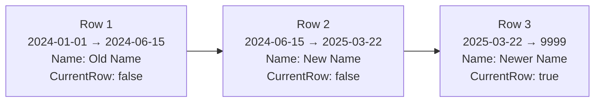

# Group Historical Entities

## Overview

Rock's `*Historical` entities are point-in-time snapshots of `Group`, `GroupMember`, and `GroupLocation` state, populated by the `ProcessGroupHistory` job and consumed by reporting and audit UIs. The pattern is "type 2 slowly changing dimension": each row covers a date range during which the snapshotted values held, and a `CurrentRowIndicator` flag marks the row representing right-now state.

## Mental Model

A Historical row is **a frozen snapshot of a tracked entity at a point in time**. Each row says "between EffectiveDateTime and ExpireDateTime, this Group/Member/Location had these field values". One row at any time has `CurrentRowIndicator = true`; the rest are historical.



Tracking is **opt-in per GroupType** via `GroupType.EnableGroupHistory`. Most GroupTypes do not have it on. The flag exists because Historical tables grow without bound and most GroupTypes (communication recipient lists, registration groups) generate churn nobody asks history questions about. Opt-in keeps the cost focused on the few GroupTypes where history matters.

The data is populated by a **job, not save hooks**. `ProcessGroupHistory` runs nightly, compares current state against the most recent `CurrentRowIndicator = true` row, and writes a new historical row if anything in the tracked field set changed. This means history has day-level resolution at most. Edits between job runs are not in history yet.

## What You Need to Know

**Tracking is opt-in per GroupType.** Most GroupTypes do not have `EnableGroupHistory` set. Asking "what was this Group's state on date X" returns no rows for untracked types. If you write a feature that depends on historical data, document the requirement that the relevant GroupType must opt in.

**Job-driven, not save-hook-driven.** A change you make right now will not appear in history until the next `ProcessGroupHistory` run (typically nightly). Code that reads history immediately after a write will see pre-write state.

**Rows are full snapshots, not deltas.** Each Historical row holds a complete copy of the tracked field set, not "the fields that changed". This makes "show state as of date X" a single-row lookup. The cost is more bytes per change.

**`CurrentRowIndicator = true` rows have `ExpireDateTime = HistoricalTracking.MaxExpireDateTime` (year 9999).** Do not assume null `ExpireDateTime` for current rows. The 9999 sentinel lets a single `BETWEEN`-style query work for both current and historical reads.

**Reads use the half-open interval `[EffectiveDateTime, ExpireDateTime)`.** Boundary timestamps belong to the row whose `EffectiveDateTime` they equal. A timestamp exactly equal to `ExpireDateTime` belongs to the next row.

**Historical tables grow without bound.** No pruning is performed by `ProcessGroupHistory`. Operators with high-churn tracked GroupTypes implement their own retention. There is no framework-level retention policy because compliance requirements vary.

**Disabling `EnableGroupHistory` does not delete existing rows.** Turning the flag off stops new rows from appearing. Existing rows stay in place. The most recent `CurrentRowIndicator = true` row remains the "current" view of the entity, frozen at the moment tracking stopped, until tracking is re-enabled and the entity changes again.

**Re-enabling `EnableGroupHistory` does not backfill the gap.** History resumes from the next job run forward. The period during which tracking was off is invisible; consumers should be aware that gaps exist.

**Adding a new field to `Group` does not auto-track it.** The Historical entity has its own column set. Adding fields to history requires a schema change, plumbing into `CreateCurrentRowFromGroup`, and updating the comparison logic in `ProcessGroupHistory`.

## Common Scenarios

**"Show me what this Group's name was last August."**

```csharp
historicalService.Queryable()
    .Where( h => h.GroupId == groupId
              && h.EffectiveDateTime <= cutoff
              && h.ExpireDateTime > cutoff )
    .Select( h => h.Name )
    .FirstOrDefault();
```

**"Show me everyone who was in this Group on a specific date."**

```csharp
memberHistoricalService.Queryable()
    .Where( h => h.GroupId == groupId
              && h.IsArchived == false
              && h.EffectiveDateTime <= cutoff
              && h.ExpireDateTime > cutoff )
    .Select( h => h.PersonId );
```

**"Enable history tracking for an existing GroupType."** Set `GroupType.EnableGroupHistory = true`. The next `ProcessGroupHistory` run picks up every Group of that type and inserts an initial `CurrentRowIndicator = true` row for each. Pre-existing state has no history.

**"Prune historical rows older than three years for a specific GroupType."** Custom SQL DELETE. There is no framework helper. Be careful: deleting rows breaks the SCD-2 chain for the affected entities.

## Key Architectural Decisions

### Snapshot, not delta

Each row is a full snapshot. "Show state as of X" is a single-row lookup rather than a stream replay. The cost is more bytes per row; the benefit is queryability.

### Job-driven population

Per-save inserts would multiply write cost on every Group/GroupMember edit and require versioning logic in the SaveHook. The nightly job gives day-level resolution at a fraction of the cost. Day-level resolution is sufficient for almost every consumer.

### `MaxExpireDateTime` sentinel for current rows

Setting `ExpireDateTime` to year 9999 for current rows lets the same `BETWEEN`-style query work for both current and historical reads. Null `ExpireDateTime` would force special-casing every consumer query.

### Opt-in per GroupType

Tracking every GroupType would balloon the Historical tables for high-churn types nobody asks history questions about. `GroupType.EnableGroupHistory` is the operational lever that keeps the system tractable.

## Considered but Rejected

### Save-hook-driven history (write a row on every entity save)
Rejected. Per-save inserts would multiply write cost and require per-save versioning logic. Day-level job resolution is enough for the consumers that exist.

### Tracking every GroupType by default
Rejected. High-churn types would generate historical rows nobody reads. Opt-in keeps the data set scoped.

### Auto-pruning old historical rows
Rejected. The team did not commit to a framework-level retention policy because organizations have widely varying compliance and reporting needs. Operators set their own retention.

## Technical Reference

### Data Model

Three parallel entities, all with the same SCD-2 shape:

`GroupHistorical` ([Rock/Model/Group/GroupHistorical/GroupHistorical.cs](../../Rock/Model/Group/GroupHistorical/GroupHistorical.cs)). Snapshots `Group`. Captures `Name`, `GroupTypeId`, `CampusId`, `ParentGroupId`, `ScheduleId`, `Description`, `IsActive`, `IsArchived`, `StatusValueId`, `IsSecurityRole`, plus the SCD-2 metadata.

`GroupMemberHistorical` ([Rock/Model/Group/GroupMemberHistorical/GroupMemberHistorical.cs](../../Rock/Model/Group/GroupMemberHistorical/GroupMemberHistorical.cs)). Snapshots `GroupMember`. Captures `GroupId`, `PersonId`, `GroupRoleId`, `IsLeader` (denormalized at snapshot time), `GroupMemberStatus`, `IsArchived`, `ArchivedDateTime`, `InactiveDateTime`, plus SCD-2 metadata.

`GroupLocationHistorical` ([Rock/Model/Group/GroupLocationHistorical/GroupLocationHistorical.cs](../../Rock/Model/Group/GroupLocationHistorical/GroupLocationHistorical.cs)). Snapshots `GroupLocation`. Captures `GroupId`, `LocationId`, `GroupLocationTypeValueId`, `IsMappedLocation`, `IsMailingLocation`, plus SCD-2 metadata.

SCD-2 metadata triple:

- `EffectiveDateTime` ([line 194 of GroupHistorical.cs](../../Rock/Model/Group/GroupHistorical/GroupHistorical.cs)). Start of the period these values held.
- `ExpireDateTime` ([line 206](../../Rock/Model/Group/GroupHistorical/GroupHistorical.cs)). End of the period. For current rows, `HistoricalTracking.MaxExpireDateTime` (9999).
- `CurrentRowIndicator` ([line 216](../../Rock/Model/Group/GroupHistorical/GroupHistorical.cs)). True iff this row represents the current state.

### The Population Job

[Rock/Jobs/ProcessGroupHistory.cs](../../Rock/Jobs/ProcessGroupHistory.cs):

1. Enumerate Groups whose `GroupType.EnableGroupHistory == true` ([line 122](../../Rock/Jobs/ProcessGroupHistory.cs)).
2. For each tracked Group, compare current entity state to the most recent `CurrentRowIndicator = true` row.
3. If anything in the tracked field set changed:
   - Mark the existing current row as historical: `CurrentRowIndicator = false`, `ExpireDateTime = now` ([lines 159-163](../../Rock/Jobs/ProcessGroupHistory.cs)).
   - Insert a new current row via `GroupHistorical.CreateCurrentRowFromGroup()` ([Rock/Model/Group/GroupHistorical/GroupHistorical.Logic.cs:34](../../Rock/Model/Group/GroupHistorical/GroupHistorical.Logic.cs)).
4. Repeat for GroupMembers and GroupLocations of each tracked Group.

Bulk operations (`BulkInsert`, `BulkUpdate`) at [lines 175, 179](../../Rock/Jobs/ProcessGroupHistory.cs). Configurable `CommandTimeout` at [line 36](../../Rock/Jobs/ProcessGroupHistory.cs) for very large groups.

### Querying

Current state: `WHERE CurrentRowIndicator = true`. Exactly one such row per tracked entity.

State as of date X:

```sql
SELECT * FROM GroupHistorical
WHERE GroupId = @groupId
  AND EffectiveDateTime <= @date
  AND ExpireDateTime > @date
```

Half-open interval `[EffectiveDateTime, ExpireDateTime)`.

### Affected Blocks and UI Surfaces

- **Group Membership History** views (where they exist). Show the lineage of a single GroupMember.
- **Reporting consumers.** Custom reports built against historical entities.
- **Audit UIs.** Compliance flows that display the historical row sequence for sensitive Groups.

There is no top-level admin block for browsing historical rows directly.

### Extension Points

- **Track additional fields.** Add the column to the Historical entity, plumb into `CreateCurrentRowFromGroup`, update the comparison logic in `ProcessGroupHistory`.
- **Per-GroupType opt-in.** `GroupType.EnableGroupHistory` is the only switch.

### File Index

- [Rock/Model/Group/GroupHistorical/](../../Rock/Model/Group/GroupHistorical/)
- [Rock/Model/Group/GroupMemberHistorical/](../../Rock/Model/Group/GroupMemberHistorical/)
- [Rock/Model/Group/GroupLocationHistorical/](../../Rock/Model/Group/GroupLocationHistorical/)
- [Rock/Jobs/ProcessGroupHistory.cs](../../Rock/Jobs/ProcessGroupHistory.cs)

## Recent Impactful Changes

(No changes to the historical-entity subsystem in the last 18 months that materially affect doc content.)
