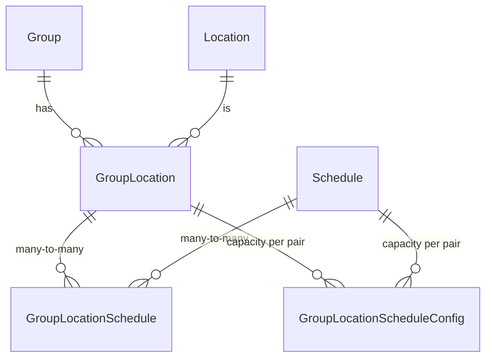

# Group Locations

## Overview

`GroupLocation` ties a Group to a Location with optional schedules and per-(location, schedule) capacity. The same entity backs three different use cases: a check-in classroom, a small-group meeting place, and a Family Group's home address. The GroupType decides which use case applies through `LocationSelectionMode` and `GroupTypeLocationType` restrictions.

## Mental Model

A GroupLocation is **a Location attached to a Group with a purpose**. The purpose comes from `GroupLocationTypeValueId` (a DefinedValue: "Home", "Meeting Location", "Previous", etc.). Schedules can hang off the location, and capacity policy can hang off each (location, schedule) pair.

Three GroupTypes use the same entity for very different things:

- **Family Groups** use it for addresses. `IsMailingLocation` and `IsMappedLocation` flags decide which address goes on labels and maps.
- **Small Groups and meeting groups** use it for "where do we meet" with optional schedules.
- **Check-in classrooms** use it for "which physical room hosts this Group" with schedules driving when check-in is open.

Capacity is not a property of the Group, the Location, or the Schedule alone; it is a property of the **combination**. `GroupLocationScheduleConfig` is keyed on `(GroupLocationId, ScheduleId)` and holds `MinimumCapacity`, `DesiredCapacity`, `MaximumCapacity`, plus per-pair messaging additions for confirmation and reminder communications.

## What You Need to Know

**Capacity lives on the (location, schedule) pair, not the Group.** A classroom that runs at different capacities on different services has one `GroupLocationScheduleConfig` row per service. The Group Scheduler reads these configs to know how many volunteers to fill each slot with.

**`AllowMultipleLocations` is a GroupType setting enforced by UI/service paths.** Direct EF inserts can violate it. If you write code that bulk-imports GroupLocations, check the GroupType first.

**`GroupTypeLocationType` only restricts when present.** A GroupType with no `GroupTypeLocationType` rows accepts any `GroupLocationTypeValueId`. New admins assume "no rows configured" means "no locations allowed"; it actually means the opposite.

**Active-detection requires three checks.** A "live" GroupLocation needs the row to exist, the parent Group to be active and not archived, and the Location to be active. Use the `WhereDeducedIsActive()` extension rather than rolling your own; the extensions encapsulate the joint check.

**`GroupLocationCache` has an alternate index that can stale.** `AllForLocationId(locationId)` returns all GroupLocations for a Location, backed by an internal index. The standard save-hook path keeps the index fresh; raw SQL or `BulkUpdate` paths do not. Call `ClearByLocationId` after non-standard mutations to a `GroupLocation.LocationId`.

**Family Group address management is just GroupLocation editing.** When a UI lets a person edit their addresses, it is editing GroupLocation rows on their Family Group. The Group save hook recomputes `Person.PrimaryCampusId` when a Family Group's `CampusId` changes via `_FamilyCampusIsChanged`.

**`IsMailingLocation` and `IsMappedLocation` are not mutually exclusive.** Both can be true on the same row, both can be true on multiple rows. UI flows typically enforce a single primary; service-level flows do not. If you write code that picks "the" mailing address, decide what to do when multiple are flagged.

**Non-named locations cache for only 10 minutes.** `GroupLocationCache` keeps named locations indefinitely (until invalidated) but expires non-named ones after 10 minutes. This is fine for read-heavy correctness but means cache hits are not guaranteed for ad-hoc geocoded addresses.

## Common Scenarios

**"Add a new location to a small group."** Insert a `GroupLocation` row with the Group, the Location, and a `GroupLocationTypeValueId` from `GROUP_LOCATION_TYPE`. Attach Schedules through the many-to-many. If the group's GroupType requires capacity, also create `GroupLocationScheduleConfig` rows.

**"Find every active GroupLocation for a Location."** `groupLocationService.Queryable().Where(gl => gl.LocationId == id).WhereDeducedIsActive()`.

**"Set capacity for a check-in classroom on Sunday at 9am."** Find the `GroupLocation` for the classroom Group, find the 9am `Schedule`, upsert a `GroupLocationScheduleConfig` row with the desired capacity values.

**"Detect when a Family Group's address changed."** Watch GroupLocation save hooks on Family Groups. The Group save hook handles campus recomputation; address-change detection is the business of the consuming code.

## Key Architectural Decisions

### One entity for many use cases

Family addresses, small group meeting places, and check-in classrooms share a schema. The cost is some flags that are mutually irrelevant per use case (`IsMailingLocation` and `IsOverflowLocation` exist on every row). The benefit is one schema for every consumer: mapping, scheduling, attendance, and reports all speak the same language.

### Capacity on the (Location, Schedule) pair

Capacity varies by combination. Modeling it on the pair lets the same classroom run at 30 capacity for 9am service and 50 for 11am without duplicating the Location.

### Location selection delegated to the GroupType

`LocationSelectionMode` lets the GroupType decide which UI to present. The same `GroupLocation` schema works for everything from "pick your home address" to "draw a polygon for this small group's territory".

## Considered but Rejected

### Per-Group capacity overrides
Rejected. Capacity already varies by `(Group, Location, Schedule)`; another per-Group dimension would not improve expressiveness and would complicate the scheduler.

### Hard-deleting GroupLocation rows on Group archive
Rejected. Archived Groups still have addresses on file (especially Family Groups). GroupLocation rows persist alongside their Group; they vanish from default queries via the Group's archive filter.

## Technical Reference

### Data Model

`GroupLocation` ([Rock/Model/Group/GroupLocation/GroupLocation.cs](../../Rock/Model/Group/GroupLocation/GroupLocation.cs)).

Required FKs:
- `GroupId`. Cascade delete from Group.
- `LocationId`. Cascade delete from Location.

Type and behavior: `GroupLocationTypeValueId` (DefinedValue from `GROUP_LOCATION_TYPE`, nullable, non-cascade), `IsMailingLocation`, `IsMappedLocation`, `IsOverflowLocation`.

Optional Person link: `GroupMemberPersonAliasId` (cascade delete from PersonAlias). Set when `LocationSelectionMode = GroupMember` records that the location was selected from a specific group member's address.

Display: `Order` (required).

Collections: `Schedules` (many-to-many through `GroupLocationSchedule`), `GroupLocationScheduleConfigs` (one-to-many, cascade delete).

`GroupLocationScheduleConfig` ([Rock/Model/Group/GroupLocation/GroupLocationScheduleConfig.cs](../../Rock/Model/Group/GroupLocation/GroupLocationScheduleConfig.cs)). Composite PK `(GroupLocationId, ScheduleId)`. Holds:

- `MinimumCapacity`, `DesiredCapacity`, `MaximumCapacity` (nullable ints).
- `ConfirmationAdditionalDetails`, `ReminderAdditionalDetails`. Lava-friendly text for the standard communications.
- `ConfigurationName` (max 100).

Cascade delete from both `GroupLocation` and `Schedule`.

`GroupTypeLocationType` ([Rock/Model/Group/GroupTypeLocationType/GroupTypeLocationType.cs](../../Rock/Model/Group/GroupTypeLocationType/GroupTypeLocationType.cs)). Composite PK `(GroupTypeId, LocationTypeValueId)`. Restricts which DefinedValues from `GROUP_LOCATION_TYPE` are valid for Groups of the parent GroupType. No rows means no restriction.

### Selection Modes

`GroupType.LocationSelectionMode`:

| Mode | Behavior |
|---|---|
| `Location` | Pick a named Location from the location tree. |
| `Address` | Enter an address; resolves to or creates a Location row. |
| `Point` | Lat/long picker. |
| `Polygon` | Geofence picker. |
| `GroupMember` | Pick from a Group member's addresses. Sets `GroupMemberPersonAliasId`. |

### Filtering Helpers

[Rock/Model/Group/GroupLocation/GroupLocationExtensions.cs](../../Rock/Model/Group/GroupLocation/GroupLocationExtensions.cs):

- `WhereHasActiveGroup()`. Filter to `gl.Group.IsActive == true`.
- `WhereHasActiveLocation()`. Filter to `gl.Location.IsActive == true`.
- `WhereDeducedIsActive()`. Both ANDed.

### Caching

`GroupLocationCache` ([Rock/Web/Cache/Entities/GroupLocationCache.cs](../../Rock/Web/Cache/Entities/GroupLocationCache.cs)):

- Caches `GroupId`, `LocationId`, the type/flag fields, `ScheduleIds` (list of int).
- Lazy `Location` (via `NamedLocationCache`) and `Schedules` (via `ScheduleCache`).
- TTL: named locations get standard lifespan; non-named get 10 minutes ([line 55](../../Rock/Web/Cache/Entities/GroupLocationCache.cs)).
- Alternate index `_byLocationIdCache` accessed via `AllForLocationId(locationId)` ([line 127](../../Rock/Web/Cache/Entities/GroupLocationCache.cs)). Maintained by `UpdateCachedEntity(GroupLocation, EntityState)` ([line 206](../../Rock/Web/Cache/Entities/GroupLocationCache.cs)). Custom code that bypasses the save hook must call `ClearByLocationId` ([line 284](../../Rock/Web/Cache/Entities/GroupLocationCache.cs)).

### Affected Blocks and UI Surfaces

- **Group Detail "Locations" panel** (still WebForms in some shipped versions).
- **Check-in admin UIs.** Configure classrooms with schedules and capacities.
- **Family Edit and Person Detail.** Address management implemented as GroupLocation edits on the Family Group.
- **Group Scheduler** ([Rock.Blocks/Group/Scheduling/GroupScheduler.cs](../../Rock.Blocks/Group/Scheduling/GroupScheduler.cs)). Reads `GroupLocationScheduleConfig` for capacity targets.
- **Group Attendance Detail** ([Rock.Blocks/Group/GroupAttendanceDetail.cs](../../Rock.Blocks/Group/GroupAttendanceDetail.cs)).

### Extension Points

- **Custom location types.** Add DefinedValue rows to `GROUP_LOCATION_TYPE` and optionally restrict per GroupType via `GroupTypeLocationType`.
- **Schedule configs.** Per-(location, schedule) capacity and messaging is the supported tuning point for scheduler behavior.

### File Index

- [Rock/Model/Group/GroupLocation/](../../Rock/Model/Group/GroupLocation/)
- [Rock/Model/Group/GroupTypeLocationType/](../../Rock/Model/Group/GroupTypeLocationType/)
- [Rock/Web/Cache/Entities/GroupLocationCache.cs](../../Rock/Web/Cache/Entities/GroupLocationCache.cs)

## Recent Impactful Changes

- **2025-10-27** ([commit `b7f1eaa9e0`](https://github.com/SparkDevNetwork/Rock/commit/b7f1eaa9e0)). `GroupLocationCache` switched to `RockApp.Current.CreateRockContext()` for testability. Behavior unchanged.
