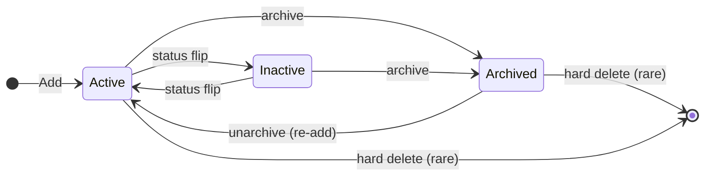

# Group Members and Roles

## Overview

A `GroupMember` is the join row that puts a `Person` into a `Group` with a specific `GroupTypeRole`. The role decides what the member can do inside the Group: lead, take attendance, view the roster, edit settings, manage other members. Membership has its own lifecycle (active, inactive, archived) independent of the Group's lifecycle.

## Mental Model

Membership is **one Person playing one role in one Group**. A single Person can hold multiple `GroupMember` rows in the same Group with different roles. Permissions ride on the role, not on the membership row, so changing what a "Leader" can do is one edit on the GroupTypeRole and applies everywhere.

Three things can happen to a member, and they are not the same:

- **Status flip** (`Active` to `Inactive`). A logical "no longer participating" while staying on the roster. Visible.
- **Archive**. A hard soft-delete that hides the row from default queries via the global `IsArchived` filter. The row still exists; it is just invisible.
- **Hard delete**. Removal of the row from the database. Cascades destroy related attendance, assignments, and history.

Most "remove" flows want archive, not delete. Re-adding a previously archived member should unarchive the existing row, not insert a new one. The historical link matters.

A `GroupMember` row carries a denormalized `GroupTypeId` so queries that filter by GroupType (volunteers, small group members) do not have to join through Group. The save hook keeps it in sync; you should never set it manually.

## What You Need to Know

**`PersonId` is a direct FK to `Person`, not `PersonAlias`.** Most "tracking who did this" columns in Rock use PersonAlias because the question is "which alias was active at the time". Membership is different: it belongs to the Person across all aliases. Audit columns on `GroupMember` (`ArchivedByPersonAliasId`) do use PersonAlias; the membership itself does not.

**The save hook runs requirement validation. Saves can throw.** Adding or modifying a member that fails an attached `GroupRequirement` raises `GroupMemberValidationException`, by design. The exception only fires when the member is being saved as not archived and not inactive: requirements are not enforced on the way out. Watch the exception log if a misconfiguration is blocking writes.

**`GroupTypeId` is denormalized.** The save hook copies it from the parent Group. Direct EF inserts that bypass `SaveChanges` will leave it null and produce wrong results in any query that filters by GroupType. Always go through the service or `RockContext.SaveChanges`.

**`DateTimeAdded` is auto-populated on insert.** If you do not set it, the save hook stamps `RockDateTime.Now`. If you do set it (e.g., a backfill that needs the historically correct date), the hook respects your value. Most code should not bother setting it.

**Re-adding an archived member: unarchive, do not insert.** Use `GroupService.GetArchivedGroupMember(group, personId, roleId)` to find the existing archived row and flip `IsArchived = false`. A new insert will succeed but loses the historical link, breaks attendance lineage, and leaves the archived row dangling. The Group Sync system follows this pattern; manual flows must too.

**Authorization defers to the parent Group.** The `EDIT` action on a GroupMember resolves to the parent Group's `EDIT` or `MANAGE_MEMBERS`. There is no per-member auth granularity. This is what makes role-based permissions simple: the role decides who can manage the roster, the GroupMember inherits.

**Default queries hide archived rows.** `GroupMemberService.Queryable()` enforces the global `IsArchived` filter. Use `.AsNoFilter()` or `GroupMemberService.GetArchived()` when you need archived rows. The most common bug here is a custom block that lists "all members ever" and silently misses the archived ones.

**Duplicate members are off by default.** `web.config` exposes `AllowDuplicateGroupMembers` (default false). When false, a Person cannot hold two rows in the same Group with the same role. When true, they can, but most Rock features (attendance, scheduling, requirements, peer network) are not designed for it. Leave it off unless you have a specific reason and have audited the consequences.

**Removing a `GroupTypeRole` while members hold it is dangerous.** The UI prevents it; raw SQL or service-level deletion does not. Orphaned `GroupMember.GroupRoleId` references are the result. If you must remove a role, move members to a different role first.

## Common Scenarios

**"Add this person to this Group as a leader."** Use `GroupMemberService.Add(member)` or `RockContext.GroupMembers.Add(member)` followed by `SaveChanges`. The save hook will denormalize `GroupTypeId`, validate requirements, populate `DateTimeAdded`, and write history.

**"Remove this person from this Group."** Set `IsArchived = true` and save. Do not hard-delete unless the row was test data.

**"Re-add a previously archived member."** Look up the archived row via `GroupService.GetArchivedGroupMember`. If found, set `IsArchived = false` and save. If not found, a new insert is appropriate.

**"Find all members of a person across all Groups, including archived."** `GroupMemberService.Queryable().AsNoFilter().Where(m => m.PersonId == personId)`.

**"Change a member's role."** Edit `GroupRoleId`. The save hook will run requirement validation against the new role; if requirements scoped to the new role fail, the save will throw. Either fix the requirements first or transition the member through inactive.

**"Disable a member without removing them."** Set `GroupMemberStatus = Inactive` and save. The hook will populate `InactiveDateTime`; the row stays visible.

## Key Architectural Decisions

### `PersonId` direct FK, not `PersonAlias`

Membership is a property of the Person across aliases. Storing an alias would require resolution on every read. Direct Person FK is simpler and faster.

### Validation on save, not on read

Requirement validation runs in the save hook and throws on failure. The database is always self-consistent: a row that exists is either valid or was archived/inactivated. Read-time consumers do not have to filter for "but is this member valid right now"; the answer is recorded.

### Role permissions on `GroupTypeRole`, not on `Group`

Five permission flags live on the role, shared across every Group of the type. This is the largest single reason large Rock deployments are administrable.

### Denormalize `GroupTypeId` on `GroupMember`

Filter-by-GroupType queries are common; joining through Group on every one of them is slow. The save hook keeps the denormalized column in sync.

## Considered but Rejected

### Direct per-member authorization rules
Rejected. Per-member auth would multiply check cost and fragment the security story. Inheriting from Group plus role permissions covers the common cases.

### `PersonAlias` instead of direct `Person` for `GroupMember.PersonId`
Rejected. Membership conceptually belongs to the Person across all aliases.

### Allowing duplicate members by default
Rejected. Most Rock features assume one membership per (Person, Group, Role). The web.config setting exists for unusual sites but is not the default.

## Technical Reference

### Data Model

`GroupMember` ([Rock/Model/Group/GroupMember/GroupMember.cs](../../Rock/Model/Group/GroupMember/GroupMember.cs)):

Required FKs:
- `GroupId`. Cascade delete from Group.
- `PersonId`. Direct FK to Person, cascade delete.
- `GroupRoleId`. References `GroupTypeRole`. Non-cascade.

Audit and metadata: `GroupTypeId` (denormalized), `DateTimeAdded` (auto on insert), `Note`, `GuestCount`, `GroupOrder` (nullable, null sorts last), `IsNotified`, `CommunicationPreference`, `IsChatMuted`, `IsChatBanned`, `IsSystem`.

Status:
- `GroupMemberStatus` (`Active` | `Inactive` | `Pending`, default `Active`).
- `InactiveDateTime` (auto on transition to Inactive).
- `IsArchived` (default false; hidden by global filter at [GroupMember.cs:381](../../Rock/Model/Group/GroupMember/GroupMember.cs)).
- `ArchivedDateTime`, `ArchivedByPersonAliasId`.

Scheduling: `ScheduleTemplateId`, `ScheduleStartDate`, `ScheduleReminderEmailOffsetDays`.

Composite index `(GroupId, GroupRoleId, GroupMemberStatus)` at [GroupMember.cs:75](../../Rock/Model/Group/GroupMember/GroupMember.cs).

`GroupTypeRole` ([Rock/Model/Group/GroupTypeRole/GroupTypeRole.cs](../../Rock/Model/Group/GroupTypeRole/GroupTypeRole.cs)) belongs to a GroupType (cascade delete). Defines:

- Display: `Name`, `Description`, `Order`, `IsSystem`.
- Behavior: `IsLeader`, `IsCheckInAllowed` (default true), `IsPublic` (default true), `IsExcludedFromPeerNetwork`, `ChatRole`.
- Permissions: `CanView`, `CanEdit`, `CanManageMembers`, `CanTakeAttendance`, `ReceiveRequirementsNotifications`.
- Capacity: `MaxCount`, `MinCount` (nullable, enforced at app layer).

### Save Hook Behavior

[GroupMember.SaveHook.cs](../../Rock/Model/Group/GroupMember/GroupMember.SaveHook.cs):

- **`GroupTypeId` denormalization** ([line 145](../../Rock/Model/Group/GroupMember/GroupMember.SaveHook.cs)). Always copied from the parent Group.
- **Requirement validation.** When the row is not deleted, not archived, and `GroupMemberStatus != Inactive`, calls `IsValidGroupMember`. Throws `GroupMemberValidationException` on failure.
- **Auto timestamps.** `DateTimeAdded` populated on insert. `InactiveDateTime` populated on transition to Inactive, cleared on transition back.
- **History entries** ([lines 156-199](../../Rock/Model/Group/GroupMember/GroupMember.SaveHook.cs)). Person and Group history for role, note, status, communication preference, guest count.

`IsValidGroupMember` ([GroupMember.Logic.cs:184](../../Rock/Model/Group/GroupMember/GroupMember.Logic.cs)) calls `base.IsValid` then `ValidateGroupMembership`, which evaluates `GroupRequirement` rows that apply to the member's `(GroupId, GroupRoleId)` and accumulates failures into `ValidationResults`. Internal escape hatch `IsSkipRequirementsCheckingDuringValidationCheck` for archival flows.

### Service Methods

[GroupMemberService.cs](../../Rock/Model/Group/GroupMember/GroupMemberService.cs):

- `GetArchived()` ([line 85](../../Rock/Model/Group/GroupMember/GroupMemberService.cs)). `AsNoFilter().Where(IsArchived == true)`.
- `Queryable(includeDeceased, includeArchived)` ([line 122](../../Rock/Model/Group/GroupMember/GroupMemberService.cs)). Parametric helper.
- `GetPerson(groupMemberId)` ([line 65](../../Rock/Model/Group/GroupMember/GroupMemberService.cs)). Uses `AsNoFilter()` to fetch even archived members' Person.

[GroupService.cs](../../Rock/Model/Group/Group/GroupService.cs):

- `GetArchivedGroupMember(group, personId, roleId)` ([line 1805](../../Rock/Model/Group/Group/GroupService.cs)). Most recent archived row.
- `ExistsAsArchived(group, personId, roleId, out GroupMember)` ([line 1791](../../Rock/Model/Group/Group/GroupService.cs)).
- `ExistsAsMember(group, personId, roleId, out GroupMember)` ([line 1832](../../Rock/Model/Group/Group/GroupService.cs)). Uses `AsNoFilter`.
- `AllowsDuplicateMembers()` ([line 1818](../../Rock/Model/Group/Group/GroupService.cs)). Reads web.config.

### Affected Blocks and UI Surfaces

- **Group Member List** ([Rock.Blocks/Group/GroupMemberList.cs](../../Rock.Blocks/Group/GroupMemberList.cs)).
- **Group Member Detail** (still WebForms in some shipped versions). Per-member editor.
- **Group Type Detail roles tab** ([Rock.JavaScript.Obsidian.Blocks/src/Group/GroupTypeDetail/roles.partial.obs](../../Rock.JavaScript.Obsidian.Blocks/src/Group/GroupTypeDetail/roles.partial.obs)).
- **Group Member Schedule Template Detail and List** ([Rock.Blocks/Group/GroupMemberScheduleTemplateDetail.cs](../../Rock.Blocks/Group/GroupMemberScheduleTemplateDetail.cs), [Rock.Blocks/Group/Scheduling/GroupMemberScheduleTemplateList.cs](../../Rock.Blocks/Group/Scheduling/GroupMemberScheduleTemplateList.cs)).

### Extension Points

- **Custom GroupMember attributes.** Defined on the GroupType when `AllowSpecificGroupMemberAttributes` is true.
- **Member workflow triggers.** `GroupMemberWorkflowTrigger` rows on the GroupType launch workflows on member events.
- **Communication preference.** Per-member preference for email/SMS overrides Person-level preference within Group communications.

### File Index

- [Rock/Model/Group/GroupMember/](../../Rock/Model/Group/GroupMember/)
- [Rock/Model/Group/GroupTypeRole/](../../Rock/Model/Group/GroupTypeRole/)
- [Rock/Model/Group/GroupMemberWorkflowTrigger/](../../Rock/Model/Group/GroupMemberWorkflowTrigger/)

## Recent Impactful Changes

- **2025** ([commit `bbfdb9f3b4`](https://github.com/SparkDevNetwork/Rock/commit/bbfdb9f3b4)). Edge-case GroupMember validation moved to async to avoid blocking saves.
- **2025** ([commit `fa351ab9a9`](https://github.com/SparkDevNetwork/Rock/commit/fa351ab9a9)). `GroupMemberDetail` reduced redundant `PersonMeetsGroupRequirements` calls.
- **2025-08-12** ([commit `4c4ef121b4`](https://github.com/SparkDevNetwork/Rock/commit/4c4ef121b4)). Obsidian Group Type Detail correctly persists `GroupTypeRole` attribute values and security checks.
- **2025** ([commit `7d26eea4be`](https://github.com/SparkDevNetwork/Rock/commit/7d26eea4be)). Group Placement "Date Added" sort uses `DateTimeAdded` correctly.
