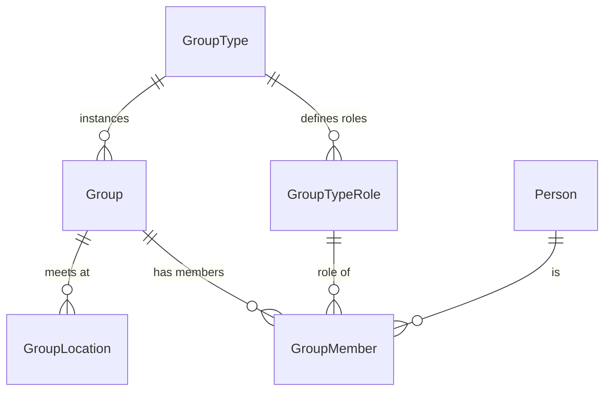

# Groups Domain Overview

## Overview

Groups are Rock's universal "people in a relationship" container. Families are Groups. Small groups, volunteer teams, security roles, communication lists, and check-in classrooms are all Groups. Most of Rock is built on top of this domain. If you are working anywhere near membership, attendance, scheduling, or check-in, you are working with Groups.

This is the orientation doc. Read this first, then jump to the subsystem-specific docs as needed.

## Mental Model

Think of Groups as **runtime instances** of a **template** called `GroupType`. The GroupType is where almost all the configuration lives: terminology, attendance behavior, scheduling rules, allowed locations, chat policy. Individual `Group` rows hold runtime state and a small number of overrides. This is what makes Rock administrable: a single edit on "Small Group" GroupType changes how every small group in the system behaves.

A `GroupMember` is the join row that puts a `Person` into a `Group` in a specific role (`GroupTypeRole`). The role is where permissions live: a "Leader" role with `CanManageMembers = true` is what lets a small-group leader manage their own roster without the admin having to set up per-Group security.

Three big systems hang off this core: **Requirements** (eligibility rules per member), **Sync** (DataView-driven membership), and **Scheduling/Attendance** (volunteer scheduling and presence tracking). Each of those has its own doc.

The other piece worth internalizing up front: in Rock, "delete" is rarely the right word. Groups and GroupMembers have an `IsArchived` flag with a global query filter that hides archived rows by default. Archive is the supported "make it go away" path; hard delete is reserved for rows that should never have been written.

## What You Need to Know

**`IsArchived` and `IsActive` are independent.** They look similar but mean different things. `IsActive = false` is a logical "not in use right now"; the row stays visible. `IsArchived = true` is a hard soft-delete; the row vanishes from default queries via a Z.EntityFramework.Plus global filter. Most queries filter `IsArchived` for you whether you remember it or not. To see archived rows, you must explicitly call `.AsNoFilter()` on the queryable. Forgetting this is the most common Group-domain bug.

**Save hooks own a lot.** `Group.SaveHook` and `GroupMember.SaveHook` do real work: cascade `IsActive` changes to members, populate `InactiveDateTime` and `ArchivedDateTime` automatically, run requirement validation, write history, sanitize family group names, and bulk-clean attendance and assignments on delete. **Direct EF updates that bypass `SaveChanges` skip all of this** and produce inconsistent state. Always go through the service layer or `RockContext.SaveChanges`.

**Configuration lives on `GroupType`, not on `Group`.** If you want to change "how do small groups behave", you almost always edit the GroupType. The per-Group overrides that exist (chat, scheduling) are deliberate exceptions, not the default extension point. New developers reach for per-Group settings; the team consistently pushes back toward type-level configuration.

**Permissions are role-based.** `GroupTypeRole.CanView`, `CanEdit`, `CanManageMembers`, and `CanTakeAttendance` are the source of truth for "what can a leader of this group do". Authorization checks consult these flags via `GroupCache`, which mirrors the model's security behavior exactly. Custom auth rules per Group exist but are rare and discouraged.

**Hierarchy comes in two flavors.** `Group` has `ParentGroupId`, a tree. `GroupType` has many-to-many `ChildGroupTypes` / `ParentGroupTypes`, a directed graph. Both are cycle-protected, but the protection happens at save or traversal time, not at the schema level. Do not assume the database will catch you; the application has to.

**Family Groups are special.** Most behavior is generic, but family-group save hooks sanitize names (strip emoji and special-font characters) and trigger `Person.PrimaryCampusId` recomputation when the family campus changes. If you write code that touches Groups, check the GroupType first; family-group code paths frequently behave differently from the default.

## Common Scenarios

**"Remove this Group from production."** Use `GroupService.Archive(group, personAliasId, removeFromAuthTables)`. Hard delete only for test data that was never real. Archive preserves attendance, history, peer network, and reporting.

**"Find archived members of a Group."** Use `GroupMemberService.GetArchived()` or `Queryable().AsNoFilter().Where(m => m.IsArchived)`. The default `.Queryable()` will return zero archived rows.

**"Add a member who used to be archived in this Group."** Find the existing archived row via `GroupService.GetArchivedGroupMember(group, personId, roleId)` and unarchive it. Do not insert a new row. The Sync system does this automatically; manual flows should mirror the pattern.

**"Change how every Group of type X behaves."** Edit the GroupType. Do not write per-Group changes in a loop.

**"Walk the parent hierarchy of a Group."** Be careful: `ParentGroup` is a navigation property, not cycle-protected, and the parent can be archived. Use `GroupService` queries with `AsNoFilter()` if archived ancestors matter; trust the save-hook check on writes.

## Key Architectural Decisions

### Configuration on the type, runtime state on the row

The vast majority of behavior decisions live on `GroupType`, shared across every Group of that type. Per-Group overrides exist only for chat and scheduling because those were the dimensions where real per-Group needs surfaced. New configuration should default to type-level until proven otherwise.

### Archive as the default soft-delete

Hard delete cascades through attendance, history, peer network, and reporting. Archive preserves referential integrity at near-zero query cost because the global filter hides archived rows. Always reach for archive first.

### Save hooks own derived state

`InactiveDateTime`, `ArchivedDateTime`, member status cascades, family campus recomputation, history entries, and bulk cleanup on delete all live in the save hooks, not in callers. This is what keeps the database self-consistent against direct EF updates that go through `SaveChanges`. The cost is that any code which bypasses `SaveChanges` (raw SQL, `BulkUpdate`) skips this logic.

### Role permissions on `GroupTypeRole`

Five permission flags (`CanView`, `CanEdit`, `CanManageMembers`, `CanTakeAttendance`, `ReceiveRequirementsNotifications`) are properties of the role, not of the Group or the Person. This is the single most important reason large Rock deployments are administrable.

## Considered but Rejected

### Hard delete as the primary "remove" path
Rejected. The amount of FK churn required to delete a Group cleanly across attendance, history, peer network, communication, registration, and check-in makes it operationally fragile. Archive is correct.

### Per-Group security configuration as the default
Rejected. Most authorization questions are answered by "what role does this person hold in this Group?", not by custom per-Group rules. Role-based permissions on `GroupTypeRole` keep the common case configurable in one place.

## Technical Reference

### Data Model

The full set of entities under `Rock/Model/Group/`:

| Entity | Purpose |
|---|---|
| `Group` | The container. |
| `GroupType` | Template defining shared configuration. See [group-types.md](group-types.md). |
| `GroupTypeRole` | Role within a GroupType, with permission flags. |
| `GroupMember` | Person + Group + Role join row. See [group-members-and-roles.md](group-members-and-roles.md). |
| `GroupMemberAssignment` | Scheduled position for a member. See [group-scheduling.md](group-scheduling.md). |
| `GroupMemberScheduleTemplate` | Recurring availability template. |
| `GroupMemberRequirement` | Per-member requirement evaluation result. See [group-requirements.md](group-requirements.md). |
| `GroupMemberWorkflowTrigger` | Workflow launches on member events. |
| `GroupRequirement` | Binding of a requirement type to a Group/GroupType. |
| `GroupRequirementType` | Reusable requirement rule. |
| `GroupLocation` | Location attached to a Group. See [group-locations.md](group-locations.md). |
| `GroupLocationScheduleConfig` | Capacity per (location, schedule) pair. |
| `GroupTypeLocationType` | Allowed location types per GroupType. |
| `GroupSync` | DataView-driven membership. See [group-sync.md](group-sync.md). |
| `GroupHistorical` | Group SCD-2 snapshot. See [group-history.md](group-history.md). |
| `GroupMemberHistorical` | GroupMember SCD-2 snapshot. |
| `GroupLocationHistorical` | GroupLocation SCD-2 snapshot. |
| `GroupScheduleExclusion` | GroupType-wide blackout dates. |
| `PersonScheduleExclusion` | Person-scoped blackout dates. |
| `GroupDemographicType` / `GroupDemographicValue` | Demographic trait template + value. |
| `PeerNetwork` | Inferred peer relationships from shared membership. |

Group key columns ([Rock/Model/Group/Group/Group.cs](../../Rock/Model/Group/Group/Group.cs)): `GroupTypeId`, `ParentGroupId`, `CampusId`, `ScheduleId`, `IsActive`, `InactiveDateTime`, `IsArchived`, `ArchivedDateTime`, `ArchivedByPersonAliasId`, `IsSystem`, `Order`, `GroupCapacity`, plus chat and scheduling override flags.

The Z.EntityFramework.Plus global query filter is registered in `GroupConfiguration` ([Group.cs:938](../../Rock/Model/Group/Group/Group.cs)) and excludes `IsArchived = true` from every default query. The filter does not propagate through navigation properties: `someGroup.ParentGroup` returns the parent regardless of its archive state.

### Save Hook Behavior

[Rock/Model/Group/Group/Group.SaveHook.cs](../../Rock/Model/Group/Group/Group.SaveHook.cs):

- **Pre-save (Added)**: family-group name sanitization (strip emoji and special-font glyphs); History logging for `Name`, `Description`, `GroupTypeId`, `CampusId`, `IsSecurityRole`, `IsActive`, `AllowGuests`, `IsPublic`, `GroupCapacity`; auto-set `InactiveDateTime` if inserting inactive.
- **Pre-save (Modified)**: when `IsActive` flips, cascade to members via `UpdateGroupMembersActiveStatusFromGroupStatus()`; when `IsArchived` flips, cascade via `UpdateGroupMembersArchivedValueFromGroupArchivedValue()`; when a family Group's `CampusId` changes, set `_FamilyCampusIsChanged` for downstream `Person.PrimaryCampusId` recompute.
- **Pre-save (Deleted)**: manual delete of `GroupRequirement` rows (no cascade); `BulkUpdate` of `Attendance.SearchResultGroupId` to null; `BulkDelete` of `Attendance` rows where `Occurrence.GroupId == Entity.Id`; `BulkDelete` of `GroupMemberAssignment` rows.

### Service Methods

`GroupService` ([Rock/Model/Group/Group/GroupService.cs](../../Rock/Model/Group/Group/GroupService.cs)):

- `GetArchived()` ([line 77](../../Rock/Model/Group/Group/GroupService.cs)): `AsNoFilter().Where(IsArchived == true)`.
- `Archive(group, personAliasId, removeFromAuthTables)` ([line 1763](../../Rock/Model/Group/Group/GroupService.cs)): supported soft-delete path. Sets archive flags; if security role and `removeFromAuthTables`, deletes `Auth` rows and clears the auth cache.
- `ExistsAsArchived(group, personId, roleId, out GroupMember)` ([line 1791](../../Rock/Model/Group/Group/GroupService.cs)): check for archived membership.
- `GetArchivedGroupMember(group, personId, roleId)` ([line 1805](../../Rock/Model/Group/Group/GroupService.cs)): most recent archived member row.
- `ExistsAsMember(group, personId, roleId, out GroupMember)` ([line 1832](../../Rock/Model/Group/Group/GroupService.cs)): uses `AsNoFilter()` to check both archived and active.
- `AllowsDuplicateMembers()` ([line 1818](../../Rock/Model/Group/Group/GroupService.cs)): reads web.config `AllowDuplicateGroupMembers`, default false.

### Caching

Four cache classes back the domain: `GroupCache`, `GroupTypeCache`, `GroupTypeRoleCache`, `GroupLocationCache`. They are process-wide singletons that mirror the model's security behavior. See [group-caching.md](group-caching.md).

### File Index

- Entities: [Rock/Model/Group/](../../Rock/Model/Group/)
- C# blocks: [Rock.Blocks/Group/](../../Rock.Blocks/Group/)
- Obsidian blocks: [Rock.JavaScript.Obsidian.Blocks/src/Group/](../../Rock.JavaScript.Obsidian.Blocks/src/Group/)
- Caches: [Rock/Web/Cache/Entities/Group*.cs](../../Rock/Web/Cache/Entities/)
- Jobs: [Rock/Jobs/CalculateGroupRequirements.cs](../../Rock/Jobs/CalculateGroupRequirements.cs), [GroupSync.cs](../../Rock/Jobs/GroupSync.cs), [SendSignUpReminders.cs](../../Rock/Jobs/SendSignUpReminders.cs), [ProcessGroupHistory.cs](../../Rock/Jobs/ProcessGroupHistory.cs)

## Recent Impactful Changes

- **2026-03-13** ([commit `dd7e1d45c8`](https://github.com/SparkDevNetwork/Rock/commit/dd7e1d45c8)). `ISecured` mirroring on cache classes (including `GroupCache`) closed an authorization-mismatch class of bugs.
- **2025-10-16** ([commit `e16e7506a7`](https://github.com/SparkDevNetwork/Rock/commit/e16e7506a7)). `Group.Logic.cs` security checks now use `GroupCache` for parent authority.
- **2025-08-20** ([commit `544d4f8587`](https://github.com/SparkDevNetwork/Rock/commit/544d4f8587)). Group Registration block now refuses to register against archived groups.
- **2024-08** ([commit `f4c1cd8708`](https://github.com/SparkDevNetwork/Rock/commit/f4c1cd8708)). Reactivating very large Groups no longer times out.
- **2024** ([commit `bbfdb9f3b4`](https://github.com/SparkDevNetwork/Rock/commit/bbfdb9f3b4)). Edge-case GroupMember validation moved to async to avoid blocking saves.
