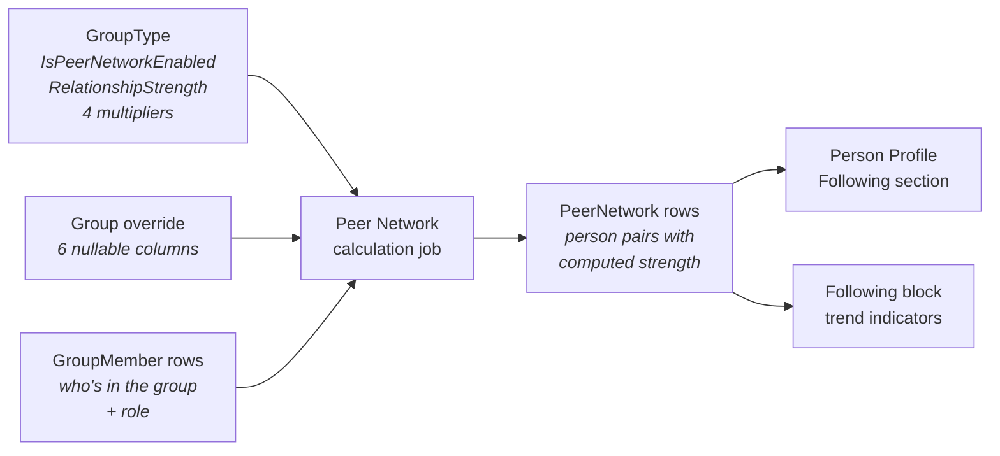

# Peer Network

## Overview

Peer Network is the system that infers relationship strength scores between people from their shared Group memberships. Each GroupType declares whether it contributes to the network and how strong its relationships are. Individual Groups can override those settings. Background jobs compute a `PeerNetwork` row per Person-pair with a score, a trend, and a relationship type, which the Person Profile and other surfaces use to render "who knows whom" insights.

## Why It Exists

A church operating at scale wants to act on real relationships: a Connection request can be routed to someone who actually knows the prospect, a leader can be notified when a person they're close to needs prayer, a small-group invitation can prioritize the inviter's strongest network. Rock had no way to express "these two people share a strong connection through serving on the same team for three years" until Peer Network was added. The feature ([commit `aa9094d69d`](https://github.com/SparkDevNetwork/Rock/commit/aa9094d69d), 2024-11-15) introduced the entity, the calculation job, and the per-GroupType + per-Group configuration model.

## Mental Model

Three layers:

- **GroupType configuration.** The GroupType holds the baseline: `IsPeerNetworkEnabled` (does this type contribute at all?), `RelationshipStrength` (how strong is the default?), `RelationshipGrowthEnabled` (does the score grow with time-in-group?), and four `*RelationshipMultiplier` decimals (modify the score based on the role pair: leader-to-leader, leader-to-non-leader, etc.).
- **Group override.** A single Group can override any of those six values via paired nullable columns (`*Override`). Null inherits from the GroupType; any non-null value overrides. The override checkbox in the UI is a UX convenience that bundles all six overrides on or off as a group.
- **Inferred peer pairs.** The `PeerNetwork` entity is the materialized output: one row per (`SourcePerson`, `TargetPerson`, `RelationshipType`) with timestamps and a computed strength. Background calculation reads memberships, applies the strength + multipliers, and writes rows. Consumers (Person Profile, scoring blocks) read these rows.

The strength values come from a small enum ([Rock.Enums/Group/RelationshipStrength.cs:25](../../Rock.Enums/Group/RelationshipStrength.cs)): `None = 0`, `Casual = 5`, `Close = 10`, `Deep = 20`. The integer-valued enum is what gets multiplied; the multipliers modify the integer to produce the final score recorded on `PeerNetwork`.

## What You Need to Know

**The override checkbox is a UX device, not a column.** The Group Detail block exposes "Override Relationship Strength" as a single checkbox. When checked, the user fills in any combination of the six override fields. When unchecked, the save flow CLEARS all six overrides as a single bundle. There is no per-field "stop overriding" UX. If you write code that mutates one override programmatically, decide whether to keep the others or clear them; the UI does the latter.

**Multipliers are stored 0.0 to 1.0, displayed 0% to 100%.** The Group Detail UI converts the text input through `AsDecimalPercentageOrNull(0, 100)` so users see and type whole-number percents. The underlying column is `decimal?` in fractional form. Default is `1.0` (full strength). A multiplier of `0` removes the relationship strength between that role pair entirely; `0.5` halves it.

**`1.0` everywhere on the override means "reset to type defaults" implicitly.** `Group.AreAnyRelationshipMultipliersCustomized` ([Group.Logic.cs:146](../../Rock/Model/Group/Group/Group.Logic.cs)) treats all four multipliers being `1m` as "not customized" and returns false, even though the columns are technically populated. This is a defensive behavior so a user who toggled off custom multipliers doesn't surface a misleading "customized" indicator.

**Overrides are ignored when the GroupType disables peer network.** If `GroupType.IsPeerNetworkEnabled = false`, the calculation job skips the GroupType entirely. Any override values stored on Groups of that type sit dormant but don't cause harm; flipping the GroupType back on resurfaces the overrides without re-entering them.

**Strength is integer-valued via the enum, not free-form.** A Group's `RelationshipStrengthOverride` is `int?`, but the legal values come from the `RelationshipStrength` enum (0, 5, 10, 20). The calculation engine doesn't validate this — a Group set to `RelationshipStrengthOverride = 7` would store 7 and use it in calculations. Stick to the enum values to keep scoring meaningful across Groups.

**`IsOverridingGroupTypePeerNetworkConfiguration` is a computed property.** Don't store it; it's `[NotMapped]`. It returns true when ANY single override column differs from the GroupType's corresponding value ([Group.Logic.cs:84](../../Rock/Model/Group/Group/Group.Logic.cs)). The view-mode chip on Group Detail uses it to render a "this Group overrides the type" indicator.

**Calculation runs on a job, not on save.** Editing override values does not update `PeerNetwork` rows synchronously. The next scheduled run picks up the changes. If you need a synchronous test ("is the calculation correct"), run the job manually from Job Administration or wait for the cycle.

**`GroupTypeRole.IsExcludedFromPeerNetwork` removes a role from the calculation entirely.** A role marked excluded contributes no peer connections. Useful for "Visitor" or "Pending" roles where membership shouldn't imply a relationship yet.

**`PeerNetwork` rows are not directly editable from the UI.** They're outputs of the calculation, not configuration. Consumers read them; the job writes them. Manual `INSERT` or `UPDATE` against the table will be overwritten on the next run.

## Common Scenarios

**"Enable peer network for a single small group when the GroupType has it disabled."** You can't, directly. The GroupType-level `IsPeerNetworkEnabled` is the hard gate. If the GroupType disables peer network, no Group of that type contributes regardless of overrides. Enable it on the GroupType.

**"Make one Small Group's relationships count as Deep instead of the type's default Close."** Set `Group.RelationshipStrengthOverride = (int)RelationshipStrength.Deep`. Confirm `Group.IsOverridingGroupTypePeerNetworkConfiguration` becomes true on the next read. The override applies on the next calculation cycle.

**"Halve the score between non-leaders in a particular Group."** Set `Group.NonLeaderToNonLeaderRelationshipMultiplierOverride = 0.5m`. The leader-related multipliers stay null (inherit the type's defaults). Non-leader pairs in this Group will score at half the relationship strength.

**"Reset a Group to inherit all type defaults."** Set all six override columns to null. The Group will revert to the GroupType's values on the next calculation cycle. The UI's "Override" checkbox unchecked is the equivalent.

**"See whether a Group has any custom peer-network settings without comparing every column."** Call `Group.IsOverridingGroupTypePeerNetworkConfiguration` ([Group.Logic.cs:84](../../Rock/Model/Group/Group/Group.Logic.cs)). It walks the six override columns and returns true if any differ from the GroupType.

**"Exclude a specific role from contributing to peer connections."** Set `GroupTypeRole.IsExcludedFromPeerNetwork = true`. Members holding that role generate no peer rows on the next calculation.

## Key Architectural Decisions

### GroupType is the gate; Group is the override

`IsPeerNetworkEnabled` on GroupType is non-overridable. A Group whose type disables peer network cannot opt back in. This keeps the global "what GroupTypes contribute" decision in one place; per-Group exception management would have made the calculation job's GroupType selection ambiguous.

### Six independent override columns, one UX checkbox

The override columns are individually nullable on the entity, but the UI bundles them into a single "Override Relationship Strength" checkbox + a form section. Checking the box reveals the form; unchecking clears all six overrides. This trades expressiveness (you can't "override only the strength but leave multipliers inheriting via the UI") for simplicity. Service callers retain full per-column control.

### Multipliers default to `1.0` for "do not modify"

Storing the default as `1.0` instead of null means the calculation engine can multiply unconditionally without a "did the user set this?" check. The cost is the slightly odd "all 1.0 = not customized" rule on `AreAnyRelationshipMultipliersCustomized`. The benefit is one calculation path instead of two.

### `PeerNetwork` rows are calculation outputs, not editable

The entity exists to let consumers (Person Profile, scoring blocks) read computed relationships without re-running the math each time. Treating it as an input would create two sources of truth and make the calculation job authoritative-but-also-not.

## Considered but Rejected

### Per-Group `IsPeerNetworkEnabled` override
Rejected. Letting a Group opt into peer network when the GroupType opts out would have created ambiguous job-selection semantics (does the job walk every Group looking for overrides, or only GroupTypes?). Keeping the gate at the GroupType keeps the job's input set bounded.

### Per-member `RelationshipStrength` override
Rejected. The strength is a property of "the kind of relationship Groups of this type create", not "the kind of person this is". Per-member overrides would have collapsed peer scoring into per-row tuning and lost the GroupType-level invariant.

### Real-time recomputation on member changes
Rejected. The calculation walks many groups and many members; running it inline on every membership change would make `GroupMember.SaveHook` slow. The scheduled-job model keeps writes fast and accepts a short eventual-consistency window.

## Technical Reference

### Data Model

`PeerNetwork` ([Rock/Model/Group/PeerNetwork/PeerNetwork.cs](../../Rock/Model/Group/PeerNetwork/PeerNetwork.cs)):

| Column | Type | Purpose |
|---|---|---|
| `Id` | `long` | PK. `long` because the table can grow large. |
| `SourcePersonId` | `int` | One side of the relationship. Direct FK to Person, not PersonAlias. |
| `TargetPersonId` | `int` | The other side. |
| `RelationshipTypeValueId` | `int` | DefinedValue from `PEER_NETWORK_RELATIONSHIP_TYPE`. Distinguishes "Following", "GroupShared", etc. |
| `RelationshipStartDate` / `RelationshipEndDate` | `Date` | When the inferred relationship started / ended. |
| `RelationshipScore` | `decimal` | Computed strength. |
| `RelationshipTrend` | `int` | Direction indicator (growing / steady / declining). |

`Group` peer-network override columns ([Rock/Model/Group/Group/Group.cs](../../Rock/Model/Group/Group/Group.cs)):

| Column | Type | Line | Purpose |
|---|---|---|---|
| `RelationshipGrowthEnabledOverride` | `bool?` | [522](../../Rock/Model/Group/Group/Group.cs) | Override of `GroupType.RelationshipGrowthEnabled`. |
| `RelationshipStrengthOverride` | `int?` | [531](../../Rock/Model/Group/Group/Group.cs) | Override of `GroupType.RelationshipStrength`. Values from `RelationshipStrength` enum. |
| `LeaderToLeaderRelationshipMultiplierOverride` | `decimal?` | [541](../../Rock/Model/Group/Group/Group.cs) | Override of the corresponding GroupType multiplier. |
| `LeaderToNonLeaderRelationshipMultiplierOverride` | `decimal?` | [551](../../Rock/Model/Group/Group/Group.cs) | Same. |
| `NonLeaderToNonLeaderRelationshipMultiplierOverride` | `decimal?` | [561](../../Rock/Model/Group/Group/Group.cs) | Same. |
| `NonLeaderToLeaderRelationshipMultiplierOverride` | `decimal?` | [571](../../Rock/Model/Group/Group/Group.cs) | Same. |

`GroupType` peer-network columns ([Rock/Model/Group/GroupType/GroupType.cs](../../Rock/Model/Group/GroupType/GroupType.cs)):

| Column | Type | Line |
|---|---|---|
| `IsPeerNetworkEnabled` | `bool` | [736](../../Rock/Model/Group/GroupType/GroupType.cs) |
| `RelationshipGrowthEnabled` | `bool` | [745](../../Rock/Model/Group/GroupType/GroupType.cs) |
| `RelationshipStrength` | `int` | [754](../../Rock/Model/Group/GroupType/GroupType.cs) |
| `LeaderToLeaderRelationshipMultiplier` | `decimal` | [764](../../Rock/Model/Group/GroupType/GroupType.cs) |
| `LeaderToNonLeaderRelationshipMultiplier` | `decimal` | [774](../../Rock/Model/Group/GroupType/GroupType.cs) |
| `NonLeaderToNonLeaderRelationshipMultiplier` | `decimal` | [784](../../Rock/Model/Group/GroupType/GroupType.cs) |
| `NonLeaderToLeaderRelationshipMultiplier` | `decimal` | [794](../../Rock/Model/Group/GroupType/GroupType.cs) |

`GroupTypeRole.IsExcludedFromPeerNetwork` ([Rock/Model/Group/GroupTypeRole/GroupTypeRole.cs](../../Rock/Model/Group/GroupTypeRole/GroupTypeRole.cs)) — when true, members holding this role contribute no peer connections.

### RelationshipStrength enum

[Rock.Enums/Group/RelationshipStrength.cs:25](../../Rock.Enums/Group/RelationshipStrength.cs):

| Name | Value | Meaning |
|---|---|---|
| `None` | 0 | No established relationship. |
| `Casual` | 5 | Basic interactions with a familiar but limited bond. |
| `Close` | 10 | Frequent interactions, strong supportive relationship. |
| `Deep` | 20 | Intense and trusted relationship with high personal engagement. |

Values are integers (not consecutive) so they directly contribute to the multiplier math. The names were renamed from `Basic / Strong / Intense` to the current `Casual / Close / Deep` set in the v20 design refresh; underlying integer values are unchanged for backward compatibility.

### Computed Properties

`Group.IsOverridingGroupTypePeerNetworkConfiguration` ([Group.Logic.cs:84](../../Rock/Model/Group/Group/Group.Logic.cs)). True when any of the six override columns has a value AND that value differs from the GroupType's corresponding value. Short-circuits to false when `GroupType.IsPeerNetworkEnabled` is false. `[NotMapped]`, `[RockInternal("17.0")]`.

`Group.AreAnyRelationshipMultipliersCustomized` ([Group.Logic.cs:146](../../Rock/Model/Group/Group/Group.Logic.cs)). Returns true if EITHER (a) any of the four multiplier overrides has a non-null value AND those values aren't all 1.0, OR (b) the parent GroupType has any customized multipliers. The "all 1.0 = not customized" branch is intentional defensive behavior.

`GroupType.AreAnyRelationshipMultipliersCustomized` ([GroupType.Logic.cs:80](../../Rock/Model/Group/GroupType/GroupType.Logic.cs)). True when any of the four multipliers on the GroupType differs from `1m`.

### Save Hook Behavior

Peer-network columns have no entity-level save hook beyond the standard `Model<T>` machinery. The Group Detail block's save flow ([Rock.Blocks/Group/GroupDetail.cs](../../Rock.Blocks/Group/GroupDetail.cs)) bundles the six override columns when the "Override Relationship Strength" checkbox is checked, clears them when unchecked. The calculation job picks up changes on the next cycle.

### The Calculation Pipeline

The peer-network calculation runs through SQL stored procedures (notably `spPeerNetwork_UpdateGroupConnections` and `spPeerNetwork_UpdateFollowing`) plus background jobs. Calculation walks every GroupType where `IsPeerNetworkEnabled = true`, then every Group of that type (respecting overrides), then every (member, member) pair, applies the strength + multipliers, and upserts `PeerNetwork` rows. Cleanup removes rows for relationships no longer supported by current memberships.

The implementation is large and intentionally out of scope for this doc; consult the stored procedures in `database/Procedures/` for the inner mechanics.

### Affected Blocks and UI Surfaces

- **Group Detail "Relationships" stack** ([editPanel.partial.obs](../../Rock.JavaScript.Obsidian.Blocks/src/Group/GroupDetail/editPanel.partial.obs)). Hosts the "Override Relationship Strength" checkbox, the strength radio, the growth toggle, and the four-multiplier matrix. Visible when `GroupType.IsPeerNetworkEnabled` is true.
- **Group Type Detail "Peer Network" tab.** Sets the GroupType-level defaults.
- **Group Detail view-panel chip.** Renders the resolved strength label with an asterisk suffix when `IsOverridingGroupTypePeerNetworkConfiguration` is true. (Pre-conversion WebForms used a `ti-asterisk` icon for the same purpose.)
- **Following block** on Person Profile. Reads `PeerNetwork` rows to render trend indicators.
- **Peer Network block** on Person Profile. The general-purpose viewer for a person's network.

### Extension Points

- **Custom relationship types** via the `PEER_NETWORK_RELATIONSHIP_TYPE` DefinedType. Lets plugins introduce additional inferred relationships (e.g., "attended same event") alongside the built-in ones.
- **`IsExcludedFromPeerNetwork` on `GroupTypeRole`.** Per-role opt-out without changing the strength model.
- **Per-Group overrides.** Already exposed in the UI for the common case (one Group needs different strength). Custom blocks can set the overrides directly through `GroupService`.

### File Index

- [Rock/Model/Group/PeerNetwork/](../../Rock/Model/Group/PeerNetwork/) — the entity and service.
- [Rock/Model/Group/Group/Group.cs](../../Rock/Model/Group/Group/Group.cs) — override columns (lines 522, 531, 541, 551, 561, 571).
- [Rock/Model/Group/Group/Group.Logic.cs](../../Rock/Model/Group/Group/Group.Logic.cs) — `IsOverridingGroupTypePeerNetworkConfiguration`, `AreAnyRelationshipMultipliersCustomized`.
- [Rock/Model/Group/GroupType/GroupType.cs](../../Rock/Model/Group/GroupType/GroupType.cs) — base settings (lines 736, 745, 754, 764, 774, 784, 794).
- [Rock.Enums/Group/RelationshipStrength.cs](../../Rock.Enums/Group/RelationshipStrength.cs) — the strength enum.
- `database/Procedures/spPeerNetwork_*.sql` — calculation procedures.

## Recent Impactful Changes

- **2024-11-15** ([commit `aa9094d69d`](https://github.com/SparkDevNetwork/Rock/commit/aa9094d69d)). Added the Peer Network feature, enabling relationship-strength scoring from shared Group memberships across all of Rock.
- **2025-01-15** ([commit `aabe6faf13`](https://github.com/SparkDevNetwork/Rock/commit/aabe6faf13)). Improved the Peer Network "Following" relationship trend indicators and added a Group label when it overrides its parent GroupType's Peer Network configuration.
- **2025-02-14** ([commit `4601f78f09`](https://github.com/SparkDevNetwork/Rock/commit/4601f78f09)). Improved the Peer Network Block's Lava template on the Person Profile Page.
- **2025-03-17** ([commit `071767ba47`](https://github.com/SparkDevNetwork/Rock/commit/071767ba47)). Moved long-running peer-network cleanup task into the post-update job to reduce v17 migration time on large databases.
