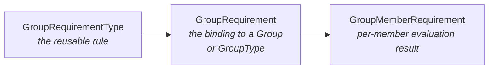
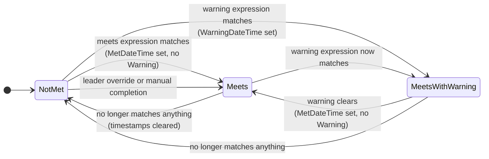

# Group Requirements

## Overview

Group Requirements are the eligibility rules a member must meet (or be in a "warning" state for) to be a valid member of a Group. Background checks, completed training, signed waivers, age thresholds: anything that can be answered by a SQL query, a DataView, or a manual sign-off. The system materializes per-member evaluation results so the UI can render in O(1) and a periodic job sweeps the whole system to keep them current.

## Mental Model

Three layers, each with a distinct job:

- **Requirement Type.** The reusable rule. "Background Check Current" or "Completed Volunteer Training". Defined once globally.
- **Requirement.** The binding. Attaches a Requirement Type to a specific Group or GroupType, optionally narrowed to one role.
- **Member Requirement.** The evaluation result. One row per (GroupMember, Requirement) saying whether that member currently meets, warns, or fails.



The state machine has three primary states: **Meets**, **MeetsWithWarning**, **NotMet**. Warning is **not** the same as NotMet. Warning means "approaching non-compliance" (background check expiring soon). A member in Warning state is still eligible for most operations including scheduling. Treating Warning as NotMet has been a recurring bug source.

State is **computed**, not directly set. The persisted `GroupMemberRequirementState` field has a private setter; the state is derived from underlying timestamps and override flags by `UpdateGroupMemberRequirementState`, which the save hook calls on every save. You change state by changing the timestamps and flags; the model recomputes.

A nightly job sweeps non-Manual requirements and refreshes the materialized rows via a stored procedure. Manual requirements are not auto-evaluated; they stay in whatever state a leader sets.

## What You Need to Know

**Warning is not Not-Met.** Member-eligibility code that compares to `MeetsGroupRequirement.Meets` is almost always wrong. The correct check for "is this member eligible" is "state is not `NotMet`", which includes `Meets`, `MeetsWithWarning`, and (depending on context) `NotApplicable`. The Group Scheduler used to fail this check; commit `78e21f1ed0` was the durable fix.

**State is computed, never set directly.** If you need a member to be in a different state, change the timestamps and override flags. The save hook recomputes the state. Setting `GroupMemberRequirementState` directly is impossible; trying to update it via raw SQL will leave it inconsistent on the next save.

**The save hook recomputes state on every save.** This means in-memory edits to `GroupMemberRequirement` properties without going through `SaveChanges` will see stale state. If you must inspect state mid-edit, call `UpdateGroupMemberRequirementState` yourself.

**Manual requirements never auto-update.** A Manual-type requirement that is marked Met stays Met forever unless cleared. There is no expiry, no revalidation. If you need expiring "manual" requirements, model them as SQL-type with a date check, not Manual.

**The job depends on a stored procedure.** Evaluation runs through `spUpdateGroupMemberRequirements` in `database/Procedures/`. A deployment that misses the proc silently produces zero updates. Verify the proc is present after migrations.

**Workflow id sentinels prevent duplicate launches.** When a member transitions to NotMet or Warning and the requirement type has a workflow attached, the launched workflow's id is recorded on the Member Requirement. As long as that id is non-null, the workflow does not relaunch. The id is cleared when the state passes back through Meets, which re-arms a future launch. Manual edits that null out the id will cause a duplicate launch.

**`MustMeetRequirementToAddMember` is enforced by callers, not the model.** The block UIs respect it; raw API consumers must check before adding. Direct service inserts that bypass validation can attach a non-qualifying member.

**SQL-type requirements run through Lava first.** The `SqlExpression` is Lava-merged with `Group`, `Person`, and `GroupRequirementType` available before execution. Standard Lava and SQL escaping rules apply: doubled single quotes, doubled braces for literals, etc. Expressions that work in pure SQL can fail at the Lava layer.

## Common Scenarios

**"Add a new requirement to all small groups."** Create the `GroupRequirementType` (the rule) once, then attach a `GroupRequirement` to the Small Group GroupType. All Groups of the type pick it up. Existing members will be re-evaluated on the next job run.

**"Manually mark a member as having met a requirement."** Set `WasManuallyCompleted = true`, `ManuallyCompletedByPersonAliasId`, `ManuallyCompletedDateTime`. The save hook recomputes state to Meets.

**"Override a requirement for a single member as a leader."** Requires `GroupRequirement.AllowLeadersToOverride = true`. Set `WasOverridden = true`, `OverriddenByPersonAliasId`, `OverriddenDateTime`. The save hook recomputes state to Meets.

**"Force a re-evaluation right now."** Run the `CalculateGroupRequirements` job manually from Job Administration. The next nightly run will catch up automatically; manual triggering is for "I need this to happen in the next minute".

**"Add a new requirement and find members who fail it."** Attach the requirement, run the job, then query `GroupMemberRequirement` for `GroupMemberRequirementState != Meets`. Workflow launches will fire automatically if the requirement type has them configured.

## Key Architectural Decisions

### Three-tier separation: Type, Requirement, MemberRequirement

The split lets one rule definition serve many groups without duplication, while still letting each binding override role scoping and DataView filters. Materializing per-member results is what keeps the UI fast: it reads, it does not re-evaluate.

### State is computed, not set

`GroupMemberRequirementState` has a private setter and is only written by `UpdateGroupMemberRequirementState`. This eliminates the "stale state vs current timestamps" bug class that produced fixes like commit `e872b392a0`.

### Workflow id sentinels prevent duplicate launches

`DoesNotMeetWorkflowId` and `WarningWorkflowId` are written once when a workflow launches and read by the job to suppress duplicates. The proc clears them when state passes back through Meets, which re-arms a future launch.

## Considered but Rejected

### Evaluating requirements live on every UI render
Rejected. Per-render evaluation cannot scale to groups with thousands of members and complex SQL or DataView filters. Materialized per-member rows let the UI render in O(1).

### Storing `GroupMemberRequirementState` as a public-set field
Rejected. Duplicate sources of truth between timestamps and state caused bugs (commit `e872b392a0`, where a previously-Met state continued to display after the member transitioned to Warning). Computing state from timestamps is the only canonical answer.

## Technical Reference

### Data Model

`GroupRequirementType` ([Rock/Model/Group/GroupRequirementType/GroupRequirementType.cs](../../Rock/Model/Group/GroupRequirementType/GroupRequirementType.cs)). The reusable rule. Defines:

- The check kind via `RequirementCheckType` ([Rock.Enums/Group/RequirementCheckType.cs](../../Rock.Enums/Group/RequirementCheckType.cs)): `Sql`, `Dataview`, `Manual`.
- "Meets" expression: `SqlExpression` (Lava-merged) OR `DataViewId`.
- "Warning" expression: `WarningSqlExpression` OR `WarningDataViewId`.
- Due-date logic: `DueDateType`, `DueDateOffsetInDays`, `DueDateAttribute`.
- Workflow types: `ShouldAutoInitiateDoesNotMeetWorkflow`, `WarningWorkflowTypeId`, `DoesNotMeetWorkflowTypeId`.
- `CategoryId` for grouping in the UI.

`GroupRequirement` ([Rock/Model/Group/GroupRequirement/GroupRequirement.cs](../../Rock/Model/Group/GroupRequirement/GroupRequirement.cs)). The binding. Attaches a type to a `GroupId` or `GroupTypeId`. Per-binding overrides:

- `GroupRoleId` (nullable). When set, applies only to that role.
- `MustMeetRequirementToAddMember`. UI/services refuse to add a failing member.
- `AllowLeadersToOverride`.
- `AppliesToAgeClassification`, `AppliesToDataViewId`. Population narrowing.

`GroupMemberRequirement` ([Rock/Model/Group/GroupMemberRequirement/GroupMemberRequirement.cs](../../Rock/Model/Group/GroupMemberRequirement/GroupMemberRequirement.cs)). The evaluation result.

- Timestamps: `RequirementMetDateTime`, `RequirementWarningDateTime`, `RequirementFailDateTime`.
- Manual: `WasManuallyCompleted`, `ManuallyCompletedByPersonAliasId`, `ManuallyCompletedDateTime`.
- Override: `WasOverridden`, `OverriddenByPersonAliasId`, `OverriddenDateTime`.
- Workflow sentinels: `DoesNotMeetWorkflowId`, `WarningWorkflowId`.
- `GroupMemberRequirementState` (private setter at [line 187](../../Rock/Model/Group/GroupMemberRequirement/GroupMemberRequirement.cs)). Computed.

States ([Rock.Enums/Group/MeetsGroupRequirement.cs](../../Rock.Enums/Group/MeetsGroupRequirement.cs)): `Meets`, `NotMet`, `MeetsWithWarning`, `NotApplicable`, `Error`.

### State Machine

State is derived on every save by `UpdateGroupMemberRequirementState` ([GroupMemberRequirement.cs:249](../../Rock/Model/Group/GroupMemberRequirement/GroupMemberRequirement.cs)). The transitions, expressed as a state diagram:



The literal derivation in code:

```csharp
if ( WasOverridden || WasManuallyCompleted || ( RequirementMetDateTime.HasValue && !RequirementWarningDateTime.HasValue ) )
    GroupMemberRequirementState = MeetsGroupRequirement.Meets;
else if ( RequirementWarningDateTime.HasValue )
    GroupMemberRequirementState = MeetsGroupRequirement.MeetsWithWarning;
else
    GroupMemberRequirementState = MeetsGroupRequirement.NotMet;
```

`Meets` and `MeetsWithWarning` are both **eligible** states for most consumers; only `NotMet` blocks. `NotApplicable` and `Error` are evaluator-time signals: `NotApplicable` is returned when role or population scoping excludes the member from the requirement, `Error` when SQL or DataView evaluation throws. Neither is typically persisted on the row.

The `SaveHook` ([GroupMemberRequirement.SaveHook.cs](../../Rock/Model/Group/GroupMemberRequirement/GroupMemberRequirement.SaveHook.cs)) invokes `UpdateGroupMemberRequirementState` on every save.

### Save Hook Behavior

`GroupMemberRequirement.SaveHook` ([line 35](../../Rock/Model/Group/GroupMemberRequirement/GroupMemberRequirement.SaveHook.cs)) calls `UpdateGroupMemberRequirementState` before commit. No other side effects.

### The Calculation Job

[Rock/Jobs/CalculateGroupRequirements.cs](../../Rock/Jobs/CalculateGroupRequirements.cs). For each non-Manual `GroupRequirement`:

1. Resolve the type and check kind.
2. **DataView types** ([line 167](../../Rock/Jobs/CalculateGroupRequirements.cs)): query `DataView` and `WarningDataView` (default through `DataViewCache`; `BypassDataViewCache` attribute is the override) to produce `meetsPersonIdList` and `warningPersonIdList`.
3. **SQL types** ([line 202](../../Rock/Jobs/CalculateGroupRequirements.cs)): Lava-merge the SQL with `Group`, `Person`, `GroupRequirementType`; execute; read PersonIds from the first column.
4. Call `spUpdateGroupMemberRequirements` (in `database/Procedures/`) with the id lists. The proc inserts new rows, updates timestamps, deletes rows for members no longer in scope.
5. Walk affected `GroupMemberRequirement` rows and launch `DoesNotMeetWorkflow` or `WarningWorkflow` instances where the corresponding workflow id field is null. Write the new workflow id back.

The job creates a fresh `RockContext` per `GroupRequirement` to keep the change tracker bounded.

Manual requirements are skipped entirely. Their state changes only when a UI action sets `WasManuallyCompleted` or `WasOverridden` and the SaveHook recomputes.

### Affected Blocks and UI Surfaces

- **Group Requirement Type Detail / List** ([Rock.Blocks/Group/GroupRequirementTypeDetail.cs](../../Rock.Blocks/Group/GroupRequirementTypeDetail.cs), [Rock.Blocks/Group/GroupRequirementTypeList.cs](../../Rock.Blocks/Group/GroupRequirementTypeList.cs), [Obsidian](../../Rock.JavaScript.Obsidian.Blocks/src/Group/groupRequirementTypeDetail.obs)). Manage the global library of requirement types.
- **Group Type Detail "Group Requirements" tab** ([Rock.JavaScript.Obsidian.Blocks/src/Group/GroupTypeDetail/groupRequirements.partial.obs](../../Rock.JavaScript.Obsidian.Blocks/src/Group/GroupTypeDetail/groupRequirements.partial.obs)). Attaches requirement types to a GroupType.
- **Group Detail "Group Requirements" tab** ([Rock.JavaScript.Obsidian.Blocks/src/Group/GroupDetail/groupRequirements.partial.obs](../../Rock.JavaScript.Obsidian.Blocks/src/Group/GroupDetail/groupRequirements.partial.obs)). Attaches requirement types to a specific Group, optionally role-scoped, with leader-override and "must-meet-to-add" toggles. Gated server-side on `ADMINISTRATE` on the group.
- **Group Member Detail block.** Per-member requirement cards, manual completion, leader override.
- **Group Scheduler** ([Rock.Blocks/Group/Scheduling/GroupScheduler.cs](../../Rock.Blocks/Group/Scheduling/GroupScheduler.cs)). Honors requirements when picking eligible volunteers (Warning state allowed).

### Extension Points

- **Custom SQL or DataView.** Most requirements should be expressed this way. SQL has Lava merge fields available.
- **Workflow types.** Any workflow can be wired to `DoesNotMeetWorkflowType` or `WarningWorkflowType`.
- **Manual requirements.** For things that have no expressible rule (e.g. "Pastor approval").

### File Index

- [Rock/Model/Group/GroupRequirement/](../../Rock/Model/Group/GroupRequirement/)
- [Rock/Model/Group/GroupRequirementType/](../../Rock/Model/Group/GroupRequirementType/)
- [Rock/Model/Group/GroupMemberRequirement/](../../Rock/Model/Group/GroupMemberRequirement/)
- [Rock/Jobs/CalculateGroupRequirements.cs](../../Rock/Jobs/CalculateGroupRequirements.cs)
- [database/Procedures/spUpdateGroupMemberRequirements.sql](../../database/Procedures/spUpdateGroupMemberRequirements.sql)

## Recent Impactful Changes

- **2026-02-09** ([commit `78e21f1ed0`](https://github.com/SparkDevNetwork/Rock/commit/78e21f1ed0)). Group Scheduler now allows scheduling members in Warning state; previously treated Warning as ineligible (Fixes #6654).
- **2026-02-07** ([commit `a0aac875b1`](https://github.com/SparkDevNetwork/Rock/commit/a0aac875b1)). Added `GroupMemberRequirementState` as a computed, persisted property and improved the requirement job.
- **2026-01-14** ([commit `2ee3535127`](https://github.com/SparkDevNetwork/Rock/commit/2ee3535127)). Group Requirement Type Detail (Obsidian) correctly loads and saves Attribute Values (Fixes #6642).
- **2025-12-16** ([commit `e872b392a0`](https://github.com/SparkDevNetwork/Rock/commit/e872b392a0)). Fixed display issue where a member who transitioned from Met to Warning still rendered as Met (Fixes #6427).
- **2025-12-12** ([commit `1f8228034a`](https://github.com/SparkDevNetwork/Rock/commit/1f8228034a)). `CalculateGroupRequirements` performance: outdated member requirements are now properly deleted, workflows re-fire when an individual newly meets a requirement, and Manual requirements are retroactively evaluated (Fixes #6594, #6595).
