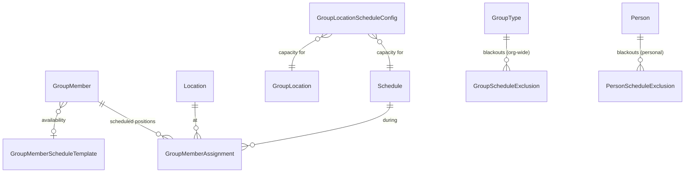

# Group Scheduling

## Overview

Group Scheduling is the volunteer scheduling system for Groups whose `GroupType.IsSchedulingEnabled` is true: typical for serving teams. The administrator-facing block is **Group Scheduler**; the volunteer-facing self-service block is **Schedule Toolbox**. Both pivot on `GroupMemberAssignment`, one row per scheduled position for one person at one (location, schedule) pair.

## Mental Model

A scheduling row is **one volunteer in one position**. The position is identified by `(Group, Location, Schedule)`. The volunteer is identified through their `GroupMember`. The same volunteer can hold many `GroupMemberAssignment` rows: one for each position they fill across services and weeks.

There are two parallel data tracks:

- **Availability** (what a volunteer says they can do) lives on `GroupMemberScheduleTemplate`. A template is a recurring pattern, like "Every Sunday Morning". A `GroupMember` references at most one template via `GroupMember.ScheduleTemplateId`.
- **Assignments** (what they have committed to) live on `GroupMemberAssignment`. Each row covers every recurrence of the schedule it references; per-occurrence reminder timestamps live on the row.

Capacity comes from `GroupLocationScheduleConfig`: a composite-key row per (location, schedule) pair holding `MinimumCapacity`, `DesiredCapacity`, `MaximumCapacity`. The Scheduler renders cells colored by how full each capacity bucket is.

Exclusions are two-tier. **Group-level exclusions** are GroupType-scoped blackouts (`GroupScheduleExclusion`); a holiday week applies to every Group of the type. **Person-level exclusions** are individual blackouts (`PersonScheduleExclusion`), optionally narrowed to a single Group, with a self-reference that lets a parent mark an entire family unavailable in one operation.

## What You Need to Know

**Sign-up commits on explicit Save.** The Schedule Toolbox sign-up flow does not auto-write when a volunteer checks an occurrence. The volunteer checks one or more occurrences, picks a location if there are multiple options, and explicitly clicks Save. This is intentional: a volunteer browsing openings should be able to back out without committing, and the Save step is the consent surface for the confirmation email that follows. The block partial that drives this is [signUpOccurrence.partial.obs](../../Rock.JavaScript.Obsidian.Blocks/src/Group/Scheduling/GroupScheduleToolbox/signUpOccurrence.partial.obs). Custom self-service flows that want different commit semantics need their own block.

**Warning-state members are eligible to schedule.** Group Requirement state matters here: members in `MeetsWithWarning` (e.g., a soon-expiring background check) are still eligible. Only `NotMet` blocks scheduling. The Scheduler block treated Warning as ineligible until commit `78e21f1ed0` fixed it. See [group-requirements.md](group-requirements.md).

**One assignment row, many occurrences.** `GroupMemberAssignment` is keyed on `(GroupMember, Location, Schedule)`. The same row covers every recurrence of the schedule, with `LastReminderSentDateTime` advancing over time. Per-occurrence presence is in `Attendance`; per-occurrence assignment rows do not exist.

**Reminders fire from "today" relative to job execution, not from occurrence time.** The reminder job sweeps assignments where the next occurrence falls within the configured offset window. A misconfigured `ScheduleReminderEmailOffsetDays` (e.g., 0) sends reminders the day of the occurrence, possibly after the service has already started.

**Capacity is advisory in the UI but not enforced server-side.** Custom block actions or API calls can create assignments above `MaximumCapacity`. The block UI is the enforcement point. Bulk operations or automation that bypass the block need to enforce capacity themselves.

**`PersonScheduleExclusion.ParentPersonScheduleExclusionId` self-reference is a UI helper.** A "for my whole family" toggle in the Toolbox creates one parent row plus child rows for each family member. Cleanup of children is handled by the UI flows; raw SQL deletes of the parent do not cascade unless the FK is configured for it. Verify on your version.

**Multi-Group multi-week scheduler views can be slow.** The performance fix in commit `49530db1e1` reduced redundant queries, but the scheduler still scales with `(groups × weeks × volunteers)`. Narrow the date range or Group set when possible.

**The "Disallow Group Selection If Specified" block setting locks the Group picker only when one or more Groups are passed in the URL.** The setting was previously ignored when more than one Group was passed; commit `60924b0e17` fixed it.

**A Group can hold its own inline Schedule via `Group.ScheduleId`.** This is separate from the `Schedule` rows attached to `GroupLocation`s. The inline schedule is the Group's "primary" schedule and comes in three flavors: **Custom** (free-form iCalendar), **Weekly** (day-of-week + time-of-day), or **Named** (a reference to a shared `Schedule` row). Editing happens in the Group Detail block's Schedule section. See "Inline Schedule Lifecycle" in Technical Reference for the create / reuse / cleanup rules — the most important one is that flipping between Custom and Weekly reuses the existing inline `Schedule` row so `ScheduleId` stays stable, but flipping to or from Named never overwrites the named schedule (corruption guard).

## Common Scenarios

**"Schedule volunteers for the next four weeks of Sunday services."** Open the Group Scheduler with the relevant Group and a four-week date range. The block resolves `GroupLocation`s, their `Schedule`s, and per-pair `GroupLocationScheduleConfig` capacity. Drag eligible volunteers into cells; each drop creates a `GroupMemberAssignment` and queues a confirmation email.

**"Volunteer wants to mark themselves unavailable for two weeks."** Toolbox -> Schedule Unavailability. Creates one `PersonScheduleExclusion` row. The "for my whole family" toggle creates additional child rows.

**"Volunteer wants to sign up for an additional service."** Toolbox -> Sign Up for Additional Times. Volunteer checks occurrences, picks a location if needed, clicks Save. Each checked occurrence becomes a `GroupMemberAssignment`. Save is explicit; the volunteer can back out without committing.

**"Block out a holiday week for every Group of a type."** Add a `GroupScheduleExclusion` row to the GroupType with the date range. Every Group of the type honors it on the next scheduler render.

**"Volunteer is going to be reliably available every Sunday at 9am."** Set the volunteer's `GroupMember.ScheduleTemplateId` to a template bound to the 9am Schedule, plus `ScheduleStartDate` for when the pattern starts. The Scheduler will surface the volunteer for matching occurrences.

## Key Architectural Decisions

### One assignment per (member, location, schedule)

The triple-key keeps total scheduling row count tractable. A weekly schedule for one volunteer over a year is one row, not 52. Per-occurrence state goes in `Attendance` rows, which is the right place for it.

### Templates are availability, assignments are scheduling

`GroupMemberScheduleTemplate` says "I can be scheduled at this cadence". `GroupMemberAssignment` says "I am scheduled for this position". The Scheduler reads templates to decide who to invite; it writes assignments as the volunteer accepts.

### Two-tier exclusions

GroupType-level for "the building is closed for Christmas". Person-level for "I am out of town that week". The Scheduler honors both in the same eligibility check. Person-level supports family rollup so parents do not have to mark four kids individually.

### Sign-up commits on explicit Save

The Toolbox sign-up flow requires an explicit Save click after the volunteer selects occurrences. Auto-on-check would commit unwanted assignments and send confirmation emails the volunteer never intended; the Save step is the consent surface.

## Considered but Rejected

### Per-occurrence assignment rows
Rejected. A weekly schedule for one volunteer over a year would generate 52 rows. The triple-keyed assignment plus per-row reminder timestamp gives the same operational view at far less storage cost.

### Auto-blocking volunteers in Warning requirement state
Rejected (commit `78e21f1ed0`). Warning means "approaching non-compliance", not "non-compliant". Blocking schedules for Warnings produced false negatives where a volunteer with a soon-expiring background check could not be scheduled for next Sunday.

### Auto-saving Toolbox sign-ups on checkbox change
Rejected. Volunteers should be able to browse openings without committing, and the Save click is the consent surface for the confirmation email. Auto-save also produces a poor UX when a volunteer checks several boxes intending to commit them as a batch.

## Technical Reference

### Data Model

`GroupMemberAssignment` ([Rock/Model/Group/GroupMemberAssignment/GroupMemberAssignment.cs](../../Rock/Model/Group/GroupMemberAssignment/GroupMemberAssignment.cs)):

- `GroupMemberId`. Cascade delete from GroupMember.
- `LocationId`. Cascade delete from Location.
- `ScheduleId`. Cascade delete from Schedule.
- `ConfirmationSentDateTime`. Once-per-assignment.
- `LastReminderSentDateTime`. Advances per-occurrence-cycle.

Compound logical key: `(GroupMemberId, LocationId, ScheduleId)`.

### Inline Schedule Lifecycle

`Group.ScheduleId` holds the Group's "primary" schedule, distinct from the schedules attached to `GroupLocation`s. The Group Detail block edits this via a tri-mode picker (Custom / Weekly / Named, plus a virtual "None") in the Schedule section. The lifecycle rules below live in `ApplyInlineSchedule` at [Rock.Blocks/Group/GroupDetail.cs:2543](../../Rock.Blocks/Group/GroupDetail.cs); the WebForms predecessor at [GroupDetail.ascx.cs:1185](../../RockWeb/Blocks/Groups/GroupDetail.ascx.cs) had the same shape.

**Silent downgrade rules.** The block does not surface validation errors for these; it silently falls back to `None`:

| Trigger | What's wrong | Result |
|---|---|---|
| Custom with invalid iCalendar | `InetCalendarHelper.CreateCalendarEvent(iCal)` returns null OR `calEvent.DtStart` is null | Schedule type becomes `None`; no inline Schedule is written. |
| Weekly missing day-of-week | `bag.WeeklyDayOfWeek` is null | Schedule type becomes `None`. |
| Weekly missing time-of-day | `ParseTimeSpanOrNull(bag.WeeklyTimeOfDay)` returns null | Schedule type becomes `None`. |

**Reuse-existing-inline rule.** When switching between Custom and Weekly on a Group that already has an inline Schedule attached, `ApplyInlineSchedule` REUSES the existing `Schedule` row (mutating its `iCalendarContent` / `WeeklyDayOfWeek` / `WeeklyTimeOfDay`) so `Schedule.Id` stays stable. A NEW inline Schedule is created only when the Group has no Schedule attached OR is currently attached to a Named schedule. The empty-`Name` field on a Schedule is the inline-Schedule marker.

**The CRITICAL named-schedule guard.** When the user is switching FROM a Named schedule, the code intentionally allocates a brand-new inline Schedule rather than reusing the named one. Mutating a named Schedule's iCalendar or Weekly fields would corrupt every other Group that references it. See the engineering note at [GroupDetail.cs:2545-2560](../../Rock.Blocks/Group/GroupDetail.cs).

**Named schedule attachment.** When the user picks a Named schedule, the code sets `entity.ScheduleId = namedScheduleId` AND nulls `entity.Schedule`. The null-nav step forces EF to honor the explicit FK rather than overriding it with the previously tracked Schedule's Id.

**Cleanup on Delete.** When a Group is deleted (`Delete` block action), if `Group.ScheduleId` points to an inline Schedule (`ScheduleType != Named`) AND no other Group references it, that Schedule row is also deleted. The check verifies no other `Group.ScheduleId` references it, but does NOT check other entity types (`Attendance.ScheduleId`, etc.). See [GroupDetail.cs:1492-1505](../../Rock.Blocks/Group/GroupDetail.cs).

**Cleanup on Save.** When the user swaps from one inline mode to another or to Named, the old inline Schedule is replaced (Custom↔Weekly) or detached (Named). When the user picks None on a Group that had an inline Schedule, the old inline Schedule is deleted post-save by `DeleteInlineSchedule` if it qualifies as orphaned.

`GroupMemberScheduleTemplate` ([Rock/Model/Group/GroupMemberScheduleTemplate/GroupMemberScheduleTemplate.cs](../../Rock/Model/Group/GroupMemberScheduleTemplate/GroupMemberScheduleTemplate.cs)). Reusable recurring availability. Optionally GroupType-scoped via `GroupTypeId` ([line 50](../../Rock/Model/Group/GroupMemberScheduleTemplate/GroupMemberScheduleTemplate.cs)). Binds a `Schedule` whose recurrence drives the pattern.

`GroupMember` carries `ScheduleTemplateId`, `ScheduleStartDate`, optional `ScheduleReminderEmailOffsetDays` per-member override.

`GroupLocationScheduleConfig` ([Rock/Model/Group/GroupLocation/GroupLocationScheduleConfig.cs](../../Rock/Model/Group/GroupLocation/GroupLocationScheduleConfig.cs)). Composite key `(GroupLocationId, ScheduleId)`. `MinimumCapacity`, `DesiredCapacity`, `MaximumCapacity`, plus `ConfirmationAdditionalDetails`, `ReminderAdditionalDetails`, `ConfigurationName`.

### Exclusions

`GroupScheduleExclusion` ([Rock/Model/Group/GroupScheduleExclusion/GroupScheduleExclusion.cs](../../Rock/Model/Group/GroupScheduleExclusion/GroupScheduleExclusion.cs)) is GroupType-scoped, `StartDate` and `EndDate`.

`PersonScheduleExclusion` ([Rock/Model/Group/PersonScheduleExclusion/PersonScheduleExclusion.cs](../../Rock/Model/Group/PersonScheduleExclusion/PersonScheduleExclusion.cs)) is Person-scoped, optionally narrowed to a single Group. `ParentPersonScheduleExclusionId` ([line 93](../../Rock/Model/Group/PersonScheduleExclusion/PersonScheduleExclusion.cs)) self-reference for family rollup.

### Confirmation and Reminder Lifecycle

Two SystemCommunications, configured per GroupType:

- `ScheduleConfirmationSystemCommunicationId`. Sent when a volunteer is initially scheduled.
- `ScheduleReminderSystemCommunicationId`. Sent N days before the scheduled date (`ScheduleReminderEmailOffsetDays`, GroupType default 2, optional per-member override).

The reminder job [Rock/Jobs/SendSignUpReminders.cs](../../Rock/Jobs/SendSignUpReminders.cs) sweeps `GroupMemberAssignment` rows where the next occurrence falls within the reminder window and `LastReminderSentDateTime` is null or older than today. For each, queues the SystemCommunication and stamps `LastReminderSentDateTime`. The same row can receive multiple reminders across different occurrences because the timestamp is "last reminder", not "the only reminder".

`ConfirmationSentDateTime` is stamped by the Scheduler when the assignment is first created. Once-per-assignment field, not once-per-occurrence.

### Capacity Honoring

The Scheduler honors `GroupLocationScheduleConfig` capacities as a soft hierarchy:

- Cells below `MinimumCapacity` flagged as urgent.
- Cells at `DesiredCapacity` flagged as filled.
- Cells at `MaximumCapacity` warned or blocked depending on flow.

`GroupCapacityRule` on the GroupType decides what happens at the Group level when capacity is hit, independent of per-(location, schedule) caps.

### Affected Blocks and UI Surfaces

- **Group Scheduler** ([Rock.Blocks/Group/Scheduling/GroupScheduler.cs](../../Rock.Blocks/Group/Scheduling/GroupScheduler.cs), [Obsidian](../../Rock.JavaScript.Obsidian.Blocks/src/Group/Scheduling/groupScheduler.obs)). Administrator-facing.
- **Group Schedule Toolbox** ([Rock.Blocks/Group/Scheduling/GroupScheduleToolbox.cs](../../Rock.Blocks/Group/Scheduling/GroupScheduleToolbox.cs), [Obsidian](../../Rock.JavaScript.Obsidian.Blocks/src/Group/Scheduling/groupScheduleToolbox.obs)). Volunteer-facing self-service.
- **Schedule Toolbox sign-up partial** ([signUpOccurrence.partial.obs](../../Rock.JavaScript.Obsidian.Blocks/src/Group/Scheduling/GroupScheduleToolbox/signUpOccurrence.partial.obs)). The explicit-Save commit surface.
- **Group Member Schedule Template Detail and List** ([Rock.Blocks/Group/Scheduling/GroupMemberScheduleTemplateList.cs](../../Rock.Blocks/Group/Scheduling/GroupMemberScheduleTemplateList.cs), [Rock.Blocks/Group/GroupMemberScheduleTemplateDetail.cs](../../Rock.Blocks/Group/GroupMemberScheduleTemplateDetail.cs)).
- **Group Detail "Schedule" and "Scheduling" sections** ([editPanel.partial.obs](../../Rock.JavaScript.Obsidian.Blocks/src/Group/GroupDetail/editPanel.partial.obs)). Per-Group inline schedule (Custom / Weekly / Named), schedule coordinator, schedule confirmation logic, attendance-record-required toggle, plus scheduling-disabled toggles. See "A Group's inline Schedule" below.

### Extension Points

- **`ScheduleConfirmationLogic`** on GroupType. Whether assignments require explicit volunteer confirmation or are auto-confirmed.
- **`ScheduleCancellationWorkflowTypeId`** on GroupType. Workflow launched on volunteer decline.
- **`ScheduleCoordinator`** on Group. Person who handles cancellations and substitution requests.
- **`AllowedScheduleTypes`** on GroupType. Restricts kinds of schedules that can attach to the Group's locations.

### File Index

- [Rock/Model/Group/GroupMemberAssignment/](../../Rock/Model/Group/GroupMemberAssignment/)
- [Rock/Model/Group/GroupMemberScheduleTemplate/](../../Rock/Model/Group/GroupMemberScheduleTemplate/)
- [Rock/Model/Group/GroupScheduleExclusion/](../../Rock/Model/Group/GroupScheduleExclusion/)
- [Rock/Model/Group/PersonScheduleExclusion/](../../Rock/Model/Group/PersonScheduleExclusion/)
- [Rock/Jobs/SendSignUpReminders.cs](../../Rock/Jobs/SendSignUpReminders.cs)

## Recent Impactful Changes

- **2026-02-09** ([commit `60924b0e17`](https://github.com/SparkDevNetwork/Rock/commit/60924b0e17)). Group Scheduler correctly disables the Group Picker when one or more Groups are passed via URL with "Disallow Group Selection If Specified" enabled (Fixes #6670).
- **2026-02-09** ([commit `78e21f1ed0`](https://github.com/SparkDevNetwork/Rock/commit/78e21f1ed0)). Warning-state Group Requirements no longer block scheduling (Fixes #6654).
- **2026-01-28** ([commit `49530db1e1`](https://github.com/SparkDevNetwork/Rock/commit/49530db1e1)). Reduced redundant DB queries when viewing many Groups across many weeks (Fixes #6662).
