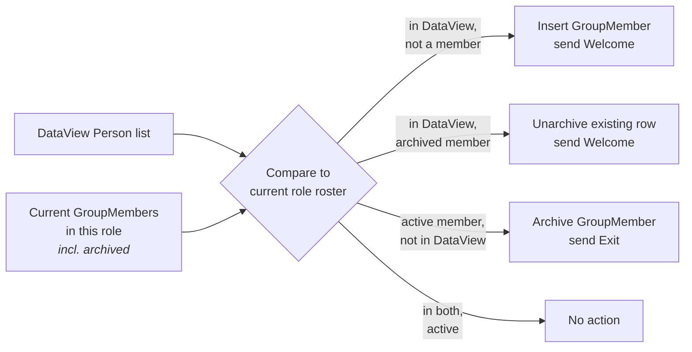

# Group Sync

## Overview

Group Sync makes a Group's roster the materialized output of a DataView. A `GroupSync` record binds a Group, a GroupTypeRole, and a DataView that returns Persons. A scheduled job runs the DataView, diffs the result against current membership in that role, and applies adds, removes, and (optionally) welcome and exit emails. The DataView is the source of truth.

## Mental Model

Think of a `GroupSync` as a **role-scoped roster manager** for one Group. It owns exactly one (Group, Role) pair: it adds people in that role when the DataView includes them, and removes people in that role when the DataView excludes them. It does not touch members in other roles, even if those members are also returned by the DataView.

The most important rule to internalize: **the DataView is law**. There is no flag for "manually added, please leave alone". If a leader manually adds someone to a synced role and that person is not in the DataView, the next sync run removes them. Groups that need a mix of synced and manually-managed members put the manually-managed members in a different role.

When a person rejoins the DataView after previously being removed, the sync **unarchives** the existing `GroupMember` row instead of inserting a new one. This preserves the historical link for attendance, peer network, and requirement evaluation history.

## What You Need to Know

**Sync owns one role, not the whole Group.** A `GroupSync` is bound to `(GroupId, GroupTypeRoleId)`. You can run multiple syncs on the same Group as long as they target different roles, each with its own DataView. You cannot run two syncs on the same role; the schema does not enforce this, but the result is conflicting writes on every run.

**Manually added members will be removed if they are not in the DataView.** This is the deliberate behavior, not a bug. The DataView is the source of truth, period. If a leader adds someone manually to a synced role, that person disappears on the next run. Use a separate role for hybrid roster management.

**Removal archives, it does not delete.** The default removal path sets `IsArchived = true` on the `GroupMember`, preserving attendance, peer network, and requirement history. Hard delete is reserved for rows that should never have existed.

**Re-add unarchives the existing row.** When a person rejoins the DataView, the sync looks up the most recent archived `GroupMember` for that (Group, Person, Role) and flips `IsArchived = false`. The historical link is preserved. Custom code that adds members to synced groups should follow the same pattern; otherwise sync will produce duplicate rows on re-entry.

**Welcome and Exit emails are configured per `GroupSync`, not per Group.** Two syncs on the same Group can use different SystemCommunications, or none. When the welcome SystemCommunication is set and the sync runs for the first time against a populated DataView, every matched person receives the welcome email. For initial syncs of large DataViews, configure without communications first, run once to populate, then attach.

**Job throughput is approximately 45 person-additions per second.** This is gated by DataView complexity and the Communication queue. Plan accordingly for large initial syncs.

**Archived groups are still synced.** The job does not check `Group.IsArchived` before running. An archived Group with an active `GroupSync` keeps adding and removing members on every run. Disable or delete the `GroupSync` record before archiving the Group.

**`ScheduleIntervalMinutes` is a per-record gate, not a job-wide schedule.** The job runs on the configured Rock job schedule. For each `GroupSync` record, it then checks `ScheduleIntervalMinutes` against the last run; the record is skipped if not yet due. Set per-record intervals when a particular sync should run less often than the job itself.

## Common Scenarios

**"Make this Group's volunteers always match my 'Active Volunteers' DataView."** Create a `GroupSync` record with `GroupId = volunteers group`, `GroupTypeRoleId = volunteer role`, `SyncDataViewId = active-volunteers DataView`. Optionally attach welcome and exit SystemCommunications. The next job run starts maintaining the roster.

**"Add a manually-managed coordinator role to a synced Group."** Create a separate GroupTypeRole "Coordinator" on the GroupType. The `GroupSync` only owns the volunteer role; coordinators live in the new role and are not touched by sync.

**"I want to do a one-time bulk add without sending welcome emails."** Create the `GroupSync` without a welcome SystemCommunication. Run the job. Then attach the welcome communication for future runs.

**"Stop a sync without losing the configuration."** Delete the `GroupSync` record (the configuration), but leave the `GroupMember` rows in place. They become manually-managed from that point.

**"Find which Groups in the system are synced."** `groupSyncService.Queryable().Select(gs => gs.GroupId).Distinct()`.

## Key Architectural Decisions

### Sync owns one role, not the whole Group

A `GroupSync` is bound to a `GroupTypeRoleId`. Mixed-management roles (synced volunteers plus manually-managed coordinators in the same Group) are supported by configuring multiple roles, with sync attached only to the ones that should be DataView-driven.

### Unarchive instead of re-insert

When a previously archived member rejoins the DataView, the existing `GroupMember` row is unarchived rather than replaced. Preserves the historical link for attendance, peer network, requirements.

### Manual additions are not protected

The deliberate decision is "DataView is the source of truth". Adding an `IsSynced` flag would create a quiet failure mode: leaders would add members expecting them to persist, sync would honor that, and the Group's roster would silently diverge from the DataView. The "DataView is law" rule is harsher but unambiguous.

## Considered but Rejected

### Tracking manual vs synced membership and protecting manual adds
Rejected. Long-standing. An `IsSynced` flag would let leaders accidentally diverge the roster from its source of truth. The harsh rule is the safer one.

### Per-Group sync (instead of per-Group + per-Role)
Rejected. Modeling sync at the Group level would prevent mixed-management roles, a common pattern for serving teams (synced volunteers plus manual coordinators).

## Technical Reference

### Data Model

`GroupSync` ([Rock/Model/Group/GroupSync/GroupSync.cs](../../Rock/Model/Group/GroupSync/GroupSync.cs)):

- `GroupId` ([line 46](../../Rock/Model/Group/GroupSync/GroupSync.cs)).
- `GroupTypeRoleId` ([line 57](../../Rock/Model/Group/GroupSync/GroupSync.cs)).
- `SyncDataViewId` ([line 67](../../Rock/Model/Group/GroupSync/GroupSync.cs)). DataView whose result type is Person.
- `WelcomeSystemCommunicationId` ([line 76](../../Rock/Model/Group/GroupSync/GroupSync.cs)).
- `ExitSystemCommunicationId` ([line 85](../../Rock/Model/Group/GroupSync/GroupSync.cs)).
- `ScheduleIntervalMinutes` ([line 103](../../Rock/Model/Group/GroupSync/GroupSync.cs)). Per-record gate.
- `AddUserAccountsDuringSync`. When true and a SystemCommunication requires a login, a user account is provisioned.

Result types: `GroupSyncInfo` ([Rock/Model/Group/GroupSync/GroupSyncInfo.cs](../../Rock/Model/Group/GroupSync/GroupSyncInfo.cs)), `GroupSyncResult` ([Rock/Model/Group/GroupSync/GroupSyncResult.cs](../../Rock/Model/Group/GroupSync/GroupSyncResult.cs)).

### The Diff Truth Table

`GroupSyncService.SyncGroups` ([Rock/Model/Group/GroupSync/GroupSyncService.cs](../../Rock/Model/Group/GroupSync/GroupSyncService.cs)) implements:

| In DataView | Active member? | Archived member? | Action |
|---|---|---|---|
| No  | No  | No  | Nothing. |
| No  | Yes | No  | Remove (archive). Send Exit if configured. |
| No  | No  | Yes | Nothing (already gone). |
| Yes | No  | No  | Add with the configured role. Send Welcome if configured. |
| Yes | Yes | No  | Nothing (already in). |
| Yes | No  | Yes | Unarchive existing row, set role, send Welcome. |

### Job

[Rock/Jobs/GroupSync.cs](../../Rock/Jobs/GroupSync.cs):

1. Enumerate every `GroupSync` record.
2. Check `ScheduleIntervalMinutes` against last run; skip if not due.
3. Resolve the DataView; produce PersonId list.
4. Resolve current membership in the target role via `AsNoFilter()` to include archived rows.
5. Apply the truth table.
6. Queue configured SystemCommunications and apply membership changes.
7. Record results in `GroupSyncResult`.

Throughput per [GroupSync.cs:55](../../Rock/Model/Group/GroupSync/GroupSync.cs): roughly 45 additions per second.

### Affected Blocks and UI Surfaces

- **Group Detail "Group Sync" tab** ([Rock.Blocks/Group/GroupDetail.cs](../../Rock.Blocks/Group/GroupDetail.cs), [Obsidian](../../Rock.JavaScript.Obsidian.Blocks/src/Group/GroupDetail/groupSync.partial.obs)). Lists, creates, edits `GroupSync` records.
- The job runs headless via the Rock job scheduler.

### Extension Points

- **DataView complexity.** Persisted DataViews are recommended for frequently-running syncs against large populations; non-persisted DataViews re-evaluate every run.
- **System Communication content.** Welcome and Exit are standard SystemCommunication records; merge fields include `Group`, `Person`, and the calling sync's metadata.

### File Index

- [Rock/Model/Group/GroupSync/](../../Rock/Model/Group/GroupSync/)
- [Rock/Jobs/GroupSync.cs](../../Rock/Jobs/GroupSync.cs)

## Recent Impactful Changes

(No release-note-worthy changes to the Group Sync subsystem in the last 18 months.)
