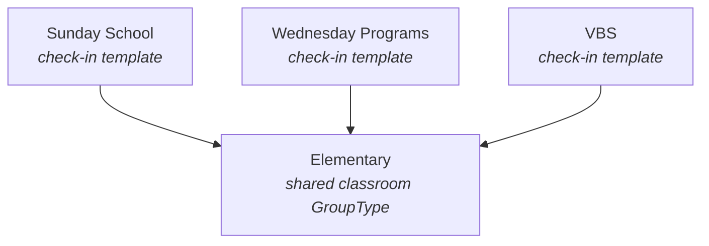

# Group Types

## Overview

`GroupType` is the configuration template every Group inherits from. Terminology, attendance rules, scheduling policy, allowed locations, chat settings, role definitions, requirement bindings: almost all of it lives on the type, not on individual Groups. If you want to change how every small group in Rock behaves, you edit the GroupType.

## Mental Model

A GroupType is the **policy**, a Group is an **instance**. Edit policy in one place, every instance updates. This is what makes Rock administrable: a single change to "Small Group" affects thousands of small group rows without per-Group writes.

The GroupType is also the **categorization** of the Group. "Family", "Small Group", "Volunteer Team", "Security Role", "Check-in Group" are all GroupTypes. They behave very differently from each other, and the difference is encoded in GroupType settings, not in code branches that check what kind of Group it is.

GroupTypes form a many-to-many graph rather than a tree. A "Elementary" check-in classroom GroupType can be a child of multiple parents ("Sunday School", "Wednesday Programs", "VBS"). This is what powers check-in templating: a shared classroom configuration reused across programs without duplication. Trees would have forced duplication; the graph keeps configuration DRY.

There is also a separate inheritance mechanism via `InheritedGroupTypeId`. A child GroupType chains to a parent (and that parent can chain to its own parent) so attribute definitions flow up through the chain. Roles, requirements, and member workflow triggers do NOT inherit; they are scoped per-GroupType only.

## What You Need to Know

**Most configuration lives here, not on Groups.** The instinct to add a per-Group override is almost always wrong. Per-Group overrides exist only for chat and scheduling because those were the dimensions where real per-Group needs surfaced. Default to type-level configuration; override per-Group only when you have evidence a single setting cannot serve everyone of the type.

**The hierarchy is a graph, not a tree.** `ChildGroupTypes` and `ParentGroupTypes` are many-to-many. Any walk through the hierarchy must be cycle-aware. The application code does this; the database does not enforce it. If you write custom traversal logic, copy the visited-id-set pattern from `GroupTypeService.GetCheckinAreaDescendants`. Naive recursion will infinite-loop on a misconfigured hierarchy.

**`InheritedGroupTypeId` carries attribute definitions, not behavior.** `GroupTypeCache.GetInheritedGroupTypeIds()` walks the full chain with a cycle guard, so a leaf GroupType inherits its ancestors' Group attribute values (via `Group.LoadAttributes`) and GroupMember attribute definitions (surfaced in the read-only "Inherited" grids in `GroupTypeDetail` / `GroupDetail`). NOTHING else inherits: roles, GroupRequirements, GroupMemberWorkflowTriggers, capacity rules, schedule rules, chat settings, and every other GroupType flag are read off the immediate `GroupTypeCache` only. If you need shared roles or requirements across many GroupTypes, attach them to each directly.

**`AdditionalSettingsJson` is an extensible escape hatch.** When plugin authors need to attach configuration without a schema migration, they put it here. There is no schema, no validation. Read defensively, write to your own well-known sub-key, and never assume what is or is not in the bag.

**Editing a GroupType propagates to every Group of that type.** Changing terminology, scheduling policy, or attendance rules takes effect immediately for every Group through `GroupTypeCache`. There is no "draft" or "staging" state. Test on a non-production GroupType first if a change might affect a large population.

**A Group's requirement set is direct + immediate GroupType, not ancestors.** `Group.GetGroupRequirements()` ([Group.Logic.cs:558](../../Rock/Model/Group/Group/Group.Logic.cs)) joins on `(GroupId == this.Id) OR (GroupTypeId == this.GroupTypeId)`. Ancestor GroupType requirements do NOT apply at runtime, even though the GroupDetail "Inherited Group Requirements" grid lists them. The grid is informational; the runtime evaluator ignores ancestor requirements. When debugging "why is this requirement firing", check (a) the Group's own `GroupRequirements`, then (b) the immediate GroupType's. That's the complete set.

**Family Groups are a GroupType, but they're treated as special in places.** The `Group.SaveHook` runs name-sanitization logic only for family GroupType rows. If you write code that distinguishes families from other groups, check the GroupType against the canonical Family GroupType Guid; do not invent your own marker.

## Key Architectural Decisions

### Configuration on the type, not on the row

Per-Group overrides are reserved for dimensions where real-world need has been demonstrated (chat, scheduling). Everything else lives on GroupType. This is the single most important convention in the domain.

### Many-to-many hierarchy, not a tree

A tree would force check-in templates to duplicate shared classroom GroupTypes under each program. The directed graph keeps shared configuration single-sourced; the price is mandatory cycle protection on every traversal.

### `CheckinAreaPath` for stable ordering

Walking a many-to-many graph in a stable display order is non-obvious. `CheckinAreaPath` builds a padded path string per node so a simple lexicographic sort produces depth-first traversal order. This is the implementation detail that makes check-in admin UIs render predictably.

### Inheritance limited to attribute definitions

The `InheritedGroupTypeId` chain walks the full hierarchy at the cache layer (with a cycle guard), but only attribute definitions flow through. Behavior (roles, requirements, workflow triggers, all flags) is per-GroupType only. This keeps configuration predictable: "what does this Group do" is answered by the immediate GroupType plus the Group's own overrides, not by walking ancestors looking for surprises.

## Considered but Rejected

### Tree-shaped GroupType hierarchy
Rejected. A tree would force duplication of shared classroom GroupTypes under each program. The directed graph keeps configuration DRY at the cost of cycle protection.

### Behavior inheritance through `InheritedGroupTypeId`
Rejected. Letting roles, requirements, or workflow triggers flow up the chain would have made "why does this Group behave this way?" depend on chain depth and force every consumer to walk ancestors. Attribute inheritance is the only supported mechanism; behavior stays per-GroupType.

### Hard delete cascading through Groups
Rejected. A GroupType with Groups attached refuses to delete by default. Forcing the user to archive or move the Groups first prevents cascading destruction across history, attendance, and peer-network references.

## Technical Reference

### Data Model

`GroupType` ([Rock/Model/Group/GroupType/GroupType.cs](../../Rock/Model/Group/GroupType/GroupType.cs)) has roughly 80 columns. Grouped by purpose:

- **Identity and display.** `IsSystem`, `Name`, `Description`, `Order`, `IconCssClass`, `GroupTypeColor`, `GroupTerm` (default `"Group"`), `GroupMemberTerm` (default `"Member"`), `AdministratorTerm`, `ShowInGroupList`, `ShowInNavigation`.
- **Capabilities.** `AllowMultipleLocations`, `AllowAnyChildGroupType`, `AllowSpecificGroupMemberAttributes`, `EnableSpecificGroupRequirements`, `AllowGroupSync`, `AllowSpecificGroupMemberWorkflows`, `EnableGroupHistory`, `EnableGroupTag`, `IsIndexEnabled`, `EnableRSVP`, `IsCapacityRequired`, `IsConcurrentCheckInPrevented`.
- **Hierarchy.** `InheritedGroupTypeId`, `DefaultGroupRoleId`. The `InheritedGroupType` chains a child GroupType to a parent for ATTRIBUTE inheritance only (see "Inheritance Chain Walking" below). Roles, requirements, and workflow triggers do NOT inherit.
- **Attendance.** `TakesAttendance`, `AttendanceCountsAsWeekendService`, `SendAttendanceReminder`, `AttendanceRule`, `AlreadyEnrolledMatchingLogic`, `GroupCapacityRule`, `AttendancePrintTo`, `GroupAttendanceRequiresLocation`, `GroupAttendanceRequiresSchedule`.
- **Location.** `LocationSelectionMode` (Location | Address | Point | Polygon | GroupMember), `EnableLocationSchedules`, plus the `LocationTypes` collection (`GroupTypeLocationType` rows).
- **Scheduling.** `IsSchedulingEnabled`, `ScheduleConfirmationSystemCommunicationId`, `ScheduleReminderSystemCommunicationId`, `RSVPReminderSystemCommunicationId`, `RSVPReminderOffsetDays`, `ScheduleConfirmationEmailOffsetDays` (default 4), `ScheduleReminderEmailOffsetDays` (default 2), `ScheduleConfirmationLogic`, `ScheduleCancellationWorkflowTypeId`, `RequiresReasonIfDeclineSchedule`, `AllowedScheduleTypes`.
- **Chat.** `IsChatAllowed`, `IsChatEnabledForAllGroups`, `IsLeavingChatChannelAllowed`, `IsChatChannelPublic`, `IsChatChannelAlwaysShown`, `ChatPushNotificationMode`. Individual Groups override via the corresponding `*Override` fields.
- **Peer Network.** `IsPeerNetworkEnabled`, `RelationshipGrowthEnabled`, `RelationshipStrength`, four directional multipliers.
- **Other.** `GroupTypePurposeValueId`, `GroupStatusDefinedTypeId`, `GroupsRequireCampus`, `IgnorePersonInactivated`, `GroupMemberRecordSourceValueId`, `AllowGroupSpecificRecordSource`, `AdditionalSettingsJson`.

Collections: `Roles` (`GroupTypeRole`), `Groups`, `ChildGroupTypes` and `ParentGroupTypes` (many-to-many through `GroupTypeAssociation`), `LocationTypes` (`GroupTypeLocationType`), `GroupRequirements`, `GroupMemberWorkflowTriggers`, `GroupScheduleExclusions`.

### Save Hook Behavior

[GroupType.SaveHook.cs](../../Rock/Model/Group/GroupType/GroupType.SaveHook.cs) is short:

- **PostSave** triggers a check-in director refresh so the in-memory check-in workflow picks up GroupType changes without a process restart.
- Cache invalidation fires via `UpdateCachedEntity` on `GroupTypeCache`.

GroupType edits do not have the heavy member-cascade logic that `Group.SaveHook` has. Type-level changes propagate through the cache to every Group instance without per-row writes.

### Service Methods

[GroupTypeService.cs](../../Rock/Model/Group/GroupType/GroupTypeService.cs):

- `GetChildGroupTypes(id)` ([line 49](../../Rock/Model/Group/GroupType/GroupTypeService.cs)) and `GetParentGroupTypes(id)` ([line 69](../../Rock/Model/Group/GroupType/GroupTypeService.cs)). Direct neighbors only.
- `GetCheckinAreaDescendants(parentId)` ([line 81](../../Rock/Model/Group/GroupType/GroupTypeService.cs)). Recursive descent with cycle protection.
- `GetCheckinAreaDescendantsOrdered(parentId)` ([line 96](../../Rock/Model/Group/GroupType/GroupTypeService.cs)). Same, ordered by `HierarchyPathString` from `CheckinAreaPath`.
- `GetCheckinAreaDescendantsPath(parentId)` ([line 108](../../Rock/Model/Group/GroupType/GroupTypeService.cs)). Returns `CheckinAreaPath` records for UI display.
- `GetCheckInConfiguration(checkInArea)` ([line 196](../../Rock/Model/Group/GroupType/GroupTypeService.cs)). Walk ancestors to find the owning template.
- `Delete(GroupType)` ([line 251](../../Rock/Model/Group/GroupType/GroupTypeService.cs)). Calls `CanDelete` first; refuses when Groups exist.
- `BulkDeleteGroupHistory(groupTypeId)` ([line 266](../../Rock/Model/Group/GroupType/GroupTypeService.cs)). Bulk delete `GroupHistorical` and `GroupMemberHistorical`.

### Inheritance Chain Walking

`GroupTypeCache.GetInheritedGroupTypeIds()` ([GroupTypeCache.cs:1070](../../Rock/Web/Cache/Entities/GroupTypeCache.cs)) walks the `InheritedGroupTypeId` chain from leaf to root and returns the list of GroupType IDs along the way. The cycle guard (`!groupTypeIds.Contains(groupType.Id)` at line 1077) prevents infinite loops on misconfigured data.

The cache-based attribute walker `GetInheritedAttributesForQualifier` ([GroupTypeCache.cs:1013](../../Rock/Web/Cache/Entities/GroupTypeCache.cs)) builds on top of it for any consumer that needs the full inherited attribute set for a given EntityType + qualifier column. Obsidian blocks (`GroupTypeDetail`, `GroupDetail`) use the same shape via a local `WalkGroupTypeInheritancePath` helper with a `HashSet<int>` cycle guard ([Rock.Blocks/Group/GroupDetail.cs:2794](../../Rock.Blocks/Group/GroupDetail.cs)).

**What walks the chain:**

| Concern | Mechanism | Notes |
|---|---|---|
| Group attribute values + definitions | `Group.LoadAttributes()` via `GroupTypeCache.GetInheritedAttributesForQualifier()` | Resolves the full chain transparently; consumers don't think about it. |
| GroupMember attribute definitions (inherited grid) | `BuildInheritedMemberAttributes` in `GroupTypeDetail` / `GroupDetail` blocks | Display only. Drives the read-only "Inherited" grid and reserved-key collision detection. |
| GroupRequirement definitions (inherited grid) | `BuildInheritedGroupRequirements` in `GroupDetail` block | **Display only.** See runtime gap below. |
| Date-typed Group attribute definitions | `BuildGroupDateAttributeOptions` in `GroupDetail` block | Feeds the requirement modal's "Due Date Group Attribute" dropdown. |

**What does NOT walk the chain:**

| Concern | Why | Source |
|---|---|---|
| `GroupTypeCache.Roles` | Queries `Where(r => r.GroupTypeId == Id)` | [GroupTypeCache.cs:668](../../Rock/Web/Cache/Entities/GroupTypeCache.cs) |
| `Group.GetGroupRequirements()` | Joins on `(GroupId == this.Id) OR (GroupTypeId == this.GroupTypeId)` | [Group.Logic.cs:558](../../Rock/Model/Group/Group/Group.Logic.cs) |
| `Group.GetGroupMemberWorkflowTriggers()` | Unions Group's own triggers with `this.GroupType.GroupMemberWorkflowTriggers` (immediate GroupType only) | [Group.Logic.cs:534](../../Rock/Model/Group/Group/Group.Logic.cs) |
| Behavior flags (`AllowedScheduleTypes`, `EnableRSVP`, chat settings, capacity rules, attendance rules, etc.) | Read off the immediate `GroupTypeCache` | [GroupTypeCache.cs](../../Rock/Web/Cache/Entities/GroupTypeCache.cs) |

**The runtime gap that bites people:** the GroupDetail block's "Inherited Group Requirements" grid lists requirements from ancestor GroupTypes for display, but `Group.GetGroupRequirements()` does NOT include them. To make an ancestor's requirement actually evaluate against a Group, attach it at the Group level (`GroupRequirement.GroupId = this.Group.Id`) or duplicate it onto the immediate GroupType. The inherited grid is a hint about the configuration, not a runtime enforcement surface.

### Affected Blocks and UI Surfaces

- **Group Type List** ([Rock.Blocks/Group/GroupTypeList.cs](../../Rock.Blocks/Group/GroupTypeList.cs), [Obsidian](../../Rock.JavaScript.Obsidian.Blocks/src/Group/groupTypeList.obs)).
- **Group Type Detail** ([Rock.Blocks/Group/GroupTypeDetail.cs](../../Rock.Blocks/Group/GroupTypeDetail.cs)) and its Obsidian partials under `Rock.JavaScript.Obsidian.Blocks/src/Group/GroupTypeDetail/`: `editPanel`, `viewPanel`, `roles`, `groupRequirements`, `groupMemberWorkflows`, `groupTypeAttributes`, `groupAttributes`, `groupMemberAttributes`.
- **Check-in configuration screens.** Use the same data through specialized check-in admin UIs.

### Extension Points

- **`AdditionalSettingsJson`** ([line 880 of GroupType.cs](../../Rock/Model/Group/GroupType/GroupType.cs)). Extensible bag for plugin authors. No validation; consumers parse what they put in.
- **Custom DefinedValue purposes.** `GroupTypePurposeValueId` references the `GROUPTYPE_PURPOSE` defined type. Custom purpose values can filter GroupTypes from custom blocks.
- **Inherited group types.** Pointing several GroupTypes at a single inherited parent shares attribute definitions (Group and GroupMember) across them. Requirements and workflow triggers do not inherit; attach those directly to each GroupType that needs them.

### File Index

- [Rock/Model/Group/GroupType/](../../Rock/Model/Group/GroupType/)
- [Rock/Model/Group/GroupTypeRole/](../../Rock/Model/Group/GroupTypeRole/)
- [Rock/Model/Group/GroupTypeLocationType/](../../Rock/Model/Group/GroupTypeLocationType/)
- [Rock/Web/Cache/Entities/GroupTypeCache.cs](../../Rock/Web/Cache/Entities/GroupTypeCache.cs)

## Recent Impactful Changes

- **2026-03-27** ([commit `6081891459`](https://github.com/SparkDevNetwork/Rock/commit/6081891459)). Group Type Detail block now loads entity attributes in view mode.
- **2026-02-05** ([commit `52191e72d4`](https://github.com/SparkDevNetwork/Rock/commit/52191e72d4)). Group Type Detail Obsidian block landed; legacy WebForms version chopped.
