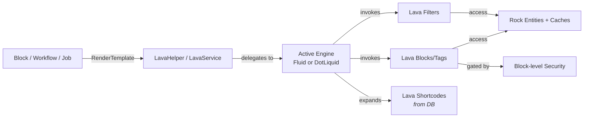

# Lava Domain Overview

## Overview

Lava is Rock's templating language: a Liquid-derived markup that lets administrators write merge-field templates against Rock entities, custom data, and computed values. Templates appear in email/SMS bodies, system communications, content channel items, dynamic blocks, workflow forms, attribute formatting, and anywhere a non-developer needs to compose output. Two engines back Lava: the legacy DotLiquid path (`Rock.Lava.RockLiquid`) and the modern Fluid path; the Fluid path is the default since Rock 16, with a multi-year migration off DotLiquid in progress.

## Why It Exists

Rock's audience includes administrators and ministry staff who are not C# developers but routinely need to compose dynamic content: a per-person email body that pulls in their giving total, a check-in label that shows a child's allergies, a content channel page that lists upcoming events filtered by campus. Hardcoding each of these as a custom block would multiply development cost and lock the system out of customer-driven configuration. Lava is the answer: a constrained templating language that exposes Rock's data model with merge fields, filters, and entity commands, sandboxed against the worst classes of injection and runaway-cost templates.

The Fluid migration (started 2024-2025) exists because DotLiquid is unmaintained, has gaps in newer C# language interop (notably async), and produces inconsistent rendering for certain edge cases. Commit `c7818bdeda` (2025-10-24, Fixes #6281) is one of many parity fixes during the migration: `forloop.rindex` and `forloop.rindex0` differed between Fluid and DotLiquid; the fix aligned them.

The Lava command system (`Sql`, `Execute`, `Cache`, `RockEntity`, `Personalize`, `InteractionWrite`, etc.) exists because some operations (database queries, entity modifications, cache reads/writes) are too expensive or too sensitive to expose as plain filters. Wrapping them as commands lets each command opt into the security check that controls who can use it; the security-fix commit `02bf3ca13b` (2025-10-29, Fixes #6494) is about exactly that: some commands' security settings were not being enforced, and blocks could use commands they should not have.

## Mental Model

Lava is **a templating engine plus a Rock-aware extension surface**. The engine evaluates Liquid syntax; the Rock-aware extensions (filters, blocks, shortcodes, commands) are what make it useful for church-management work.

Three layers to keep separate in your head:

- **Filters** transform values (`{{ Person.FullName | Truncate:10 }}`). They are pure functions, side-effect-free, registered globally per engine.
- **Blocks and tags** wrap or generate content (`...`, ``). Blocks can have side effects (database access, cache writes, workflow launches); their use is gated by per-block security configuration.
- **Shortcodes** are user-defined block-or-inline macros stored in the database (`LavaShortcode` entity). Administrators can write new shortcodes without recompiling Rock. Shortcodes have a Scope Behavior (`e2371815b1`, 2025-12-01) that controls whether internal variables leak into the surrounding template.

Behind these is the **engine factory** (`LavaEngineFactory`). Most Rock code calls `LavaService.Render` or `LavaHelper.RenderTemplate`, which delegate to the active engine. Tests can swap engines; production sites can switch between Fluid and DotLiquid via global config.

Caching is **template-level** in the WebsiteLavaTemplateCacheService: parsed templates are cached so repeated renders skip parse cost. The Cache block adds **output-level** caching: a template fragment can wrap expensive content in `...` and the rendered output is reused for the configured duration.

## What You Need to Know

**Fluid is the default; DotLiquid is the legacy path.** Most new commands and filters are Fluid-only. `c7818bdeda` and similar commits are about closing parity gaps so existing templates render consistently across engines. If you are writing a new filter or block, target Fluid first.

**Lava commands are security-gated.** Each block has a security entity-type that controls who can use it. The `Sql`, `Execute`, `RockEntity` (Modify/Delete variants), and `WebRequest` blocks are dangerous if exposed to untrusted authors. Commit `02bf3ca13b` (Fixes #6494) fixed cases where the security setting was being silently bypassed. Templates owned by untrusted persons should never have these commands enabled in their evaluation context.

**`` is the entity-query block.** It runs a parameterized query against any Rock entity type with `where:`, `expression:`, `select:`, `dataview:`, and other modifiers. The active spec at `specs/260428-lava-entity-select-tostring-regression.md` documents a current `select:` regression. The block is the most-used Lava data access primitive.

**Filters are partitioned by domain.** `Rock/Lava/Filters/LavaFilters.cs` is the master list; partials like `LavaFilters.Person.cs`, `LavaFilters.Reporting.cs`, and `LavaFilters.EntitySets.cs` group filters by area. New filters should land in the appropriate partial, not in the master file.

**Identifier filters accept multiple key forms.** Filters like `IsInDataView` (`1c2ac99587`, 2025-08-29) accept `int`, `Guid`, or `IdKey` for entity references. Same model as `GetQueryableByKey`. New filters that take an entity reference should follow the pattern (see [docs/core/entity-reference-resolution.md](../core/entity-reference-resolution.md)).

**Shortcode scope behavior controls variable leakage.** Since `e2371815b1` (2025-12-01), `LavaShortcode.ScopeBehavior` lets administrators choose isolation (no variable leakage in or out) or sharing (the surrounding context's variables are accessible inside, and shortcode-defined variables persist after). Default for new shortcodes is isolation; enabling sharing should be deliberate.

**Daylight Saving Time bites date filters.** `DatesFromICal` had a DST bug (`d7def2d156`, Fixes #6626) where the UTC offset on iCalendar-derived dates differed from `NextStartDateTime`. Date math in Lava that crosses DST boundaries should be treated with suspicion until verified against the fix commit.

**`forloop.rindex` and `forloop.rindex0` differ in DotLiquid vs Fluid for older versions.** Commit `c7818bdeda` aligned them. Templates that worked under DotLiquid and produced wrong values after a Fluid migration are likely hitting this; the fix is forward-only.

**`RenderLavaEndpoint` parses querystring in route parameters.** Since `f009b63942` (Fixes #6633), the `RenderLavaEndpoint` block correctly parses querystrings appended to the route parameter. Previously, query parameters in `route='foo?bar=1'` were silently dropped.

**`FromIdHash` accepts plain ids.** Since `9b17dc079c`, the `FromIdHash` filter returns the integer directly when given a plain (non-hashed) id string. Templates that previously had to branch on "is this hashed?" can now pass either form without conditional logic.

**The `~~/` include prefix has special handling.** Commit `470f98331c` (2026-04-15) fixed Lava includes failing when `~~/` prefixes were used inside a Job context. If a Job runs a Lava template that uses `~~/` includes and fails, this is the fix to verify is in your build.

## Common Scenarios

**"Render a per-person email body."** The Communication template body is Lava. The render context provides `Person`, `CurrentPerson`, `Communication`, plus any merge fields the template defines. Filters like `Format`, `Truncate`, `Default` shape values for output.

**"Query for groups inside a Lava template."** Use the `` block with `where:` or `expression:` filters. The result is iterable with ``. Be explicit about `select:` to limit columns; otherwise the block fetches all entity properties.

**"Cache an expensive Lava fragment."** Wrap with `...`. The output is cached for 600 seconds keyed on the template hash and any cache-key modifiers.

**"Run a SQL query in a template."** `SELECT ... ` returns a row collection. The block is gated by Lava command security; it should not be enabled for templates authored by untrusted users.

**"Define a reusable shortcode."** Lava Shortcode Detail block. Set Scope Behavior to Isolated (default) unless you specifically need to share variables with the calling template.

**"Render an iCal feed."** The `DatesFromICal` filter expands a recurrence pattern into a date list. Watch for DST edge cases on cross-boundary date ranges.

## Key Architectural Decisions

### Two engines for the migration

Maintaining DotLiquid and Fluid in parallel is operationally expensive but lets sites migrate at their own pace and lets the team fix parity bugs without forcing a hard cutover. The cost is parity work; the benefit is risk reduction.

### Commands gated by security

Lava is exposed to template authors of varying trust. Database queries, entity modifications, and HTTP calls are too dangerous to allow universally. Per-command security lets administrators grant capabilities deliberately.

### Filters as partial classes

`LavaFilters.cs` is the registration surface; the actual filter implementations live in domain-specific partials (`LavaFilters.Person.cs`, `LavaFilters.EntitySets.cs`, etc.). This keeps the master file readable as the filter count grows.

### Shortcodes as data, not code

Database-backed shortcodes let administrators extend Lava without compiling. The scope-behavior setting (`e2371815b1`) gives them a meaningful choice about variable leakage.

### Output caching as an explicit opt-in

Universal output caching would produce stale-content surprises. The `` block puts the decision in the template author's hands.

## Considered but Rejected

### Forcing a hard cutover from DotLiquid to Fluid

Rejected. The installed-base of templates is large, and a forced migration would break existing sites' rendering. Parity work plus opt-out lets sites migrate gradually.

### Allowing all Lava commands by default

Rejected. The security model is per-command opt-in for a reason: bulk SQL execution and entity modification from a templating engine are sharp edges that need deliberate enablement.

### A custom non-Liquid templating syntax

Rejected. Liquid is widely understood (Shopify, Jekyll, dozens of other systems), and the team chose to ride that ecosystem's familiarity rather than invent a new syntax.

## Technical Reference

### Engine Surface

`LavaService` ([Rock/Lava/LavaService.cs](../../Rock/Lava/LavaService.cs)) is the singleton entry point. It delegates to the active engine (Fluid or DotLiquid) configured via `LavaEngineFactory`.

`LavaHelper` ([Rock/Lava/LavaHelper.cs](../../Rock/Lava/LavaHelper.cs)) is the convenience facade most Rock code uses (`LavaHelper.RenderTemplate(template, mergeFields)`).

### Filters

`Rock/Lava/Filters/LavaFilters.cs` registers all filters. Domain-specific partials:

- `LavaFilters.Person.cs` (e.g. `Address`, `PhoneNumber`)
- `LavaFilters.EntitySets.cs` (e.g. `EntitySetIds`)
- `LavaFilters.Identifiers.cs` (e.g. `FromIdHash`, `ToIdHash`)
- `LavaFilters.Personalization.cs` (segment membership filters)
- `LavaFilters.Reporting.cs` (`IsInDataView`, etc.)
- `LavaFilters.Text.cs` (text utilities)
- `LavaFilters.AIAgent.cs` (AI integrations)

### Blocks and Tags

[Rock/Lava/Blocks/](../../Rock/Lava/Blocks/) holds the block implementations. Notable:

- `RockEntityBlock`, `RockEntityModifyBlock`, `RockEntityDeleteBlock` (entity query/modify/delete)
- `SqlBlock`, `ExecuteBlock` (SQL and arbitrary Lava execution; security-gated)
- `CacheBlock` (output caching)
- `WebRequestBlock` (outbound HTTP; security-gated)
- `PersonalizeBlock` (personalization-segment-based content)
- `JavascriptBlock`, `StylesheetBlock` (script and style emission)
- `WorkflowActivateBlock`, `InteractionWriteBlock`, `InteractionContentChannelItemWriteTag` (side-effect blocks)
- `CalendarEventsBlock`, `EventScheduledInstanceBlock` (event/calendar data)
- `RenderLavaEndpoint` (calls into LavaApplication endpoints)
- `PrintZplBlock` (Zebra printer output, added `5a647a0d9e`)
- `SetCultureBlock`, `SearchBlock`, `JsonPropertyBlock`, `ObserveBlock` (utility blocks)

### Shortcodes

[Rock/Lava/Shortcodes/](../../Rock/Lava/Shortcodes/) holds the built-in shortcodes (BootstrapAlert, MediaPlayer, NetworkGraph, SankeyDiagram, ScheduledContent, Scripturize, GroupFinder, AICompletion, etc.).

`LavaShortcode` rows in the database define administrator-authored shortcodes. The cache provider for runtime lookup is `WebsiteLavaShortcodeProvider`.

### Caching

`WebsiteLavaTemplateCacheService` caches parsed templates. The `CacheBlock` provides output-level caching keyed on template hash plus configured cache-key parameters.

### Affected Blocks and UI Surfaces

- **Lava Shortcode Detail/List.** Manage administrator-authored shortcodes.
- **Lava Application Detail/List.** Lava Applications are the URL-routed Lava endpoints.
- **Lava Endpoint Detail/List.** Per-Application endpoint configuration.
- **Email Section Designer.** Uses Lava in email-section templates.
- **Workflow Form Builder.** Workflow attribute formatting and form output.
- **Content Channel Item.** Content body and item template rendering.
- **System Communication.** Body, subject, attachment-name templates.

### Extension Points

- **Custom filters.** Add to a domain-specific partial in `Rock/Lava/Filters/`.
- **Custom blocks.** Implement `IRockLavaBlock` (DotLiquid) and the Fluid equivalent.
- **Custom shortcodes.** Either register a built-in (a class in `Rock/Lava/Shortcodes/`) or insert a `LavaShortcode` row.
- **Custom merge field providers.** `LavaContextProvider` registrations expose new top-level merge fields.

### File Index

- `Rock/Lava/` (engine, helpers, filters, blocks, shortcodes)
- `Rock/Model/Lava*` (database-backed shortcode/application/endpoint entities)
- `Rock.Blocks/Cms/Lava*` (admin UIs)

## Recent Impactful Changes

- **2026-04-15** ([commit `470f98331c`](https://github.com/SparkDevNetwork/Rock/commit/470f98331c)). Fixed Lava `~~/` includes failing when used from inside a Job context.
- **2026-03-09** ([commit `28da02625b`](https://github.com/SparkDevNetwork/Rock/commit/28da02625b)). `Where` filter gained an optional `contains` comparison parameter for partial value matching.
- **2026-03-04** ([commits `5a647a0d9e`, `db2234ff8e`](https://github.com/SparkDevNetwork/Rock/commit/5a647a0d9e)). New `PrintZpl` Lava command sends ZPL content directly to a Zebra printer; new `ToBase64` filter for arbitrary string/byte encoding.
- **2026-01-06** ([commit `f009b63942`](https://github.com/SparkDevNetwork/Rock/commit/f009b63942)). `RenderLavaEndpoint` block correctly parses querystrings in the route parameter (Fixes #6633).
- **2025-12-01** ([commit `e2371815b1`](https://github.com/SparkDevNetwork/Rock/commit/e2371815b1)). New Shortcode Scope Behavior property on `LavaShortcode` controls whether shortcode-internal variables are isolated from or shared with the surrounding template.
