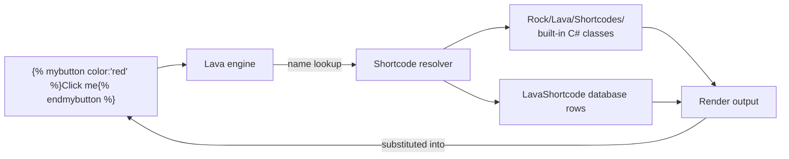

# Lava Shortcodes

## Overview

Shortcodes are user-defined Lava macros: a reusable chunk of Lava that admins author once and call from any template using `` (block form) or `{[ shortcodename ]}` (inline form). Two flavors exist:

- **Built-in shortcodes** (in `Rock/Lava/Shortcodes/`): C# classes shipped with Rock (BootstrapAlert, MediaPlayer, GroupFinder, NetworkGraph, SankeyDiagram, ScheduledContent, Scripturize, AICompletion).
- **User shortcodes** (`LavaShortcode` rows in the database): admin-authored, stored as Lava text, expanded at template render. No code changes needed.

The Shortcode Scope Behavior property (added 2025-12-01 in commit `e2371815b1`) controls whether a shortcode's internal variables are isolated from or shared with the surrounding Lava context.

## Why It Exists

Templates frequently need reusable structured output: an "alert" component (`{[ bootstrapalert ]}danger:Something broke{[ endbootstrapalert ]}`), a media player (`{[ mediaplayer src:'...' ]}`), a group-finder embed. Hardcoding each as raw HTML or repeating the markup across templates would be hostile to non-developer authors. Shortcodes give them a friendly named macro for each component.

The user-shortcode capability is what makes shortcodes especially valuable: an administrator can build a custom shortcode (a styled callout with the church's branding, a "service times" widget that pulls from the next service's data) without touching code. The shortcode is configuration-as-data; it deploys with the Rock data, not with the codebase.

The scope behavior addition (`e2371815b1`) addressed a real ambiguity: should variables defined inside a shortcode leak out to the surrounding template? The answer depends on what the shortcode is doing. A simple visual component should NOT leak; a "compute and assign" shortcode might want to. Per-shortcode configuration gives administrators the choice.

## Mental Model

The resolver looks up the shortcode by name. Built-ins ship as C# classes (decorated with `LavaShortcodeMetaDataAttribute`). User shortcodes live in `LavaShortcode` rows; their `Markup` field contains the Lava body that gets expanded.

A shortcode can be **block-form** (with opening + closing tags wrapping content) or **inline-form** (single tag like `{[ scripturize ]}`). The metadata determines which.

## What You Need to Know

**User shortcodes are configuration-as-data.** Admin authors them in the Lava Shortcode Detail block; the row is stored, the resolver picks it up. No build/deploy required.

**Scope Behavior is the variable-leakage control.** Since `e2371815b1` (2025-12-01), `LavaShortcode.ScopeBehavior` is `Isolated` (default) or `Shared`. Isolated means the shortcode's internal variables are scoped locally; Shared means they're visible in the surrounding template. New shortcodes default to Isolated; switching to Shared should be deliberate.

**Block-form vs inline-form is per-shortcode.** Configured at creation time. Block form: `{[ name ]}content{[ endname ]}`. Inline form: `{[ name args ]}`.

**Built-in shortcodes are decorated with metadata.** `LavaShortcodeMetaDataAttribute` describes the name, parameters, and category. The Fluid registration picks them up automatically.

**Built-in shortcodes have richer logic than user shortcodes.** Things like AICompletion (which calls into the AI provider), ScheduledContent (which evaluates time-based conditions), GroupFinder (which queries entities). User shortcodes are pure Lava expansion; if they need C# logic, they call into existing filters or blocks.

**Naming convention is lowercase with no spaces.** Per Lava convention. `bootstrapalert`, `groupfinder`, `mediaplayer`. Custom shortcodes should follow.

**Shortcodes can call filters and other shortcodes.** Composable. The expansion happens recursively until no more shortcodes appear.

**Performance varies by shortcode.** Heavy shortcodes (AICompletion, complex queries) inside loops are expensive. The standard `` block can wrap expensive shortcodes.

**Shortcode security is light.** A user shortcode CAN include security-sensitive blocks (``, ``) if those are enabled in the template's command list. Reviewers should treat user-authored shortcodes with the same care as templates: malicious or careless authors can produce dangerous shortcodes.

**Built-in shortcodes are versioned with Rock.** Updating Rock can change built-in behavior; user shortcodes are deployment-specific and survive upgrades.

## Common Scenarios

**"Build a custom 'service-times' shortcode."** Lava Shortcode Detail block. Name `servicetimes`, mode block-form (or inline). Markup: query upcoming services via `` and format output. Save. Use as `{[ servicetimes ]}` in any Lava template.

**"Override a built-in shortcode."** Built-ins ship as C# classes; user shortcodes with the same name take precedence (verify in your specific Rock version). Better practice: pick a different name for the custom shortcode to avoid surprise overrides.

**"Make a shortcode that defines variables for the calling template."** Set `ScopeBehavior = Shared` on the shortcode. Variables defined inside leak to the surrounding context.

**"Embed a media player from a Lava template."** Built-in `mediaplayer` shortcode. `{[ mediaplayer src:'...' ]}`.

**"Avoid expensive recomputation of a shortcode."** Wrap with `{[ expensiveshortcode ]}`.

**"Audit which shortcodes are used in deployed Lava."** Custom tooling: scan the Communication body, ContentChannelItem body, attribute values, and block configurations for `{[ name ]}` or `` patterns. Not built-in.

## Key Architectural Decisions

### Two flavors: built-in C# and user database

Built-ins for things that need real C# logic; user shortcodes for things admins can author in Lava. Each flavor is the right tool for its kind of need.

### Scope Behavior as configuration, not implicit

Variable leakage is an authoring choice. Forcing one or the other would surprise authors; per-shortcode configuration gives them the right control.

### Block-form and inline-form

Different visual roles. Block form for "wrap content with markup" (alert, callout); inline form for "emit a thing here" (icon, badge).

### Database-backed for user shortcodes

Configuration-as-data with hot-reload (no deploy needed). Admin-friendly authoring path.

### Naming convention by Lava

Lowercase, no-spaces matches the broader Lava tag/block naming convention.

## Considered but Rejected

### File-based user shortcodes

Rejected. Database storage allows per-deployment customization without filesystem permissions; CMS Configuration also lives in the database for the same reason.

### Always-isolated scope

Rejected. Some shortcodes legitimately want to expose computed values to the surrounding template. Per-shortcode control is the right tradeoff.

### Auto-versioning of user shortcodes

Rejected (so far). Manual edit history through standard audit columns is sufficient.

## Technical Reference

### Built-in Shortcodes (selected)

`Rock/Lava/Shortcodes/`:

- `BootstrapAlertShortcode`: Bootstrap-styled alerts.
- `MediaPlayerShortcode`: Audio/video embed.
- `GroupFinderShortcode`: Group-finder embed widget.
- `NetworkGraphShortcode`, `SankeyDiagramShortcode`: data viz.
- `ScheduledContentShortcode`: time-conditional content.
- `ScripturizeShortcode`: Bible reference linking.
- `AICompletionShortcode`: AI-driven completion.

### User Shortcode Schema

`LavaShortcode` (under `Rock/Model/CMS/LavaShortCode/`):

- `Name`, `TagName` (admin name vs the lookup name)
- `Markup` (the Lava body)
- `Description`
- `Documentation`
- `Parameters` (for documentation; not enforced)
- `ScopeBehavior` (since `e2371815b1`)
- `IsActive`, `IsSystem`
- `EnabledLavaCommands` (per-shortcode command-allow-list; lets a shortcode use `` even if the calling template can't)
- `TagType` (Block / Inline)

### Resolver

`Rock/Lava/WebsiteLavaShortcodeProvider.cs` is the production-side resolver. It checks built-ins first (or user-shortcodes first, depending on configuration), then expands.

### Affected Blocks

- **Admin:** Lava Shortcode Detail/List.
- **Template authors:** any block that allows Lava (Communication body, ContentChannelItem, attribute formatters, dynamic data).

### Related Docs

- [docs/lava/lava-overview.md](lava-overview.md)
- [docs/lava/writing-blocks.md](writing-blocks.md) for built-in block authoring (more code-heavy than shortcode authoring).
- [docs/lava/writing-filters.md](writing-filters.md) for filter authoring.

## Recent Impactful Changes

- **2025-12-01** ([commit `e2371815b1`](https://github.com/SparkDevNetwork/Rock/commit/e2371815b1)). New Shortcode Scope Behavior property on `LavaShortcode`: Isolated (default, no variable leakage) or Shared (variables visible in surrounding template). Lava Shortcode Detail/List blocks refreshed with updated Obsidian UI.
