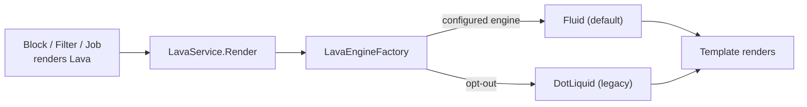

# The Fluid Migration

## Overview

Rock is in the middle of a multi-year migration from the legacy DotLiquid Lava engine to the modern Fluid engine. Fluid is the default for new deployments since Rock 16. The migration matters because: DotLiquid is unmaintained, has gaps in async / modern C# interop, and produces inconsistent rendering for certain edge cases. The migration cost is parity work: every filter, block, shortcode, and template that worked under DotLiquid must produce the same output under Fluid (or have its differences clearly documented as a fix). Most parity work has been completed; some edge cases continue to surface as commits.

## Why It Exists

DotLiquid was the right choice when Rock first added Lava: mature, well-known, broad ecosystem. It has not kept up. Recent C# language features (async, modern dynamic dispatch) are awkward; the engine hasn't seen meaningful upstream activity; some edge cases in loop variables, expression evaluation, and dynamic property resolution differ from the DotLiquid origin (Shopify's Liquid).

Fluid is actively maintained, faster, and more aligned with modern .NET. The migration was inevitable. The cost of doing it incrementally (parity work, dual-engine support, opt-out for sites that need more time) is much less than a forced cutover would have cost.

The DotLiquid removal work is staged: commit `586f38eb57` (2025-05-08) was "Stage 1 removal of DotLiquid"; `2fcefacdd8` (2025-07-16) marked more DotLiquid-related methods obsolete. Each commit narrows the surface where DotLiquid runs; eventually it will be removed entirely.

## Mental Model

The engine choice is configurable globally. For sites that have not migrated, the legacy DotLiquid path still runs. New filters and blocks target Fluid first; DotLiquid compatibility is optional but typical.

## What You Need to Know

**Fluid is the default for new deployments.** Sites upgrading from older Rock versions may still be on DotLiquid until they explicitly switch. Verify your deployment's engine configuration before debugging Lava issues.

**Most existing filters and blocks work in both engines.** The team has done extensive parity work. New code should target Fluid; DotLiquid is for legacy compat only.

**Known parity fixes (representative list):**

- `c7818bdeda` (2025-10-24, Fixes #6281): `forloop.rindex` and `forloop.rindex0` aligned between engines.
- `02bf3ca13b` (2025-10-29, Fixes #6494): Lava command security settings now correctly enforced under Fluid (some blocks were silently bypassing).
- `d7def2d156` (2026-01-02, Fixes #6626): `DatesFromICal` filter DST behavior aligned.
- `f009b63942` (2026-01-06, Fixes #6633): `RenderLavaEndpoint` querystring parsing.

**Templates that work under DotLiquid and break under Fluid usually hit a known parity gap.** Check the recent commit log for similar fixes; the issue may already be addressed in a build you have not deployed.

**Async / modern interop is Fluid-only.** New features (AI completions, streaming responses, async filters) target Fluid. DotLiquid cannot support these.

**The `ForwardedDotLiquid` mechanism allows mixed operation.** During migration, some pieces still go through DotLiquid even when the main engine is Fluid. Custom code that depends on DotLiquid-specific behavior should plan to migrate; the forwarding is a transitional convenience, not a long-term contract.

**`` works in both engines.** Most-used Lava block; parity is well-tested.

**`` and `` work in both engines.** Security gating fixed under Fluid in `02bf3ca13b`.

**Custom filters / blocks should target Fluid first.** Implement the Fluid interface; add the DotLiquid (`IRockLavaBlock`) implementation if the project specifically needs DotLiquid support.

**Fluid is faster.** For high-volume Lava rendering (statement generation, mass communications), Fluid produces noticeably better throughput than DotLiquid.

**Engine swap is configuration, not code.** Sites can switch between Fluid and DotLiquid via global config; templates do not need to change for the swap (assuming parity holds).

## Common Scenarios

**"Verify which engine my site is using."** Check the global Lava engine configuration setting. Fluid is the default for new installs.

**"My template worked yesterday, broken today."** If you upgraded Rock or switched engines, check the recent parity-fix commit list. The issue may be a known gap.

**"I'm writing a new filter; which engine do I target?"** Fluid first. Most filters work in both engines without explicit per-engine code; verify your filter shape is dual-engine compatible.

**"I'm writing a new block; which engine do I target?"** Fluid first. Add `IRockLavaBlock` for DotLiquid compatibility if your deployment supports both.

**"I need an async filter."** Fluid only. DotLiquid does not support async; building the filter Fluid-only is the right choice.

**"I want to test parity for a specific template."** Run the same template through both engines (the test infrastructure has helpers); compare outputs.

**"How do I know when DotLiquid will be fully removed?"** Watch for "Stage N removal of DotLiquid" commits. The team is removing in stages; a deployment-wide removal would be flagged in release notes well in advance.

## Key Architectural Decisions

### Gradual migration, not forced cutover

The installed-base of templates is large. A forced cutover would have produced surprise failures across customer sites. Parity work plus opt-out is the right pace.

### Fluid as the default for new deployments

New sites should not adopt the legacy engine. Default-to-Fluid pulls them onto the modern path.

### Dual-engine support via configuration

Sites pick when to switch. The cost is dual-engine maintenance during the migration.

### Parity work as ongoing fixes

Each parity gap discovered gets a targeted fix. Aggregate fixes (broad rewrites) would have been too risky.

### `ForwardedDotLiquid` as a transition mechanism

Some legacy code paths cannot be cleanly Fluid-ified yet; forwarding lets them continue to work without breaking the migration.

## Considered but Rejected

### Hard cutover from DotLiquid to Fluid

Rejected. Customer-site impact too high.

### Removing DotLiquid before parity is complete

Rejected. Templates that depend on legacy edge cases would break.

### Per-template engine selection

Rejected. Engine choice is per-deployment; per-template would multiply complexity for marginal benefit.

## Technical Reference

### Engine Surface

`LavaEngineFactory` ([Rock/Lava/LavaEngineFactory.cs](../../Rock/Lava/LavaEngineFactory.cs)) is the factory that returns the configured engine.

`ForwardedDotLiquid` ([Rock/Lava/ForwardedDotLiquid.cs](../../Rock/Lava/ForwardedDotLiquid.cs)) is the bridge for legacy operations during the migration.

`IRockLavaBlock` ([Rock/Lava/RockLiquid/Blocks/IRockLavaBlock.cs](../../Rock/Lava/RockLiquid/Blocks/IRockLavaBlock.cs)) is the legacy DotLiquid block interface; new blocks may implement it for compatibility.

### Migration Status

- Fluid is the default for new deployments.
- DotLiquid runs in opt-out (or upgrading-from-older) sites.
- Removal is staged: each "Stage N removal of DotLiquid" commit narrows the surface.
- New features target Fluid only.

### Parity Track Record

| Commit | Date | Issue |
|---|---|---|
| `c7818bdeda` | 2025-10-24 | `forloop.rindex` / `rindex0` alignment (Fixes #6281) |
| `02bf3ca13b` | 2025-10-29 | Command security enforcement (Fixes #6494) |
| `d7def2d156` | 2026-01-02 | `DatesFromICal` DST handling (Fixes #6626) |
| `f009b63942` | 2026-01-06 | `RenderLavaEndpoint` querystring parsing (Fixes #6633) |
| `470f98331c` | 2026-04-15 | `~~/` includes from inside a Job |

### Affected Areas

Every place Lava renders: Communication body, SystemCommunication, ContentChannelItem, attribute formatters, Dynamic Data block, workflow attribute rendering, Lava Application endpoints. All of them go through `LavaEngineFactory` and consequently use the configured engine.

### Related Docs

- [docs/lava/lava-overview.md](lava-overview.md)
- [docs/lava/writing-filters.md](writing-filters.md) for filter authoring across engines.
- [docs/lava/writing-blocks.md](writing-blocks.md) for block authoring across engines.

## Recent Impactful Changes

- **2025-07-16** ([commit `2fcefacdd8`](https://github.com/SparkDevNetwork/Rock/commit/2fcefacdd8)). Marked additional DotLiquid-related methods obsolete.
- **2025-05-08** ([commit `586f38eb57`](https://github.com/SparkDevNetwork/Rock/commit/586f38eb57)). Stage 1 removal of DotLiquid from Rock.

(Plus the parity fixes in the table above.)
