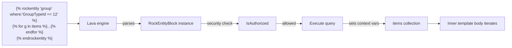

# Writing Lava Blocks and Tags

## Overview

A Lava **block** wraps content with `...`, runs logic, and optionally rewrites the wrapped content into the output. A Lava **tag** is the inline equivalent (`` with no closing tag). Both are heavier than filters: they can have side effects (database queries, cache writes, workflow launches), they can be security-gated (different permissions per block), and they can produce content that itself goes through Lava rendering. Built-in examples include `` (entity query), `` (database), `` (output caching), `` (Lava code execution), `` (workflow trigger).

## Why It Exists

Some operations are too rich for filters: they take many parameters, they produce structured collections that subsequent template code iterates, they have side effects that need careful security gating. Modeling these as blocks (with discoverable parameters and per-block security) is the right authoring surface; squeezing them into filters would overload the filter shape.

The security-gating fix in commit `02bf3ca13b` (Fixes #6494, 2025-10-29) is a reminder of why per-block security matters: some commands' security settings were not being enforced, and blocks could use commands they should not have. The fix tightened the enforcement.

## Mental Model



A block's lifecycle: parse the args, check security, run the logic, set the context variables the inner body uses. The inner template body then renders with those variables in scope.

Tags are similar but produce one-shot output without an inner body.

## What You Need to Know

**Built-in blocks are listed in `Rock/Lava/Blocks/`.** Browse for examples. The most-used: `RockEntityBlock`, `RockEntityModifyBlock`, `RockEntityDeleteBlock`, `SqlBlock`, `ExecuteBlock`, `CacheBlock`, `WorkflowActivateBlock`, `WebRequestBlock`, `PersonalizeBlock`, `InteractionWriteBlock`, `JavascriptBlock`, `StylesheetBlock`, `SearchBlock`, `JsonPropertyBlock`, `SetCultureBlock`.

**Block security is opt-in per-block.** Each block has a `SecurityActionAttribute` or equivalent that names the security action to check. Templates can be gated globally (the `EnabledLavaCommands` block setting), per-block (the security action), or per-template-author (the standard authorization).

**Some blocks are security-critical.** `Sql`, `Execute`, `WebRequest`, and `RockEntityModify` / `RockEntityDelete` should NEVER be enabled for templates authored by untrusted users. Commit `02bf3ca13b` fixed cases where the security setting was being silently bypassed. Verify template-author trust before enabling these blocks.

**Block parameters use the named-argument syntax.** `` parses `'group'` as the entity name, `where:'...'` and `iterator:'items'` as named args. The block author parses the arg list in `OnInitialize` (DotLiquid) or the equivalent Fluid hook.

**The inner body iterates over the block's output.** `RockEntityBlock` sets `items` (or the configured `iterator:` name) in the context. The body is then `...`.

**Custom blocks must support both engines (typically).** The Fluid migration is in progress; new blocks should target Fluid first. DotLiquid compatibility comes from implementing the legacy `IRockLavaBlock` interface in addition to the Fluid block hook.

**Block lifecycle hooks differ per engine.** Fluid: implement the appropriate Fluid block interface. DotLiquid: implement `IRockLavaBlock` and the standard `Block` hooks (`Render`, `OnInitialize`, etc.). Most blocks have both.

**`` is the output-caching block.** Wraps content; caches the rendered output for the configured duration. Custom caching strategies should consider this block before building one-off cache logic.

**`` calls into Lava Applications.** Since `f009b63942` (Fixes #6633), querystrings appended to the route parameter are correctly parsed.

**`` (since `5a647a0d9e`, 2026-03-04) sends ZPL content to a Zebra printer.** Useful for label-printing flows from Lava templates.

**Custom tags are similar to blocks but without `endX`.** Implement the tag interface; parse args; produce output. Used for one-shot operations (e.g., write an interaction record).

**Document custom blocks heavily.** Block authors are not the same people as template authors; the template authors need clear "what does this block do" docs. Comment liberally.

## Common Scenarios

**"Add a custom block that sends a Slack message."**

```csharp
[LavaShortcodeMetaData(...)]
public class SlackBlock : RockLavaBlockBase
{
    protected override void OnInitialize() { /* parse args */ }
    public override void Render(...) { /* call Slack API, optionally render output */ }
}
```

Register the block. Configure security (`SlackBlock` should be gated like `WebRequestBlock`).

**"Use the existing `rockentity` block to query."** `{{ g.Name }}`.

**"Cache an expensive Lava fragment."** `<expensive content>`.

**"Run a SQL query."** `SELECT * FROM ...`. Iterate the resulting `results` (or configured iterator name).

**"Launch a workflow from a Lava template."** ``.

**"Write an interaction event."** ``.

**"Create a custom tag that emits formatted output."** Implement the tag interface; parse args; emit a string. Simpler than a block (no inner body).

## Key Architectural Decisions

### Blocks for side effects, filters for pure transformations

The split keeps each shape clean. A side-effecting filter would surprise template authors who expect filters to be safe.

### Per-block security

Different blocks have different risk profiles. A unified security gate would be too coarse; per-block lets administrators grant exactly what is needed.

### Built-in blocks as classes in `Rock/Lava/Blocks/`

Discoverable, maintainable. The directory is a useful index of what blocks exist.

### Dual-engine support during the Fluid migration

New blocks target Fluid first, but DotLiquid compat is required until the migration completes. Both interfaces implemented per block.

### `` as an explicit opt-in for output caching

Implicit caching would produce stale-content surprises. Explicit `` puts the choice in the template author's hands.

## Considered but Rejected

### Side-effecting filters

Rejected. Side effects belong in blocks for security and clarity.

### Single global security gate

Rejected. Per-block granularity is necessary for safe operation.

### Auto-caching block output

Rejected. Stale-content surprises; explicit `` is correct.

## Technical Reference

### Block Class Hierarchy

| Class | Purpose |
|---|---|
| `IRockLavaBlock` (DotLiquid) | Legacy block interface |
| Fluid block interface | Modern engine block interface |
| `RockLavaBlockBase` (or similar) | Base class with security and helper methods |

### Built-in Blocks (selected)

- `RockEntityBlock`: query Rock entities.
- `RockEntityModifyBlock`, `RockEntityDeleteBlock`: side-effecting variants.
- `SqlBlock`: arbitrary SQL.
- `ExecuteBlock`: Lava code execution.
- `CacheBlock`: output caching.
- `WorkflowActivateBlock`: workflow launches.
- `WebRequestBlock`: outbound HTTP.
- `PersonalizeBlock`: personalization-segment-based content.
- `InteractionWriteBlock`, `InteractionContentChannelItemWriteTag`: interaction recording.
- `CalendarEventsBlock`, `EventScheduledInstanceBlock`: event/calendar data.
- `JavascriptBlock`, `StylesheetBlock`: emit script and style markup.
- `SearchBlock`, `JsonPropertyBlock`, `SetCultureBlock`, `ObserveBlock`: utility blocks.
- `RenderLavaEndpoint`: call into Lava Applications.
- `PrintZplBlock`: Zebra printer output.

### Built-in Tags (selected)

- `ReturnTag`: return early from a Lava endpoint.
- `TagListTag`: ?
- `InteractionIntentWriteTag`, `InteractionContentChannelItemWriteTag`.

### Affected Areas

Custom blocks become available globally; templates that reference them by name parse and run the new block. Security configuration may need to be updated per block.

### Related Docs

- [docs/lava/lava-overview.md](lava-overview.md)
- [docs/lava/writing-filters.md](writing-filters.md) for the lighter-weight transform shape.
- [docs/lava/shortcodes.md](shortcodes.md) for database-backed alternatives.

## Recent Impactful Changes

- **2026-04-15** ([commit `470f98331c`](https://github.com/SparkDevNetwork/Rock/commit/470f98331c)). Fixed Lava `~~/` includes failing when used from inside a Job context.
- **2026-03-04** ([commit `5a647a0d9e`](https://github.com/SparkDevNetwork/Rock/commit/5a647a0d9e)). New `PrintZpl` Lava block sends ZPL content directly to a Zebra printer.
- **2026-01-06** ([commit `f009b63942`](https://github.com/SparkDevNetwork/Rock/commit/f009b63942)). `RenderLavaEndpoint` block correctly parses querystrings in the route parameter (Fixes #6633).
- **2025-10-29** ([commit `02bf3ca13b`](https://github.com/SparkDevNetwork/Rock/commit/02bf3ca13b)). Fixed Lava command security settings not being correctly enforced for some blocks (Fixes #6494).
