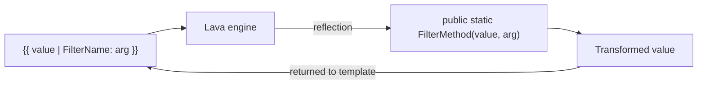

# Writing Lava Filters

## Overview

A Lava filter transforms a value as it flows through a template: `{{ Person.FullName | Upcase }}` runs the `Upcase` filter on the resulting string. Filters are pure C# methods, registered globally, decorated with attributes that tell the Lava engine which name to expose. Rock has hundreds of filters split across domain-specific partials in `Rock/Lava/Filters/`. Adding a new filter is a one-method change in the appropriate partial.

## Why It Exists

Templates need to transform values: format dates, truncate strings, convert ids, look up related entities, format addresses. Forcing every template author to write transformations inline (Lava expressions, conditional logic) would multiply template complexity and security risk. Modeling each transformation as a named filter that admins can use without thinking about the C# behind it is the right authoring surface.

The split across partials (`LavaFilters.Person.cs`, `LavaFilters.Reporting.cs`, etc.) keeps the master file scannable. Hundreds of filters in one file would be unreadable; one partial per domain is the right granularity.

## Mental Model

A filter is a static method (or extension method) returning a new value. The engine resolves the filter by name at template-render time; the method runs once per template invocation per filter use.



For Fluid (the modern engine), filters are registered through the `LavaFilterRegistration` machinery; for legacy DotLiquid, the `Liquid` reflection picks up methods by convention. Most filters are dual-engine compatible because the method shape is the same.

## What You Need to Know

**Filters are static, side-effect-free.** A filter that mutates state (writes to the database, increments a counter) is a misuse. Use a Lava block (Sql, Execute) for side-effecting operations.

**The first parameter is the input value.** Subsequent parameters are filter arguments. `{{ "hello" | Truncate: 3 }}` calls `Truncate(input, length)` with `input = "hello"` and `length = 3`.

**Place new filters in the appropriate partial.** Person-related filters in `LavaFilters.Person.cs`, reporting filters in `LavaFilters.Reporting.cs`, etc. The master `LavaFilters.cs` is for cross-domain or general-purpose filters. Resist the urge to put every new filter in the master file.

**Identifier filters accept multiple key forms.** Filters like `IsInDataView` (per commit `1c2ac99587`, 2025-08-29) accept an `int`, `Guid`, or `IdKey` for entity references. New filters that take an entity reference should follow the pattern. See [docs/core/entity-reference-resolution.md](../core/entity-reference-resolution.md).

**The `FromIdHash` filter accepts plain ids.** Since `9b17dc079c`, `FromIdHash` returns the integer directly when given a plain (non-hashed) id string. Templates can pass either form without conditional logic. Custom filters dealing with id strings should follow the pattern.

**`Where` filter accepts a `contains` comparison parameter.** Since `28da02625b` (2026-03-09), the `Where` filter has an optional comparison parameter for partial matching: `{{ items | Where: 'Name', 'Foo', 'contains' }}`. Useful for partial-substring filters in templates.

**Date filters must respect Daylight Saving Time.** The `DatesFromICal` DST bug (`d7def2d156`, Fixes #6626) is the cautionary tale: returning UTC offsets that differed across DST boundaries broke iCal-derived schedule rendering. Custom date filters should test cross-DST boundary cases.

**Filters are dual-engine in most cases.** A filter that works in the Fluid engine usually also works in DotLiquid. Edge cases (forloop variables, certain expression types) sometimes differ; commit `c7818bdeda` (Fixes #6281) is one of the parity fixes (`forloop.rindex`).

**Filter security is light by default.** Most filters are safe (formatting, conversion). Filters that access sensitive data (private attributes, internal IDs) should consult security explicitly: do not assume all template authors are trusted. Filters that perform expensive operations (database queries inside the filter) should also document the cost; a filter called inside a `for` loop multiplies the cost.

**Adding a new filter requires just a method.** Decorate with the appropriate attribute, place in the right partial, build. The engine picks up the new filter on next template render.

**Test filters in isolation.** Filters are pure functions; unit-testing them is trivial. The Rock test infrastructure has Lava test helpers; new filters should ship with tests.

## Common Scenarios

**"Add a filter to format a phone number."**

```csharp
// In LavaFilters.Text.cs (or LavaFilters.Person.cs):
public static string FormatPhoneNumber( string number )
{
    if ( number.IsNullOrWhiteSpace() ) return string.Empty;
    // ... format logic ...
    return formatted;
}
```

Add the appropriate Fluid registration call if needed. Build. Use as `{{ phoneString | FormatPhoneNumber }}` in templates.

**"Add a filter that takes an entity-id-or-key and returns the entity."**

Follow the identifier-filter pattern. Accept `string` (or `object`); resolve int / Guid / IdKey via the same `Service<T>.GetQueryableByKey` logic. See `LavaFilters.Identifiers.cs` for examples.

**"Add a filter that fetches related data."**

Use sparingly. Filters in tight loops multiply database hits. If the filter is unavoidable, cache aggressively per-request. For bulk relational lookups, prefer a Lava block (``) which is more honest about its cost.

**"Test a custom filter."**

Use the `LavaTestHelper` (or equivalent test fixture). Render a small template with the filter; assert the output. Test edge cases (null input, type mismatches, empty collections).

**"Report on filter usage across templates."**

The Lava template cache logs unique templates parsed; a custom audit can scan persisted templates (Communication body, ContentChannelItem, etc.) for filter names. Not built-in; custom tooling.

## Key Architectural Decisions

### Static methods, side-effect-free

Lets the engine call filters in any order, parallel-safe, cacheable.

### Domain-partial organization

Master file would be unreadable with hundreds of filters; partials per domain are the right granularity.

### Identifier filters accept multiple key forms

Aligns with the `GetQueryableByKey` pattern. Templates do not need to know whether they have an int or an IdKey.

### Dual-engine compatibility

Same method shape works in both engines. Eases the Fluid migration; both engines run the same filter code.

### Filter security is opt-in for sensitive cases

Most filters are safe; security is the caller's responsibility for expensive or sensitive operations.

## Considered but Rejected

### Side-effecting filters

Rejected. Side effects belong in Lava blocks, not filters.

### One filter per file

Rejected. Per-file overhead would balloon the project.

### Per-template filter registration

Rejected. Global registration is simpler and matches the "filters are universal helpers" expectation.

## Technical Reference

### Filter Partials

| Partial | Domain |
|---|---|
| `LavaFilters.cs` | Master / general |
| `LavaFilters.Person.cs` | Person-related (FullName, Address, PhoneNumber) |
| `LavaFilters.Reporting.cs` | DataView / report (`IsInDataView`) |
| `LavaFilters.EntitySets.cs` | Entity set utilities |
| `LavaFilters.Identifiers.cs` | Hashed-id helpers (`FromIdHash`, `ToIdHash`) |
| `LavaFilters.Personalization.cs` | Segment membership, personalization |
| `LavaFilters.Text.cs` | String utilities |
| `LavaFilters.AIAgent.cs` | AI-related filters |

### Standard Idiom

```csharp
public static class LavaFilters
{
    /// <summary>Filter description here.</summary>
    public static string MyFilterName( string input, int arg )
    {
        if ( input.IsNullOrWhiteSpace() ) return input;
        // transform
        return result;
    }
}
```

### Engine Differences

- Fluid: explicit registration through the engine factory (`Rock/Lava/Fluid/`).
- DotLiquid: reflection-based discovery; method must be public static.

Most filters work in both without per-engine code.

### Affected Areas

Custom filters become available globally to every template. Communication bodies, content channel items, system communications, attribute formatters, and dynamic blocks all see new filters immediately.

### Related Docs

- [docs/lava/lava-overview.md](lava-overview.md)
- [docs/lava/writing-blocks.md](writing-blocks.md) for side-effecting blocks instead of filters.
- [docs/lava/the-fluid-migration.md](the-fluid-migration.md) for engine differences.

## Recent Impactful Changes

- **2026-03-09** ([commit `28da02625b`](https://github.com/SparkDevNetwork/Rock/commit/28da02625b)). `Where` filter gained an optional `contains` comparison parameter for partial value matching.
- **2026-03-04** ([commit `db2234ff8e`](https://github.com/SparkDevNetwork/Rock/commit/db2234ff8e)). New `ToBase64` filter for arbitrary string/byte encoding.
- **2026-01-02** ([commit `d7def2d156`](https://github.com/SparkDevNetwork/Rock/commit/d7def2d156)). `DatesFromICal` filter now accounts for Daylight Saving Time correctly when generating timestamps (Fixes #6626).
- **2025-08-29** ([commit `1c2ac99587`](https://github.com/SparkDevNetwork/Rock/commit/1c2ac99587)). `IsInDataView` filter accepts data view id as int, Guid, or IdKey in addition to string.
- **2025-07-23** ([commit `9b17dc079c`](https://github.com/SparkDevNetwork/Rock/commit/9b17dc079c)). `FromIdHash` filter returns the integer directly when given a plain (non-hashed) id string.
