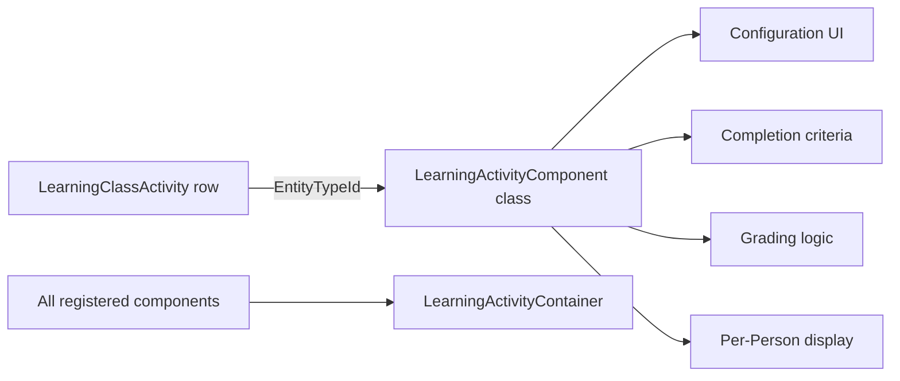

# LMS Activity Components

## Overview

A LMS Learning Activity is a typed unit of work in a class: read a content article, watch a video, take a quiz, upload a file, acknowledge a statement. Each type is implemented as a `LearningActivityComponent` subclass; the activity entity references the component via `EntityTypeId`. Built-in components ship for common activities; custom components extend the system. The component handles its own configuration, completion criteria, grading logic, and data display. The container (`LearningActivityContainer`) discovers registered components.

## Why It Exists

Different activity types have fundamentally different shapes: a video has a watch-completion-percentage threshold; a file upload has artifact-retention concerns; an assessment has scoring; an acknowledgment is a single click. Modeling all in one entity with conditional logic would have been hostile to maintainers; the component pattern lets each shape live in its own class.

The recent fix wave addresses real component-specific issues: file uploads were being deleted before grading (`1c410e56e9`, Fixes #6359, 2025-06-27); late detection used grade time instead of submission time (`ef0c011535`, Fixes #6710, 2026-03-05). Each fix is in the appropriate component, not in shared activity logic.

## Mental Model

The activity row references its component class. The component renders its own configuration UI, evaluates completion / grading, and produces the per-Person display surface.

## What You Need to Know

**Each component is one class.** Subclass `LearningActivityComponent`. Implement abstract methods: configuration, render, evaluate completion, grade if applicable.

**Container is the registry.** `LearningActivityContainer` discovers registered components via the standard EntityType registration. New components become available immediately.

**Built-in components cover common cases.** Acknowledgment, Assessment (with PointAssessment variant), ContentArticle (added 2025-07-09 in `0a2660ba94`), FileUpload, VideoWatch.

**File uploads persist until graded.** Pre-fix `1c410e56e9` (Fixes #6359, 2025-06-27), uploaded files were deleted after two days regardless of grading status. The fix keeps files until grading completes.

**Late detection uses submission time.** Pre-fix `ef0c011535` (Fixes #6710, 2026-03-05), an activity submitted before due date but graded after was incorrectly marked late. The fix uses submission timestamp.

**Grading is per-component.** AssessmentComponent has built-in scoring; FileUploadComponent supports manual grading; AcknowledgmentComponent is binary done/not-done.

**Custom components handle deployment-specific learning shapes.** A custom "Reflection Journal" component, a custom "Meeting With Mentor" component, etc. Each is one class.

**Component configuration is per-activity-instance.** A LearningClassActivity row holds the per-instance configuration values; the component reads them via the standard attribute system.

**Activity completions persist as `LearningClassActivityCompletion`.** Per-Person, per-activity row tracking the work and result. Reports query for graded / late / not-yet-submitted.

**Completion can trigger workflows.** A completed activity can launch a workflow (badge award, next-step notification, instructor-grade-needed alert).

## Common Scenarios

**"Add a video-watch activity to a class."** Course / Class / Activity authoring. Pick VideoWatchComponent. Configure video URL and completion threshold. Save.

**"Build a custom 'reflection journal' component."** Subclass LearningActivityComponent. Configuration: prompt text, minimum word count. Completion: word count meets threshold. Grading: optional instructor pass/fail.

**"Grade a file-upload assignment."** Open the LearningClassActivityCompletion. Inspect the uploaded file (preserved since `1c410e56e9`). Apply grade. Submission timestamp is what determines late status (since `ef0c011535`).

**"Configure assessment-style scoring."** AssessmentComponent or PointAssessmentComponent. Define the questions and answers; auto-grading; per-question scoring.

**"Custom completion trigger: external system marks done."** Custom component or custom workflow that creates the completion row. The completion event fires standard workflows.

**"Investigate a late-marked activity that was submitted on time."** Verify the fix `ef0c011535` is in your build. Pre-fix, late status used grade time instead of submission time.

## Key Architectural Decisions

### Component pattern for activity types

Different shapes need different code. Pluggable components match the rest of Rock's extension model.

### Container for discovery

Standard EntityType registration; new components become available without core changes.

### Configuration via attributes

Per-activity configuration values use the standard attribute system; admins author through the standard UI.

### Per-component grading logic

Each component knows how to evaluate its own completion / grade. Generic logic would have been awkward.

### Completion as separate entity

Per-Person, per-activity rows let reporting query each independently.

## Considered but Rejected

### Single Activity entity with conditional logic

Rejected. Different shapes; unmaintainable.

### Hardcoded component types

Rejected. Per-deployment custom learning shapes are universal.

### Auto-deletion of uploaded files

Rejected (since `1c410e56e9`). Files must persist through grading.

## Technical Reference

### Component Base

`LearningActivityComponent` ([Rock/Lms/LearningActivityComponent.cs](../../Rock/Lms/LearningActivityComponent.cs)):
- `IconCssClass`, `Description`
- `EnableTimeEstimate`, `EnableDueDate`
- `RenderConfiguration`, `RenderViewer`, `RenderEditor`
- `EvaluateCompletion`
- `GradeCompletion`

### Built-in Components

| Component | Purpose |
|---|---|
| `AcknowledgmentComponent` | Single-click acknowledgment |
| `AssessmentComponent` | Quiz with auto-grading |
| `PointAssessmentComponent` | Point-weighted assessment |
| `ContentArticleComponent` | Read a content article (added `0a2660ba94`) |
| `FileUploadComponent` | Submit a file artifact |
| `VideoWatchComponent` | Watch a video with completion threshold |

### Container

`LearningActivityContainer` ([Rock/Lms/LearningActivityContainer.cs](../../Rock/Lms/LearningActivityContainer.cs)): standard component container; discovers registered components.

### Affected Blocks

- **Admin:** Learning Class Activity Detail, Learning Class Activity List.
- **Public:** Public Learning Class Workspace.

### Related Docs

- [docs/lms/lms-overview.md](lms-overview.md)
- [docs/lms/grading-systems.md](grading-systems.md)
- [docs/lms/public-block-security.md](public-block-security.md)

## Recent Impactful Changes

- **2026-03-05** ([commit `ef0c011535`](https://github.com/SparkDevNetwork/Rock/commit/ef0c011535)). Activity completion uses submission time, not grade time, for late detection (Fixes #6710).
- **2025-07-09** ([commit `0a2660ba94`](https://github.com/SparkDevNetwork/Rock/commit/0a2660ba94)). New Content Article Learning Activity component.
- **2025-06-27** ([commit `1c410e56e9`](https://github.com/SparkDevNetwork/Rock/commit/1c410e56e9)). File-upload activities preserve files until grading completes (Fixes #6359).
