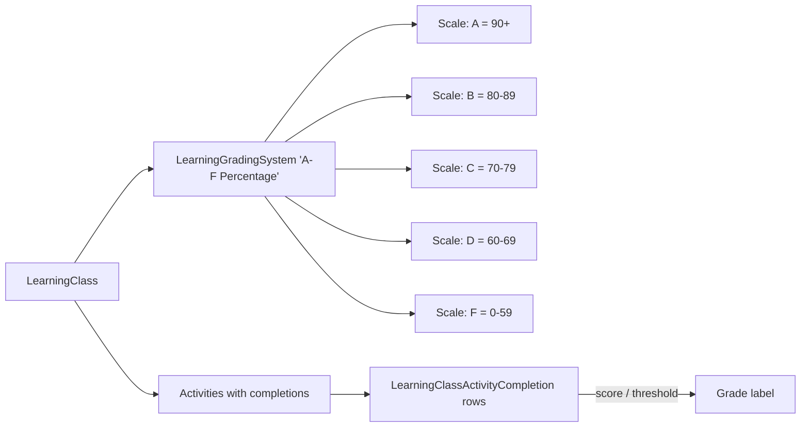

# LMS Grading Systems

## Overview

A `LearningGradingSystem` defines how activity scores translate to grades: A/B/C/D/F based on percentage thresholds, pass/fail, custom labels. `LearningGradingSystemScale` rows are the threshold-to-grade mappings. Each `LearningClass` references a grading system; per-Activity completions get graded against it. Completion statistics aggregate per-Class and per-Activity. Program KPIs (`LearningProgramKpis`) roll up across the program.

## Why It Exists

Different church training programs need different grading conventions: a discipleship class might use Pass/Fail; a leadership-development program might use percentage-based grades; a children's curriculum might use stars or completion-only. Hardcoding one system would force every deployment to use that style; configuration-as-data with per-class assignment lets each program pick.

## Mental Model

A grading system has scales (thresholds with labels). The class references the system. Per-activity completion scores get mapped to grade labels via the scale.

## What You Need to Know

**Multiple grading systems can be configured.** Different classes use different systems; each grading system is independent.

**`LearningGradingSystemScale` rows are the thresholds.** A scale has a percentage threshold and a label; the rendering logic finds the scale matching the score.

**Pass/Fail is one scale row.** A grading system with a single "Pass" scale at 70%+ and an implicit Fail below; or two scales (Pass / Fail).

**Per-activity completion stores the score.** `LearningClassActivityCompletion` has the points-earned. The grade label is derived from the system at display time.

**Total class grade aggregates activity completions.** Summed-points / total-possible math, with grade-label lookup. Aggregation logic is in the class display.

**`LearningClassActivityCompletionStatistics` aggregates per-activity.** Per-Class statistics: completion rate, average score, distribution. Useful for instructor dashboards.

**`LearningProgramKpis` rolls up across the program.** Program-level metrics: total enrolled, completed, in-progress, dropped. Used by Program Detail analytics.

**Configurable per-Activity weight.** Some activities count more than others; weighted scoring. Grading logic respects the weights.

**Grading is instructor-driven for some components, automatic for others.** AssessmentComponent grades automatically; FileUploadComponent requires instructor evaluation; AcknowledgmentComponent is binary done/not-done.

**Late submissions can incur penalties.** Configurable per-class. Pre-fix `ef0c011535`, late detection used grade time; the fix uses submission time. Custom penalty logic lives in the grading-evaluation path.

**Completion grading-systems context.** Pre-fix `383989e398` (Fixes #6567, 2025-11-07), the "Communication Preference" option appeared even when no class activity sent communication. The fix scopes appearance correctly. Tangential to grading but illustrates the per-class configuration awareness.

## Common Scenarios

**"Configure a grading system for a discipleship class."** LearningGradingSystem "Pass/Fail". Add a single scale "Pass" with threshold 70%. Reference from the Class.

**"Configure A-F percentage grading."** LearningGradingSystem "A-F". Add scales: A 90+, B 80-89, etc. Reference from the Class.

**"Custom grading: stars."** LearningGradingSystem "Stars". Scales: 5 stars 90+, 4 stars 75-89, etc. Reference from the Class.

**"View class grade distribution."** Use `LearningClassActivityCompletionStatistics` or the built-in Class analytics surface (refreshed in `8aadf06f08`).

**"Implement late-submission penalty."** Custom code in the completion-evaluation path. Read submission datetime vs due date; apply penalty.

**"Audit per-Person grade history."** Query `LearningClassActivityCompletion` for the Person across classes.

## Key Architectural Decisions

### Configurable grading systems

Different programs need different grading. Configuration-as-data is right.

### Per-Class system reference

Same program can have different grading systems for different classes (a level-1 might be Pass/Fail; a level-3 might be A-F).

### Per-activity completion as the unit

Class-level grading composes activity completions; modeling at the activity level gives reporting flexibility.

### Auto vs instructor grading per component

Each activity component knows how to grade its own work; some auto, some manual.

### Statistics aggregation outside the entity

`LearningClassActivityCompletionStatistics` is a separate aggregation type, not on the entity. Reporting-driven, not entity-internal.

## Considered but Rejected

### Hardcoded grading

Rejected. Per-program flexibility required.

### Single grading system per program

Rejected. Per-class flexibility within a program is desirable.

### Always-instructor grading

Rejected. Auto-grading for assessments is a major time-saver.

## Technical Reference

### Schema (relevant subset)

`LearningGradingSystem`:
- `Name`, `Description`
- `IsPassFail` flag for shorthand systems
- Configuration

`LearningGradingSystemScale`:
- `LearningGradingSystemId`
- `Name` (the grade label: A, B, Pass, etc.)
- `ThresholdPercentage`
- `IsPassing`

`LearningClassActivityCompletion`:
- `LearningClassActivityId`
- `Student PersonAliasId`
- `PointsEarned`, `IsLate`, `IsStudentCompleted`, `IsFacilitatorCompleted`
- `CompletedDateTime`, `DueDate`
- `Notes`, `BinaryFileId` (for file uploads)

### Aggregation

`LearningClassActivityCompletionStatistics` ([Rock/Lms/LearningClassActivityCompletionStatistics.cs](../../Rock/Lms/LearningClassActivityCompletionStatistics.cs)): per-Class activity statistics.

`LearningProgramKpis` ([Rock/Lms/LearningProgramKpis.cs](../../Rock/Lms/LearningProgramKpis.cs)): program-level KPIs.

### Affected Blocks

- **Admin:** Learning Grading System Detail/List, Learning Grading System Scale Detail/List.
- **Operational:** Learning Class Activity Completion Detail/List, Learning Class Detail (grading panel).

### Related Docs

- [docs/lms/lms-overview.md](lms-overview.md)
- [docs/lms/activity-components.md](activity-components.md) for the grading-relevant components.
- [docs/lms/public-block-security.md](public-block-security.md)

## Recent Impactful Changes

- **2026-03-05** ([commit `ef0c011535`](https://github.com/SparkDevNetwork/Rock/commit/ef0c011535)). Late detection by submission time, not grade time (Fixes #6710).
- **2025-11-07** ([commit `383989e398`](https://github.com/SparkDevNetwork/Rock/commit/383989e398)). Communication Preference option appears only when at least one activity sends communication (Fixes #6567).
