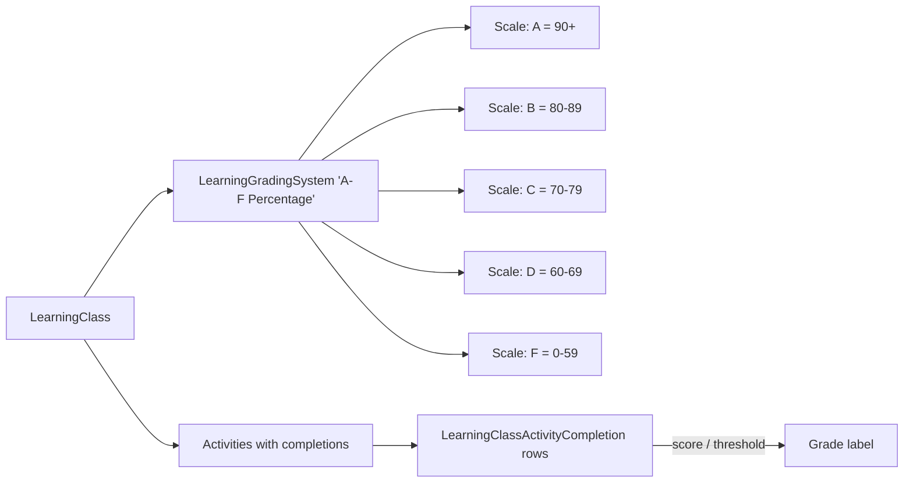

# LMS Grading Systems

## Overview

A `LearningGradingSystem` defines how activity scores translate to grades: A/B/C/D/F based on percentage thresholds, pass/fail, custom labels. `LearningGradingSystemScale` rows are the threshold-to-grade mappings. Each `LearningClass` references a grading system; per-Activity completions get graded against it. Completion statistics aggregate per-Class and per-Activity. Program KPIs (`LearningProgramKpis`) roll up across the program.

## Why It Exists

Different church training programs need different grading conventions: a discipleship class might use Pass/Fail; a leadership-development program might use percentage-based grades; a children's curriculum might use stars or completion-only. Hardcoding one system would force every deployment to use that style; configuration-as-data with per-class assignment lets each program pick.

## Mental Model

A grading system has scales (thresholds with labels). The class references the system. Per-activity completion scores get mapped to grade labels via the scale.

Retakes sit on top of this. A scored activity can carry a **Retake Threshold** (a point value). A submission that finishes below the threshold is reset to a fresh attempt instead of keeping the failing score: auto-graded activities reset the moment the score lands, and facilitator-graded activities reset when the facilitator assigns a retake. A reset deletes the prior attempt outright (no versioning), so the activity simply reads as not-yet-completed again.

## What You Need to Know

**Multiple grading systems can be configured.** Different classes use different systems; each grading system is independent.

**`LearningGradingSystemScale` rows are the thresholds.** A scale has a percentage threshold and a label; the rendering logic finds the scale matching the score.

**Pass/Fail is one scale row.** A grading system with a single "Pass" scale at 70%+ and an implicit Fail below; or two scales (Pass / Fail).

**Per-activity completion stores the score.** `LearningClassActivityCompletion` has the points-earned. The grade label is derived from the system at display time.

**Total class grade aggregates activity completions.** Summed-points / total-possible math, with grade-label lookup. Aggregation logic is in the class display.

**`LearningClassActivityCompletionStatistics` aggregates per-activity.** Per-Class statistics: completion rate, average score, distribution. Useful for instructor dashboards.

**`LearningProgramKpis` rolls up across the program.** Program-level metrics: total enrolled, completed, in-progress, dropped. Used by Program Detail analytics.

**Configurable per-Activity weight.** Some activities count more than others; weighted scoring. Grading logic respects the weights.

**Grading is instructor-driven for some components, automatic for others.** AssessmentComponent grades automatically; FileUploadComponent requires instructor evaluation; AcknowledgmentComponent is binary done/not-done.

**A Retake Threshold can gate a failing score.** `LearningClassActivity.RetakeThreshold` (nullable points) is the minimum a student must earn to avoid a retake; null disables retakes for that activity. The activity editor rejects a threshold greater than the activity's `Points`. Only scored components expose the field (see [activity-components.md](activity-components.md)).

**Retake eligibility is one comparison on the completion.** `LearningClassActivityCompletion.IsScoreBelowRetakeThreshold` (internal) is true only when the activity has a threshold and the completion has a final `PointsEarned` below it. A null threshold or an unscored completion returns false, so a retake is never warranted until there is a score to compare. It answers only "is this below threshold"; it does not decide or act.

**Two paths assign a retake; both delete the attempt.** Auto-graded activities assign automatically in the student workspace when the score lands below threshold and no facilitator has touched the completion. Facilitator-graded activities surface an Assign Retake choice while grading. Either way, `LearningClassActivityCompletionService.AssignRetake` deletes the completion (and any uploaded file), clears the participant's completion date, and resets completion status to Incomplete; saving then recomputes class grades through the completion save hook.

**A class is not "complete" while any activity is ungraded.** This is general, not retake-specific. `UpdateClassGrades` forces `LearningCompletionStatus` to Incomplete while any assignment is ungraded, so neither a program-completion record nor a completion workflow (both keyed off Pass) can fire prematurely. The student-facing success screen and completion banner are likewise withheld client-side until every activity is completed and graded.

**Late submissions can incur penalties.** Configurable per-class. Pre-fix `ef0c011535`, late detection used grade time; the fix uses submission time. Custom penalty logic lives in the grading-evaluation path.

**Completion grading-systems context.** Pre-fix `383989e398` (Fixes #6567, 2025-11-07), the "Communication Preference" option appeared even when no class activity sent communication. The fix scopes appearance correctly. Tangential to grading but illustrates the per-class configuration awareness.

## Common Scenarios

**"Configure a grading system for a discipleship class."** LearningGradingSystem "Pass/Fail". Add a single scale "Pass" with threshold 70%. Reference from the Class.

**"Configure A-F percentage grading."** LearningGradingSystem "A-F". Add scales: A 90+, B 80-89, etc. Reference from the Class.

**"Custom grading: stars."** LearningGradingSystem "Stars". Scales: 5 stars 90+, 4 stars 75-89, etc. Reference from the Class.

**"View class grade distribution."** Use `LearningClassActivityCompletionStatistics` or the built-in Class analytics surface (refreshed in `8aadf06f08`).

**"Implement late-submission penalty."** Custom code in the completion-evaluation path. Read submission datetime vs due date; apply penalty.

**"Audit per-Person grade history."** Query `LearningClassActivityCompletion` for the Person across classes.

**"Require a passing score with a retake."** Set the activity's Retake Threshold to the minimum passing points. Auto-graded activities reset a failing submission on the spot with an in-workspace warning; facilitator-graded activities show an Assign Retake choice while grading and email the student a "Retake Required" notice when one is assigned.

## Key Architectural Decisions

### Configurable grading systems

Different programs need different grading. Configuration-as-data is right.

### Per-Class system reference

Same program can have different grading systems for different classes (a level-1 might be Pass/Fail; a level-3 might be A-F).

### Per-activity completion as the unit

Class-level grading composes activity completions; modeling at the activity level gives reporting flexibility.

### Auto vs instructor grading per component

Each activity component knows how to grade its own work; some auto, some manual.

### Retake eligibility as a completion property, not per-component

The threshold comparison is component-independent, so it lives once on the completion (`IsScoreBelowRetakeThreshold`) rather than as a per-component override. The auto path layers on the generic guards (`RequiresGrading == false`, `GradedByPersonAliasId == null`); the Assessment short-answer case falls out for free, because `PointsEarned` is null while items await grading.

### Retakes delete the prior attempt

Activation deletes the completion outright rather than versioning it. The model assumes one completion per student per activity, and the feature explicitly does not retain prior attempts, which keeps grade calculation and reporting unchanged.

### Statistics aggregation outside the entity

`LearningClassActivityCompletionStatistics` is a separate aggregation type, not on the entity. Reporting-driven, not entity-internal.

## Considered but Rejected

### Hardcoded grading

Rejected. Per-program flexibility required.

### Single grading system per program

Rejected. Per-class flexibility within a program is desirable.

### Always-instructor grading

Rejected. Auto-grading for assessments is a major time-saver.

### Store the retake threshold as a percentage

Rejected. The grading UI and `Points` are point-based ("out of 10"); a point threshold keeps the facilitator's mental model consistent and avoids percent-versus-points rounding ambiguity.

### A per-component `DetermineRetakeRequired` virtual

Rejected after first being built. Every component's override was the identical threshold comparison, so the decision collapsed to one completion property. The per-component seam can be reintroduced without a breaking change (the base is `[RockInternal]`) if a future scored component ever needs non-threshold logic.

## Technical Reference

### Schema (relevant subset)

`LearningGradingSystem`:
- `Name`, `Description`
- `IsPassFail` flag for shorthand systems
- Configuration

`LearningGradingSystemScale`:
- `LearningGradingSystemId`
- `Name` (the grade label: A, B, Pass, etc.)
- `ThresholdPercentage`
- `IsPassing`

`LearningClassActivityCompletion`:
- `LearningClassActivityId`
- `Student PersonAliasId`
- `PointsEarned`, `IsLate`, `IsStudentCompleted`, `IsFacilitatorCompleted`
- `CompletedDateTime`, `DueDate`
- `Notes`, `BinaryFileId` (for file uploads)

### Aggregation

`LearningClassActivityCompletionStatistics` ([Rock/Lms/LearningClassActivityCompletionStatistics.cs](../../Rock/Lms/LearningClassActivityCompletionStatistics.cs)): per-Class activity statistics.

`LearningProgramKpis` ([Rock/Lms/LearningProgramKpis.cs](../../Rock/Lms/LearningProgramKpis.cs)): program-level KPIs.

### Retakes

- **Threshold.** `LearningClassActivity.RetakeThreshold` ([Rock/Model/LMS/LearningClassActivity/LearningClassActivity.cs](../../Rock/Model/LMS/LearningClassActivity/LearningClassActivity.cs)), nullable points; null disables retakes. The activity editor rejects a value greater than `Points`.
- **Eligibility.** `LearningClassActivityCompletion.IsScoreBelowRetakeThreshold` ([LearningClassActivityCompletion.Logic.cs](../../Rock/Model/LMS/LearningClassActivityCompletion/LearningClassActivityCompletion.Logic.cs)), internal computed; the single component-independent comparison.
- **Activation.** `LearningClassActivityCompletionService.AssignRetake` ([LearningClassActivityCompletionService.cs](../../Rock/Model/LMS/LearningClassActivityCompletion/LearningClassActivityCompletionService.cs)) deletes the completion and any uploaded `BinaryFile`, clears the participant's `LearningCompletionDateTime`, and sets `LearningCompletionStatus = Incomplete`. The caller saves; the completion save hook's `UpdateClassGrades` recomputes the grade.
- **Auto path.** `PublicLearningClassWorkspace.CompleteActivity` ([Rock.Blocks/Lms/Public/PublicLearningClassWorkspace.cs](../../Rock.Blocks/Lms/Public/PublicLearningClassWorkspace.cs)) assigns automatically when `!RequiresGrading && GradedByPersonAliasId == null && IsScoreBelowRetakeThreshold`, returns a fresh attempt, and sets `IsRetakeAssigned` / `RetakeMessage` on the bag for the in-workspace warning. No email is sent here.
- **Manual path.** The facilitator grading block ([Rock.Blocks/Lms/LearningClassActivityCompletionDetail.cs](../../Rock.Blocks/Lms/LearningClassActivityCompletionDetail.cs)) honors the `IsRetakeAssigned` bag flag on save, then sends the prepared "Retake Required" notification only after the retake commits.
- **Notification.** `LearningClassActivityCompletionService.PrepareRetakeRequiredNotification` builds an email-or-SMS `RockMessage` (recipient preference via `Communication.DetermineMediumEntityTypeId`) from the `LEARNING_ACTIVITY_RETAKE_REQUIRED` system communication, using `LavaDataObject` merge objects (`Activity`, `Class`, `Course`, `Program`). Seeded by migration `202606251440354_AddLearningClassActivityRetakeThreshold` (email body only; add an SMS message and From number to enable SMS delivery).
- **Client gating.** `publicLearningClassWorkspace.obs` withholds the success screen and completion banner until `areAllActivitiesCompleteAndGraded()` (wrapped by the `isClassCompletedAndGraded` computed).

### Affected Blocks

- **Admin:** Learning Grading System Detail/List, Learning Grading System Scale Detail/List.
- **Operational:** Learning Class Activity Completion Detail/List, Learning Class Detail (grading panel).

### Related Docs

- [docs/lms/lms-overview.md](lms-overview.md)
- [docs/lms/activity-components.md](activity-components.md) for the grading-relevant components.
- [docs/lms/public-block-security.md](public-block-security.md)

## Recent Impactful Changes

- **2026-06-25** ([commit `7c0fac73aa`](https://github.com/SparkDevNetwork/Rock/commit/7c0fac73aa)). Configurable per-activity Retake Threshold: a submission scoring below the threshold is reset for a retake, assigned automatically for auto-graded activities or by the facilitator for manually graded ones, with class completion gated until every activity is graded.
- **2026-03-05** ([commit `ef0c011535`](https://github.com/SparkDevNetwork/Rock/commit/ef0c011535)). Late detection by submission time, not grade time (Fixes #6710).
- **2025-11-07** ([commit `383989e398`](https://github.com/SparkDevNetwork/Rock/commit/383989e398)). Communication Preference option appears only when at least one activity sends communication (Fixes #6567).

## Related Specs

- [LMS Assessment Retakes](../../specs/completed/lms/260623-lms-assessment-retakes.md) (2026-06-23, Jason Hendee)
