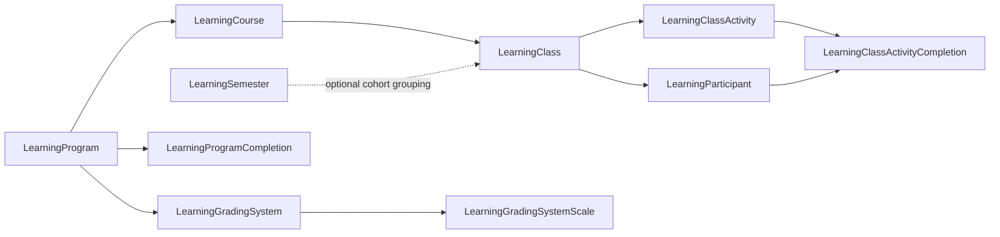

# LMS Domain Overview

## Overview

LMS is Rock's Learning Management System: programs, courses, classes, semesters, activities, completions, and grading. Used for staff training, volunteer onboarding, theological education, and any structured curriculum a church wants to deliver inside Rock. The model is intentionally academic-shaped: a `LearningProgram` (Foundations) has `LearningCourse`s (Foundations 101, 201) which run as `LearningClass` instances (Spring 2026 cohort) with enrolled `LearningParticipant`s and `LearningClassActivity` completions.

LMS tagging in commit messages is a mix of `+ (LMS)`, `+ (Engagement)` (because LMS shares the Engagement domain folder under `Rock/Model/`), and occasionally `+ (Core)` for cross-cutting fixes.

## Why It Exists

A church training program (volunteer onboarding, leader development, theology classes) needs more structure than the existing Step / Achievement systems provide: per-activity grading, late-submission detection, file uploads with retention, content articles that count for completion, instructor feedback, and class-cohort scoping. Building these on top of generic Step / Group models would have produced a confusing overload of Group semantics.

The activity-component model (`LearningActivityComponent` and its subclasses) exists because activities differ in their interaction shape: a video-watch records seconds-watched, an acknowledgment is a single click, a file upload retains the artifact for grading, an assessment scores answers. Each is a distinct component plugged into the same Activity entity.

The recent fixes address operational reality: file uploads were auto-deleted after two days even when ungraded (`1c410e56e9`, Fixes #6359, 2025-06-27); submissions before the due date were marked late if graded after (`ef0c011535`, Fixes #6710, 2026-03-05); communication preference toggles surfaced even when no class activity sent communications (`383989e398`, Fixes #6567). These are all ministry-scenario bugs that the surface area surfaces.

## Mental Model

Five entity layers, academic-shaped:

Activities are typed by component:

| Component | Use case |
|---|---|
| `AcknowledgmentComponent` | Single-click "I acknowledge" steps. |
| `VideoWatchComponent` | Video viewing with completion threshold. |
| `FileUploadComponent` | Submit a file artifact for grading. |
| `AssessmentComponent` / `PointAssessmentComponent` | Quizzes/tests with scoring. |
| `ContentArticleComponent` | Read a content article (added 2025-07-09). |

`LearningSemester` is optional cohort grouping (Spring/Fall/Summer); academic-calendar courses use it heavily, while always-on courses (volunteer onboarding) typically do not.

`LearningProgramKpis` and `LearningClassActivityCompletionStatistics` are precomputed roll-ups for analytics blocks.

## What You Need to Know

**Late detection uses submission time, not grade time.** Pre-fix `ef0c011535`, an activity submitted before the due date but graded after was incorrectly marked late. The fix uses submission timestamp; older completion data may have wrong late flags.

**File uploads persist until graded.** Pre-fix `1c410e56e9`, files were deleted after two days regardless of grading status. The fix keeps files until grading completes.

**Communication Preference shows only when communications are configured.** `383989e398` (Fixes #6567) hid the option for courses without configured communications. Custom course configuration UIs should follow the same pattern.

**Public LMS blocks support security.** Since `b853227029` (2025-09-18), public-external blocks enforce security on programs, courses, and classes. Pre-fix, public visibility was global per block; the fix is per-entity.

**Smart Scroll auto-scrolls activities into view.** Default-on as of `3354bf6c2a` (2026-03-12). Public Learning Class Workspace block setting; can be disabled per placement.

**Academic Calendar courses had admin-permission gaps.** `21852c133a` (Fixes #6352, 2025-06-27) addressed LMS Administrators being unable to create Content pages or Announcements in Academic Calendar courses despite holding the role. Custom permission-checking code should verify against the fix.

**LMS image uploads in CMS editors.** Cross-domain bug (`5c39d14cd4`, 2025-08-13): images uploaded into the content editor for various LMS parts were not being saved correctly and got removed by the Rock Cleanup job. The fix tightens save semantics for that flow.

**Entity Attributes on Learning Course were not saving.** `60745e81c5` (Fixes #6387, 2025-07-31) addressed this. Custom Course-attribute consumers should verify the fix is in place.

**LMS uses a Group-Type-of-LMS pattern in places.** Some Group entities back LMS classes (for member rosters); custom LMS code that touches Group must respect the LMS GroupType conventions.

## Common Scenarios

**"Set up a volunteer onboarding course."** LearningProgram "Volunteer Onboarding" -> LearningCourse "Onboarding 101" -> LearningClass (always-on or cohort). Add Activities (acknowledgment, video, content article, assessment).

**"Grade a file-upload assignment."** Submit -> Instructor reviews -> Grade. The completion timestamp is submission, not grade (since `ef0c011535`).

**"Run an academic-calendar course with a Spring cohort."** LearningSemester "Spring 2026", attach to a LearningClass. Enrollments roll up at semester level for cohort reporting.

**"Show learners a list of available courses publicly."** Public Learning Program List block. Honors security since `b853227029`.

**"Auto-scroll students to the current activity."** Default behavior since `3354bf6c2a`; disable per block setting if undesired.

## Key Architectural Decisions

### Activity component pluggability

Different activities have different interaction shapes; modeling them as components instead of one-big-Activity-table avoids null columns and keeps each shape clean.

### Class as the runtime, Course as the template

Same template-vs-instance pattern as the rest of Rock. Courses can be reused across cohorts without duplication.

### Optional Semester layer

Academic-calendar courses use semesters; always-on courses do not. Making it optional avoids forcing every program through an academic calendar.

### Submission time, not grade time, for late

Late should reflect when the work happened, not when an instructor got around to grading. The fix codifies the rule.

### File retention until grading

Auto-delete before grading would lose ungraded artifacts. The fix retains files until the grade is recorded.

## Considered but Rejected

### One Activity table with all interaction fields

Rejected. Would have produced null-heavy rows and confusing semantics.

### Hard semester-required model

Rejected. Always-on courses are common; forcing them through a semester would have been ceremony for no value.

### Auto-delete files on a fixed schedule regardless of grading

Rejected (since `1c410e56e9`). Files must persist through grading.

## Technical Reference

### Activity Components

`Rock/Lms/`:

- `LearningActivityComponent` (base)
- `LearningActivityContainer` (registry)
- `AcknowledgmentComponent`
- `AssessmentComponent`, `PointAssessmentComponent`
- `ContentArticleComponent`
- `FileUploadComponent`
- `VideoWatchComponent`

### Roll-Up Helpers

- `LearningProgramKpis`
- `LearningClassActivityCompletionStatistics`

### Data Model

LMS entities live under `Rock/Model/Lms/` (note lowercase folder per the path convention) with the standard suite (entity, Logic, Service, SaveHook).

Key entities (model file paths follow the standard convention):

| Entity | Purpose |
|---|---|
| `LearningProgram` | Top-level training program. |
| `LearningProgramCompletion` | Program-finish record. |
| `LearningCourse` | A course within a program. |
| `LearningClass` | A run of a course (semester or always-on). |
| `LearningClassAnnouncement` | Per-class announcements. |
| `LearningClassContentPage` | Static content pages within a class. |
| `LearningClassActivity` | One activity within a class. |
| `LearningClassActivityCompletion` | One participant's completion of an activity. |
| `LearningParticipant` | Enrolled person in a class (with role). |
| `LearningSemester` | Academic-calendar cohort. |
| `LearningGradingSystem` | Grading system configuration. |
| `LearningGradingSystemScale` | Scale (A/B/C/D/F or pass/fail). |

### Affected Blocks and UI Surfaces

- **Public:** Public Learning Class Workspace, Public Learning Program List/Detail, Public Learning Course List.
- **Admin:** Learning Program Detail/List, Learning Course Detail/List, Learning Class Detail/List, Learning Class Activity Detail, Learning Class Activity Completion Detail/List, Learning Participant Detail, Learning Semester Detail/List, Learning Grading System Detail/List/Scale.
- **Engagement:** Learning Program Completion Detail/List.

### Extension Points

- **Custom activity components.** Implement `LearningActivityComponent` and register via the container.
- **Custom grading systems.** `LearningGradingSystem` rows + scales, no code required for typical cases.

### File Index

- `Rock/Model/Lms/` (entities; note lowercase folder)
- `Rock/Lms/` (activity components)
- `Rock.Blocks/Lms/` (Obsidian-aware C# blocks)

## Recent Impactful Changes

- **2026-03-12** ([commit `3354bf6c2a`](https://github.com/SparkDevNetwork/Rock/commit/3354bf6c2a)). Smart Scroll setting added to Public Learning Class Workspace; auto-scrolls the selected Activity content into view. Default-on, configurable per block.
- **2026-03-05** ([commit `ef0c011535`](https://github.com/SparkDevNetwork/Rock/commit/ef0c011535)). Activities submitted before due date are no longer marked late if graded after; completion uses submission time (Fixes #6710).
- **2025-11-07** ([commit `383989e398`](https://github.com/SparkDevNetwork/Rock/commit/383989e398)). "Communication Preference" option appears only when at least one class activity is configured to send communication (Fixes #6567).
- **2025-09-18** ([commit `b853227029`](https://github.com/SparkDevNetwork/Rock/commit/b853227029)). Public LMS blocks (programs, courses, classes) now enforce per-entity security.
- **2025-07-09** ([commit `0a2660ba94`](https://github.com/SparkDevNetwork/Rock/commit/0a2660ba94)). New Content Article Learning Activity type, plus SMS notifications for new learning activities.
