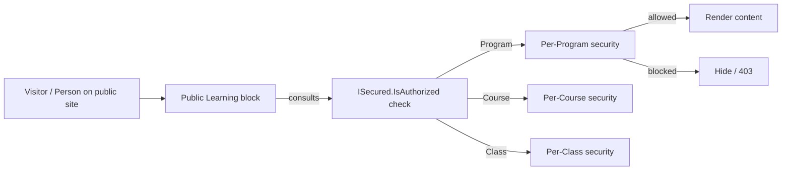

# LMS Public Block Security

## Overview

Rock's LMS exposes public-external blocks (Public Learning Program List, Public Learning Course List, Public Learning Class Workspace) for non-internal-staff access. Since `b853227029` (2025-09-18), these blocks enforce per-entity security: a Person can only see programs / courses / classes they're authorized to view. Pre-fix, public visibility was global per block; the fix scopes per-entity. The Smart Scroll setting (commit `3354bf6c2a`, 2026-03-12) auto-scrolls the active activity content into view for better UX in the Class Workspace.

## Why It Exists

Some training programs are public (open enrollment, anonymous viewing OK); others are restricted (employees only, members only, completed-prerequisite only). Hardcoding all programs as public would expose restricted content; hardcoding all as restricted would block legitimate public programs. Per-entity security gives administrators the right granularity: each program / course / class is configured with appropriate access.

The pre-fix state was a real exposure: programs that should have been restricted were visible because the public blocks did not enforce security. The fix consolidated authorization with the rest of Rock.

## Mental Model



Every public block consults the standard `ISecured` authorization for the entity it surfaces. Anonymous visitors see only public-allowed entities; authenticated visitors see what their roles allow.

## What You Need to Know

**Per-entity security since `b853227029` (2025-09-18).** Public Learning Program List / Course List / Class Workspace consult `Program.IsAuthorized`, `Course.IsAuthorized`, `Class.IsAuthorized` per-entity. Pre-fix, blocks rendered all entities regardless of authorization.

**Standard `ISecured` authorization applies.** Programs / Courses / Classes inherit from `Model<T>` and implement `ISecured`. Configure security via the standard authorization UI: Anonymous Can View, Authenticated Users Can View, specific roles, etc.

**Anonymous access is the default for true-public content.** If a program should be visible to anyone, configure Anonymous Can View. The block surfaces it without requiring login.

**Restricted access requires authentication.** Block "you must log in to view" UX. The block surfaces login prompt for restricted entities.

**Smart Scroll auto-scrolls the active activity (since `3354bf6c2a`, 2026-03-12).** Default-on. The Public Learning Class Workspace block scrolls the selected Activity content into view automatically. Disable per-block setting if undesired.

**Class Workspace is the main learner-facing block.** Full Class participation: view activities, submit work, take assessments. Authorization gates the Class itself.

**Program / Course Lists filter authorized entities.** Anonymous visitors see only public programs; authenticated visitors see what they're authorized for.

**Pre-fix migration concerns.** Sites running pre-fix builds may have exposed restricted content. Audit logs may show unintended access. Migration to a fixed build is the resolution; auditing past exposure may be required.

**Custom public blocks should follow the security pattern.** Authorization checks per-entity, not block-level. Reuse the standard `IsAuthorized` calls.

**Authentication and authorization are separate.** A logged-in Person may not have permission to a specific Program. The block respects both.

## Common Scenarios

**"Make a program publicly visible."** Authorization: Anonymous Can View. Block surfaces to all visitors.

**"Restrict a leadership program to staff."** Authorization: only the "Staff" Group / Role can View. Other Persons see access-denied or it's hidden from listings.

**"Smart-scroll new activity into view."** Default-on since `3354bf6c2a`. Disable per block setting if necessary.

**"Custom public block for a deployment-specific learning experience."** Inherit from the Public Learning block bases. Use standard authorization checks. The block respects per-entity security.

**"Audit pre-fix exposure."** Query the audit logs for accesses to restricted programs prior to the fix date. Investigate accordingly.

**"Per-Class enrollment-only access."** Custom workflow / authorization: only enrolled Persons (`LearningParticipant` rows) get View. Others blocked.

## Key Architectural Decisions

### Per-entity security in public blocks

Per-block security would have been too coarse; per-entity is the right granularity.

### Default to standard `ISecured`

Reuse the existing authorization mechanism; no LMS-specific security.

### Smart Scroll default-on

UX improvement that benefits most learners; configurable per placement.

### Authentication required for restricted

Public blocks gracefully prompt login when accessing restricted entities.

### Custom blocks inherit the pattern

Don't bypass authorization in custom code.

## Considered but Rejected

### Block-level only security

Rejected. Different entities within one block need different access.

### Always-public LMS

Rejected. Restricted programs are a real need.

### LMS-specific authorization mechanism

Rejected. Reusing `ISecured` is consistent with the rest of Rock.

## Technical Reference

### Public Block Locations

`Rock.Blocks/Lms/Public/`:
- `PublicLearningProgramList`
- `PublicLearningCourseList`
- `PublicLearningClassWorkspace`
- Related authorization helpers

### Authorization Pattern

```csharp
if ( !program.IsAuthorized( Authorization.VIEW, currentPerson ) )
{
    // skip / hide / 403
}
```

### Smart Scroll Block Setting

`PublicLearningClassWorkspace` block setting `SmartScroll`. Default true. Disable per placement if needed.

### Affected Blocks

- **Public:** Public Learning Program List, Public Learning Course List, Public Learning Class Workspace.

### Related Docs

- [docs/lms/lms-overview.md](lms-overview.md)
- [docs/lms/activity-components.md](activity-components.md)
- [docs/lms/grading-systems.md](grading-systems.md)

## Recent Impactful Changes

- **2026-03-12** ([commit `3354bf6c2a`](https://github.com/SparkDevNetwork/Rock/commit/3354bf6c2a)). Smart Scroll setting added to Public Learning Class Workspace; default-on, configurable per block.
- **2025-09-18** ([commit `b853227029`](https://github.com/SparkDevNetwork/Rock/commit/b853227029)). Public LMS blocks (programs, courses, classes) now enforce per-entity security.
