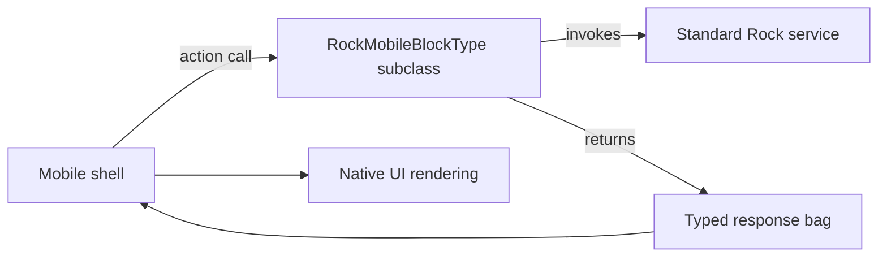

# Mobile Block Type Bases

## Overview

Mobile blocks in Rock subclass `RockMobileBlockType` (or its typed-bag variant). The base class provides the standard plumbing for the mobile shell to invoke server-side actions, render typed bag responses, and handle configuration. Mobile blocks live under `Rock/Blocks/Types/Mobile/` (organized by domain), shadow web blocks where parallel functionality exists, and reuse Rock's services for the underlying logic. The mobile shell renders the UI; this server-side surface is the API.

## Why It Exists

Native mobile UX is too different from web to share rendering: gesture handling, push notifications, offline modes, and platform-specific affordances all matter. Sharing services (the data layer) gives correctness consistency; separate blocks give freedom to design mobile-native flows. The block-type base class encodes the shared mobile-block conventions (action shape, bag response, configuration attributes) so per-block code stays focused on the per-block logic.

## Mental Model



The shell sends action requests; the server-side block runs Rock services; bag responses cross the boundary. The shell renders mobile-natively.

## What You Need to Know

**Inherit from `RockMobileBlockType` or `RockMobileBlockType<TBag>`.** The typed variant declares the response bag type at the base level. The non-typed version is for blocks that don't have a single canonical bag.

**`[BlockAction]` decorates server-side actions.** Same convention as web Obsidian blocks; the mobile shell calls `invokeBlockAction("ActionName", argsBag)` to invoke.

**Shell-side rendering is in the mobile codebase.** This domain only describes the server-side; the mobile shell project has its own block rendering logic for each block type.

**Bag-based responses.** Typed C# POCOs in `Rock.ViewModels/Blocks/...`. The mobile shell consumes them with type-aware deserialization.

**Configuration via `[BlockAttribute]` family.** Same as web blocks; admins configure per-placement settings. The shell receives configuration values via the standard configuration bag.

**Blocks reuse Rock services.** `GroupService`, `PersonService`, `FinancialTransactionService` are the same classes web blocks use. Correctness consistency is the goal.

**Mobile blocks are not the same as web blocks.** A web Connection Request Detail block and a mobile Connection Request Detail block are different code; they share services but not block code. Bug fixes do not auto-propagate.

**`SourceTypeValueId` distinguishes entry channel.** Mobile flows tag entities (Attendance, Person creation) with a mobile source type so reports can distinguish from kiosk / web entries.

**Push notifications integrate via Communication.** Mobile blocks creating notifications go through the standard Communication infrastructure; see [docs/communication/push-notifications.md](../communication/push-notifications.md).

**`PersonalDevice` registration is the device-identity layer.** A device registered via the mobile shell creates a `PersonalDevice` row tying it to a Person. Mobile blocks resolve "who is the current user" through the request context, populated from the device.

**Authentication is shell-driven.** Standard auth; the mobile shell handles login flows. Server-side blocks see the authenticated Person via `RequestContext.CurrentPerson`.

## Common Scenarios

**"Build a custom mobile block."** Inherit from `RockMobileBlockType<TBag>`. Implement actions with `[BlockAction]`. Define the response bag in `Rock.ViewModels/Blocks/Mobile/`. The mobile shell renders.

**"Add a new mobile block to an existing domain."** Drop a new C# class under `Rock.Blocks/Types/Mobile/{Domain}/`. Follow the convention.

**"Pass configuration from the C# block to the shell."** Use `[BlockAttribute]` on the class; the configuration bag carries values to the shell.

**"Reuse logic from a web block."** Extract the logic into a service (or use an existing service); call from both web and mobile blocks.

**"Investigate a mobile block that produces wrong data."** Check the service the block calls; verify the bag fields are populated correctly; compare with the web block (if there is one) to spot drift.

**"Handle a push notification from a mobile block."** Create a Communication of type Push targeting the recipient PersonalDevice. Standard Communication infrastructure routes.

## Key Architectural Decisions

### Separate mobile blocks, shared services

Different surfaces; different UX. Sharing services keeps data correctness consistent.

### Bag-based responses

Typed contract across the C#/JS boundary. Catches shape mismatches at build time.

### Action method discovery via `[BlockAction]`

Standard Rock convention; same pattern as web blocks.

### Configuration via standard attributes

Reuses the existing block-attribute system; admins author per-placement settings the same way.

### Authentication via shell

The mobile shell handles login flows; server-side blocks consume the authenticated context.

## Considered but Rejected

### Mobile blocks rendered on web via webview

Rejected. Performance, UX, and offline support all suffer.

### Auto-generating mobile blocks from web blocks

Rejected. UX needs differ; auto-generated mobile UIs are not usable.

### Shell-side block configuration

Rejected. Standard `[BlockAttribute]` on the C# class keeps configuration discoverable in the standard admin UI.

## Technical Reference

### Class Hierarchy

```
IRockBlockType                      ← root
  IRockMobileBlockType              ← mobile-specific interface
RockBlockType                       ← shared base
  RockMobileBlockType               ← mobile base
  RockMobileBlockType<TBag>         ← typed-bag variant
```

### Standard Idiom

```csharp
[DisplayName("My Mobile Block")]
[Category("My Domain")]
[Description("...")]
[Rock.SystemGuid.EntityTypeGuid("...")]
[Rock.SystemGuid.BlockTypeGuid("...")]
public class MyMobileBlock : RockMobileBlockType<MyResponseBag>
{
    [BlockAction]
    public BlockActionResult MyAction( MyArgsBag args )
    {
        // ... use Rock services ...
        return ActionOk( new MyResponseBag { ... } );
    }
}
```

### Mobile Block Type Folder

`Rock/Blocks/Types/Mobile/{Domain}/`:
- `CheckIn/`, `Cms/`, `Communication/`, `Connection/`, `Core/`, `Crm/`, `Engagement/`, `Events/`, `Finance/`, `Groups/`, `Prayer/`, `Reminders/`, `Security/`, `Workflow/`

### Affected Areas

- **Mobile shell:** consumes the bag responses, renders native UI.
- **PersonalDevice registration:** tracks devices.
- **Push transport:** delivers push notifications.

### Related Docs

- [docs/mobile/mobile-overview.md](mobile-overview.md)
- [docs/mobile/push-notifications.md](push-notifications.md)
- [docs/mobile/personal-device-and-registration.md](personal-device-and-registration.md)
- [docs/core/obsidian-block-lifecycle.md](../core/obsidian-block-lifecycle.md) for the parallel web pattern.

## Recent Impactful Changes

(No release-note-tagged changes specifically to mobile block infrastructure in the last 18 months. The infrastructure is stable; per-block work is in individual domain directories.)
