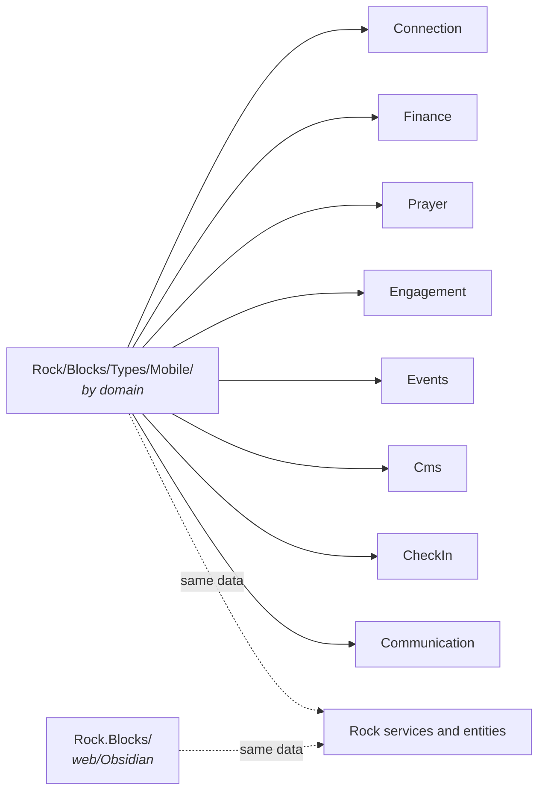

# Mobile Domain Overview

## Overview

Mobile is Rock's native mobile-app block surface, distinct from the Obsidian web blocks. Mobile blocks live under `Rock/Blocks/Types/Mobile/` (organized by domain: Connection, Engagement, Events, Finance, Prayer, Reminders, etc.) and render through the Rock Mobile shell, a separate Xamarin/Maui-based application. The data model and back-end services are shared with the web; the rendering surface is mobile-specific.

## Why It Exists

Churches that distribute a custom mobile app to their congregation need block-equivalent functionality on phones: signups, giving, prayer requests, schedule toolbox, daily challenges. Forcing every web block to also work on mobile would have produced compromised UX everywhere. The Mobile block infrastructure exists so that mobile-native interactions (touch gestures, push notifications, on-device cameras for check-in, offline modes) can be designed for phone first while still using Rock's services and data.

The recent fix wave for mobile Connection Request blocks (`0bd3ec3ad9`, `f52bd2c35b`, `aa49aff6a6`, `4e1e45ff22`, all on 2026-02-09) addressed a class of mobile-only bugs that had accumulated: status-display inconsistencies, wrong name field rendered, activity status sort order, list sort instability. The pattern is "the web block was right; the mobile block was rebuilt and missed parity."

The Outreach Toolbox feature (`9f72c0ab56`, 2026-01-13) is mobile-first by design: the relational-ministry use case (pray for someone, reach out, log a touchpoint) is phone-native.

## Mental Model

Mobile blocks parallel web blocks domain by domain:

A Mobile block is a C# class that:

1. Inherits from `RockMobileBlockType` (or a more specific subclass).
2. Declares its template/layout via XAML or Mobile-shell-specific descriptors.
3. Provides block actions (POST endpoints) that the mobile shell calls.
4. Renders typed bag responses that the shell consumes.

The mobile shell is a separate codebase; this domain is the server-side shape exposed to it.

## What You Need to Know

**Mobile blocks shadow web blocks per domain.** A Connection Request Detail block exists in both; the mobile one is at `Rock/Blocks/Types/Mobile/Connection/ConnectionRequestDetail.cs`, the web equivalents are under `Rock.Blocks/Engagement/`. Bug fixes do not auto-propagate; commits in 2026-02-09 specifically addressed this drift for the Connection blocks.

**Display fields differ on mobile.** Examples: `f52bd2c35b` fixed the activity list to show NickName instead of FirstName; `aa49aff6a6` fixed Activity Status order; `0bd3ec3ad9` fixed status display when "Show Connect Button" was disabled. Mobile blocks need to mirror the web's display rules; mismatches are bugs.

**Sort stability matters more on mobile.** `4e1e45ff22` fixed Connection Request List sort by date; mobile lists scroll continuously and unstable sort produces visible jumps.

**Mobile uses the same services as web.** The data layer is shared: `ConnectionRequestService`, `FinancialTransactionService`, etc. Mobile blocks should not invent new query patterns; they should call the same services.

**Push notifications integrate via Communication.** The `Communication.Push` type plus a registered transport handles mobile push delivery. Custom mobile flows that need to notify should produce Communications, not call mobile shell APIs directly.

**Person identification on mobile uses `PersonalDevice`.** Devices register; the registration ties to a Person. Mobile blocks resolve the current person through the request context, same as web.

**Outreach Toolbox is the canonical "designed for mobile" feature.** Built on `Contact` and `ContactTouchpoint`. The web admin UI exists for setup but the operational surface is the phone.

**Block settings and attribute pickers work, but the rendering is shell-driven.** A mobile block configures its inputs via standard `RockBlock` attribute infrastructure; how those inputs render is the mobile shell's job. Authors should not assume web-style attribute editors.

## Common Scenarios

**"Give to a campaign from the mobile app."** Finance / Giving mobile block. Wraps the same `FinancialTransactionService` paths as the web; UI is mobile-native.

**"Log that I prayed for someone in the Outreach Toolbox."** Outreach Toolbox tap -> creates a `ContactTouchpoint` row with the touchpoint type "Prayer."

**"Add a Prayer Request from mobile."** Prayer Request Detail mobile block; URL parameter resolves the Person (`93a173b138` Fixes #6357 fixed PersonId pre-fill).

**"View my Connection Requests on mobile."** Connection Request List/Detail blocks. Sort by date works correctly since `4e1e45ff22`.

**"Check in to a service from the mobile app."** Mobile check-in flow under `Rock/Blocks/Types/Mobile/CheckIn/`. Same v2 engine on the server, mobile-tailored UI.

## Key Architectural Decisions

### Separate mobile blocks instead of one block per surface

Mobile UX needs differ enough from web UX that one block class for both would compromise both. Separate blocks under `Rock/Blocks/Types/Mobile/` let mobile design independently while reusing services.

### Shared services, separate blocks

Reusing services means data correctness is consistent across web and mobile. Separating blocks lets each surface evolve at its own pace.

### Bag-based responses

Mobile shell consumes typed bag responses; this matches the Obsidian pattern and keeps the mobile-shell-server contract structured.

### Outreach Toolbox as mobile-first

Some use cases are phone-native. Building them mobile-first (and then adding admin web UI for setup) matches usage patterns.

## Considered but Rejected

### Web blocks rendered on mobile via webview

Rejected. Performance, UX, and offline support all suffer. Native blocks consuming services is the right model.

### Auto-propagating fixes from web to mobile

Rejected. The blocks are different code paths; an automated propagation would have produced bad fits. Manual parity work is the cost.

## Technical Reference

### Mobile Block Folders

`Rock/Blocks/Types/Mobile/` (selected):

- `CheckIn/` (mobile check-in flows)
- `Cms/` (content channel item viewing, calendar)
- `Communication/` (push notification opt-in, messaging)
- `Connection/` (Connection Request Detail/List, Connections Hub)
- `Core/` (account edit, login, my account, search)
- `Crm/` (Person profile, Person search, family viewer)
- `Engagement/` (Outreach Toolbox blocks, daily challenges)
- `Events/` (Live Experience, registration list)
- `Finance/` (Giving, Saved Account List/Detail, Transaction Detail, Financial Batch Detail)
- `Groups/` (Group viewer, member list)
- `Prayer/` (Prayer Request Detail, Prayer card)
- `Reminders/` (Reminder list, edit)
- `Security/` (Auth flows)
- `Workflow/` (Mobile workflow entry)

### Block Type Bases

- `RockMobileBlockType` (base)
- `RockMobileBlockType<TBag>` (typed for response bags)

### Affected Surfaces

- **Mobile shell.** Separate Xamarin/Maui codebase that consumes block actions and renders.
- **Push transport.** `Communication.Push` type plus mobile push transport.
- **PersonalDevice registration.** Devices register through the shell, tied to Person.

### Extension Points

- **Custom mobile blocks.** Inherit from `RockMobileBlockType`, follow the bag-based action pattern.
- **Custom mobile-shell-side components.** Done in the mobile shell codebase, not here.

### File Index

- `Rock/Blocks/Types/Mobile/` (server-side mobile blocks)
- `Rock/Common/Mobile/` (shared types between server and shell)

## Recent Impactful Changes

- **2026-02-09** ([commit `0bd3ec3ad9`](https://github.com/SparkDevNetwork/Rock/commit/0bd3ec3ad9)). Connection Request Detail Edit view no longer shows status as "Connected" when Show Connect Button is disabled.
- **2026-02-09** ([commit `f52bd2c35b`](https://github.com/SparkDevNetwork/Rock/commit/f52bd2c35b)). Connection Request Detail activity list now displays NickName instead of FirstName.
- **2026-02-09** ([commits `aa49aff6a6`, `4e1e45ff22`](https://github.com/SparkDevNetwork/Rock/commit/aa49aff6a6)). Connection Request Detail Activity Status values display in configured order; Connection Request List sort by date is stable.
- **2026-01-26** ([commit `74c7765901`](https://github.com/SparkDevNetwork/Rock/commit/74c7765901)). Prayer Request Detail block gained a Campus Type filter on the campus picker.
- **2025-08-19** ([commit `113d75a864`](https://github.com/SparkDevNetwork/Rock/commit/113d75a864)). Financial Batch Detail and Financial Batch List blocks added to support mobile check scanning, batch creation, and batch viewing.
