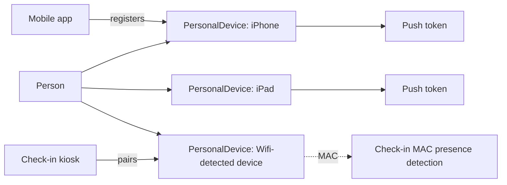

# Personal Device and Registration

## Overview

`PersonalDevice` rows track devices associated with a Person: phones, tablets, and other devices the mobile app or check-in flows have registered. Each row holds the device type (iOS / Android / etc.), a unique identifier (push token / MAC address / fingerprint), notification preferences, last-seen timestamp, and the link to PersonAlias. The mobile shell creates / updates rows on app install and registration; check-in flows create rows for kiosk-paired devices. Push notifications fan out across a Person's active devices.

## Why It Exists

A Person can have multiple devices (phone + tablet + smartwatch). Tracking each independently lets the system: target push notifications correctly, identify check-in by MAC presence, log device-specific interaction history, and detect lapsed-app-usage scenarios (no last-seen update in N days). Without per-device modeling, "which device should I send to?" would be ambiguous.

## Mental Model

Multiple device types with different identifiers; push targets push-token devices; MAC-detection targets MAC-known devices.

## What You Need to Know

**`DeviceTypeValueId` is a DefinedValue.** Standard types: iOS, Android, Web, Other. Custom types can be added.

**`DeviceRegistrationId` is the push token.** For mobile devices that have push enabled. Updated when the provider rotates the token.

**`MACAddress` is for Wi-Fi-detected devices.** Some check-in deployments detect Persons by MAC presence on the church Wi-Fi. The MAC is stored here for identification.

**`NotificationsEnabled` controls push opt-in.** A device with the app installed but notifications disabled (in the OS) does not receive push. The mobile shell updates this flag based on OS settings.

**`IsActive` controls whether the row is considered for routing.** Lapsed devices (uninstalled, MAC no longer seen in 90 days) can be marked inactive. Active rows participate in fan-out.

**`LastSeenDateTime` updates on app activity.** Useful for "is this device still active" queries. The mobile shell updates on each session start.

**One PersonalAlias FK per row.** Per-device, per-Person tracking. A shared family device might have multiple rows (one per Person who logged in on it).

**Cascade on Person delete is configured.** When a Person is deleted, their PersonalDevices go with them. Care is needed in test data cleanup.

**Save hook updates derived state.** `PersonalDevice.SaveHook` handles activity timestamps and audit columns.

**Web devices count too.** Browser sessions can register PersonalDevice rows for tracking; less common than mobile but supported.

**Custom registration flows.** A custom integration (e.g., a hardware beacon reading) can register PersonalDevice rows. The standard service handles inserts.

## Common Scenarios

**"Person installs the mobile app."** App registers a PersonalDevice row for the Person on first launch. DeviceRegistrationId populated; NotificationsEnabled true if user opted in.

**"Push notification sent to a Person."** Recipient resolution walks Person -> all active push-enabled PersonalDevice rows -> dispatches to each token.

**"User uninstalls the app."** The next push fails (token invalid). The transport flags the device or token; admin / job marks inactive.

**"Check-in by MAC presence."** Custom check-in flow detects device on Wi-Fi; queries PersonalDevice by MAC; resolves Person; pre-fills check-in.

**"List a Person's devices."** Person profile widget queries PersonalDevice for the Person. Surfaces device type, last-seen, notifications-enabled.

**"Disable a specific device's notifications."** Admin: PersonalDevice -> NotificationsEnabled = false. The mobile app may also disable when the user changes OS settings.

## Key Architectural Decisions

### Per-device row

Multi-device Persons are common. Per-device modeling supports both push routing and presence detection.

### Token in `DeviceRegistrationId`

The push token is the addressable unit; storing on the device row keeps it close to the device's other state.

### `NotificationsEnabled` separate from `IsActive`

A device can be active (last-seen recent) but with notifications disabled. The two fields capture different states.

### Multi-Person devices supported

Family members sharing a tablet each have their own row when they log in. Per-row identity supports per-Person notifications.

### Save-hook activity updates

Centralizes timestamp updates; the mobile shell triggers via standard saves rather than custom paths.

## Considered but Rejected

### Single device per Person

Rejected. Multi-device usage is real.

### Token on Person directly (no PersonalDevice)

Rejected. Per-device state (last-seen, type, notifications-enabled) needs its own row.

### Device delete cascading to interaction history

Rejected. Interaction history references Person, not Device; device delete preserves history.

## Technical Reference

### Schema (relevant subset)

`PersonalDevice`:
- `PersonAliasId`
- `DeviceRegistrationId` (push token, unique identifier)
- `DeviceTypeValueId` (DefinedValue)
- `MACAddress` (for Wi-Fi detection)
- `NotificationsEnabled`
- `IsActive`
- `LastSeenDateTime`
- `PersonalDeviceTypeValueId` (Personal / Public / etc.)
- `PlatformValueId`
- `DeviceFingerprint`

### Save Hook

`PersonalDevice.SaveHook` handles activity timestamps and standard audit.

### Service / API

`PersonalDeviceService`: standard CRUD. Custom integration code can register devices via this service.

### Affected Areas

- **Mobile shell:** registers / updates rows on app activity.
- **Push transport:** consumes for fan-out.
- **Check-in:** MAC-presence detection (deployment-specific).
- **Person Detail:** Personal Devices panel.

### Related Docs

- [docs/mobile/mobile-overview.md](mobile-overview.md)
- [docs/mobile/push-notifications.md](push-notifications.md)
- [docs/mobile/block-type-bases.md](block-type-bases.md)
- [docs/communication/push-notifications.md](../communication/push-notifications.md)

## Recent Impactful Changes

(No release-note-tagged changes specifically to PersonalDevice in the last 18 months. The mechanism is mature; per-deployment registration flows continue.)
