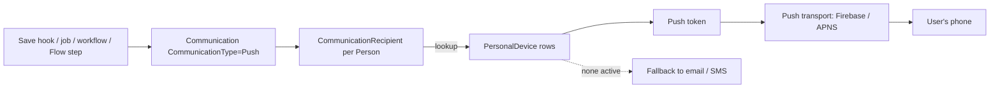

# Mobile Push Notifications

## Overview

Push notifications target a Person's mobile devices via the standard Communication infrastructure. A `Communication` of type `PushNotification` (or a CommunicationFlow step with channel = Push) generates per-recipient sends; the recipient resolution walks `Person -> PersonalDevice` rows and dispatches to each device's push token. Delivery goes through a configured push transport (Firebase / APNS via the mobile shell). Fallback to email or SMS is configurable when a Person has no active devices.

This is the mobile-domain doc; see also [docs/communication/push-notifications.md](../communication/push-notifications.md) for the Communication-domain perspective.

## Why It Exists

Members who use the church mobile app expect timely notifications: check-in alerts, prayer-request comments, group-message replies, scheduled-reminder pushes. Email is too slow for these; SMS isn't always enabled. Push is the right channel for app users.

The chat-message fallback work (commit `bcbe225de8`, 2025-07-15) added the "Send Fallback Chat Notification" Automation Event: alerts via alternate methods (email, SMS) when a Person has no active personal device or has notifications turned off. Tying fallback into the Communication system means the same logic works for any push trigger.

## Mental Model

A trigger creates a Communication; the standard Communication path resolves recipients and dispatches. Fan-out is per-device (a Person with phone + tablet receives on both).

## What You Need to Know

**Push is a `CommunicationType` value.** Same Communication shape as email / SMS; routing differs by type.

**Multi-device fan-out.** A Person with multiple registered devices receives on all active push-enabled devices. The recipient state aggregates (delivered to ANY = delivered).

**`PersonalDevice.NotificationsEnabled` controls per-device push.** Disabled devices skip; the user controls this from device settings.

**Tokens rotate.** Push providers issue tokens that periodically rotate; the mobile shell re-registers and updates `DeviceRegistrationId`. Failed sends should flag the token as inactive and trigger re-registration.

**Click tracking is provider-dependent.** Some providers report delivery status; some report clicks; coverage varies. Custom analytics must respect what the provider supports.

**Fallback via Automation Event.** "Send Fallback Chat Notification" (added `bcbe225de8`) handles the no-active-device or notifications-off case. Configuration on the chat-channel or chat-message automation. Without fallback, push-only sends silently fail for opt-out recipients.

**System Communications can use push.** Group attendance reminders, sign-up confirmations, sign-up reminders gained medium-fallback awareness in `fcd4a50879` (2025-07-28). Configure push as the medium with optional email fallback.

**Workflow actions for push.** Standard Send Push Notification action, plus the Chat Channel Message Send / Direct Message Send actions added in `6774847b62` (2025-10-29).

**Lock-screen content sensitivity.** Many phones display the push body on the lock screen. Sensitive content (private prayer requests, financial details) should redact and use deep-link "you have a message, open the app" rather than putting content in the body.

**Provider failures bubble up to delivery status.** A failed token (uninstalled app, expired registration) marks the send as failed; the next push to that device fails again until the token is refreshed.

## Common Scenarios

**"Send a push to a specific Person."** SystemCommunication of type Push, triggered with the target Person.

**"Push as part of a Communication Flow step."** CommunicationFlow step with channel = Push.

**"Notify chat user about new message via push, fallback to email."** "Send Fallback Chat Notification" automation event handles fallback.

**"Custom workflow that sends push."** Send Push Notification workflow action; or for chat-related, Chat Channel Message Send / Direct Message Send.

**"Add a new push provider."** Implement the appropriate `TransportComponent`. Configure the provider's API credentials. Communications of type Push route through.

**"Disable push for a Person."** They can disable in mobile app notification settings (sets `PersonalDevice.NotificationsEnabled = false`). Admins can also disable per-device.

## Key Architectural Decisions

### Push as CommunicationType, not separate entity

Reuses the standard Communication infrastructure for recipient state, tracking, history.

### Multi-device fan-out

Phone + tablet both get the notification. Single-device-only would miss real-world usage.

### Fallback opt-in via automation events

Hardcoded fallback would force every push to also send email/SMS; opt-in lets admins tune.

### Tokens stored on `PersonalDevice`

Device is the natural addressable unit; token rotation goes through the standard save flow.

### Provider abstraction

Different providers (Firebase, APNS, custom) have different APIs; pluggable transport handles each.

## Considered but Rejected

### Push as a separate entity from Communication

Rejected. Reusing keeps the surface unified.

### Send only to most-recent device

Rejected. Multi-device users expect notifications on all.

### Hardcoded provider integration

Rejected. Different deployments use different providers.

## Technical Reference

### Schema (relevant subset)

`Communication.CommunicationType`: enum value `PushNotification`.

`PersonalDevice`:
- `PersonAliasId`
- `DeviceRegistrationId` (push token)
- `DeviceTypeValueId` (DefinedValue: iOS, Android, etc.)
- `NotificationsEnabled`
- `IsActive`
- `LastSeenDateTime`

### Transport Components

`Rock/Communication/Transport/`: implementations per medium. Push transports per provider.

### Service / API

Push send flows through the standard `CommunicationService.Send(communication)` path.

### Affected Blocks

- **Composition:** Communication Entry Wizard, SystemCommunication Detail.
- **PersonalDevice management:** Personal Devices admin.
- **Workflow actions:** Send Push Notification, Chat Channel/Direct Message Send.

### Related Docs

- [docs/communication/push-notifications.md](../communication/push-notifications.md) for the Communication-domain perspective.
- [docs/mobile/personal-device-and-registration.md](personal-device-and-registration.md)
- [docs/mobile/mobile-overview.md](mobile-overview.md)

## Recent Impactful Changes

- **2025-10-29** ([commit `6774847b62`](https://github.com/SparkDevNetwork/Rock/commit/6774847b62)). New Workflow Action Types: Chat Channel Message Send and Chat Direct Message Send.
- **2025-07-28** ([commit `fcd4a50879`](https://github.com/SparkDevNetwork/Rock/commit/fcd4a50879)). System notifications check SMS-enabled status before choosing SMS or email; same pattern applies to push fallback.
- **2025-07-15** ([commit `bcbe225de8`](https://github.com/SparkDevNetwork/Rock/commit/bcbe225de8)). Chat Message Automation Trigger and Send Fallback Chat Notification automation event.
