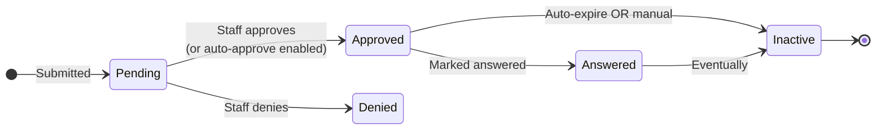

# Prayer Request Approval and Publication Flow

## Overview

Prayer requests follow a configurable lifecycle: submitted -> reviewed -> approved (or denied) -> displayed on prayer cards / mobile -> answered -> closed. The state is captured by `PrayerRequest.IsApproved`, `IsActive`, `IsPublic`, plus the answered fields (`Answer`, `AnsweredDateTime`). Approval can be auto-granted (no admin step) or staff-mediated; the prayer category and global setting drive the policy. Approved + active + public requests appear on prayer cards; private requests appear only to authorized viewers.

The 2025-08-06 fix (commit `d4478716b3`) addressed approval-stamping on the Obsidian block; pre-fix, approving did not write `ApprovedOnDateTime` and `ApprovedByPersonAliasId`. The 2025-07-15 fix (commit `afe5573866`) defaulted `IsUrgent` to false on create.

## Why It Exists

A prayer request submission flow is sensitive: anonymous abuse, inappropriate content, and over-sharing all need filtering. Approval-by-default-OR-by-staff lets admins choose: a trusted prayer team can submit auto-approved; public submissions might require staff review. The state model captures both paths.

## Mental Model

Submitted requests start as Pending (or Approved if auto-approve). Staff transitions move requests through the approval / denial paths; answer / inactive transitions mark resolution.

## What You Need to Know

**Approval stamps `ApprovedOnDateTime` and `ApprovedByPersonAliasId`.** Per `d4478716b3` (Fixes #6403, 2025-08-06), the Obsidian Prayer Request Detail block now writes these fields on approval. Pre-fix builds may have missing audit data.

**`IsUrgent` defaults to false on create.** Per `afe5573866` (Fixes #6373, 2025-07-15), the default is false. Pre-fix, NULL was possible, breaking sort-by-urgency.

**`IsPublic = true` is required for public display.** Public prayer cards filter by `IsPublic`. Default on submission depends on the entry block's configuration; some blocks default to private (assume sensitivity); some default to public (assume sharing).

**`IsActive = true` keeps the request on cards.** Inactive requests hide from public surfaces; the row persists for audit.

**`IsApproved` is approval status.** Approved + Active + Public = visible on public cards. Other combinations narrow visibility.

**Auto-approval is configurable.** Some categories auto-approve (trusted submitters); others require staff review. Configurable per category.

**`AnsweredDateTime` is set when prayer is marked answered.** The `Answer` text field captures the answer / testimony. Answered prayers can stay visible (configurable) for celebration.

**Public-only attributes are hidden on public blocks.** Per `4274cc88b1` (Fixes #6253, 2025-03-26), Prayer Request Attributes not marked Public are correctly hidden on the Obsidian Prayer Request Entry block. Pre-fix, they were exposed.

**`PersonId` URL parameter pre-fills new requests.** Per `93a173b138` (Fixes #6357, 2025-06-27), the Obsidian Prayer Request Detail block honors PersonId for new-request flows. Custom flows passing PersonId now work.

**CAPTCHA on public-facing blocks.** Per `55f933e96d` (2025-08-25, CMS-tagged), CAPTCHA support reduces spam. Configure on Prayer Request Entry per deployment.

**Mobile flow has its own block.** Mobile Prayer Request Detail (per `74c7765901`, 2026-01-26) added a Campus Type filter on the campus picker. Mobile flow shadows web; verify parity for custom flows.

**Prayer comments / sessions are separate features.** Some prayer flows support per-request comments (someone prayed) or prayer sessions (a prayer team works through the queue). Different blocks; same underlying entity.

## Common Scenarios

**"Submit a prayer request from the public site."** Public Prayer Request Entry block. Configure CAPTCHA, default visibility, auto-approve setting per category. Submitter sees the form; on submit, the request lands in the database with the configured initial state.

**"Approve a pending request."** Internal -> Prayer -> Pending Requests list. Open the request; click Approve. `IsApproved = true`, audit fields stamped (since `d4478716b3`).

**"Mark a prayer answered."** Open the request; populate Answer text; set AnsweredDateTime. Optionally keep IsActive for celebration display.

**"Configure auto-approve for a trusted category."** Prayer Category configuration. Enables auto-approve for new requests in the category.

**"Add CAPTCHA to public submission."** Configure on the Prayer Request Entry block. Default off.

**"Custom workflow on submission."** Prayer Request Created workflow trigger. Sends email to staff, creates a Connection Request, etc.

**"Audit who approved which requests."** Query `PrayerRequest.ApprovedByPersonAliasId` and `ApprovedOnDateTime`. Reports across requests.

## Key Architectural Decisions

### Single-entity model

Prayer is simple enough that one entity captures the lifecycle. Splitting would have been over-engineering.

### Approval stamping in the save hook

Audit fields written automatically; reduces author-error.

### Public / Private as boolean flag

Visibility is binary; per-request granular access could be added but isn't needed.

### Auto-approve per category

Different categories warrant different policies; per-category configuration is right.

### IsUrgent default false

Sort-by-urgency stability requires a non-NULL default.

## Considered but Rejected

### Multi-step approval workflow as part of the entity

Rejected. Approval is one bit; complex multi-step approvals belong in workflows.

### Always-staff-review

Rejected. Trusted submitters benefit from auto-approve.

### Hard-deleting denied requests

Rejected. Audit / history value preserves them.

## Technical Reference

### Schema (relevant subset)

`PrayerRequest`:
- `FirstName`, `LastName`, `Email`, `Text`
- `RequestedByPersonAliasId`, `CategoryId`, `CampusId`
- `IsPublic`, `IsActive`, `IsApproved`, `IsUrgent`
- `Answer`, `AnsweredDateTime`
- `ApprovedByPersonAliasId`, `ApprovedOnDateTime`
- `EnteredDateTime`, `ExpirationDate`
- `PrayerCount`, `FlagCount`
- `AllowComments`

### Save Hook Behavior

`PrayerRequest.SaveHook`:
- Stamps approval fields on transition to Approved (since `d4478716b3`).
- Writes history.
- Triggers configured workflows.

### Service / API

`PrayerRequestService`: standard CRUD plus query helpers.

### Affected Blocks

- **Public:** Prayer Request Entry, Prayer Card, Prayer Session.
- **Admin:** Prayer Request Detail, Prayer Request List, Prayer Comment List.
- **Mobile:** Mobile Prayer Request Detail.

### Related Docs

- [docs/prayer/prayer-overview.md](prayer-overview.md)
- [docs/ai/ai-overview.md](../ai/ai-overview.md) for AI-driven prayer-request analysis.

## Recent Impactful Changes

- **2026-01-26** ([commit `74c7765901`](https://github.com/SparkDevNetwork/Rock/commit/74c7765901)). Mobile Prayer Request Detail Campus Type filter on the campus picker.
- **2025-08-25** ([commit `55f933e96d`](https://github.com/SparkDevNetwork/Rock/commit/55f933e96d)). CAPTCHA support on public-facing blocks reduces spam (Prayer Request Entry benefits).
- **2025-08-06** ([commit `d4478716b3`](https://github.com/SparkDevNetwork/Rock/commit/d4478716b3)). Approving via Obsidian Prayer Request Detail correctly stamps `ApprovedOnDateTime` and `ApprovedByPersonAliasId` (Fixes #6403).
- **2025-07-15** ([commit `afe5573866`](https://github.com/SparkDevNetwork/Rock/commit/afe5573866)). `IsUrgent` defaults to false on create (Fixes #6373).
- **2025-06-27** ([commit `93a173b138`](https://github.com/SparkDevNetwork/Rock/commit/93a173b138)). PersonId URL parameter honored for new-request flows (Fixes #6357).
- **2025-03-26** ([commit `4274cc88b1`](https://github.com/SparkDevNetwork/Rock/commit/4274cc88b1)). Non-public Prayer Request Attributes correctly hidden on public Entry block (Fixes #6253).
