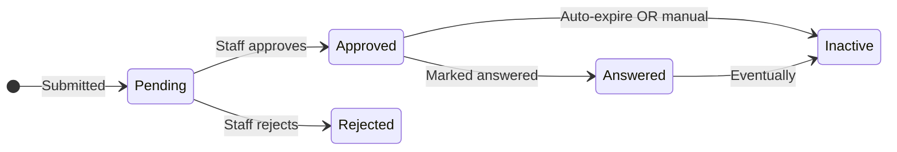

# Prayer Domain Overview

## Overview

Prayer is one of Rock's smaller domains by surface area but high-touch by usage. The single primary entity is `PrayerRequest`: a person submits a prayer request (publicly or anonymously, with optional category and campus), it goes through approval if configured, and it surfaces on prayer-card / prayer-list blocks for others to pray and respond. Prayer integrates with AI Automation (the prayer-request analyzer / formatter) to optionally summarize, categorize, or draft follow-up messages.

## Why It Exists

A prayer request is one of the most personal interactions a member has with the church. Tracking it as data lets the prayer team coordinate, lets staff follow up, lets Lava-driven prayer cards and mobile blocks surface them, and lets analytics measure prayer engagement (one of the few non-attendance/giving discipleship metrics). Modeling it as a single entity with `IsApproved`, `IsActive`, `IsUrgent`, `IsPublic`, `AllowComments`, and per-request answer/follow-up timestamps keeps the model simple while letting blocks render in many configurations.

The 2025 fix wave (`4274cc88b1`, `93a173b138`, `afe5573866`, `d4478716b3`) addressed Obsidian-block parity issues: attributes not marked Public displaying anyway, PersonId URL parameter not pre-filling on create, IsUrgent defaulting to NULL (causing sort issues), and approval not stamping the approver/timestamp. Each is the same shape of bug: the legacy WebForms block had it right, the Obsidian conversion missed it, and the fix restores parity.

## Mental Model

Single primary entity, simple state machine:

`PrayerRequest` carries the request itself (`Text`), categorization (`CategoryId`, `CampusId`), visibility (`IsPublic`), urgency (`IsUrgent`), state (`IsActive`, `IsApproved`, `Answer`, `AnsweredDateTime`), and audit fields (`ApprovedByPersonAliasId`, `ApprovedOnDateTime`).

Public prayer cards and the mobile prayer block read from this single entity with various filters. Approval can be skipped per category or globally.

## What You Need to Know

**Approval timestamps were not always stamped on Obsidian.** Pre-fix `d4478716b3` (Fixes #6403, 2025-08-06), approving a Prayer Request through the Obsidian Prayer Request Detail block did not update `ApprovedOnDateTime` and `ApprovedByPersonAliasId`. Custom approval flows must stamp these.

**`IsUrgent` defaults to false on create.** Pre-fix `afe5573866` (Fixes #6373, 2025-07-15), the Obsidian Prayer Request Detail block left `IsUrgent` as NULL when not selected, which broke sorts that ordered urgent-first. The default is now false; reports that depend on urgency should treat NULL as not-urgent (defensive coding for older data).

**PersonId URL parameter pre-fills the new request.** Pre-fix `93a173b138` (Fixes #6357), the Obsidian Prayer Request Detail did not honor `PersonId` for new-request flows, so person data was not pre-filled. Custom create flows that pass PersonId should now work.

**Public-only attributes really should be public-only.** Pre-fix `4274cc88b1` (Fixes #6253, 2025-03-26), Prayer Request Attributes not marked "Public" were incorrectly displayed on the Obsidian Prayer Request Entry block. The fix hides them. If a deployment relied on private attributes being visible, it was a security accident; the fix is correct.

**Campus deletion no longer cascades.** `9d30769249` (Fixes #6563, 2025-12-04) fixed Prayer Request rows being deleted when their Campus was deleted; they are now safely detached. Older deployments may have lost data to this class of incident.

**Mobile Prayer Request Detail has its own URL-parameter behaviors.** `74c7765901` (2026-01-26) added a Campus Type filter on the mobile campus picker. Mobile blocks shadow web blocks; verify parity for custom flows.

**AI integration is opt-in via Automation.** AIAutomation rules can run prayer requests through the analyzer/formatter components; without configuration, no AI runs. Prayer-team-side AI summarization is administrator opt-in.

**CAPTCHA on public-facing blocks reduced spam (`55f933e96d`, 2025-08-25, CMS-tagged).** Public Prayer Request entry can configure CAPTCHA to reduce automated submissions.

## Common Scenarios

**"Submit a prayer request publicly."** Public Prayer Request Entry block. Configure with optional CAPTCHA, configurable categories, optional anonymous mode.

**"Approve and surface to prayer cards."** Prayer Request List block (admin) shows pending. Approve writes `ApprovedByPersonAliasId` and `ApprovedOnDateTime` since `d4478716b3`.

**"Mark a prayer request answered."** Set `Answer` and `AnsweredDateTime`. Reports can filter for testimonies and follow-up communications.

**"Show my own active prayer requests."** Filter by `RequestedByPersonAliasId` (or current person), `IsActive = true`.

**"Auto-summarize new prayer requests with AI."** AIAutomation rule referencing `PrayerRequestAnalyzerResponse` or similar. Runs on save.

## Key Architectural Decisions

### Single-entity model

Prayer is simple enough that splitting into Request / Response / Comment would have been over-engineering. One entity with many state flags serves the use cases.

### Approval via flag, not lifecycle entity

`IsApproved` plus `ApprovedBy/On` is enough. A separate ApprovalLog entity would have been ceremony.

### `IsUrgent` defaults to false

Sort stability matters; NULL was producing inconsistent ordering. Defaulting to false keeps reports clean.

### Public-only attributes really hidden

Public visibility is a security boundary; non-public attributes must be hidden on public blocks.

## Considered but Rejected

### Per-request comment thread

Rejected (so far). Conversation modeling would multiply complexity; at present the Answer field plus follow-up communication captures the use cases.

### Cascading Campus delete

Rejected (since `9d30769249`). Lost prayer history on Campus delete is unacceptable.

## Technical Reference

### Data Model

| Entity | Purpose |
|---|---|
| `PrayerRequest` | The single primary entity. Text, person, category, campus, visibility, urgency, approval, answer. |

### Save Hook Behavior

`PrayerRequest.SaveHook` ([Rock/Model/Prayer/PrayerRequest/PrayerRequest.SaveHook.cs](../../Rock/Model/Prayer/PrayerRequest/PrayerRequest.SaveHook.cs)) handles approval-stamp logic and history.

`PrayerRequest.Logic` (`Logic.cs`) holds the security overrides and computed properties.

### Affected Blocks and UI Surfaces

- **Public:** Prayer Request Entry, Prayer Card, Prayer Session.
- **Admin:** Prayer Request List, Prayer Request Detail, Prayer Comment List.
- **Mobile:** Prayer Request Detail, Prayer card on mobile shell.

### Extension Points

- **Custom categories.** `PrayerRequest.CategoryId` references the standard Category infrastructure.
- **Custom workflow triggers.** Prayer Request lifecycle events.
- **AI automation.** Configure AIAutomation rules to analyze, format, or follow up on prayer requests.

### File Index

- `Rock/Model/Prayer/PrayerRequest/`
- `Rock.Blocks/Prayer/`
- `Rock/AI/Automations/PrayerRequestAnalyzerResponse.cs`, `PrayerRequestFormatterResponse.cs`

## Recent Impactful Changes

- **2025-08-06** ([commit `d4478716b3`](https://github.com/SparkDevNetwork/Rock/commit/d4478716b3)). Approving a Prayer Request through the Obsidian block now correctly updates `ApprovedOnDateTime` and `ApprovedByPersonAliasId` (Fixes #6403).
- **2025-07-15** ([commit `afe5573866`](https://github.com/SparkDevNetwork/Rock/commit/afe5573866)). `IsUrgent` defaults to false (instead of NULL) on Obsidian Prayer Request Detail to fix sorting issues (Fixes #6373).
- **2025-06-27** ([commit `93a173b138`](https://github.com/SparkDevNetwork/Rock/commit/93a173b138)). Obsidian Prayer Request Detail honors the `PersonId` URL parameter to pre-fill person data on new requests (Fixes #6357).
- **2025-03-26** ([commit `4274cc88b1`](https://github.com/SparkDevNetwork/Rock/commit/4274cc88b1)). Prayer Request Attributes not marked Public are now properly hidden on the Obsidian Prayer Request Entry block (Fixes #6253).
