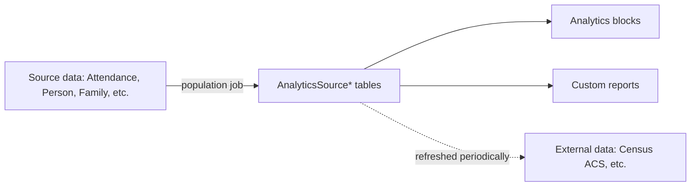

# Analytics Source Tables

## Overview

Analytics Source tables are denormalized snapshots of Rock data optimized for analytics queries. The Analytics blocks (Attendance Analytics, Giving Analytics) query these tables instead of joining through normalized data, which would be slow at scale. Examples include `AnalyticsSourcePostalCode` (US Census ACS demographic data), `AnalyticsSourceFamilyHistorical`, `AnalyticsSourcePersonHistorical`, plus the various per-domain analytics-source projections. Population jobs maintain the snapshots; the analytics blocks consume them.

## Why It Exists

Real-time aggregation against fully normalized data is slow at church-data scale. A "weekly attendance trend by campus over 5 years" query joining Attendance + AttendanceOccurrence + Group + Schedule + Campus + Person + PersonAlias is expensive enough that running it on every page render is impractical. Pre-computed denormalized snapshots make these queries fast at the cost of snapshot freshness.

The `AnalyticsSourcePostalCode` data refresh (commit `195c755816`, 2026-03-23) is illustrative: ACS 5-year income estimates were updated to refresh family income ranges, totals, and median income. This kind of demographic data is updated periodically by the Census; Rock pulls the latest into the snapshot.

## Mental Model

Population jobs run on schedule, denormalize source data into the snapshots, write to AnalyticsSource* tables. Reports query the snapshots, not the live normalized data.

## What You Need to Know

**AnalyticsSource* tables are denormalized for query performance.** Joining through the normalized model would be slow; the snapshots optimize for read.

**Population jobs maintain snapshots.** Job-driven refresh on configurable cadence. Real-time updates would defeat the optimization; periodic is correct.

**Snapshots can lag.** The "right now" view of giving / attendance reflects the last job run. Most analytics use cases tolerate this; some real-time dashboards need direct queries.

**`AnalyticsSourcePostalCode` is US-Census-driven.** Demographic data (income, household composition) per postal code. Periodically refreshed (last refresh 2026-03-23). Sites outside the US may have local equivalents or skip this table.

**Family / Person Historical snapshots are SCD-2.** Slowly Changing Dimension Type 2: each row has a date range during which its values held. Reports query "as of date X" by selecting the row whose date range includes X.

**Custom analytics queries can join snapshots.** A custom Dynamic Data report that joins `AnalyticsSourceFamilyHistorical` to `AnalyticsSourcePostalCode` can answer demographic questions cheaply.

**The snapshot job is idempotent.** Re-running the job produces the same result. Useful for catching up after a downtime.

**Source-data deletes don't auto-cascade.** If a Person is deleted, their Historical snapshot rows persist. Reports must filter explicitly if needed.

**Custom Analytics Source tables are possible.** A custom denormalized snapshot for deployment-specific analytics needs is a one-table addition plus a population job. Configuration-as-data plus custom code.

## Common Scenarios

**"Show family income demographics by postal code."** Join `AnalyticsSourceFamilyHistorical` to `AnalyticsSourcePostalCode` on PostalCode. Aggregate income data; render in a custom report.

**"Long-running attendance trend report."** Use the appropriate AnalyticsSource attendance snapshot. Avoid live aggregation against `Attendance` for multi-year trends.

**"State of giving as of last fiscal year."** SCD-2 snapshot query: filter to rows where the date range includes the fiscal year boundary.

**"Build a custom analytics table."** Custom table with denormalized columns plus a population job (likely a Rock job that runs nightly). Reports / blocks query the table.

**"Diagnose stale-looking analytics."** Verify the population job ran recently. The snapshot reflects the last run.

**"Refresh AnalyticsSourcePostalCode."** Per `195c755816`, this happens periodically as a Census-data refresh. Custom code can trigger.

## Key Architectural Decisions

### Denormalized snapshots for analytics

Read-optimized at the cost of write complexity. The right tradeoff for analytics queries.

### Job-driven population

Real-time updates would multiply DB load. Job-driven gives bounded cost.

### SCD-2 for historical entities

Time-series questions about Person / Family state across time need Type-2 modeling.

### Per-domain source tables

Each domain has its own analytics needs; per-domain tables match.

### External data (Census ACS)

Some analytics depend on external reference data; periodic refresh imports.

## Considered but Rejected

### Live normalized queries for analytics

Rejected. Performance prohibitive at scale.

### Materialized views in SQL Server

Rejected (mostly). Materialized views have refresh / index complexity that the application-level snapshot avoids.

### Real-time snapshot updates

Rejected. Cost too high; periodic is correct.

## Technical Reference

### Snapshots (selected)

- `AnalyticsSourcePostalCode`: US Census ACS data per postal code.
- `AnalyticsSourceFamilyHistorical`: SCD-2 Family snapshot.
- `AnalyticsSourcePersonHistorical`: SCD-2 Person snapshot.
- `AnalyticsSourceAttendance`: per-attendance denormalized rows.
- `AnalyticsSourceGiving`: per-transaction denormalized rows.
- `AnalyticsDimAttendance`, `AnalyticsDimFamily`, etc.: dimension-table-shaped snapshots (cube-style).

### Population Jobs

Various Rock jobs maintain the snapshots:
- Daily refresh job for transactional snapshots.
- Periodic Census refresh for `AnalyticsSourcePostalCode`.

### Affected Blocks

- **Analytics:** Attendance Analytics, Giving Analytics, Email Analytics consume snapshots.
- **Custom reports:** can query snapshots directly via Dynamic Data block.

### Related Docs

- [docs/reporting/reporting-overview.md](reporting-overview.md)
- [docs/reporting/custom-metrics.md](custom-metrics.md)
- [docs/reporting/dynamic-data-block.md](dynamic-data-block.md)

## Recent Impactful Changes

- **2026-03-23** ([commit `195c755816`](https://github.com/SparkDevNetwork/Rock/commit/195c755816)). AnalyticsSourcePostalCode refreshed with the latest U.S. Census ACS 5-year income estimates.
- **2026-02-24** ([commit `736ee7d4e7`](https://github.com/SparkDevNetwork/Rock/commit/736ee7d4e7)). Attendance Analytics correctly aggregates per-group when multiple groups share a name (Fixes #6691). Affects analytics consuming attendance snapshots.
- **2026-01-16** ([commit `730a83dba4`](https://github.com/SparkDevNetwork/Rock/commit/730a83dba4)). Attendance Analytics block honors selected GroupTypes (Fixes #6637).
