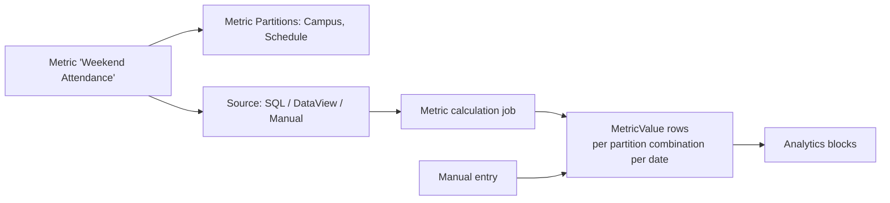

# Custom Metrics

## Overview

A `Metric` is a time-series aggregate definition: weekly attendance, monthly giving, baptism count by quarter. Each `MetricValue` row is one (Metric, Partition, DateTime) data point. Metrics can be partitioned (Campus, Schedule, Group) so one metric definition produces multiple per-partition values. The metric job (or manual entry) writes values; reporting blocks (Email Analytics, Attendance Analytics) consume them. Custom metric source components evaluate their own logic to produce values.

## Why It Exists

Time-series questions ("how is attendance trending?", "is giving up year-over-year?", "how many baptisms last quarter by campus?") are universal church-management needs. Modeling each as a metric (with per-partition values stored over time) gives reports a uniform shape: chart Metric X over date range Y, optionally split by partition Z. Without this, every report would require custom queries.

The de-duplicate-manual-values fix (commit `de9db6b0fe`, Fixes #6180, 2025-03-12) addressed a real bug: the metric job was overwriting manually-entered values for the same date. Users would manually enter attendance for a week the system couldn't compute (a special service), the next job run would clobber it. The fix preserves manual entries.

## Mental Model

A metric defines what to measure and how to compute. Partitions slice the value (per-campus, per-schedule). The job runs the source query and writes per-partition values; manual entries override / supplement.

## What You Need to Know

**Metrics can be partitioned by multiple dimensions.** A "Weekend Attendance" metric partitioned by Campus + Schedule produces one MetricValue per (Campus, Schedule, Date) combination.

**Source types: SQL, DataView, Manual, Lava.** SQL is the most common (run a SQL query, return value plus partition values). DataView returns a count of matching Persons. Lava lets the metric body be Lava-rendered. Manual is admin-entry only.

**The metric job runs on schedule.** Configurable cadence (typically nightly or weekly). On each run, the job evaluates each metric's source for the appropriate date range and writes / updates values.

**Manual values are preserved.** Per `de9db6b0fe`, the job no longer overwrites manually-entered values for the same date. Custom metric jobs that write directly should respect the same convention.

**`MetricValue.MetricValueDateTime` is the time-series axis.** All charts plot against this. Granularity (day / week / month) depends on the metric's cadence.

**`MetricValueType` distinguishes Measure vs Goal.** Some metrics have a goal value alongside the actual ("aim for 1000 weekly attendees"). Reports surface both.

**Value notes are free-form.** Per-value notes record context ("special service", "conference week") for later analysis.

**Categories organize metrics.** `MetricCategory` rows group metrics for browsing.

**Custom source components.** `MetricCalculatedSourceComponent` is the abstraction. Implement custom source logic; register; configure on metrics.

**Analytics blocks consume metrics.** Custom dashboards, the Email Analytics block, the Attendance Analytics block. They query MetricValues filtered by date range and partition.

## Common Scenarios

**"Track weekly attendance per campus."** Metric "Weekend Attendance" with partitions = Campus. Source = SQL counting attendance rows. Job runs weekly, writes one value per campus.

**"Manually enter attendance for a holiday weekend."** Metric Value Detail block. Pick the Metric and date. Enter the value. The job does not overwrite (since `de9db6b0fe`).

**"Define a goal value for monthly giving."** Metric "Monthly Giving" with `MetricValueType = Goal`. Set the goal as a separate value. Reports plot actual vs goal.

**"Custom source: pull from an external system."** Custom `MetricCalculatedSourceComponent` calling the external API; converts to per-partition values; the job invokes.

**"Chart attendance trends."** Attendance Analytics block. Configures the metric, partitions, date range. Renders the chart.

**"Add a 'note' to a specific data point."** Edit the MetricValue; add the note. Custom analytics blocks can surface.

## Key Architectural Decisions

### Metric definition + per-time values

Standard time-series shape. Definition is metadata; values are data.

### Partition support

Multi-dimensional metrics are universal. Partition rows handle the dimensional split.

### Source-component pluggability

Different metric calculation needs (SQL, DataView, custom integration). Component pattern supports each.

### Manual override preservation

Real-world metrics sometimes need manual entry; the job respecting that is correct.

### Goal vs Measure value types

Goal-tracking is a common use case; first-class support.

## Considered but Rejected

### Hardcoded metric definitions

Rejected. Per-deployment metrics are universal.

### Real-time metric computation

Rejected. Cost too high; job-driven is correct.

### Single-dimension metrics only

Rejected. Multi-partition is essential.

## Technical Reference

### Schema (relevant subset)

`Metric`:
- `Title`, `Subtitle`, `Description`
- `IconCssClass`
- `MetricChampionPersonAliasId` (owner)
- `SourceValueTypeId` (DefinedValue: SQL / DataView / Lava / Manual)
- `SourceSql`, `SourceLava` (for those source types)
- `DataViewId` (for DataView source)
- `EnableAnalytics`
- `IsCumulative`, `NumericDataType`
- `XAxisLabel`, `YAxisLabel`, `UnitType`

`MetricCategory`:
- `MetricId`
- `CategoryId`

`MetricValue`:
- `MetricId`
- `MetricValueType` (Measure / Goal)
- `MetricValueDateTime`
- `YValue` (the value)
- `XValue`
- `Note`

`MetricPartition`:
- `MetricId`
- `EntityTypeId` (Campus / Schedule / Group / etc.)
- `Order`
- `IsRequired`

`MetricValuePartition`:
- `MetricValueId`
- `MetricPartitionId`
- `EntityId` (the partition value, e.g., a specific Campus.Id)

### Service / API

`MetricService`, `MetricValueService`: standard CRUD.

### Affected Blocks

- **Admin:** Metric Detail/List, Metric Value Detail, Metric Value List.
- **Operational:** Attendance Analytics, Email Analytics, Giving Analytics, custom dashboards.

### Related Docs

- [docs/reporting/reporting-overview.md](reporting-overview.md)
- [docs/reporting/analytics-source-tables.md](analytics-source-tables.md) for denormalized aggregates.

## Recent Impactful Changes

- **2025-11-07** ([commit `b2351af708`](https://github.com/SparkDevNetwork/Rock/commit/b2351af708)). Email Analytics block X Axis now consistently shows daily labels rather than time-of-day labels (Fixes #6561).
- **2025-03-12** ([commit `de9db6b0fe`](https://github.com/SparkDevNetwork/Rock/commit/de9db6b0fe)). Metric job no longer overwrites manually-entered values for the same date (Fixes #6180).
