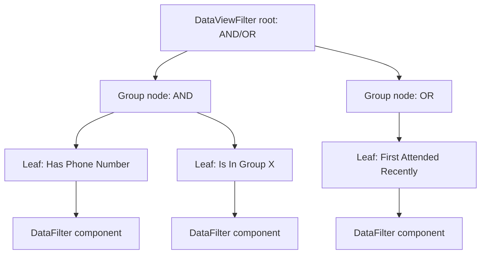

# DataView Filter Components

## Overview

A DataView's logic is a tree of `DataViewFilter` rows: AND/OR group nodes plus leaf filter components. Each leaf is a `DataViewFilterComponent` (a C# class implementing the filter logic for a specific question: "matches a phone number," "is in a Group," "first attended in the last N days"). Custom filters extend the component model: implement the class, register, configure in DataView Detail. Custom filters work across every consumer of DataViews (Communications, Group Sync, workflows, blocks).

## Why It Exists

Hardcoding the filter set would lock administrators to whatever the team imagined. Configuration-as-data with pluggable components is the right pattern: ship dozens of built-in filters, let custom code add more. Each filter is one class implementing the standard interface; new filters are a one-class change.

The component pattern matches the rest of Rock's extension model (FieldType, BadgeComponent, ActionComponent). Familiarity reduces the authoring barrier.

## Mental Model

The tree composes filters; each leaf invokes its component to evaluate the criterion.

## What You Need to Know

**Each filter is one component class.** Subclass `DataFilterComponent` (or domain-specific subclass like `PropertyFilter` or `DataSelectComponent`). Implement the abstract methods: name, configuration UI, expression generation.

**The filter generates a LINQ expression.** Filters convert their configuration to an EF expression that gets composed into the DataView's overall query. Performance depends on the expression; filters that translate to SQL well are fast, those that force in-memory evaluation are slow.

**Configuration UI is part of the component.** The component renders its configuration (a number picker, a Group picker, a date range). The Obsidian DataView Detail block uses these UIs to compose the filter tree.

**Per-EntityType filters.** Many filters are entity-type-specific (a Phone Number filter is for Person; a Group Membership filter is for Person; a Transaction Amount filter is for FinancialTransaction). Each filter declares which entity types it applies to.

**Filter discovery is via EntityType registration.** Standard component pattern; new filters become available immediately on registration.

**Filter performance varies.** A simple property comparison is fast; a complex filter that joins through PersonAlias / DataView / etc. can be slow. Test against realistic data before deploying.

**`Site Session` filter has special handling.** Per `b3bd46edb0` and earlier `dbaa28bc75` (2025-10-30), the filter maps SiteId to InteractionChannelId where needed. Pre-fix, the filter failed when configured Site Id did not match associated InteractionChannel Id.

**`First Attendance in Group` filter description fix.** Per `8f1fb0a4a9` (Fixes #6448, 2025-09-12), the filter description was inaccurate; the fix updated wording. Custom filters should have clear descriptions.

**`Group Location Schedules` filter added.** Per `347a31cd09` (2025-07-18), DataViews can filter by Group Location Schedules. Useful for targeting attendees of specific service times.

**Reports on Group entity type now work.** Per `f83e3c45a8` (2025-11-14), Reports could not previously be created on the Group entity type. The fix enables it.

## Common Scenarios

**"Filter to people who have attended in the last 30 days."** DataView with leaf filter "First Attendance in Group" or similar attendance-recency component.

**"Build a custom filter: 'completed orientation.'"** Implement `DataFilterComponent`. Configure in DataView Detail. Available immediately.

**"Filter by Group Location Schedule."** Per `347a31cd09`, the filter is built-in. Use the Group Location Schedule filter component.

**"Diagnose a slow DataView."** Inspect the filter tree. Identify filters that force in-memory evaluation. Replace with SQL-translatable equivalents where possible.

**"Custom filter writing pattern."** Inherit from `DataFilterComponent`. Override `Title`, `Section`, `GetClientFormatSelection`, `FormatSelection`, `FilterControl`, `GetSelection`, `SetSelection`, `GetExpression`. Build the LINQ expression in `GetExpression`.

**"Test a custom filter."** Mock the DataView; instantiate the component; configure; call GetExpression; verify the SQL.

## Key Architectural Decisions

### Component pattern for filters

Standard Rock extension model. Configuration plus class implementation.

### LINQ expression generation

EF translates to SQL. Filters that generate good SQL are fast; in-memory evaluation is the fallback.

### Per-EntityType applicability

Filters declare which entity types they apply to. The DataView Detail UI filters the picker accordingly.

### Configuration UI in the component

Filter authors design the configuration UI; DataView Detail block hosts it. Lets filters have rich configuration without per-filter block code.

### Discovery via EntityType registration

Familiar pattern; new filters become available immediately.

## Considered but Rejected

### Hardcoded filter set

Rejected. Configuration-as-data with components is right.

### SQL-only filter language

Rejected. LINQ expressions integrate with EF and IQueryable composition.

## Technical Reference

### Schema

`DataViewFilter`:
- `DataViewId` (the DataView this filter belongs to)
- `ParentId` (parent filter for tree structure)
- `ExpressionType` (Filter / GroupAll / GroupAny / GroupAll-Negate / GroupAny-Negate)
- `EntityTypeId` (the filter component class)
- `Selection` (component-specific configuration JSON)

### `DataFilterComponent` Base

Override:
- `EntityType`: which entity type the filter applies to
- `Title`, `Section`, `Description`: display
- `GetClientFormatSelection`: friendly text representation
- `GetExpression`: LINQ expression generation
- `FilterControl`: the configuration UI
- `GetSelection`, `SetSelection`: serialize / deserialize configuration

### Built-in Filters (location)

`Rock/Reporting/DataFilter/`: dozens of filters organized by entity type:
- `Person/`: Person-specific filters
- `Group/`, `GroupMember/`: Group-related
- `Financial*/`: finance filters
- `Workflow/`: workflow filters

### Service / API

`DataViewService` plus the standard `DataView.GetExpression(...)` method that composes the tree into a final LINQ expression.

### Affected Blocks

- **Configuration:** DataView Detail (filter tree authoring).
- **Operational:** DataView Results, every consumer (Communication, Group Sync, etc.) that accepts a DataView.

### Related Docs

- [docs/reporting/reporting-overview.md](reporting-overview.md)
- [docs/reporting/dynamic-data-block.md](dynamic-data-block.md)
- [docs/reporting/custom-metrics.md](custom-metrics.md)

## Recent Impactful Changes

- **2026-04-08** ([commit `a12f627fbe`](https://github.com/SparkDevNetwork/Rock/commit/a12f627fbe)). DataViews load gracefully when a referenced Registration Template is deleted (Fixes #6756).
- **2025-11-14** ([commit `f83e3c45a8`](https://github.com/SparkDevNetwork/Rock/commit/f83e3c45a8)). Reports can be created on the Group entity type.
- **2025-10-30** ([commit `b3bd46edb0`](https://github.com/SparkDevNetwork/Rock/commit/b3bd46edb0)). Site Session DataView filter maps ChannelIds to SiteIds for compatibility.
- **2025-09-12** ([commit `8f1fb0a4a9`](https://github.com/SparkDevNetwork/Rock/commit/8f1fb0a4a9)). "First Attendance in Group" filter description fix (Fixes #6448).
- **2025-07-18** ([commit `347a31cd09`](https://github.com/SparkDevNetwork/Rock/commit/347a31cd09)). Group Location Schedules filter added.
